# Mapping 

The [Mapping module](https://omeka.org/s/modules/Mapping){target=_blank} allows you to geolocate Omeka S items and display interactive maps throughout your public sites. Maps can also include timelines that allow you to scroll through items on a map in chronological order.


The Mapping module adds several metadata fields to each item, a "Mapping" tab to item editing, and several batch-editing options for items. It also adds:

- optional location-based search fields to the advanced search pages on the admin and public interfaces, controlled on a site-by-site basis by [Site Settings](../sites/site_settings.md#settings)
- three page blocks to [Site Pages](../sites/site_pages.md) that can display maps and timelines for browsing: "Map by query", "Map by attachments", and "Map by groups"
- a "Map Browse" page for each site, found in the [Site Navigation settings](../sites/site_navigation.md)
- [resource blocks to items and item sets](../sites/site_theme.md#select-regions-and-blocks) (not media), which can be repositioned within the regions offered by a given site's theme. 

Mapping has no global configuration settings. Item sets cannot be geolocated, but can display mapping information based on items assigned to them.

Mapping can work with the [Collecting](../modules/collecting.md#prompts) module, by allowing users filling out the contribution form to provide geolocation data for their submissions. Users click directly on a map to place a marker, and can optionally provide a text label for the marker. See the Collecting module page for more information.

Mapping can work with the [CSV Import](../modules/csvimport.md) module, allowing geolocation data to be added in bulk. See the [CSV Import integration section below](#csv-import-integration) for more information.

## How to use maps

On public pages, site visitors use their mouse or trackpad to navigate within a map, by scrolling up or down to zoom in and out, and clicking and dragging to pan. Scrolling using a mouse wheel is a setting that can be turned on or off in map page blocks. (It cannot be set for item or item set maps.) Map features (pins or shapes) can be clicked to see more information, and can provide links to items. 

When editing a map in the administrative interface, small white square buttons on the left side of the map allow you to navigate and to edit the map's features. Hover over the buttons with the mouse to view tool-tips.


* **Zoom in**: The small white square with a black plus sign. Each click zooms in one step (between 0 and 19).
* **Zoom out**: The square with black minus sign. Each click zooms out one step (between 0 and 19).
* **Full Screen**: The square with four corners. View this map expanded to fit the screen of your device.
* **Draw a polyline**: The square with a diagonal line. Create a line with two or more points to indicate a relevant area on the map, such as a street.
* **Draw a polygon**: The square with a five-sided shape. Create a shape with three or more sides to indicate a relevant area on the map, such as a state or province. 
* **Draw a rectangle**: The square with a black square. Create a shape with four sides to indicate a relevant area on the map. 
* **Draw a marker**: The square with a black bubble marker. When you click the button your pointer becomes a blue marker. Click again on the map to place the marker.
* **Edit feature**: The square with a black box and pencil icon. This option is only available after a marker or shape has been added. Click the button and a pink box appears around each marker. Click a marker to move it. Click again to place. Use the grey buttons to "Save" or "Cancel".
* **Delete feature**: The square with a trashcan icon. This option is only available after a marker or shape has been added. Click the icon to select a marker. Click the marker to be removed and it will disappear. Use the grey buttons to "Save" or "Cancel" these changes, or to "Clear all" markers currently on the map.
* **Enter address**: The square with a black magnifying glass icon. Click to enter an address in the search bar.
* **Set the current view as the default view**: The square with a target or crosshair symbol. The map may have a default zoom level based on the site settings, or a zoom level containing all existing markers if applicable. Click to set the current view as the default view for this item.
* **Go to the current default view**: The square with a black box around a dot. This option is only available after you have set a default view. Click to pan and zoom map to the selected view for this item.
* **Clear the default view**: The square with a black "X". This option is only available after you have set a default view. Click to clear pan and zoom preferences and return to the initial global view.

### Search for mapping data

Items with Mapping metadata (i.e. with markers or shapes on the map) can be searched with fields that the Mapping module adds to the advanced search fields. The public fields are optional (turned off by default) on [individual sites](../sites/site_settings.md#settings) in their [site settings](#site-wide-settings). 

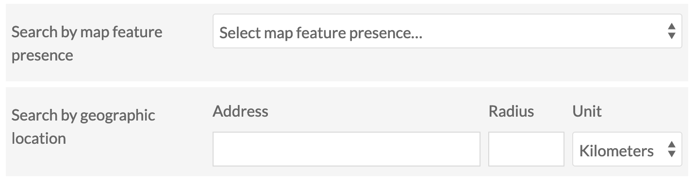

The "Add geographic location to advanced search" option will add the three fields seen above, allowing users to search by location: they must provide an address, as well as a distance (in numbers) and select a unit (kilometres or miles) to search within.

The "Search by map marker presence" option provides users with a dropdown with the options of "Has map markers" or "Has no map markers", as seen above.

## Geolocate items

The Mapping module adds metadata fields to each item, most of which cannot be accessed directly the way a text field can. This includes a latitude and longitude pair that creates markers on maps (an item can have more than one marker), or a series of coordinates that define shapes on the map (lines, polygons, and rectangles). There are also default display settings for each item's map - minimum corner coordinates that ensure the map contains at least those top, bottom, left, and right spots. 

This information can be set manually using the item's "Mapping" tab via a visual map interface, or can be textually bulk-added to items using [CSV Import](#csv-import-integration).

### Add locations

The item view screen will not show a "Mapping" tab unless there is already geolocation metadata, but one will appear when editing the item. To add a map to an item, enter editing mode and navigate to the "Mapping" tab.


To move the map to where you want to add a location, you can do one of the following:

* Zoom and drag to find the location.
* Enter latitude and longitude coordinates into the search box. These should be formatted as decimals, for example `38.897222, -77.064167`, not `38° 53′ 50″ N, 77° 3′ 51″ W`.
* Type the place name into the search box (see the image below).
	* Options will populate as you type, and will not search locations which do not match the formatting of the search function.


When you are centered on your intended location, you can then:

* Use the line tool to define a line across the map. This can be used to, for example, position an item along a border or a street. A line has a start and end, and as many points or angles as desired, but cannot be connected to make a shape. 
* Use the polygon or rectangle tool to define a shape across the map. This can be used to, for example, enclose a rough area of relevance (such as a city or country) or indicate a potential range of locations (for example, where the precise location of a photo is not known). 
* Click on the marker tool; your cursor will become a marker. To set the point, click on the map.

We refer to these various markers and shapes as "features" throughout the rest of this documentation.


#### Edit features

You can now click on the marker or shape to add a label that will display on [public map views](#public-view) of the item. Be aware that this will display in a large font.

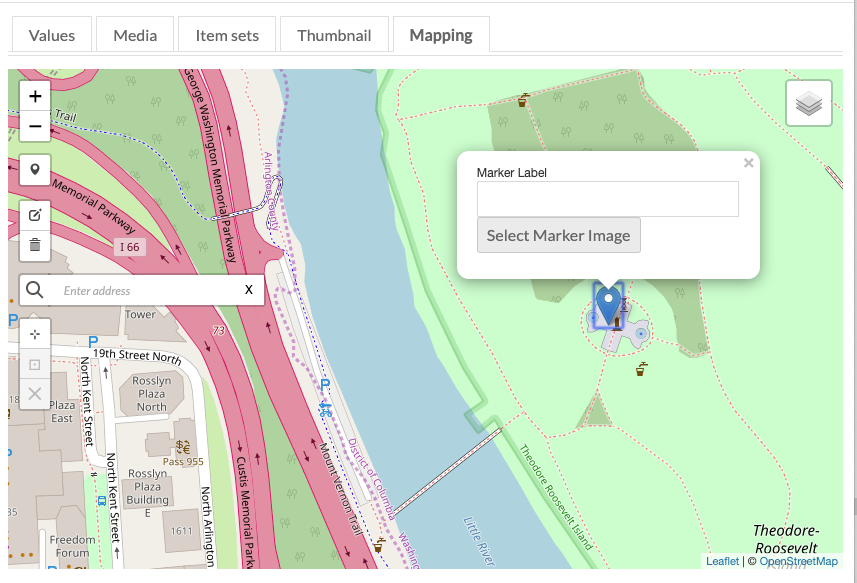

You can also add an image to display on the feature when clicked in the [public view](#public-view). You can only select from images that have already been [attached to the item as media](../content/items.md#media). To remove the image, select "No Image" from the sidebar.


Neither field is required, but if you choose an image without entering a label, the media title will appear in the label field. This can be removed. 

To edit the label or image again, click on the feature. This will open the options for the label and image, as seen above.

To **move a marker or shape**, use the "Edit feature" button on the left hand toolbar (small white square with black box and pencil icon). Any feature on the map will become highlighted in a red, dotted-line outline. Click and drag the feature you want to move. Rectangles can be turned into polygons using this tool, and individual points in lines and polgyons can be removed by clicking on them without dragging (a polygon requires a minimum of three points). 

To apply your changes, click the "Save" option that opens from the "Edit feature" button. If you do not save, the marker will not be moved.

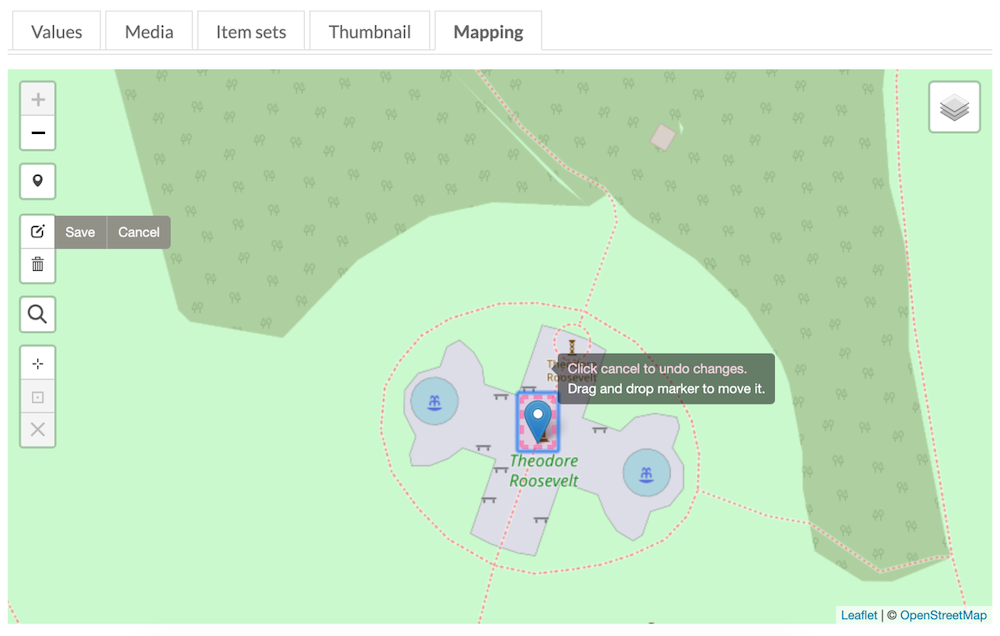

To **delete a marker**, first click the "Delete feature" button in the left hand toolbar (trash can icon). Click on the marker or shape you want to delete; this will remove the feature from the map. In order to make the deletion permanent, you must click "Save" in the small menu that opens from the "Delete feature" button.

Note that you can use the "Clear all" button in the menu which opens form the "Delete feature" button to clear all markers and shapes on the map.


#### Map display

You can set any map's zoom level and center. The default is to center on one feature and zoom fully in, or to zoom out far enough to contain all features in the map view.

* **Set the current view as the default view**: The square with a target or crosshair symbol. The map will default to a zoomed out (global) view. Click to set the current view as the default view for this item.
* **Go to the current default view**: The square with a black box around a dot. This option is only available after you have set a default view. Click to pan and zoom map to the selected view for this item.
* **Clear the default view**: The square with a black "X". This option is only available after you have set a default view. Click to clear pan and zoom preferences and return to the initial global view.

#### Batch-edit map data

Users can select multiple items and perform [batch editing](../content/items.md#batch-editing) to create and edit map markers. You cannot batch-add shapes at this time, nor can you batch-edit map display settings, but you can batch-add markers from latitude and longitude values, and you can batch-edit labels and images for all features. 

The options are:

- **Delete features**: You can batch-remove all existing markers and shapes from multiple items. 
- **Copy coordinates to markers**: This involves taking latitude and longitude data from an existing metadata value on each item or from their associated media. This will append new markers, not overwrite any existing markers. If there are multiple values on an item in the chosen proprerty, this will batch-copy them all as multiple markers. You can specify:
	- Which fields contain each or both values (for example, if you previously put this information into a text field such as `dcterms:spatial`)
	- How they are separated (the operation will ignore spaces)
	- Whether the longitude or latitude comes first in the pair. 
If you copy coordinates from an attached media, you can also check a box to assign the media as a marker image. 
- **Update features**: Markers and shapes can have [customized thumbnails and labels](#edit-features) rather than displaying just the item title as a link. You can batch-edit marker customization by:
	- Removing images
	- Using items' primary media as images
	- Copying labels from an existing metadata value (either from the item, the primary media, or the media already assigned to the marker)
	- Removing labels (the first entry in the dropdown).

Note that marker labels have a limit of 255 characters. You will see your labels truncated if you copy label text from a field containing values longer than 255 characters.

If the chosen field in this batch operation does not contain valid entries, the item(s) will be skipped and you will not see an error message. [Batch-editing operations](../content/items.md#batch-editing) do not appear in the Jobs log unless they are "Edit all," so if you have done a selected-items batch-edit you may not be able to trace which items were modified.

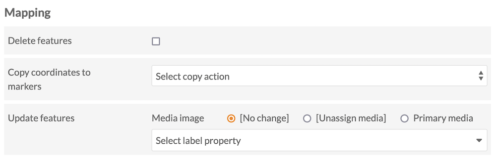

You may wish to copy your coordinates in one batch operation, then update those markers with labels and images in a second batch operation. Note that if an item has multiple markers, all markers will get updated with identical images and labels. 

### CSV Import integration

Mapping is compatible with [CSV Import](../modules/csvimport.md) when importing items (but not when importing mixed resources).

If the two modules are enabled, your CSV Import process will have a new "Mapping" dropdown menu in the "Add mapping" sidebar when you are connecting a spreadsheet column to a property.

The "Mapping" dropdown menu includes three options for pinning the item geographically: "Latitude", "Longitude", and "Latitude/Longitude". Make sure your "Latitude/Longitude" values are separated with a slash (`/`) character. 

These must all be supplied as numerical values, not degree: write northern latitudes as positive numbers and southern latitudes as negative numbers ("-90" to "90"), eastern longitudes as positive numbers and western longitudes as negative numbers ("-180" to "180").

!!! note 
	The latitude and longitude fields cannot take multiple values, that is, you cannot bulk-import two or more markers for each item using these fields. You also cannot import multiple latitudes and longitudes using the "Append" method in CSV Import to import multiple rows of data onto the same item. You can add multiple values using the "Latitude/Longitude" field. This will take input in the form of `lat/long;lat/long`, where the semi-colon is the multivalue separator you indicate in the CSV Import settings.

The "Default Bounds (sw_lng,sw_lat,ne_lng,ne_lat)" option allows you to set four corner coordinates for the map that displays for that item, in the format `sw_lng,sw_lat,ne_lng,ne_lat` (bottom left longitude, bottom left latitude, top right longitude, top right latitude). Map widths and heights display dynamically depending on the page and the browser window, so your four coordinates will be centered within the map and excess space will display either vertically or horizontally as applicable. **Be careful to provide longitudes first and latitudes second in your bounds values.**

!!! note
	The default bounds field will not accept multiple values. You will encounter an error with your entire CSV Import process if you attempt to Append a second default bounds value to an item. At this time you will also encounter an error for the entire process if you attempt to Revise or Update an existing default bounds value on an item; the error message will not specify which rows worked successfully, but the log will identify the item where the process stopped by its unique ID. You must manually erase default bounds from each item individually if you wish to change those settings. Mapping properties do not appear in bulk-editing options.

For example, to pin an item near Madrid and set the map bounds around the country of Spain, you could provide two values: a marker latitude and longitude of "40.79864618/-3.645817429" and default bounds of "4.25300,43.95470,-12.12392,36.45605". 

Note that the default bounds will ignore any location markers. For example, if you set bounds around Spain, but your item's marker is pinned to Antarctica, the map will display Spain and users will have to search for the marker manually.

You cannot set marker labels or marker images in CSV Import. You cannot import the coordinates for map shapes in CSV Import. 

You cannot [batch-edit](../content/items.md#batch-editing) mapping values after items are in your system, only edit them manually one item at a time, or batch-revise mapping data using CSV Import.

## Add maps to a site

### Site-wide settings

The Mapping module adds a section to each site's "Settings" tab found under "Site admin." 

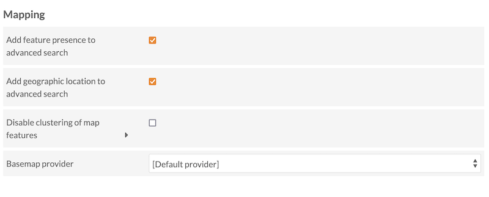

- **Add feature presence to advanced search**: Allow site visitors to search by whether or not an item has location data. 
- **Add geographic location to advanced search**: Allow site visitors to search with a specific coordinate and a radius to include nearby items. 
- **Disable clustering of map features**: Enable or disable feature clustering on this site's maps with a checkbox.
- **Basemap provider**: Display the same basemap for every map on the site. This can be overriden by specific maps' settings. 

### Map Browse page

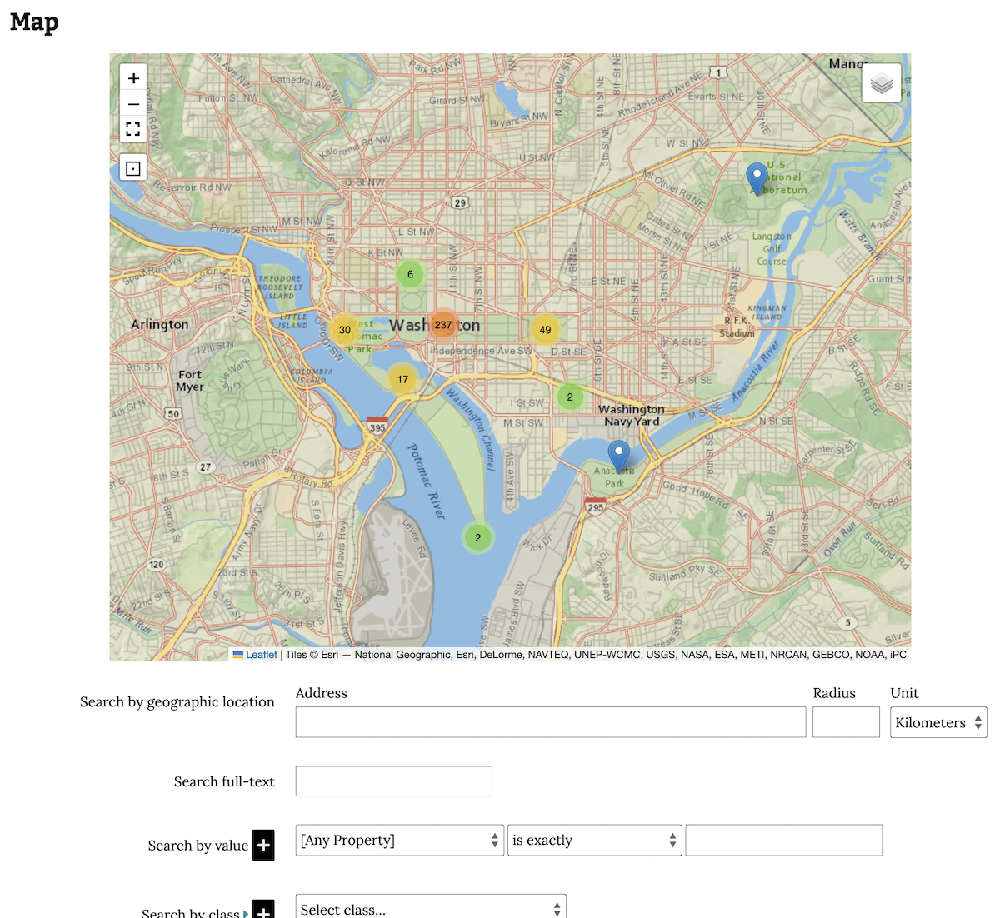

Mapping creates a "Map Browse" page that can be added to each site in its navigation settings. This map has minimal customization options and will show every item in the site that has one or more geolocations, as well as some advanced search fields (including searching by an address with a radius). These search fields are not affected by the site settings. The title of the page will be "Map".

Go to a Site, then go to Navigation. You will see under "Add a custom link" the option to add "Map Browse." When this is added to your navigation, you will be able to change the label that appears in the navigation (default is "Map Browse"), and the basemap, by clicking on the pencil icon to edit the Map Browse page settings. Note that changing the basemap will change the URL that is added to the navigation - for example, `yoursite/map-browse?mapping_basemap_provider=OpenTopoMap`. 

### Resource page blocks

#### Items

[Resource page blocks can be configured on each site](../sites/site_theme.md#select-regions-and-blocks) based on the theme your site is using. Some sites offer multiple regions where blocks can be placed. Maps are not automatically added to item pages when the module is active; you must manually move the Mapping block into your desired location. 

#### Item sets

Item sets cannot themselves be geolocated (pinned to a map), but they will display maps of all their items' geolocation data. This appears in the admin side as a "Mapping" tab on the item set, the same as items. This tab is for informational purposes only, cannot be edited, and will disappear when you go to editing mode. 

On the public side, item sets will not display a map automatically - you must [manually add the "Mapping" resource page block to a region](../sites/site_theme.md#select-regions-and-blocks) offered by your site theme, for each site you have. 

Item set pages, if you add the Mapping resource block to a region, will display a map with all the features for all the items in that set. This map resource block has no settings but can be modified with the [site-wide settings](#site-wide-settings).

### Page blocks

Mapping creates three page blocks you can add to your site pages: "Map by attachments", where you manually add resources to the map block; "Map by query", which allows you to use search parameters to add resources to the map block; and "Map by groups", where you can display a single map feature (a center-point pin or a containing shape) to represent categories of items, such as items grouped by their classes.

To add a map to a page, go into page editing mode. On the right, under "Add new block", click either the "Map by attachments," "Map by query", or "Map by groups" block. Selecting one will add the map block to the bottom of the page. The blocks include customizable features for the map in collapsable panes. Click the triangles to expand or collapse these fields.


The "Map by attachments" and "Map by query" blocks have largely the same settings besides the method for adding items to the map. 

The "Map by groups" block does not have timeline or overlay options.

#### Default view

This section lets you set the appearance and zoom level of the map. There are three fields and a preview map. Within the preview map are buttons for setting the default zoom and location of the map. If you do not set a default zoom or location, the map will contain all resources when first loaded on the public page.

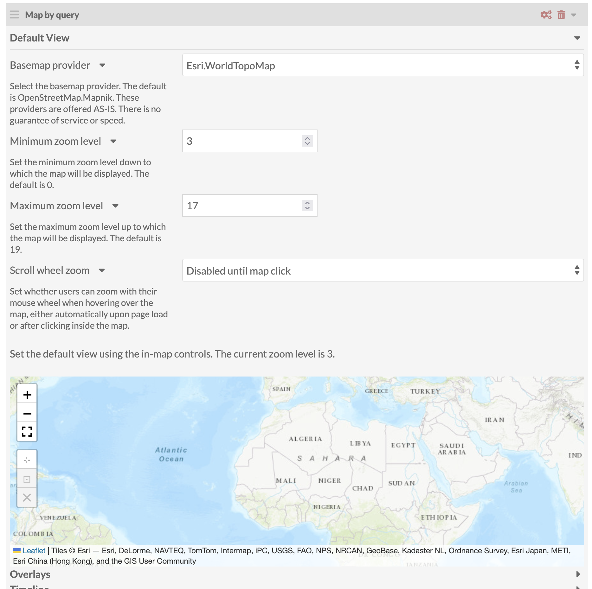

**Basemap provider**: Select from a dropdown of basemaps. Once selected, the preview map will show you the appearance of that map. The default is "OpenStreetMap.Mapnik". These external providers are offered as-is; there is no guarantee of service or speed. 

!!! note
	Some maps do not have tiles at a high degree of zoom; be sure to test your chosen basemap on item pages, item set pages, the Map Browse page, and page blocks to be certain it will work for your needs. 

**Minimum zoom level**: Set the minimum zoom for the map. Fully zoomed out is 0. See the preview map below to visualize each level of zoom and test your settings and basemap.

**Maximum zoom level**: Set the maximum possible zoom level. The highest is 19. Some basemaps do not function at higher levels; be sure to set your maximum at a level where your basemap is visible. See the preview map below to visualize each level of zoom and test your settings and basemap.

**Scroll wheel zoom**: Set whether users can zoom with their mouse wheel when hovering over the map, either automatically upon page load or after clicking inside the map. You can disable mouse-wheel scrolling entirely.

The preview map allows you to visually set a default view for this map. The map dimensions on the public page may not match the dimensions shown in this preview, but saving a default view here will guarantee that the four corner points will be displayed on the public page, with excess added to the outer edges if applicable. 

Note that the text above the preview map tells you the current zoom level. 

Within the preview map, there are six buttons:

 * **Zoom in**: The square with a black plus sign. Each click zooms in one step (between 0 and 19).
 * **Zoom out**: The square with black minus sign. Each click zooms out one step (between 0 and 19).
 * **Full screen**: Expands the map to full-screens for editing.
 * **Set the current view as the default view**: The square with a target or crosshair symbol. The map will default to a global view, or a view containing all map features from all items. Click to set the current view as the default view. 
 * **Go to the current default view**: The square with a black box around a dot. Click to visualize the current setting.
 * **Clear the default view**: The square with a black "X". Click to return to the initial default center and zoom level.

The last two options are only available after a default view has been set. 

You must save your default view using the in-map buttons, then save the page. 

#### Overlays

You can add supplementary information to your maps using the Overlays options. 

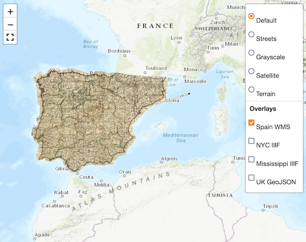

Omeka provides three formats for adding custom overlays or non-Omeka data: 

- [Web Map Service (WMS)](https://mapserver.org/ogc/wms_server.html){target=_blank}
- [International Image Interoperability Framework (IIIF) Georeference Annotation](https://iiif.io/api/extension/georef/){target=_blank}
- [GeoJSON](https://geojson.org/){target=_blank}.

WMS and IIIF overlays appear as optional visual layers that site visitors can display or hide. Overlays frequently only cover one part of the world map - for example, a historical map of northern Africa that has been digitized and mapped precisely with coordinates. You can have multiple layers all set to be visible by default, whether they overlap each other or not. 

GeoJSON overlays are datasets for adding map features. Rather than display items from your Omeka collection, this option can display information on a map using markers and shapes generated from [GeoJSON](https://en.wikipedia.org/wiki/GeoJSON){target=_blank}-formatted data. You can provide supplemental clickable pins to your site maps using this tool; pins are not tied to Omeka items, but can be used to add context, such as important buildings. You can manually create GeoJSON for your own use, or copy GeoJSON from other sources. See below for more information about GeoJSON.

First, you can set whether you wish the overlays to display exclusively (one at a time) or inclusively (multiple at the same time). Then choose one of the three formats to begin entering information.

##### WMS and IIIF

Four fields are available for WMS overlays: 

 * **Label**: Create a unique, descriptive label for the map overlay. This will be visible to visitors and should be used to differentiate between overlays. (Required.)
 * **Base URL**: Add a map overlay to the WMS map by URL. 
 * **Layers**: Any of the offered layers you wish to use, separated by commas. This is a string or strings provided by the WMS host.
 * **Styles**: Any styles you wish to use, separated by commas. This is a string or strings provided by the WMS host.

Two fields are available for IIIF overlays:

 * **Label**: Create a unique, descriptive label for the map overlay. This will be visible to visitors and should be used to differentiate between overlays. (Required.)
 * **URL**: Enter the URL of the IIIF manifest. This may be in the format `website.org/manifests/123456789`.

Click "Save overlay" to create the overlay. Click "Cancel" to clear each of the fields. Multiple overlays can be added. Make sure you save each overlay edit, and then save the page. 

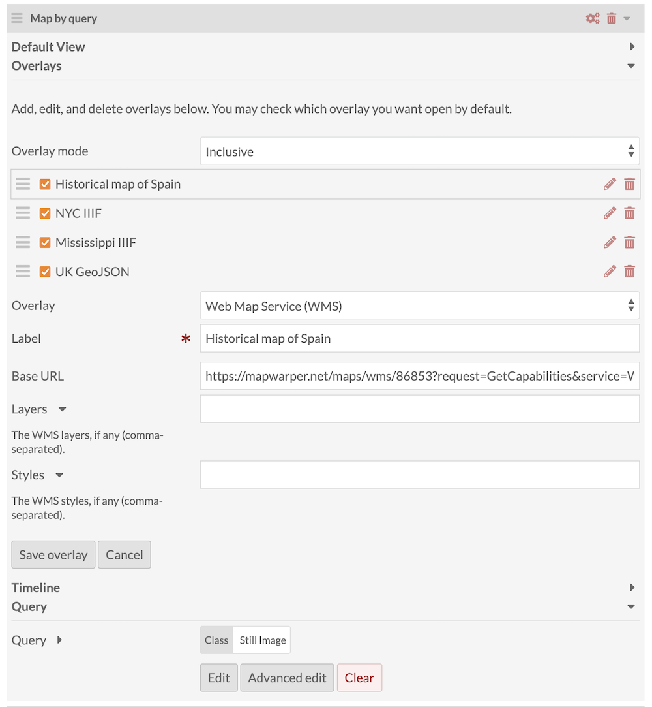

Once you have added an overlay, it will appear above the fields for adding more overlays. If you would like one or more of the overlays to display automatically when the page loads, check the box next to it. Note that some overlays can be large and take time to load on a public page. 

Edit an overlay by clicking on on the red pencil edit button, or click the red trashcan icon to delete the overlay.

##### GeoJSON overlays

GeoJSON provides map features as well as metadata information about each feature. You can use this to illustrate areas, such as historical boundaries of a municipality, or add coordinates related to the topic of your Omeka site or page. You can display any number of map features, of all types (point, line, and polygon). You can also have one set of metadata that refers to multiple discrete areas of the map - such as showing the continental United States, Alaska, and Hawaii as one single datapoint with three separate polygonal features. GeoJSON features look just like Omeka item features. 

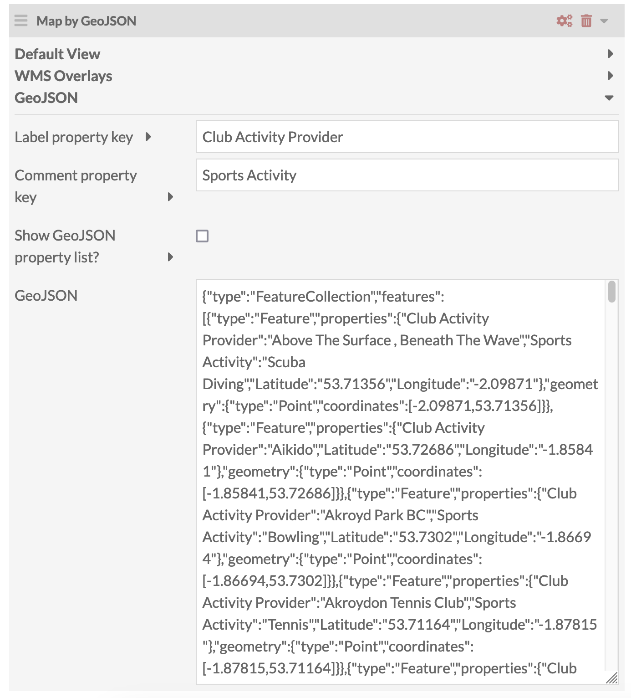

Five fields are available for GeoJSON overlays:

* **Label**: Create a unique, descriptive label for the map overlay. This will be visible to visitors and should be used to differentiate between overlays. (Required.)
- **GeoJSON**: Enter the GeoJSON data in full. This should look something like [the example data below](https://geojson.org/){target=_blank}:

```
{
  "type": "Feature",
  "geometry": {
    "type": "Point",
    "coordinates": [125.6, 10.1]
  },
  "properties": {
    "name": "Dinagat Islands"
  }
}
```
By looking within this data to find the available properties (such as "name" in the example above), you can fill the "label" and "comment" fields if so desired. 

* **Label property key**: The map pop-ups can contain all of the metadata you've pasted in, or can feature one field as a label and one as a comment (these fields on Omeka item pins are usually the title and description fields). If you wish to feature one value as each map feature's pop-up title, enter the property name here. Look in the code you have pasted into the "GeoJSON" field to get this information. Note that this will not include the property's name alongside the value.
* **Comment property key**: If you wish to feature one value as each map feature's pop-up text, enter the property name here. Look in the code you have pasted into the "GeoJSON" field to get this information. Note that this will not include the property's name alongside the value.
* **Show GeoJSON property list?**: Check this box if you wish the pop-ups to display all of the available metadata you have pasted into the field above. If unchecked, the pop-ups will only show the label or comment fields you have chosen; depending on how much information you have included, the pop-ups may become quite long and need to scroll. Note that this will replicate any information you have entered into the label and comment fields; if you check this, you may wish to leave those fields blank.

This is a geoJSON map pop-up with the label and comment selected:
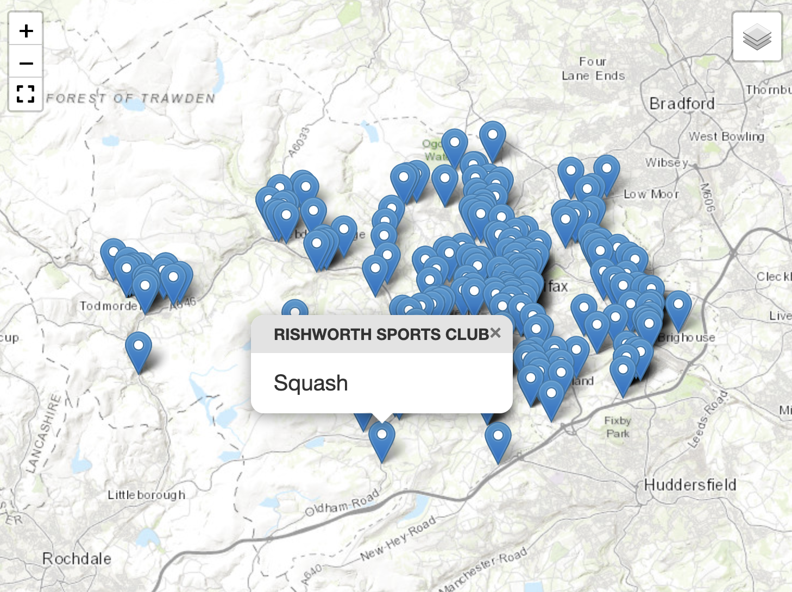

And this is a geoJSON map pop-up with all available properties showing, without a label or comment selected:


The administrative interface will not preview the map with your GeoJSON data before or after you save the overlay. You will need to go to the public view of the page to see the features that result from your input.

Note that GeoJSON data will not be available to the Timeline as dates; if your map includes a timeline, the GeoJSON-added features will appear on the default map but cannot be displayed when the timeline is used for navigation.

Click "Save overlay" to create the overlay. Click "Cancel" to clear each of the fields. Multiple overlays can be added. Make sure you save each overlay edit, and then save the page. 

#### Timeline

The Timeline section allows you to add a timeline display alongside the map view. This feature requires the [Numeric Data Types](numericdatatypes.md) module and items with Timestamp or Interval values (applied via the [resource template](../content/resource-template.md)).

- **Title headline**: displays on the first slide of the timeline (see ["Timeline public view"](#timeline-public-view) below). You can use this to name the timeline.
- **Title text**: appears below the title headline on the first slide of the timeline (see ["Timeline public view"](#timeline-public-view) below). You can use this to provide context or narrative introduction for the timeline.
- **Fly to**: is a dropdown menu where you can set the zoom level for each point in the timeline on the map. Your options are default view, or zoom levels 0-18 (even numbers only). The higher the number, the more zoomed in the map will be.
	- Note that the transition between points is animated, so if you have very distant points the shift between them will involve a significant zoom out and in.
- **Show contemporaneous events**: sets how two events with the same timestamp or interval are displayed. If checked, contemporaneous events will both display in the map when active in the story slider.
	- For timestamp properties, if two events have a date of "1 January 2000," both events will show on the map when either is in the story slider.
	- For interval properties, if one event has an interval of "28 July 1914 - 11 November 1918" and another has an interval of "January 1819- December 1920" both events will show on the map when either is in the story slider.
	- Note that this setting only works with the default view of Timeline navigation position.
- **Timeline navigation position**: by default, the timeline displays with the story slider, to the left of the map. Using this dropdown, you can change where the story slider displays. Options are:
	- Default position
	- Full width, below story slider and map
	- Full width, above story slider and map.
- **Property**: a dropdown menu; select the timestamp or interval property to use when populating the timeline. The dropdown menu will populate with the properties which have been defined in a resource type as using numeric data types Interval or Timestamp.
	- You may want to make a note of which property and numeric data type you are using before creating the map block. The dropdown only displays the term and data type but not which template it is associated with, for example `Date Created (numeric:timestamp)`.
	- Note that you can only select *one* property per timeline. You cannot mix timestamp and interval data.

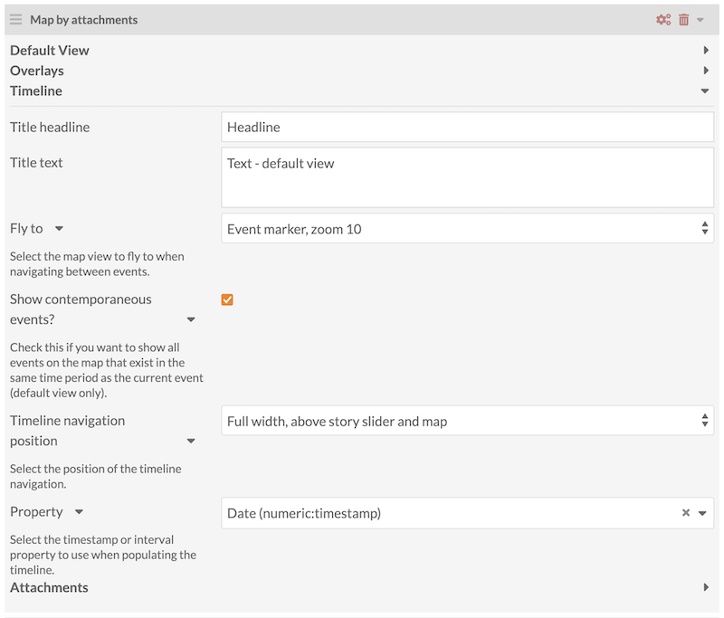

To remove the timeline from a map block, click the "X" on the far right of the Property dropdown.

To see how the various settings of the timeline block appear on the public side, please see the [Timeline Public View](#timeline-public-view) section below.

#### Attachments (Map by attachments block)

With this block, markers are added to the map by selecting items manually.

* Click "Add Attachment" (1) to open the right-hand drawer and select items from the list (2). Note: This list will only be populated by items that have at least one location added to them.
* Clicking an item adds it to the list in the Attachments section (3).
* Drag and drop items in this list to reorder them.
* Remove items from the list by clicking the red trashcan.


To add multiple items at once, click the "Quick add" slider just above the list of items in the right-hand drawer. This will add a checkbox to the left of each item. Check the boxes of those items you want to add to the map, then click the "Add selected" button at the bottom of the drawer.

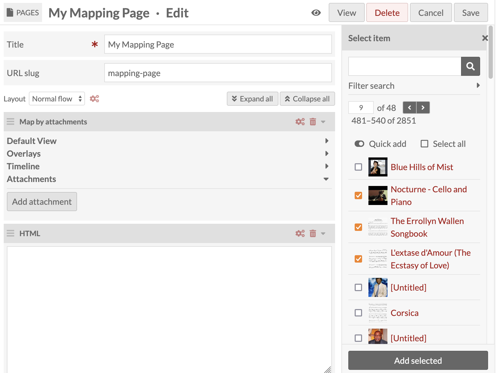

#### Query (Map by query block)

This block allows you to choose a subset of the resources added to your site with a search query, rather than by manually adding items. 

The query can be left blank; in this case, the map will show all items added to the site that have qualifying mapping data.

More complicated queries can be set: specific item sets, classes, templates, items from a date range, or items with a specific linked resource (such as a particular Person item in the "Creator" field), for example. 

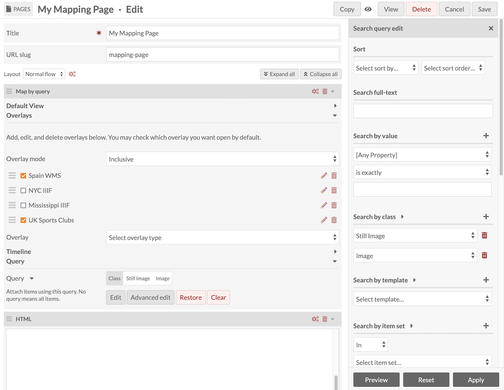

You can also run a search on your public site, and from the search results page, copy everything in your browser's address bar, starting with the question mark all the way to the end of the search URL (to the right) - for example:

```
?fulltext_search=london&resource_class_id[]=33&has_media=1&has_features=1
```

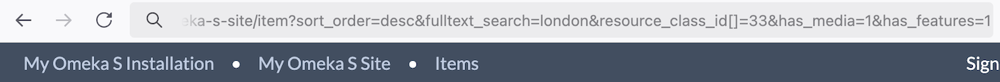

Click the "Advanced edit" button and paste the URL string into the field that appears. 

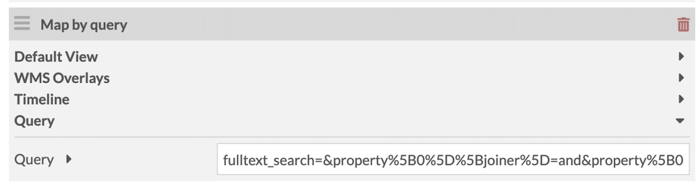

You should see the query render into structured statements when you click the "Apply" button.

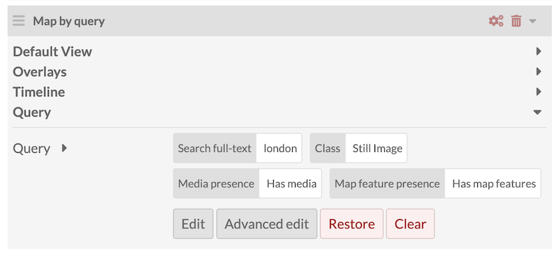

Note that the administrative interface will not preview the map with your selected items. You will need to go to the public view of the page to see the items that result from your query.

#### Groups (Map by groups block)

The "Map by groups" page block allows you to sort your items according to various criteria. A group will display as either a single map pin (in the center of all the locations of all its items), or as a polygon (containing all the locations of all its items). Users can click on the groups to see only that group's items. 

This page block offers common ways that users want to group their items: by classes, by item sets, or by common values in a given field, such as linked resources used in the same field. 

This block does not have timeline or overlay settings - only the Default View section, as above, and a Groups section. 

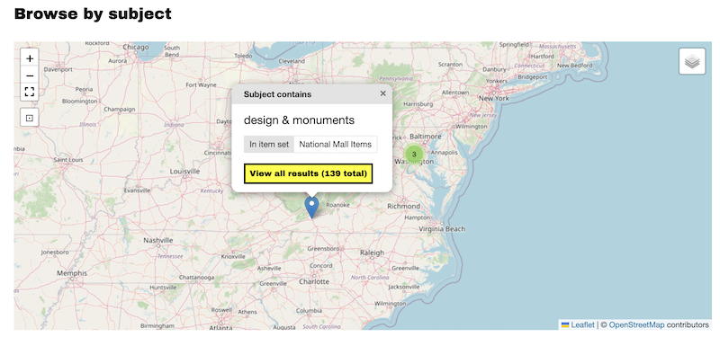

The Groups section has two fields to start:

- **Group by**: Select the type of group: 
	- Item sets
	- Resource classes
	- Property values (is exactly)
	- Property values (contains)
	- Property values (is item with ID)
	- Properties (has any value).
- **Feature type**: Select the type of feature to represent each group:
	- Polygon: A shape with boundaries around the outermost features.
	- Point: The central point of all the group's items' locations.

Once a user selects a "Group by" choice, the form should expand with more fields, based on the selection. 

Filtering options are also offered: when one grouping choice is made (such as group items by their class), you can then choose to filter items based on the other selections (such as only including items from a particular item set). These filters allow only one selection. 

##### Group by Item sets

- Filter by resource class: Only include items assigned to the selected resource class.
- Item sets: Select the item sets to render as groups on the map. Remember that each item set will render as either a polygon or point representing all of its items' locations - and that items can belong to more than one item set. 

##### Group by Resource classes

- Filter by item set: Only include items assigned to the selected item set.
- Resource classes: Select the classes to render as groups on the map. Remember that items can only have one class. 

##### Group by Property values (is exactly)

This option can be useful if you use controlled vocabularies, for example for subject headings. 

- Filter by item set.
- Filter by resource class.
- Property: Select the property of the values to group. You can leave this blank to create groups from finding the supplied text values in all properties. 
- Values: Enter the (exact match) text values to render as groups on the map, separated by new lines. With this option, an item can potentially be in more than one group.

##### Group by Property values (contains)

This option allows you more flexibility than the "is exactly" option. This can be useful to group items with textual location metadata such as City, State - enter each State text on a new line to see your items grouped by their state. 

- Filter by item set.
- Filter by resource class.
- Property: Select the property of the values to group. You can leave this blank to create groups from finding the supplied text values in all properties.
- Values: Enter the (matches any part) text values to render as groups on the map, separated by new lines. 

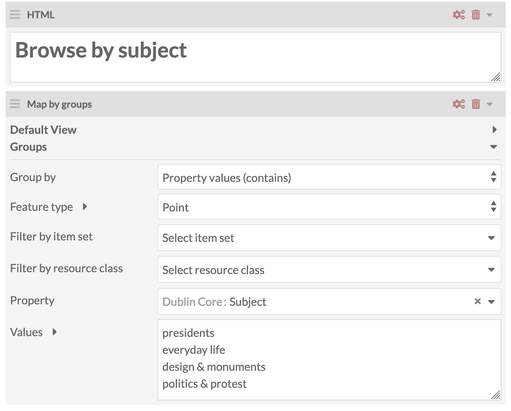

##### Group by Property values (is item with ID)

This option allows you to group items that have a common linked resource. Enter the ID of the resource used as a metadata value in several items' descriptions. You can choose a specific property, or choose to group all items that reference the same resource in any property. This feature will require complex linked data in your collection. 

- Filter by item set.
- Filter by resource class.
- Property: Select the property of the values to group. You can leave this blank.
- Values: Enter the resource IDs to render as groups on the map, one per line. That is, enter the linked resource used as a value in other items' metadata, such as an item set used by multiple items' Creator field.

##### Group by Properties (has any value)

- Filter by item set.
- Filter by resource class.
- Properties: Select the properties (that have any values) to render as groups on the map. Each property selected will become a group. 

The public map on first viewing shows a feature for each group. In the image below polygons are set to display for each group. This is the same map as the image at the beginning of this section, set to display polygons instead of single pins:

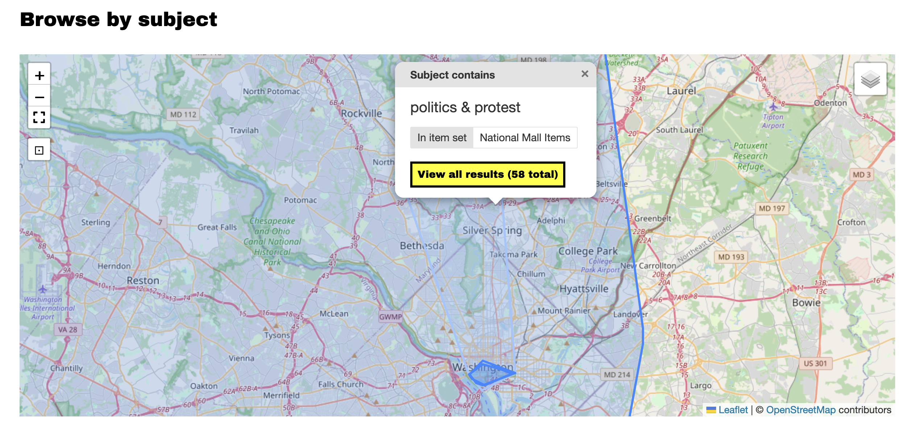

In the image above, one polygon has been selected and its pop-up is showing, reading "Subject contains politics & protest, in item set National Mall Items" with "View all results (58 total)" on a clickable button. 

After a group is selected, the map will update to display features for each item in the group. There may be clusters, pins, and shapes. Underneath the map there will appear a "Return to groups" button, alongside the current browsing parameters (including the group and any filters applied):

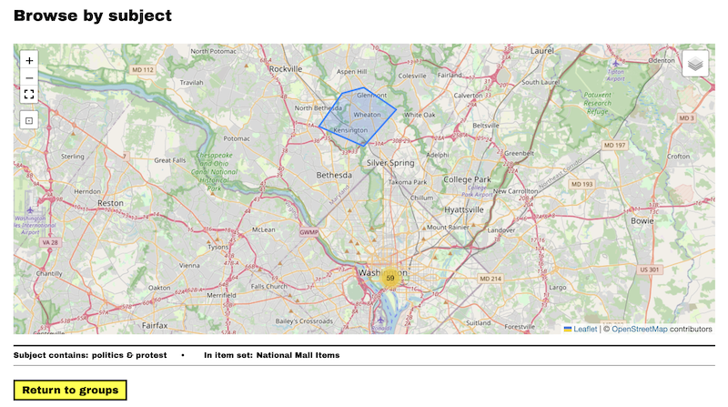

In the image above, the browsing parameters read "Subject contains: politics & protest | In item set: National Mall items". 

### Public view

A map block will display on a public page, item view, or item set view at the full page or block width, subject to your page design settings. If you have settings in the [default view](#default-view) of the map block, or have set [default map bounds for the item](#map-display), these should be applied. Otherwise the map will zoom so that all of the items are visible.

Viewers can zoom either using the scroll function of their computer or the zoom in/out buttons on the left side of the map. You can set whether viewers can use their mouse wheels to scroll inside the map page blocks (not item maps or the Map Browse page). 


Each item will display as one or more markers or shapes on the map. Features that are close together may display as a cluster circle, with a number indicating how many items share that location. As you zoom in, these clusters will break open. Depending on the size of a shape, shapes may not cluster except at very low zoom levels, or at all. Clicking on a marker will display the label for that marker. 

Item set pages, if you [add the Mapping resource block to a region](../sites/site_theme.md#select-regions-and-blocks), will display a map with all the features for all the items in that set. This resource block has no settings but can be modified with the [site-wide settings](#site-wide-settings).

If you have not added a label or image for the markers, they will simply say "Item: [Title]." 

!!! note
	Note that map features should display the appropriate language metadata based on the site's locale setting: for example, if a site is set to "French" in the locale, and the item has a French-tagged title (`fr`), that title should display rather than a title with another language tag or no tag at all. If you are experiencing problems loading the right language in multilingual projects, check your site settings and the language tags on the items' metadata fields. 

If you have added a label, it will show the label, as well as representative media and a link to the media if the marker has one.

Item mapping marker with label only:


Item mapping marker with label and image:

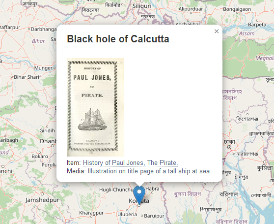

Item mapping marker with no label or image:

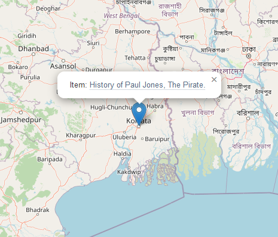

#### Timeline public view

Timelines only appear in page blocks. The timeline will display to the left of the map, or above the map on mobile views. Each item appears on both the map and the timeline (meaning it will only display items that have both numeric dates and map markers).

On a map block with a timeline, the block initially loads with the map either at default view or zoomed to display all markers. The timeline will display the title headline and text, as seen below:


In the timeline half of the display, information appears on the top and the timeline on the bottom. The timeline viewer has zoom buttons which increase or decrease the horizontal display of time (zoom in for year by year, zoom out to see decades at once). The arrow below them returns the viewer to the title slide.

When mousing over the timeline, the cursor changes to a four-directional arrow. Viewers can hold and drag left and right to scroll through the timeline. They can also navigate between items using the semi-opaque right and left arrows on the information area of the display.

Clicking on a marker will display that item's date or interval, title, description, and attached image. The information area has a scroll bar for longer material. The title acts as a link to the item's show page.


Whenever an item is selected, its marker in the timeline will show up with a highlight to indicate that it is active.

**Numeric:Interval appearance**

Interval properties display as a long bar running horizontally across the timeline, with bars reaching down to the timeline at the start and end dates of the interval. Overlapping intervals will stack.


**Numeric:Timestamp appearance**

Timestamp properties display as a flag on the timeline, with one bar anchoring them to the timeline. Items which overlap either due to date or long text will stack.

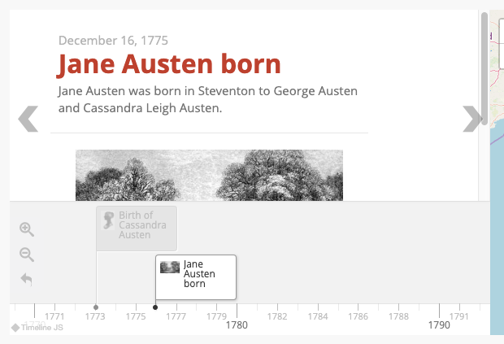

**Timeline navigation position**

If you select "full width, below story slider and map" in the "Timeline navigation position" dropdown, the timeline and map will display as follows:


If you select "full width, above story slider and map", the display will be similar but with the timeline above.

**Show contemporaneous events**

When "Show contemporaneous events" is checked, the map zooms to display all events which take place on the same day.

In the image below, the timeline is using interval data. The event "Reading Abbey Girls' School" (March 1785 - December 1786) takes place within the same period as "Steventon Rectory" (1775-1801), so the map is zoomed out to display the location markers for both events.

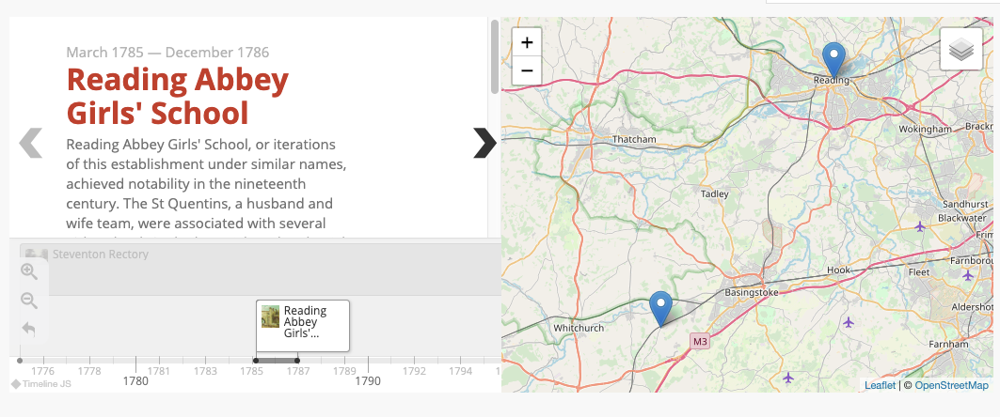

## Troubleshooting

- Trouble deleting: If you would like to remove the mapping location from an item, you must delete all the map modifications. First, delete each marker (click the "Delete feature" button, select the markers, click to save). Then clear the map view settings (click the "Clear the default center and zoom level" button). The map will return to a global view. Save the item and confirm that the map no longer appears.
- Trouble with map tiles: Ensure you have chosen a basemap from our provider list that offers tiles at a high degree of zoom. If not, choose another basemap or go back to the default provider.
- Trouble with timelines: Ensure you have the Numeric Data Types module installed and active, and that your selected date metadata field is formatted correctly as a Numeric Data Type using resource templates. Items with mapping data but without date data will not show, nor will items with date data but without mapping data, as maps with timelines require both.
- Trouble with items appearing on your maps: Ensure all items are added to your site under the Resources tab. Ensure the items have valid mapping data in their individual Mapping tabs. Test the Map Browse page, found at `yoursite/mapping/index/browse`. Test a simple Map by Attachments page block with a few items you know are geolocated correctly.
- Trouble with maps appearing on item pages or item set pages: Add the Mapping resource page block to a region provided by your theme, by going to [Site > Theme > Configure resource pages](../sites/site_theme.md#configure-resource-pages).
- Trouble saving overlays: There is a "Save overlay" button that must be clicked when an overlay is being entered or edited. Be sure to save each edit and then save the page. 
