# Mapping 

The [Mapping module](https://omeka.org/s/modules/Mapping){target=_blank} allows you to geolocate Omeka S items. Maps can also include timelines that allow you to scroll through items on a map in chronological order.

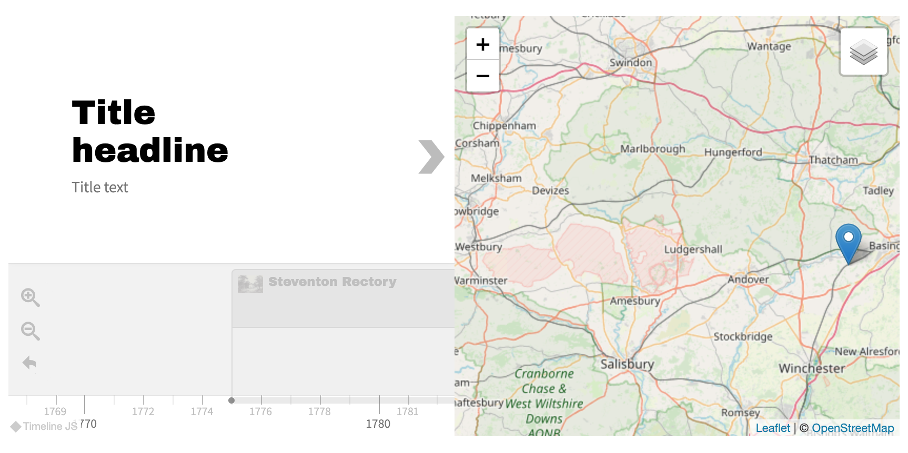

The Mapping module has no global configuration settings. It adds a new "Mapping" tab to each item edit screen, and also adds page blocks to [Site Pages](../sites/site_pages.md) that can be used to display maps for browsing.

## Item mapping

To add a map to a new or existing item, click to edit the item. Navigate to the "Mapping" tab to add location data to the item. Selecting the tab will open the map interface.

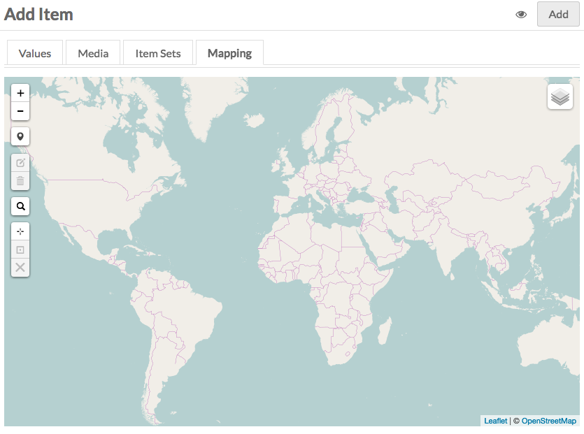

### Manipulating the map
Small white buttons on the left side of the map control and modify the appearance of the map. Hover over the buttons with the mouse to view tool-tips.

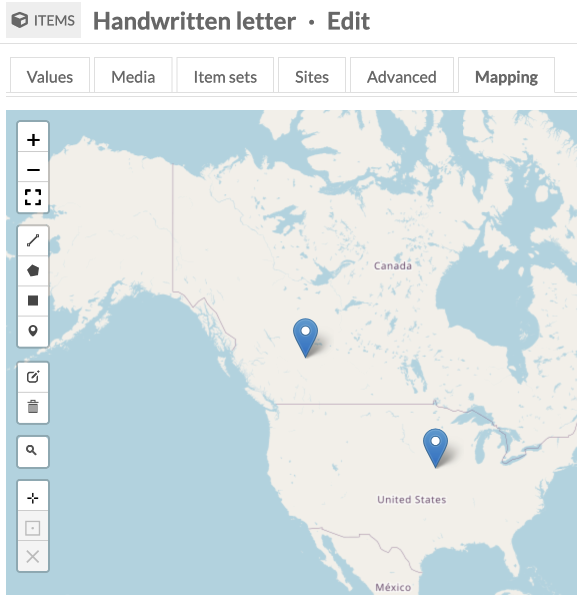

* **Zoom in**: The small white square with a black plus sign. Each click zooms in one step (between 0 and 19).
* **Zoom out**: The small white square with black minus sign. Each click zooms out one step (between 0 and 19).
* **Draw a Marker**: The small white square with black bubble marker. When you click the button your pointer becomes a blue marker. Click again on the map to place the marker.
* **Move Marker**: The small white square with black box and pencil icon. This option is only available after a marker has been added. Click the button and a pink box appears around each marker. Click a marker to move it. Click again to place. Use the grey buttons to "Save" or "Cancel".
* **Delete Marker**: The small white button with a trashcan icon. This option is only available after a marker has been added. Click the icon to select a marker. Click the marker to be removed and it will disappear. Use the grey buttons to "Save" or "Cancel" these changes.
* **Search Address**: The small white square with a black magnifying glass icon. Click to enter an address in the search bar.
* **Set the current view as default view**: The small white square with a target or crosshair symbol. The map will default to a zoomed out (global) view. Click to set the current view as the default view for this item.
* **Go to current default view**: The small black square with a black box around a dot. This option is only available after you have set a default view. Click to pan and zoom map to the selected view for this item.
* **Clear the default center and zoom level**: The small white square with a black "X". This option is only available after you have set a default view. Click to clear pan and zoom preferences and return to the initial global view.

In addition to these options, you can also navigate the map using your mouse or trackpad by scrolling to zoom and clicking and dragging to pan.

### Adding locations to an item
In order to add a location to an item, edit the item and go to the "Mapping" tab.

To find the point where you want to locate the marker, you can do one of the following:

* Zoom and drag to find the location.
* Type the place name into the Search Address field (see Figure 4 below).
	* Note that this will populate as you type, and will not search locations which do not match the formatting of the search function.
* Enter latitude and longitude coordinates into the search box. These should be formatted as decimals, for example `38.897222, -77.064167`, not `38° 53′ 50″ N, 77° 3′ 51″ W`.

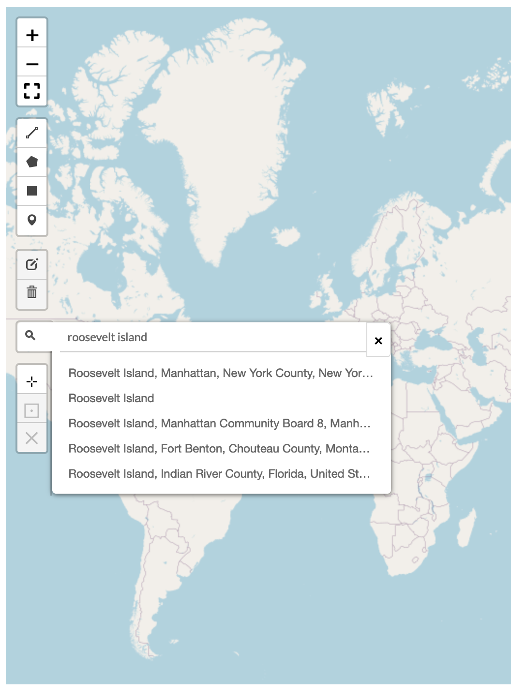

Click on the **Draw a Marker** tool in the right hand toolbar. Your cursor will become a marker which can move around the map. To set the point, click on the map.

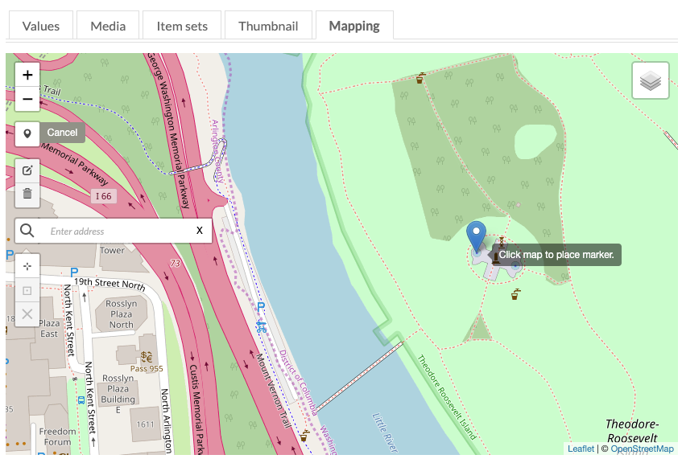

You can now click on the marker to add a label which will display on [public map views](#public-view) of the item. Be aware that this will display in a large font.

When you are adding a label, you can also add an image to display on the marker when clicked in the [public view](#public-view). You can only select from images which have already been [attached to the item as media](../content/items.md#media). To remove the image, select "No Image" from the sidebar.

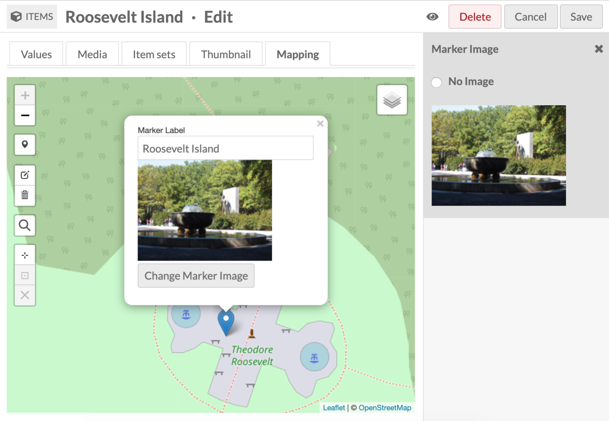

### Editing markers
To edit the label or image, simply click on the marker. This will open the options for the label and image, as seen above.

To **move a marker** you have added, use the "Move marker" button on the left hand toolbar (small white square with black box and pencil icon). Any marker on the map will become highlighted in a red, dotted-line outline. Click and drag the marker you want to move.

To apply your changes, click the "Save" option which opens from the "Move marker" button. To cancel the changes, click "Cancel". If you do not click save, the marker will not be moved.

To **delete a marker**, first click the "Delete a marker" in the left hand toolbar (trash can icon). Click on the marker you want to delete; this will remove the marker from the map. In order to make the deletion permanent, you must click Save in the menu which opens from the "Delete a marker" button.

Note that you can use the "clear all" button in the menu which opens form the "delete a marker" button to clear all markers on the map.

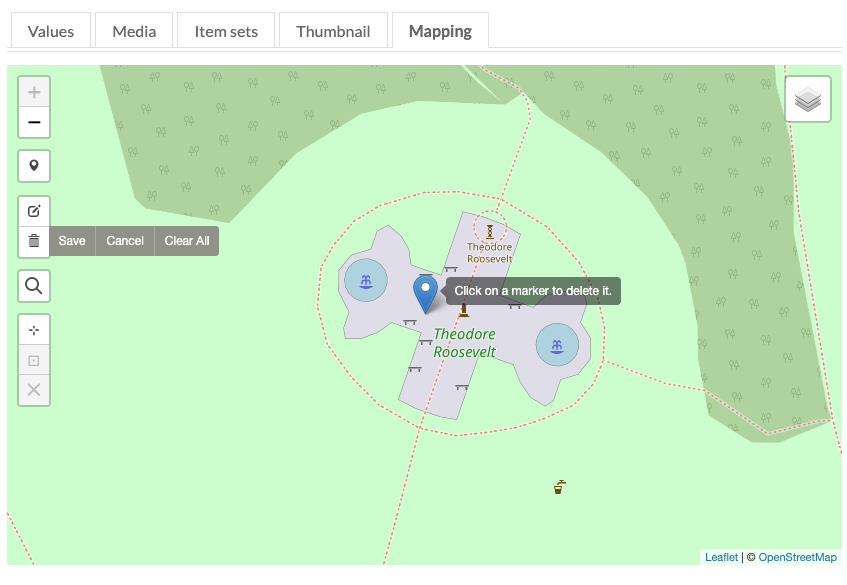

### Setting the map display

You can also set the map's default display zoom level and center, independently of the marker(s) you place. The default is to center on one marker and zoom fully in, or to zoom out far enough to contain all markers in the map view.

* **Set the current view as default view**: The small white square with a target or crosshair symbol. The map will default to a zoomed out (global) view. Click to set the current view as the default view for this item.
* **Go to current default view**: The small black square with a black box around a dot. This option is only available after you have set a default view. Click to pan and zoom map to the selected view for this item.
* **Clear the default center and zoom level**: The small white square with a black "X". This option is only available after you have set a default view. Click to clear pan and zoom preferences and return to the initial global view.

## CSV Import integration

Mapping is compatible with [CSV Import](../modules/csvimport.md) when importing items (not mixed resources).

If the two modules are enabled, your CSV Import process will have two new dropdown menus in the "Add mapping" sidebar when you are connecting a spreadsheet column to a property.

The "Resource location" dropdown menu includes three options for pinning the item geographically (latitude, longitude, and latitude/longitude). You can import multiple values for these fields.

The "Default map view" dropdown menu allows you to set a centerpoint and zoom level for the map that displays for that item. Without a map centerpoint, the map will center on the item's pin.

You cannot set marker labels or marker images in CSV Import.

You cannot [batch-edit](../content/items.md#batch-actions) mapping values after items are in your system, only edit them manually one item at a time. So, CSV Import can help you do things such as set a consistent map zoom level on each item, by supplying a spreadsheet with every item and the same zoom level number in each row.

## Adding map blocks to a site

Mapping creates two page blocks you can add to your pages: "Map by attachments", where you manually add resources to the map block; and "Map by query", which allows you to use a search string to add resources to the map block.

To add a map to a new or existing page, click to edit the page. On the right, under "Add new block", click either the "Map by attachments" or "Map by query" option (1). Selecting one will open the map block to the page (2). The blocks include customizable features for the map in collapsable panes. Click the triangle to expand or collapse these fields (3).

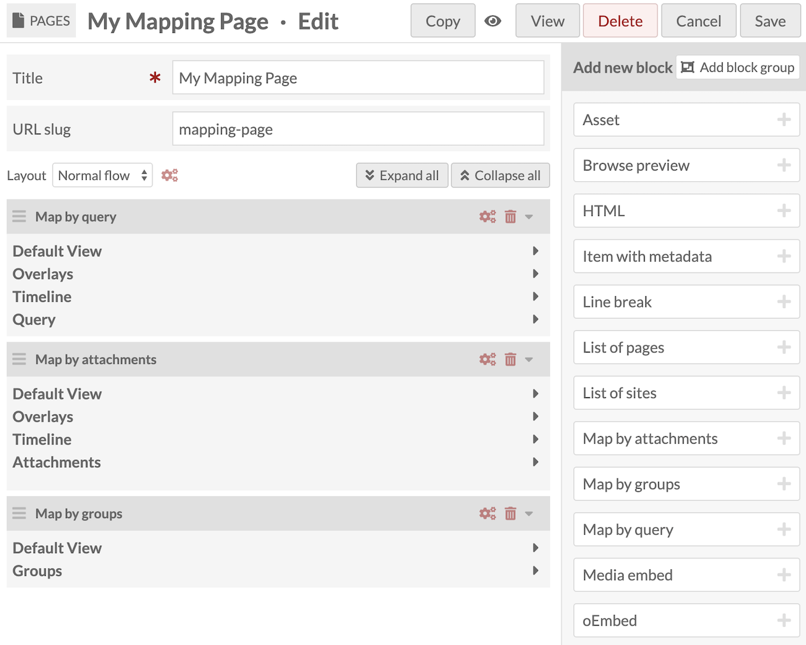

The "Map by attachments" and "Map by query" blocks have largely the same settings, with the exception of the final option.

### Default view
This section lets you set the appearance and zoom level of the map. There are three fields and a preview map. Within the preview map are buttons which you can use to set the default zoom and location of the map. If you do not set a default zoom or location, the map will adjust to display all resources.

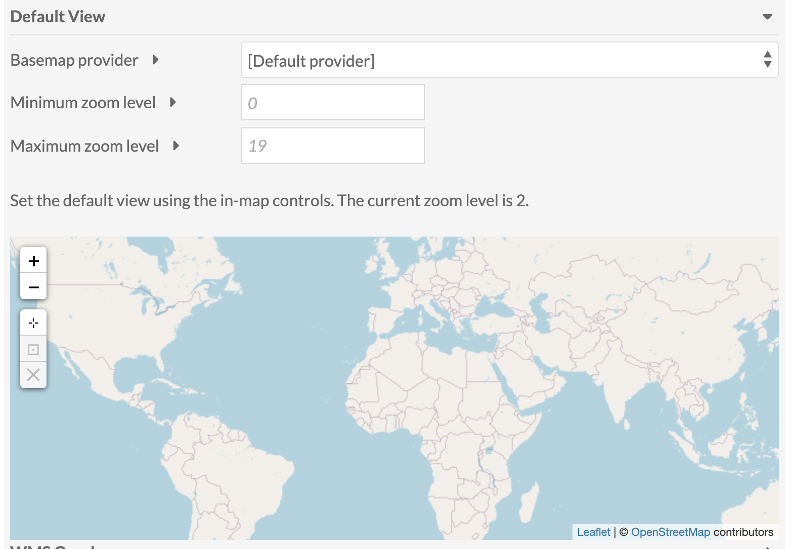

**Basemap provider**: select from a dropdown of basemaps. Once selected, the preview map will update to show you the appearance of that map. The default is "OpenStreetMap.Mapnik".

**Minimum zoom level**: set the minimum zoom for the map. Fully zoomed out is 0.

**Maximum zoom level**: set the maximum possible zoom level. The highest is 19. Some basemaps do not function at higher levels; you will want to check to be sure you set your maximum at a level where you basemap is visible.

Between the fields and the preview map is a message which tells you the current zoom level, as you zoom using the plus and minus buttons on the preview map or the scroll on your comptuer. Use this to help you determine where you want to set your minimum and maximum zoom levels.

Within the preview map, there are five buttons:

 * Zoom in: The small white square with a black plus sign. Each click zooms in one step (between 0 and 19).
 * Zoom out: The small white square with black minus sign. Each click zooms out one step (between 0 and 19).
 * Set the current view as default view: The small white square with a target or crosshair symbol. The map will default to a global view. Click to set the current view as the default view.
 * Go to current default view: The small black square with a black box around a dot. This option is only available after a default view has been set. Click to pan and zoom map to the selected view.
 * Clear the default center and zoom level: The small white square with a black "X". Click to clear pan and zoom preferences and return to the initial global view.

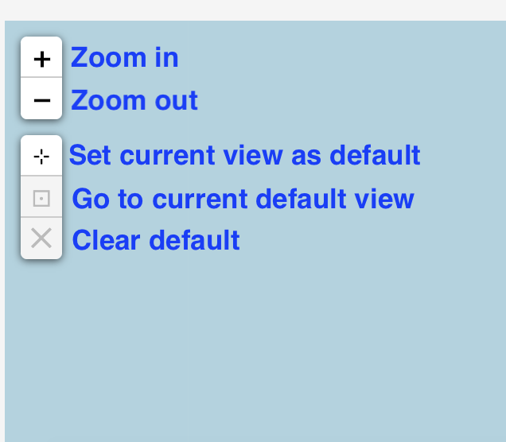

### WMS overlays

 Add, edit, and delete [Web Map Service (WMS)](https://mapserver.org/ogc/wms_server.html){target=_blank} overlays.

 * **Label**: Create a unique, descriptive label for the map overlay. This will be visible to visitors and should be used to differentiate between overlays.
 * **Base URL**: Add a URL to the WMS map.
 * **Layers**: Any layers you wish to use, separated by commas.
 * **Styles**: Any styles you wish to use, separated by commas.

 Click Add Overlay to create the overlay. Click _Clear Inputs_ to clear each of the fields. Multiple overlays can be added.

 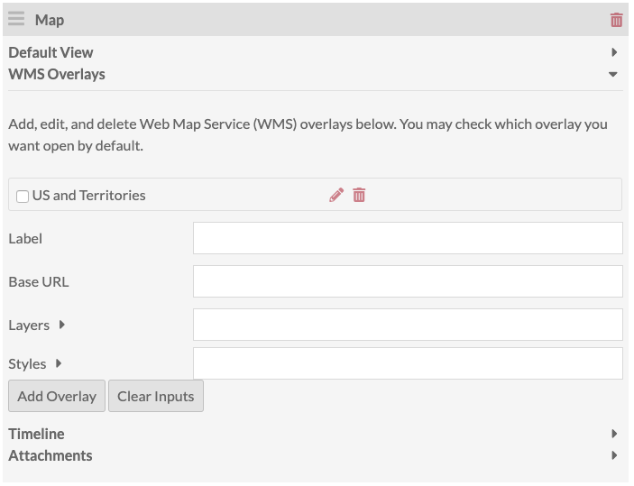

  Once you have added an overlay, it will appear above the fields for adding overlays.

  Choose a default overlay by checking the box next to it. Edit an overlay by clicking on on the red pencil edit button, or click the red trashcan icon to delete the overlay.

  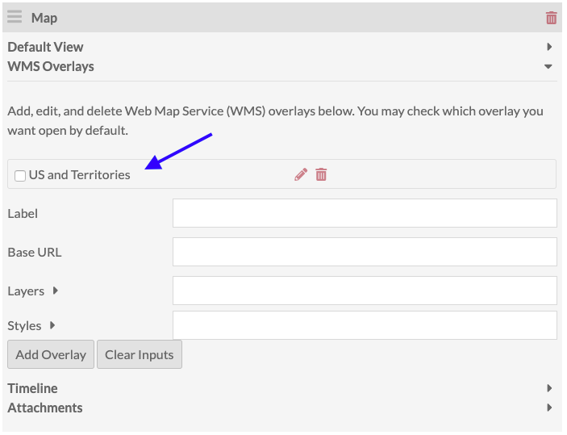

### Timeline
Timeline adds a timeline display to the left of the map view. Note that this feature requires the [Numeric Data Types](../modules/numericdatatypes.md) module and at least one item that has a property with a Timestamp or Interval value (applied via the [resource template](../content/resource-template.md)).

- **Title headline**: displays on the first slide of the timeline (see ["Timeline public view"](#timeline-public-view) below). You can use this to name the timeline.
- **Title text**: appears below the title headline on the first slide of the timeline (see ["Timeline public view"](#timeline-public-view) below). You can use this to provide context or narrative introduction for the timeline.
- **Fly to**: is a dropdown menu where you can set the zoom level for each point in the timeline on the map. Your options are default view, or zoom levels 0-18 (even numbers only). The higher the number, the more zoomed in the map will be.
	- Note that the transition between points is animated, so if you have very distant points the shift between them will involve a significant zoom out and in.
- **Show contemporaneous events**: sets how two events with the same timestamp or interval are displayed. If checked, contemporaneous events will both display in the map when active in the story slider.
	- For timestamp properties, if two events have a date of "1 January 2000," both events will show on the map when either is in the story slider.
	- For interval properties, if one event has an interval of "28 July 1914 - 11 November 1918" and another has an interval of "January 1819- December 1920" both events will show on the map when either is in the story slider.
	- Note that this setting only works with the default view of Timeline navigation position.
- **Timeline navigation position**: by default, the timeline displays with the story slider, to the left of the map. Using this dropdown, you can change where the story slider displays. Options are:
	- Default position
	- Full width, below story slider and map
	- Full width, above story slider and map.
- **Property**: a dropdown menu; select the timestamp or interval property to use when populating the timeline. The dropdown menu will populate with the properties which have been defined in a resource type as using numeric data types Interval or Timestamp.
	- You may want to make a note of which property and numeric data type you are using before creating the map block. The dropdown only displays the term and data type but not which template it is associated with, for example `Date Created (numeric:timestamp)`.
	- Noted that you can only select *one* property per timeline. You cannot mix timestamp and interval data.

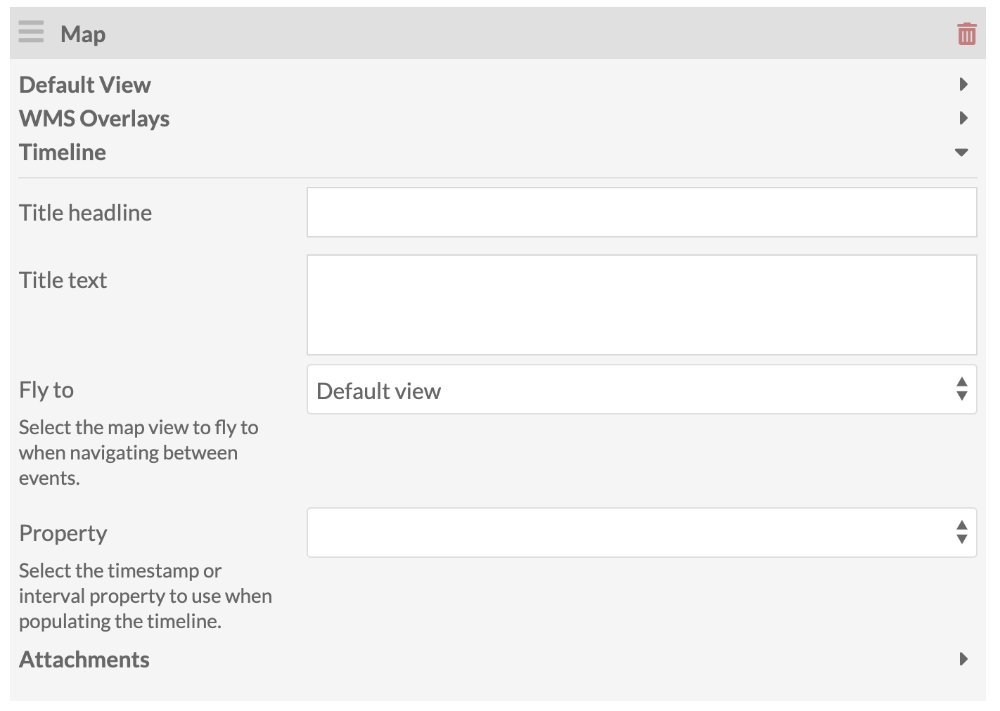

To remove the timeline from a map block, click the "X" on the far right of the Property dropdown.

To see how the various settings of the timeline block appear on the public side, please see the [Timeline Public View](#timeline-public-view) section below.

### Attachments (Map by attachments block)

Markers are added to the map using Items.

* Click "Add Attachment" (1) to select them from a list on the right (2). Note: This list will only be populated by items that have at least one location added to them (when editing the item).
* Clicking an item adds it to a list in the Attachments pane (3).
* Click and drag items in this list to reorder them.
* Delete items by clicking the red trashcan.

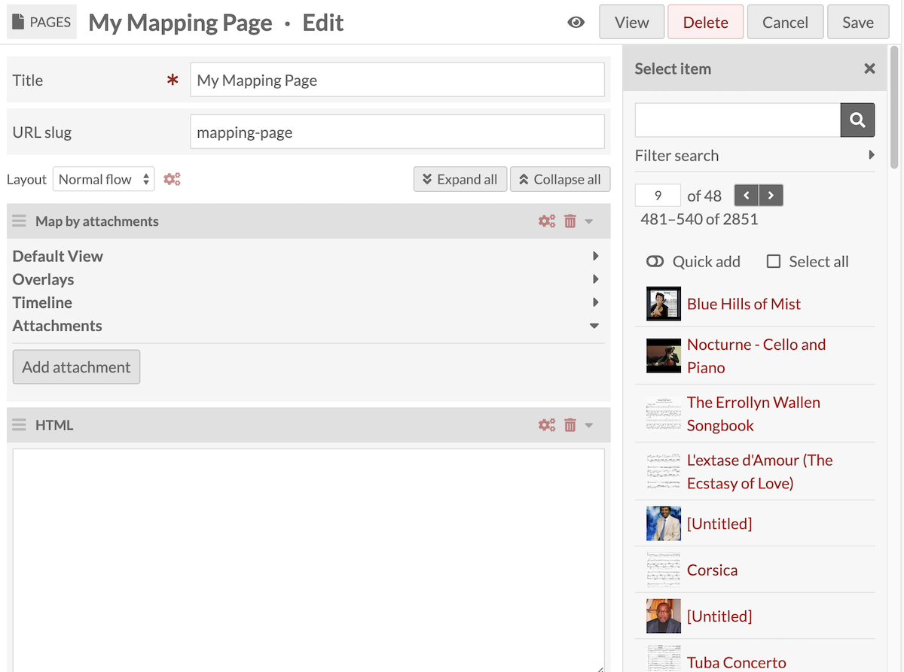

To add multiple items at once, click the "Quick add" slider just above the list of items in the right hand drawer. This will add a checkbox to the left of each item. Check the boxes of those items you want to add to the map, then click the "Add selected" button at the bottom of the drawer.

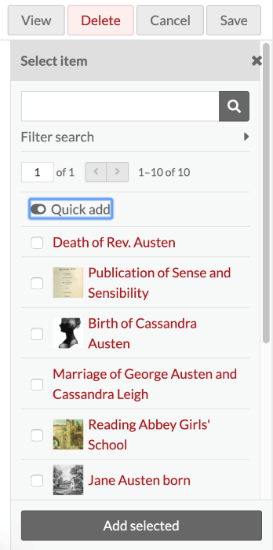

### Query (Map by query block)
In order to use this block, you will need to run a query, or search, in your items. From the search results page, copy everything in your browser's address bar starting with the question mark all the way to the end of the search url (to the right).

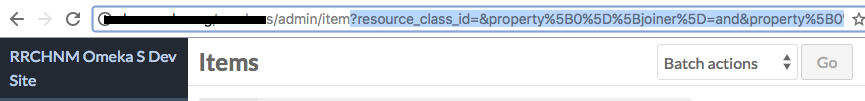

Paste the query string into the Query field in the Map by query block. Note that at no point will items display on the admin side. You will need to go to the public view to see the items which result from your query.

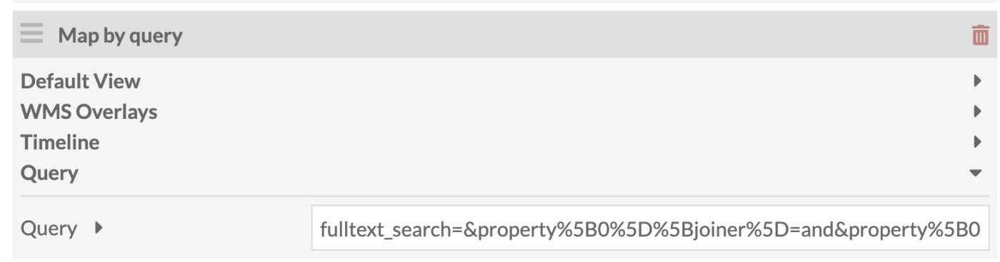

## Public view
A map block will display on a public page at full page width. If you have settings in the [default view](#default-view) of the block, these should be applied. Otherwise the block will zoom so that all of the items are visible.

Viewers can zoom either using the scroll function of their computer or the Zoom in/out buttons on the left side of the map.

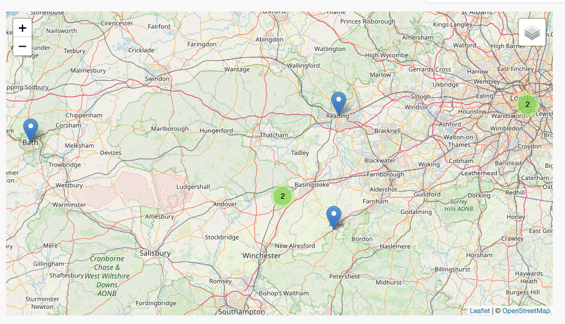

Each item will display as a marker on the map. Markers which are close together will display as a cluster circle, with a number indicating how many items share that location. As you zoom in, these clusters may break open.

Clicking on a marker will open a label for that marker. If you have not added a label or image for the marker, it will simply say "view item." If you have added a label, it will show the label, as well as representative media and a link to the media if the marker has one.

Item mapping marker with label only:
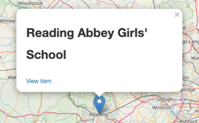

Item mapping marker with label and image:
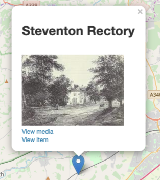

Item mapping marker with no label or image:
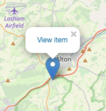

### Timeline public view
On the public side, the timeline will display to the left of the map, or above the map on mobile views. Each item appears on both the map and the timeline.

On a map block with timeline, the block initially loads with the map either at default view or zoomed to display all markers. The timeline will display the title headline and text, as seen below:

In the timeline half of the display, information appears on the top and the timeline on the bottom. The timeline viewer has zoom buttons which increase or decrease the horizontal display of time (zoom in for year by year, zoom out to see decades at once). The arrow below them returns the viewer to the title slide.

When mousing over the timeline, the cursor changes to a four-directional arrow. Viewers can hold and drag left and right to scroll through the timeline. They can also navigate between items using the semi-opaque right and left arrows on the information area of the display.

Clicking on a maker will display that item's date or interval, title, description, and attached image. The information area has a scroll bar for longer material. The title acts as a link to the item's show page.

Whenever an item is selected, its marker in the timeline will show up with a highlight to indicate that it is active.

**Numeric:Interval appearance**
Interval properties display as a long bar running horizontally across the timeline, with bars reaching down to the timeline at the start and end dates of the interval. Overlapping intervals will stack.

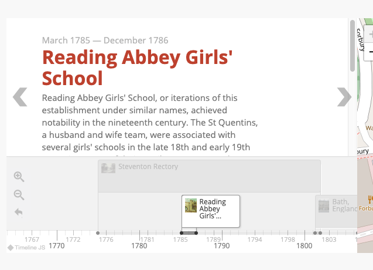

**Numeric:Timestamp appearance**
Timestamp properties display as a flag on the timeline, with one bar anchoring them to the timeline. Items which overlap either due to date or long text will stack.

**Timeline navigation position**
If you select "full width, below story slider and map" in the "Timeline navigation position" dropdown, the timeline and map will display as follows:

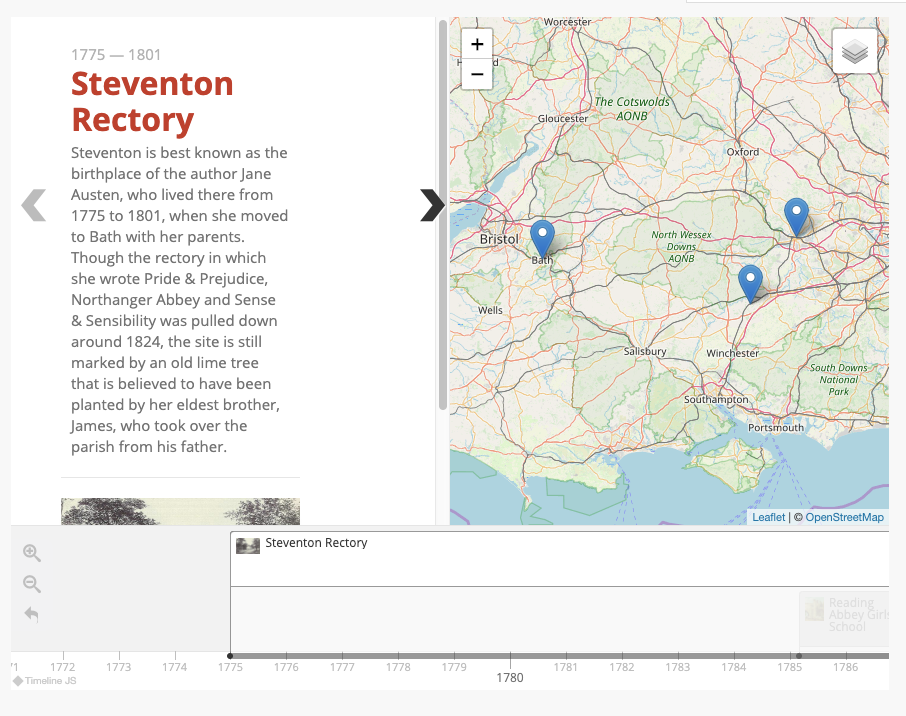

If you select "full width, above story slider and map", the display will be similar but with the timeline above.

**Show contemporaneous events**
When "show contemporaneous events" is checked, the map zooms to display all events which take place on the same day.

In the image below, the timeline is using interval data. The event "Reading Abbey Girls' School" (March 1785 - December 1786) takes place within the same period as "Steventon Rectory" (1775-1801), so the map is zoomed out to display the location markers for both events.

## Troubleshooting
If you would like to remove the mapping location from an item, you must delete all the map modifications. First, delete each marker (click the "Delete a Marker" button, select the markers, click to save). Then clear the map view settings (click the "Clear the default center and zoom level" button). The map will return to a global view. Save the item and confirm that the map no longer appears.
