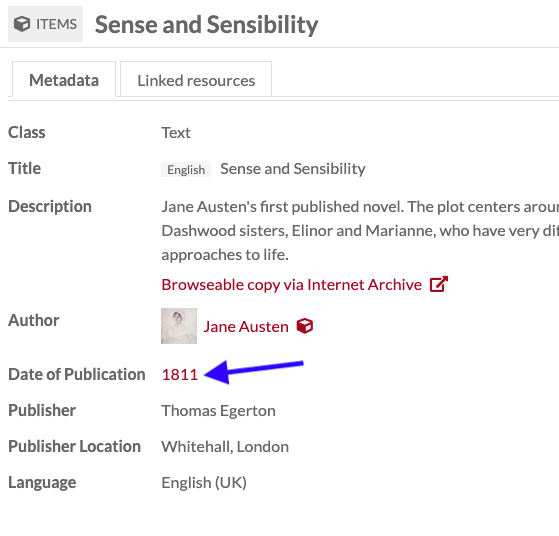
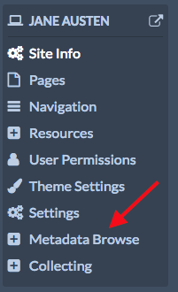
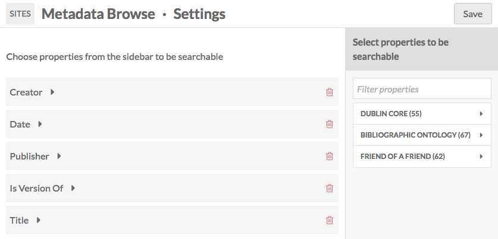
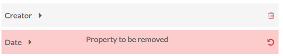
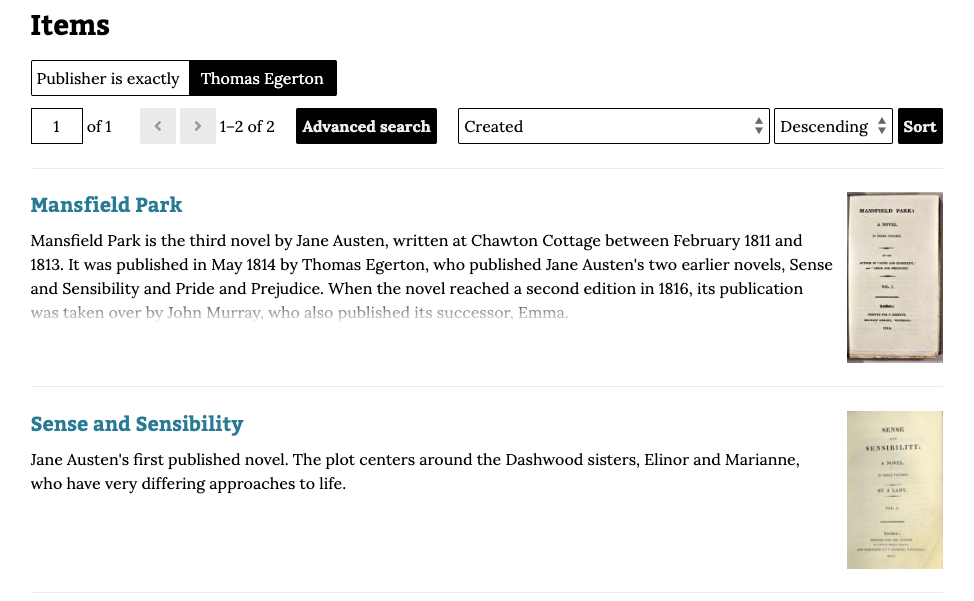
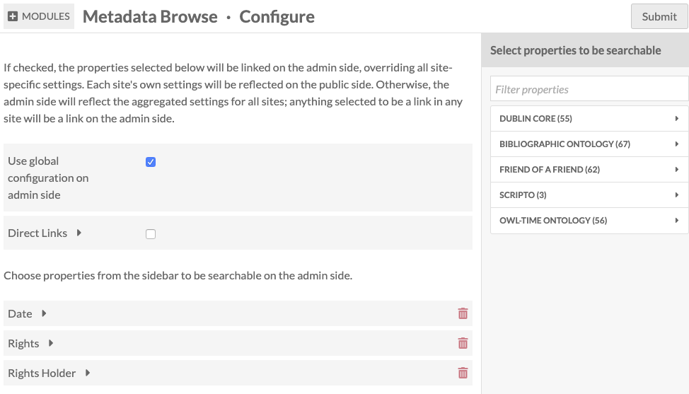
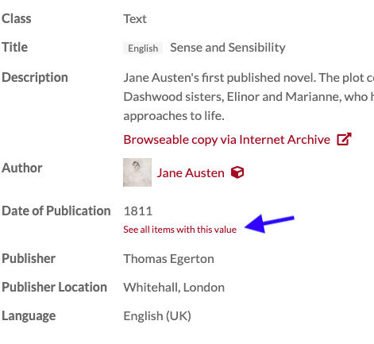
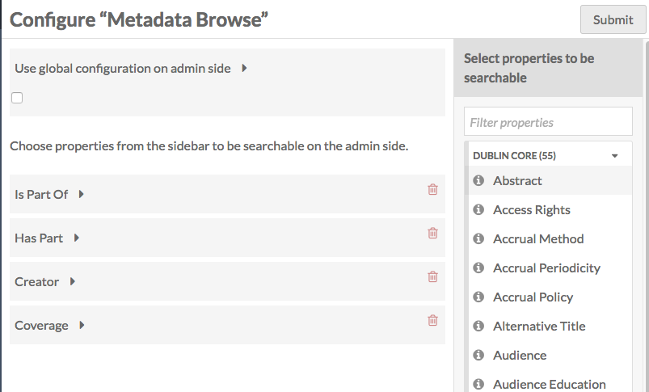
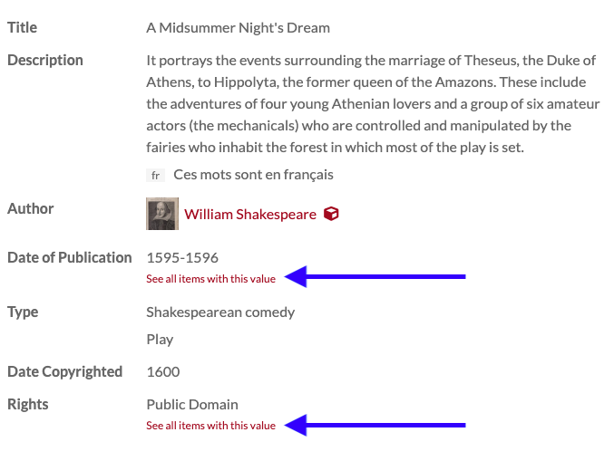

# Metadata Browse

The [Metadata Browse module](https://omeka.org/s/modules/MetadataBrowse){target=_blank} makes it possible to browse all resources that share a value for a particular metadata property.

It does this by either turning selected properties into a link, or by adding a link below properties that reads "See all items with this value". These links appear only on item view pages. When the link is clicked, the module returns the results of that search (property value is equal to input). It is similar to the Omeka Classic plugin [Search by Metadata](http://omeka.org/add-ons/plugins/search-by-metadata/){target=_blank}.

The module adds a site-specific configuration menu that allows you to make properties browseable on each site. It can also make specific properties browseable in the admin interface. The choice of directly-linked properties, or the display of a separate link, is a universal setting and cannot be changed from site to site.

These settings are only available to users at the level of Global Admin, Supervisor, or Editor. Site Managers cannot change site-specific settings.

## Metadata Browse on sites
Once the module is activated, it will show up in the context menu for [each of the sites on your installation](../sites/index.md). To set up Metadata Browse for a site, click on the Metadata Browse tab in the site's context menu.

On the page that displays, the main section displays all currently enabled properties. Select properties, by clicking on them in the sidebar, to enable metadata browsing.

Delete any selected properties by clicking the trash can icon. If you accidentally click the delete button, simply click the undo button that replaces it to keep that property.

Remember to click the "Save" button to save changes.

### Public view
Once you have selected properties and saved changes, visitors to your site can use the selected properties to browse all items on the site with matching values.

The item view will either display with the property as a link, or with a link reading "See all items with this value", depending on whether the [Direct Links option is checked](#direct-links) in the global module configuration.

In the example below, Metadata Browse is available for Title, Date of Publication, and Publisher, and the "Direct Links" setting is unchecked.

Clicking on "See all items with this value" under creator takes a visitor to a page of exact match search results. For example, this is the result for clicking "See all items with this value" for the Publisher property in the previous image:

## Admin configuration
Global site settings and admin-side settings can be changed from the module's configuration page, under the Modules tab of the left-hand navigation. Click the "Configure" button, with the wrench icon, to the right of the Metadata Browse label.

The module has two checkbox configuration options: Global Configuration and Direct Links.

### Global configuration
The "Use global configuration on admin side" checkbox determines how the properties available for **administrative side** metadata browsing (on items and item sets views) are determined: by aggregating the properties selected on all of the sites in the installation (unchecked), or by limiting to only the properties chosen on this page (checked).

This checkbox modifies the admin side for all users. For example, a site about artists might have the Metadata Browse enabled for "Creator" (Dublin Core), while a site collecting conference papers might enable Metadata Browse for "presented at" (Bibliographic Ontology). With the box unchecked, both "Creator" and "presented at" would have Metadata Browse enabled on the admin views of all items and item sets across the entire installation.

Checking the box can be used to limit the number of properties that have Metadata Browse enabled on the admin side. If, for example, the site about artists was using Metadata Browse on every possible property, those Metadata Browse links would be visible on the public site but would not show up on the admin side. Instead, the Global Administrator(s) could decide which properties to enable browsing for on the admin side.

### Direct links
The "Direct Links" checkbox sets how metadata-browsing links are displayed on both the admin side and across all sites.

If this box is unchecked, the properties selected for metadata browse will display with a textual link under them which reads "See all items with this value". Clicking on the link text opens the page of items with matching metadata.

In this example, metadata browsing is active for the "Date of Publication" property:

If this box is checked, the values of the properties themselves become the link, similar to how a property populated by a resource displays. In this case, clicking on the property value itself opens the page of items with matching metadata.

### Choose properties
Selecting properties for Metadata Browse in the Module configuration will only work if the ["Use global configuration" checkbox](#global-configuration) is checked.

Select the properties from the sidebar by clicking on the desired property. It will load under the prompt "Choose properties".

To remove a property simply click the trash can icon to the right of the property label.

## Admin side browse

Once you have selected properties for Metadata Browse, either in the configuration for the module or on at least one site, you will be able to search for exact matches to item and item set properties on the admin side.

When viewing the metadata of any item (not when editing), you will be able to browse those properties as exact matches for any other item in the installation with that value in that property. If the [direct link checkbox](#direct-links) is active, these properties will display as links; if not, they will display with the text "See all items with this value" just below the value for the property.

