# Numeric Data Types

The [Numeric Data Type module](https://omeka.org/s/modules/NumericDataTypes){target=_blank} allows you to set certain properties as numeric data, using resource templates. You can designate properties as either dates and times or numbers.

## Create numeric properties
To implement the module, you will need to create or edit a [resource template](../content/resource-template.md) to set specific properties as having numeric data types. 

When creating or editing a resource template, find the property you want to set as numeric in the right hand sidebar. Click on the property to add it to the template if needed.

Once the property is included in the template, click the pencil icon to edit the property. In the right hand drawer that opens, look for the dropdown "Data type" under the heading "Other options".

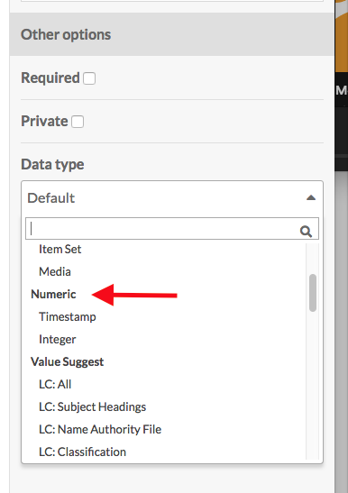

In the dropdown, select from the following options under the "Numeric" heading:

- Timestamp, which can be as broad as a year or formatted as a date and time
- Number, which can be negative or positive, and can include a decimal
- Duration, for how long something lasted, with options for years down to seconds
- Interval, a date-based range with start and end dates in each instance of the property.

Be sure to click "Set changes" at the bottom of the drawer to save this setting.

When you save changes to your resource template, the numeric type you chose should show up in the column "Data type" for the template.

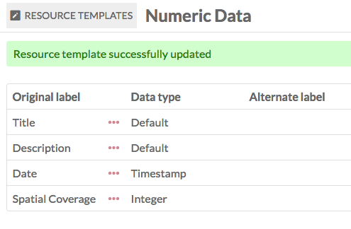

!!! note
	These fields will display only the numeric data entered, as in, it will show "200" if you mean to indicate "200 metres". If you want to indicate what your number values represent (seconds minutes, metres, pixels, inches, etc.), we suggest employing the property's alternate label to include the scale you are using; for example, use "Spatial Coverage" and rename it to indicate "Height (cm)".

## Add numeric data
When you add or edit an item using the template you created above, the properties you set as numeric will appear as follows:

### Timestamp
A Timestamp property automatically loads with fields for Year, Month, and Day. The Month input is a dropdown where you select from the months' names. 

If you enter a day without a month, the day information will not be saved. 

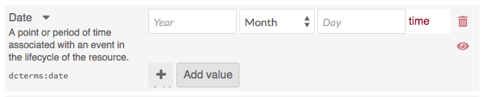

Clicking on the "time" button to the right of the day input field will load additional dropdown fields for Hour, Minute, and Second. Note that there is no AM/PM option; use twenty-four hour time entries (14 for 2pm, etc.).

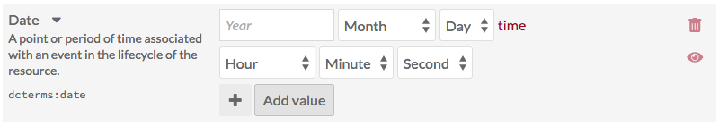

Entries must be whole numbers, with no decimal points.

### Number
A number property is a small text field that allows you to type in a number, either a whole number or with a decimal (that is, this field allows numeric characters, a negative sign [-] before the number, and one period). 

The entered value must be an integer or decimal. The number must not be less than -9007199254740991 or greater than 9007199254740991. The number of digits to either the left or right side of a decimal cannot exceed 16.

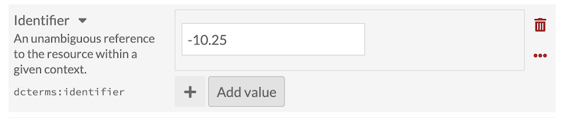

### Duration
A Duration property has a series of fields in which to enter the duration of the resource. There are fields for Years, Months, and Days. Clicking on the "time" button to the right of the day input field will load additional dropdown fields for Hours, Minutes, and Seconds. Note that there is no AM/PM option; use twenty-four hour time entries (14 for 2pm, etc.).

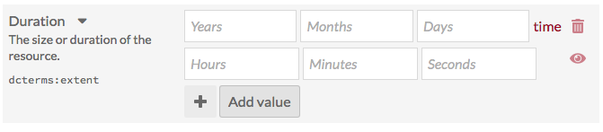

You do not need to have input in every field. For example, you can enter a duration of 1 year and 5 days, leaving the month field blank.

### Interval
An Interval property allows you to enter the beginning and end dates and times for a resource. There are two sets of timestamp fields, one for the start date and one for the end. 

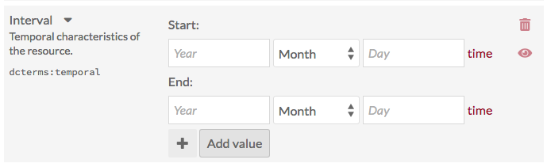

## Bulk-edit numeric data

The module adds additional options to the dropdown menu of the ["Convert data type" option on batch-editing pages](../content/items.md#batch-editing) for resources (items, media, and item sets).

The "Convert data type" option lets you convert an existing text property to other data types, including numeric. It will not work on properties where the data is currently an Omeka resource or a URI. 

This method allows you to add numeric data types to resources without employing resource templates to do so. 

In the first field, select a property from the dropdown. You can type to search through the properties. Note that this dropdown loads the property names from the vocabulary and will not have the additional labels from your resource template, so be sure you know which vocabulary term you are looking for.

In the second field, select from the following options to convert to:

- Timestamp
- Number
- Duration
- Interval.

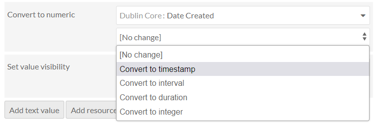

When textual data is converted to numeric data, the module will identify either numbers or [ISO 8601](https://en.wikipedia.org/wiki/ISO_8601){target=_blank}-formatted dates and times. It will not recognize and reformat dates in, for example, `MM/DD/YYYY` formatting. You would need to manually edit or bulk-import the correct formats using [CSV Import](../modules/csvimport.md).

Use the following formats for [dates](https://en.wikipedia.org/wiki/ISO_8601#Dates){target=_blank}, including dashes between values:

- `2022`
- `2022-08` (year and month, no date)
- `2022-08-18`.

Use the following formats to add [times](https://en.wikipedia.org/wiki/ISO_8601#Times){target=_blank} to your date values:

- `2022-08-18T17:26:49+00:00` ([time offset from UTC](https://en.wikipedia.org/wiki/ISO_8601#Time_offsets_from_UTC){target=_blank})
- `2022-08-18T17:26:49Z` ([coordinated universal time](https://en.wikipedia.org/wiki/ISO_8601#Coordinated_Universal_Time_(UTC)){target=_blank}). 

You cannot omit the year while providing a month and/or day. You cannot supply ordinal dates (as in, `2000-175` for the 175th day of the year 2000). 

Use the following format for [intervals](https://en.wikipedia.org/wiki/ISO_8601#Time_intervals){target=_blank} with start and end points:

- `2007-03-01T13:00:00Z/2008-05-11T15:30:00Z` (Start and end).

Use the following formats for [durations](https://en.wikipedia.org/wiki/ISO_8601#Durations){target=_blank}, expressed as number of years, number of months, number of days, etc.:

- `P23DT23H` (23 days & 23 hours)
- `P3Y6M4DT12H30M5S` (3 years, 6 months, 4 days, 12 hours, 30 minutes, & 5 seconds).

## Sort by numeric data

Once you have resources using numeric data types, they will appear as sortable options on the respective resources' browse views. For example, if at least one item has a "Timestamp" value in a field, you can sort your item browse table by that field. 

Click the first dropdown on the top right corner of the table of resources, which defaults to "Created".

Clicking on this dropdown will reveal multiple options, including all of the properties using numeric data types. These options display as the property with the data type in parentheses, for example "Date (numeric:timestamp)". 

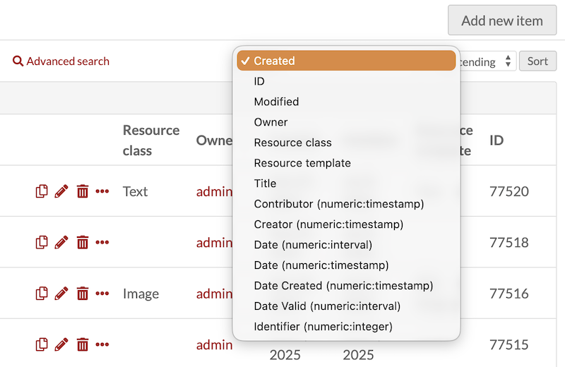

Note that occasionally in the interface, including here, you may see "integer" displaying when referring to "number". This will still be numbers that can include decimal places. 

## Search numeric data

When the module is active, it adds additional search options to the Advanced Search for resources. 

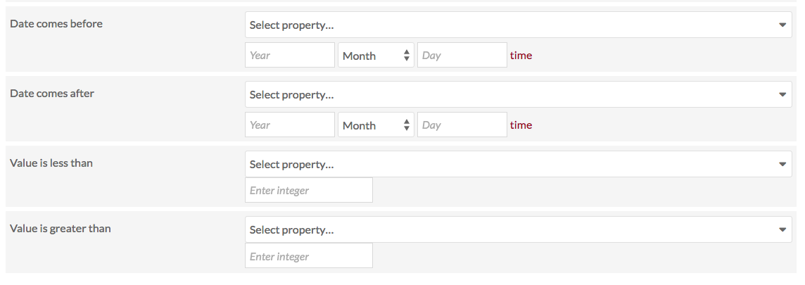

For each search option, you must select a specific property from the dropdown. For example, if you are using "Duration" from two separate vocabularies, one for film (`time:hasDuration`) and one for events (`dcterms:extent`), you would need to select the correct property from the resource template you want to search. The dropdown will display the original property labels (`Extent` or `hasDuration` in the examples above). If you hover over the properties in the dropdown, it will show you the resource templates that are using that property and to which the search will apply.

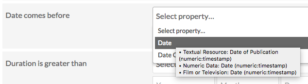

**Timestamp** data has two search options, one for "Date comes before" and "Date comes after". Select the property for timestamp from the dropdown - only properties which are being used for timestamp will appear in the dropdown. 

**Duration** data, like timestamp data, has two options, for Duration is greater than and duration is less than. After selecting the property you want to search on, enter values for years, months, days, hours, minutes, or seconds.

**Date in interval** searches for a date within an interval. When searching on an interval, be as precise as possible. Because of the way that the module stores timestamps, the date you are searching must fall *within* the interval. So a search for the year 1814 would not turn up an event with interval September 12-15, 1814, because of the way the data reads the two dates. 

**Number** data is searchable with "Value is less than" and "Value is greater than." As with the timestamp data, only properties which have numeric data will load in the dropdown. 

## Integration with other modules

Numeric Data Types functions with [Collecting](../modules/collecting.md), [CSV Import](../modules/csvimport.md), [Faceted Browse](../modules/facetedbrowse.md), and [Mapping](../modules/mapping.md).