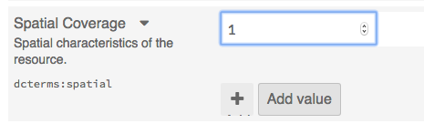
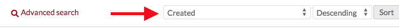
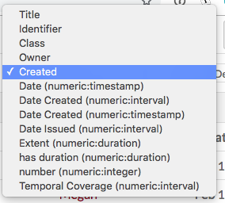

# Numeric Data Types

This module allows you to set certain properties as numeric data, using resource templates. You can designate properties as either date and time (ISO) or integers.

To install Numeric Data Types, follow the instructions for [Installing Modules](../modules/index.md#installing-modules) on the Modules documentation.

## Create numeric properties
To implement the module, you will need to create or edit a [resource template](../content/resource-template.md) to set specific properties as having numeric data types. 

When creating or editing a resource template, find the property you want to set as numeric in the right hand sidebar. Click on the property to add it to the template.

Once the property has been added to the template, click the pencil/edit icon to edit the property. In the right hand drawer which opens, look for the dropdown "Data type" under the heading "Other options".

In the dropdown, select from the following options under the heading for "Numeric":

- Timestamp, which can be as broad as year or as defined as the date and time;
- Integer, a whole number;
- Duration, for how long something lasted, with options for years down to seconds;
- Interval, a date-based range with start and end dates in each instance of the property.

Be sure to click "set changes" at the bottom of the drawer to save this setting.

When you save changes to your resource template, the numeric type you chose should show up in the column "Data type" for the template.

Note: these fields will display only the numeric data entered. If you want to indicate what the integers represent, edit the property's label to include the scale you are using, for example creating an alternate label for "Spatial Coverage" which reads "Height (cm)".

## Add numeric data
When you add or edit an item using the template you created above, the properties you set as numeric will appear as follows:

### Timestamp data
A Timestamp property automatically loads with fields for Year, Month, and Day. Note that the Month input is a dropdown where you select from the months' names. 

If you enter a day without a month, the day information will not be saved. 

Clicking on the "time" button to the right of the day input field will load additional dropdown fields for Hour, Minute, and Second. Note that there is no AM/PM option so you will want to use twenty-four hour time entries (14 for 2pm, etc)

Entries must be whole numbers, with no decimal points. 

### Integer data
An integer property has a narrow input which, once you have data in it, will display up and down arrows on the right hand side to  increase or decrease the value.

Your entry must be whole number; decimal points are not supported and will be rounded up to the nearest number. 

### Duration data
A Duration property has a series of fields in which to enter the duration of the resource. There are fields for:

- Years
- Months
- Days
- Hours
- Minutes
- Seconds
By default, only the first three of these fields display. Clicking on the "time" button to the right of the day input field will load the fields for Hour, Minute, and Second. Note that there is no AM/PM option so you will want to use twenty-four hour time entries (14 for 2pm, etc)

You do not need to enter every field. For example, you can enter a duration of 1 year and 5 days, leaving the month field blank.

### Interval data
Interval data allows you to enter the beginning and end dates for a resource. There are two sets of timestamp fields, one for the start date and one for the end. 

## Sort
Once you have active resource templates using numeric data types, you can use these to sort on the Item, Media, and Item Set browse views. 

Click the first dropdown on the upper right above the table of resources, which defaults to "Created"

Clicking on this dropdown will reveal multiple options, including all of the properties using numeric data types. These options display as the property with the data type in parentheses, for example "Date (numeric:timestamp)" 

## Bulk edit numeric data
The module adds an additional option to the [item batch edit](../../content/items/#batch-editing): convert to numeric.

For each search option, you must select a specific property from the dropdown; if you are using Duration in two resource templates, one for film (ex `time:hasDuration`) and one for events (ex, `dcterms:extent`), you would need to select the correct property from the resource template which you want to search. The dropdown will display the original property labels (`Extent` or `hasDuration` in the examples above). If you hover over the properties in the dropdown, it will show you the resource templates which are using that property and to which the search will apply.

**Timestamp** data has two search options, one for "Date comes before" and "Date comes after". Select the property for timestamp from the dropdown - only properties which are being used for timestamp will appear in the dropdown. 

**Duration** data, like timestamp data, has two options, for Duration is greater than and duration is less than. After selecting the property you want to search on, enter values for years, months, days, hours, minutes, or seconds.

**Date in interval** searches for a date within an interval. When searching on an interval, be as precise as possible. Because of the way that the module stores timestamps, the date you are searching must fall *within* the interval. So a search for the year 1814 would not turn up an event with interval September 12-15, 1814, because of the way the data reads the two dates. 

**Integer** data is searchable with "Value is less than" and "Value is greater than." As with the timestamp data, only properties which have numeric data will load in the dropdown. 
