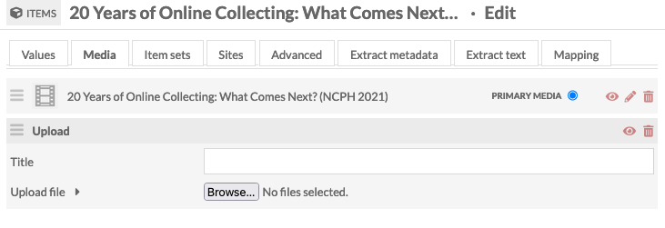

# OHMS Embed

The [OHMS Embed module](https://omeka.org/s/modules/ohmsEmbed){target=_blank} allows site administrators to embed Oral History Metadata Synchonizer objects in Omeka S Items. 

## Enabling XML Media Types and File Extensions

The OHMS Editor produces an XML file that carries the metadata, index, and transcript that accompany the oral history. The file must be added to an Omeka S Item as media to facilitate the embedding of the viewer. Generally, XML is not among the allowed media types and file extensions in an Omeka S installation.

Go to the installation Security Settings on the Settings page. 

Add `/xml` to the **Allowed media types** list.

Add `xml` to the **Allowed file extensions** list. 

When you are finished, click the "Save" button in the upper right hand corner of the screen.

## Working with OHMS using Omeka S Items with stored Media

The OHMS Editor can work with media that is stored in a variety of locations (e.g. YouTube, Vimeo). If you would like to host your media directly in the Omeka S installation, you can create Items and upload your media directly. Using this approach, you can create your metadata directly in Omeka S, taking advantage of the range of LOD properties, data types, and controlled vocabularies that are appropriate to describe the content.

To do so, you will need to locate the direct URL of the file in question. Go to your Item and then click on the media you'd like to use. In the description on the right side of the screen, locate the File Derivatives section. If you have directly added your media, clicking on the Original link will open a link directly to the file.

Use Host as the Media File Host option in the OHMS Editor. Input the URL for the original file in the Omeka S installation as the Media URL. 

Then, proceed with indexing the oral history. When you are complete, export your OHMS XML file.

Return to the corresponding Omeka S Item and edit it to upload the XML file as media.

You may want to consider adding a [custom thumbnail](https://omeka.org/s/docs/user-manual/content/items/#thumbnail) by going to the Advanced tab of the Item Edit interface.

## Importing metadata created within the OHMS Editor

Users may chose to create metadata describing an oral history directly in the OHMS Editor. This metadata is stored in the OHMS XML file and can be extracted and mapped to Omeka S metadata properties using the [Extract Metadata module](ExtractMetadata.md).

Configure the Extract Metadata module to enable the OHMS extractor. Then go to the JSON Pointer crosswalk tab to map the metadata fields, either to the media or to the item. Extracted metadata will be generated as plain text.

The following is a list of possible pointers generated by the OHMS Application:

- Record ID: `/id`
- Record date: `/dt`
- OHMS Application version: `/version`
- Interview Date: `/date`
- Date (Non-preferred format): `date_nonpreferred_format`
- CMS: `/cms_record_id`
- Title: `/title`
- Accession Number: `/accession`
- Duration: `/duration`
- Collection ID: `/collection_id`
- Collection Name: `/collection_name`
- Series ID: `/series_id`
- Series (Name): `/series_name`
- Organization: `/repository`
- Acknowledgement: `/funding`
- Organization URL: `/repository_url`
- Media file: `/file_name`
- Media ID: `/media_id`
- Media URL: `/media_url`
- Language for Translation: `/transcript_alt_lang`
- Language: `/language`
- User Notes: `/user_notes`
- Type: `/type`
- Summary: `/description`
- `/rel`
- Rights Statement: `/rights`
- Media Format: `/fmt`
- Usage Statment `/usage`
- OHMS XML Location: `/xmllocation`
- OHMS XML Filename: `/xmlfilename`
- Collection Link: `/collection_link`
- Series Link: `/series_link`
- Subject: `/subject`
- Keywords: `keyword`
- Interviewee: `interviewee`
- Interviewer: `interviewer`
- Format: `format`

## Bulk Import of OHMS XML

If you are interested in adding many OHMS records to your Omeka S installation at once, it is possible to use a combination of [CSVImport](csvimport.md) and [File Sideload](filesideload.md) to do so. Add the XML files to your File Sideload directory. Then, create a spreadsheet that that lists the filename and the Omeka S Item ID for the item to which you want to attach the file. Use the CSVImport module to [import media](https://omeka.org/s/docs/user-manual/modules/csvimport/#import-media).

## Publishing OHMS Interviews in Sites

Having added your OHMS XML to you Omeka S Items, you are ready to use them within your sites. The Omeka S OHMS viewer has several public controls: a toggle between the index and the transcription and/or translation if those elements are available, an information icon that shows the media metadata, and an option to move to a fullscreen view.

It is possible to feature items in two ways. 

You may include OHMS-related items via a [browse custom  links](https://omeka.org/s/docs/user-manual/sites/site_navigation/#add-a-custom-link) (regular, faceted, mapping) or preview blocks. End users will then be able to click through to the Item show page which will feature the OHMS viewer with the index.

Alternatively, you may place the OHMS view of an Item direcly on a Site Page by attaching it via the [Media Embed](https://omeka.org/s/docs/user-manual/sites/site_pages/#media-embed) block. 

