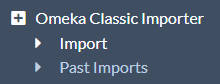
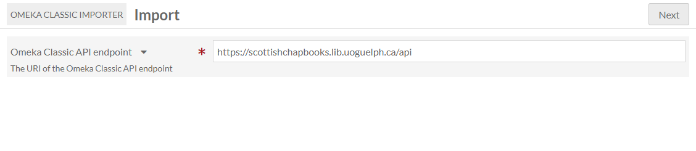
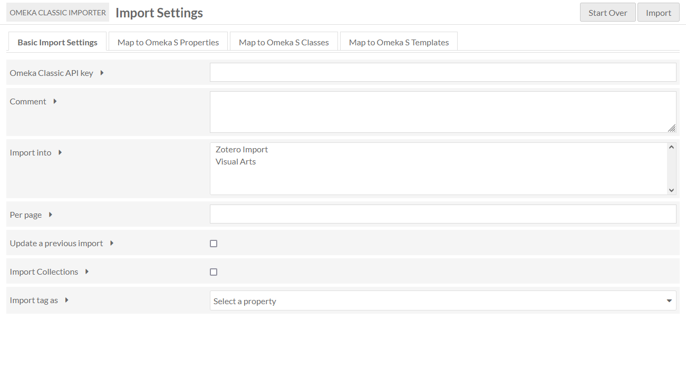
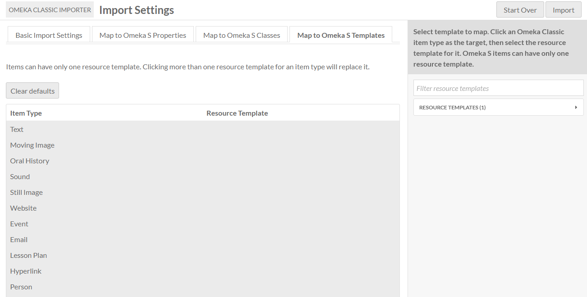
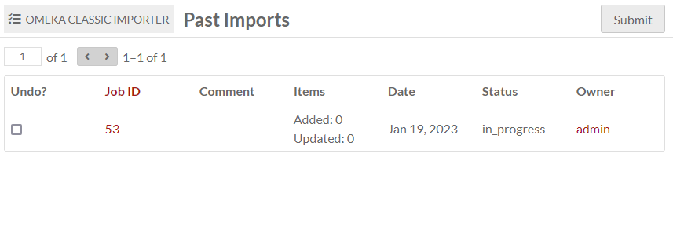

# Omeka Classic Importer

The [Omeka Classic Importer module](https://omeka.org/s/modules/Omeka2Importer){target=_blank} (a.k.a. the Omeka 2 Importer) enables you to import items and collections from an Omeka Classic 2.x site into an Omeka S installation. The source site needs to be Classic version 2 or greater in order to offer an API endpoint for this module to use. 

This module only imports items and their metadata (including tags), attached files, and collections (as item sets). It *will not* import Simple Page content or Exhibit Builder content.

If plugins/modules are installed on both the source site and the target site, Omeka Classic Importer can import module-specific metadata. For example, geolocation data facilitated by the Mapping module in S and the Geolocation plugin in Classic will automatically be imported. PDF Text elements can be imported and mapped to Extract Text fields. The data may not automap properly, so be sure to check the mappings manually.

!!! note
	Because resource properties in Omeka S do not have HTML formatting, any HTML in your Omeka Classic item properties (links, text formatting, etc.) will be stripped during the import process. You can instead preserve any element as a piece of media, with "HTML" as its media type.

## Import

Once installed, the Omeka Classic Importer module should appear toward the bottom of the left navigation menu on the main admin dashboard. When selected, there are sub-menu items for **Import** and **Past Imports**. 

From the Import tab you can start new imports. 

You must have the API enabled on the source Omeka Classic installation for the importer to work. To do this, the owner of the origin Omeka Classic installation should go to the API tab under Settings, accessed via the top navigation bar on the administrative dashboard. Ensure that the "Enable API" box is checked.

To find the API endpoint of the origin Omeka Classic installation, go to the home page of that installation. Add `/api` to the end of the URL. You should see a page with the message "This is the endpoint URL for [name of origin site]" and links to the site information and available API resources. To confirm that the API is enabled, click on the link for available API resources. If you see `{"message":"API is disabled"}`, you will not be able to import from this site.

### Enter the API

On the first page of the importer, enter the **Omeka Classic API Endpoint** - the site URL for the API you wish to access (it should end with "api"). Make sure you enter the full URL, beginning with "http", otherwise the importer will not be able to access the items at that site. Click "Next".

If you have entered a valid API endpoint, the next page will load with no issue. If you have entered an invalid endpoint, the module will display the error message "Warning: Invalid argument".

### Import settings and map metadata
On the second page of the importer there are three tabs: **Basic Import Settings**, **Map to Omeka S Properties**, **Map to Omeka S Classes**, and **Map to Omeka S Templates**. 

Clicking the "Start Over" button will take you back to the first page, where you can enter a different API endpoint.

This module will preserve item visibility from Classic to S (public or private) as of version 1.3. 

#### Basic import settings
* **Omeka Classic API key**: This field can either be blank or filled, depending on whether you have an API key for the site you are attempting to import data from.  
* **Comment**: You can add a comment such as "Jane Doe's API, no key" to help identify the specific import when viewing past imports.  
* **Import into**: This option allows you to select an item set or sets to import the items into. Note that you can only import into item sets you own. You cannot create a new item set from this page. You may wish to import collections instead, or in addition to, importing into an item set here.
* **Per page**: Enter a number to limit the number of records retrieved per request. Useful for sites which may have a large number of items.
* **Update a previous import**: To update - and overwrite - a previous import from the same source.
* **Import Collections**: To import the collections from the Omeka Classic site to the Omeka S site, as item sets.
* **Import tag as**: To import Omeka Classic tags, select a property to map them to.

#### Map to Omeka S Properties
This tab features a table for mapping between Omeka Classic elements and Omeka S properties. 

The Import module will automatically map many properties, but you should review the mapping in case you need to add more, or edit the automatic mapping. Custom item type elements may need to be mapped manually. 

To clear the default mapping, click the "Clear Defaults" button. 

The columns of the table are **Omeka Classic element**, **Mapped properties**, and a checkbox option to **Preserve HTML as media**. Any field that has HTML you would like to maintain in your Omeka S installation, such as line breaks and text styling in the description field, can be imported as an HTML file attached to the item. The field will be imported in plain-text to the metadata and with its formatting as a media.

The first set of the table is Dublin Core, followed by Item Type Metadata. The import will also bring in any legacy or additional element sets (for example, Omeka Legacy File), or elements created by Classic plugins (such as a PDF Text section for extracted text). These plugin-based elements may auto-map if you have the equivalent Omeka S module installed (such as Extract Text in this case). 

To map:

1. Select the element or item type in the table by clicking on its row or label.
1. In the right-hand drawer, either click through or search for the S property to which you want to map your Classic element. 
1. Click on the property in the drawer to map it. 

To remove a mapping, click the trash can icon in the element/property row.

#### Map to Omeka S Classes
In this tab you can map Omeka Classic Item Types to Omeka S Resource Classes. You can select from the classes for any of the installed vocabularies.  

To map:

1. Select the item type in the table by clicking on its row or label.
1. In the right-hand drawer, either click through or search for the resource class to which you want to map your element. 
1. Click on the resource class in the drawer to map it.

Items with the original Classic item type will be imported with the new S class. 

#### Map to Omeka S Templates

This tab allows you to map your importing items to a specific resource template in your Omeka S install. All of your existing resource templates in S will appear in the right-hand drawer. 

To map:

1. Select the item type in the table by clicking on its row or label.
1. In the right-hand drawer, either click through or search for the resource template to which you want to map your element. 
1. Click on the resource template in the drawer to map it.

Items with the original Classic item type will be imported with the new S resource template.

### Complete import
When you have finished customizing the mapping, click the "Import" button in the upper right corner of the window.

!!! note
	Are your jobs starting and not completing? You might need to [set the path for PHP](../configuration.md#php-path) so that your system can perform the background process to make the items.

## Past imports

The past imports section of the module allows you to view previous API imports.

Each import is a row. The table has the following columns:

* **Undo**: Check this box if you wish to undo the import. Once you click Submit, the status for that specific import will change to "undone".    
* **Job ID**: A numerical value assigned to each specific API import. You can also view the job under the [Jobs tab on the administrative dashboard](../admin/jobs.md).  
* **Comment**: If you entered a comment when setting up the import, that comment will appear here.
* **Items**: Lists the number of items added and updated with each import.   
* **Date**: The date on which the import took place.   
* **Status**: Will be "in_progress", "completed", or "undone".  
* **Owner**: The user who requested the import.

