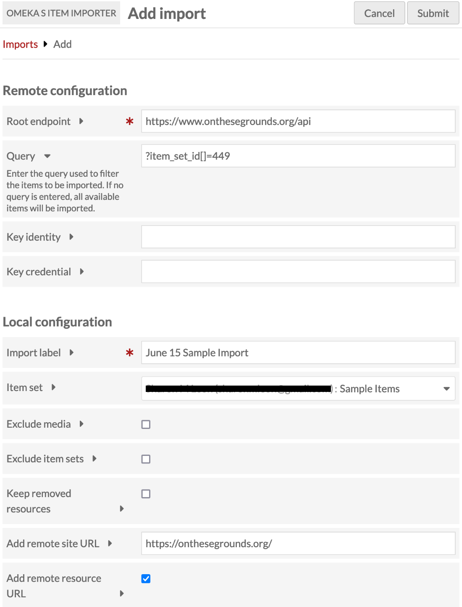
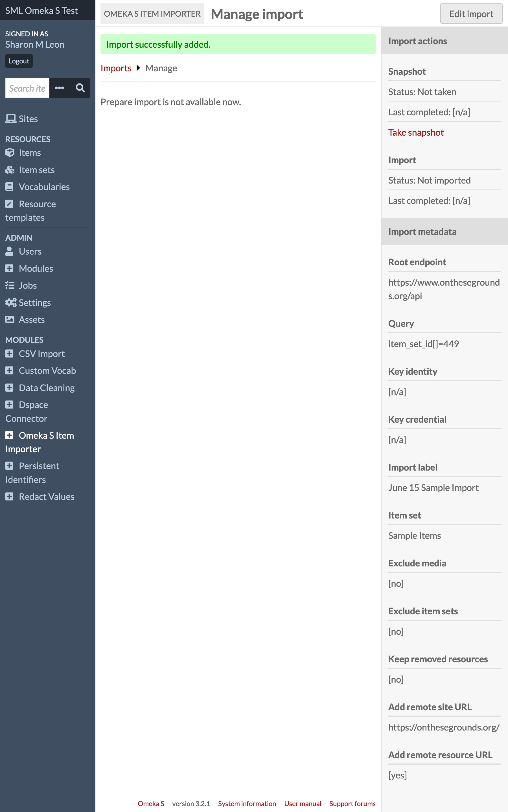
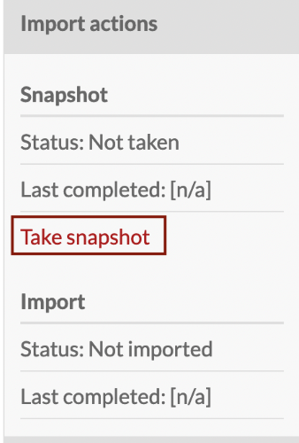
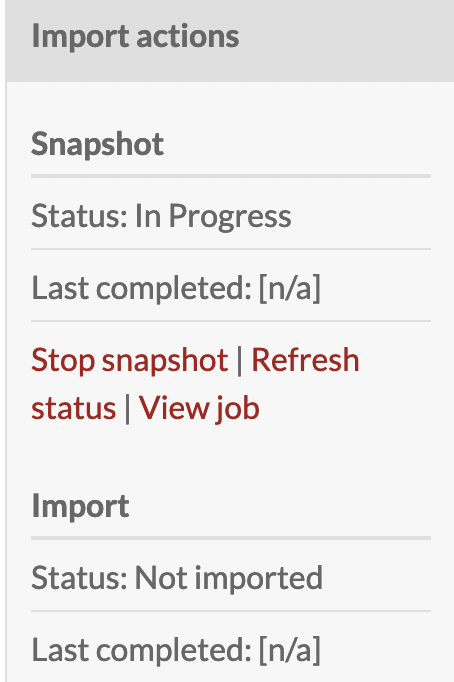
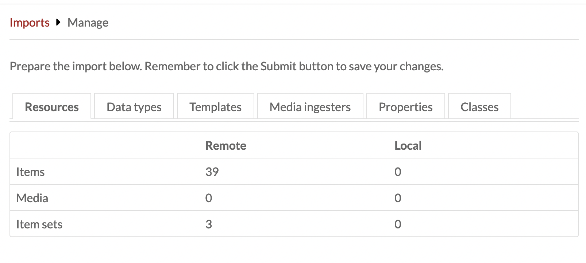
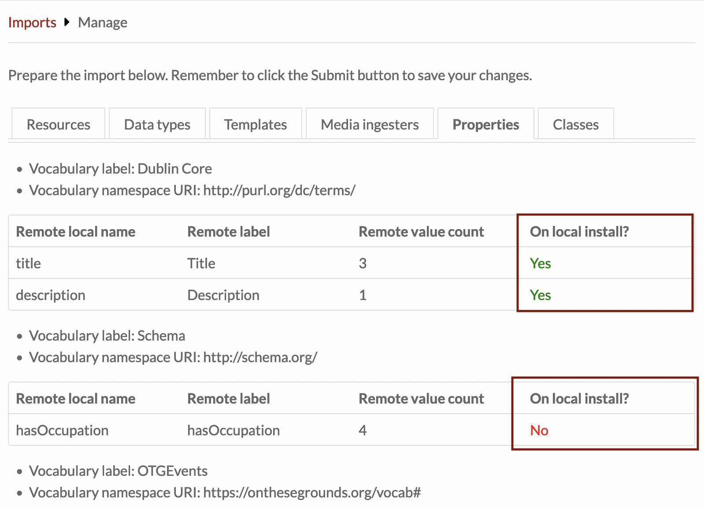
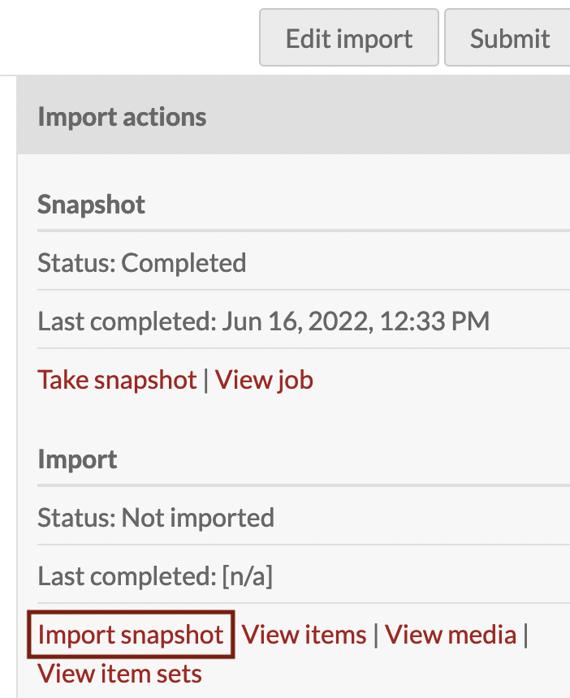

# Omeka S Item Importer

The [Omeka S Item Importer module](https://omeka.org/s/modules/Osii){target=_blank} makes it possible to import items from one Omeka S installation into another Omeka S installation. This importer can duplicate items, their media, and their item sets - but it cannot duplicate site or page information. 

Transferring data from one installation to another creates a situation where there is significant potential for data loss, but careful planning and preparation by the user of the receiving installation can prevent that from happening.

## Prepare for import

To minimize data loss, the local installation must be prepared carefully to accept the data from the providing installation. As much as possible the administrator of the receiving installation should work to recreate the remote installation's data model. To do so, the administrator should:

- Import any linked data [vocabularies](../content/vocabularies.md) that are used by the remote installation's items.
- [Install and configure modules](../modules/index.md) that control the data types used as values in the remote installation's items, such as: 
     - [Custom Vocab](customvocab.md): In addition to installing this module, the administrator will have to create custom vocab value lists that match those used in the remote installation.
     - [Numeric Data Types](numericdatatypes.md)
     - [Value Suggest](valuesuggest.md)
- [Import any resource templates](../content/resource-template.md#import-a-resource-template) used by the remote installation.
- Install and activate media ingesters originally used by the remote installation, such as [File Sideload](filesideload.md).
- [Double-check that resource-heavy modules such as Extract Text are set for a bulk import](extracttext.md) (i.e., disable Tesseract for image recognition, and other extractors, until the ingest is done, then use it in smaller batches later). 

Once all of that infrastructure is in place, the local installation is ready to begin importing items.

## Add an import

Start the import process by clicking the "Add an Import" button on the module's landing page in the administrative interface. You will then be presented with two types of configuration settings: remote and local.

### Remote configuration

**Root endpoint (required)**: Input the endpoint for the API of the installation from which you wish to import. To find the "Root endpoint" you'll need to navigate to the installation and replace the part of the URL that includes and comes after the "/s/" with "/api".

For example, change this URL: 

`http://your-domain-name.edu/omeka-s/s/sitename/page/home`

to 

`http://your-domain-name.edu/omeka-s/api/`

If you click on an API URL, you may see something like this:

```
{"errors":{"error":"The API request resource must be a string. Type \u0022NULL\u0022 given."}}
```

Even though this is an error, this URL is the root endpoint. 

**Query**: You have the option to include a "Query" to filter the items to be imported. If you don't provide a query, the module will import all **public** items from the remote installation; this will include items that are not part of a public site. One way to generate a query is by performing an advanced search in the remote site. Once the results have loaded, you can select the portion of the URL to the right of the "?" to get the query string. 

**Key Identity** and **Key Credential**: If you want to import resources that are marked as **private**, you will need to provide a "Key identity" and "Key credential" generated by the base installation. The only way to obtain these strings is by having an account on the remote installation or by asking someone who has an account to provide them.

### Local configuration

**Import Label (required)**: Input an identifying label for the import. This may be the name of the remote organization, or another way to help you remember this connection.

**Item set**: If you wish, select one or more item sets to which the imported items will be assigned.

**Exclude Media**: Check this if you want the import to exclude media. If not checked, media will be imported as normal. If you decide to change this configuration at a later date, you will need to take a new snapshot and process a new import for those changes to take place. There is no capacity for continuous automatic syncing of data.

**Exclude item sets**: Check this if you want the import to exclude item sets (within the parameters of your query, if a query is set). If not checked, the remote installation's item sets will be imported as normal. 

**Keep removed resources**: Check this if, during import, you want to keep local resources from a previous import that were removed from the current remote snapshot. If checked, removed resources will remain locally but will no longer be managed by this import. If not checked, removed resources will be deleted locally as normal.

**Add remote site URL**: If you would like to indicate the general source of the imported item, enter the URL to the site from which the imported resources are derived. If entered, this will be added to every imported resource, saved as a value using the property `osii:source_site`. You may wish to use a specific Omeka site URL, such as `http://your-domain-name.edu/omeka-s/s/sitename/`, rather than the base installation URL here; but note that all items will be imported with this link whether they are part of any one site or not. 

**Add remote resource URL**: Check this if you want to add the remote item's canonical URL to every imported item, saved as a value using the property `osii:source_resource`. This will provide a direct link to the original item via the API, in the form `http://your-domain-name.edu/omeka-s/api/items/1234`, rather than a link to an item view page on any particular site. 

Save your configuration choices by clicking on the "Submit" button in the upper right corner of the interface. Once this import is configured, it is saved for future editing and updating. 



## Manage imports

Once an import is configured, the user is taken to an interface with three areas:

- **Mapping area**: provides options to map the remote installation data to the local installation
- **Import actions**: provides the action options for the import process and offers access to the results of those actions
- **Import metadata**: shows the configuration choices for the import.

Upon the initial configuration of an import, the user will find a message in the main area of the interface that says "Prepare import is not available now." 



### Take the snapshot

Proceed to the Import actions section of the sidebar. The "Import actions" section contains most of the actions you'll need to successfully run and troubleshoot an import. Click the **Take snapshot** link, and the subsequent confirmation button to take a snapshot of the current resources in the remote installation. This will gather the data needed to import the resources and reconcile the local installation with the remote one. 



The Status indicator on the snapshot will change from "[n/a]" to "In progress." The import may take some time depending on the scope of the universe to be examined. You can click on the "Refresh Status" link to check on the progress. If the Status changes to "Error," you can click "View job" to inspect the snapshot processing.



You have the option to "Stop snapshot" if you wish. The Status for the snapshot will change to "Stopping." Click "Refresh Status" until the Status has changed to "Stopped."

Once you have successfully taken a snapshot, the Status will change to "Completed," and the main panel of the interface will contain quite a bit of metadata about the snapshot. Use this to reconcile differences between the remote and local installations, to the extent desired.

### Prepare the import

Located in the main panel of the interface, the Mapping area provides users with an interface to specify the elements of the data for import. The tabbed interface provides a comparison between the information about the remote installation and the local data configuration. Use this time between the snapshot and the full import to perfect your local installation to capture as much informtion from the import as you can. 

- **Resources tab**: This view offers an overview of the resources within the import universe on both the remote installation and the local installation.



- **Data types tab**: This view offers a view of the remote data types and their value count. The user can select from a dropdown menu of locally available data types (e.g. literal, resource, URI, `numeric:timestamp`) to map the local installation to the remote installation. If you find there are data types available remotely that are not available locally, you will need to add them to your installation before proceeding to avoid data loss. If a remote data type is not mapped to a local one, the values will not be imported. Data types can be added by modules such as [Numeric Data Types](numericdatatypes.md) and [Value Suggest](valuesuggest.md).

- **Templates tab**: This view shows the remote resource templates and their count. The user can select from a dropdown menu of locally available resource templates to map the local installation to the remote installation. Note that the local installation can duplicate the remote templates by performing [exports and imports](../content/resource-template.md#share-resource-templates). This may be a good time to create or modify templates to better mirror the items you wish to import. 

- **Media ingesters tab**: This view shows a list of the remote media ingesters and whether they are available on the local installation. Media will be imported only if their ingester is available. Note that some of these ingesters can be added by installing and activating modules, such as [File Sideload](filesideload.md). 

- **Properties tab**: This view includes a list of the remote properties and whether they are on the local installation. Values will be imported only if their respective properties are on the local installation. If you find the there are properties available remotely that are not available locally, you will need to [add their vocabularies to your installation](../content/vocabularies.md#add-a-vocabulary) before proceeding to avoid data loss. Note that you may see some properties in red on the remote installation - ones that were not available in earlier versions or have been deprecated in later versions of the vocabulary. You may need to find and install the same specific version of that vocabulary on your local installation. 



- **Classes tab**: This view shows a list of the remote classes and whether they are installed on the local installation. Items will be imported without classes, if not. If you find there are classes available remotely that are not available locally, you will need to add them to your installation before proceeding to avoid data loss. Classes are added through [vocabularies](../content/vocabularies.md). Note that you may see some classes in red on the remote installation - ones that were not available in earlier versions or have been deprecated in later versions of the vocabulary. You may need to find and install the same specific version of that vocabulary on your local installation. 

After mapping the elements of the data model, click on the "Submit" button at the top righthand corner of the page. You will receive a confirmation message that the import has been successfully prepared. 

### Modify the snapshot as needed

Once the remote resources have been viewed, you can modify the snapshot if desired, by returning to the first configuration page. 

For example, if you wish to import only the items inside one particular item set that appeared in the snapshot, use the Query field to limit items found in that item set. You can construct these narrowing queries using the advanced search found on the remote sites. 

Once this is done, take a new snapshot. You should see a different number of resources in the "Remote value count". 

### Import the snapshot

Under the Snapshot information in the Import actions panel, you will find the Import information. Initially the Status for the import should report [n/a]. Click the "Import snapshot" link to begin the import. Just as with the snapshotting process, the import status will change to "In progress," and may take some time to complet. Click the "Refresh status" link to check on progress. Similarly, you may stop an import that is in progress by clicking "Stop import". Should the Status change to "Error," then you can click on the "View job" link to review the issue and any log message.



Once the import Status reaches "Complete", you will be able to click through to "View items", "View media", or "View item sets" from the import. Additionally, the completed import will receive a timestamp indicating the point of import.

## Revisit an import

Once you have successfully launched an import, the main screen for the module will list that action on a table of attempted imports. That table includes the label for the import, the root endpoint, the snapshot status, the import status, and the owner of the import.

### Edit an import

While an import might have technically been successful, you might have suffered some data loss due to mapping between the remote installation and the local installation. You can edit the import to remediate that data loss. Begin the edit process by clicking on the pencil icon to the right of the import label of your choice. You will then have the opportunity to update your configurations, retake your snapshot, update your mappings, and re-execute your import.

### Repeat an import

You may have an import that needs to be re-run to capture new resources from remote installation. In this case you can edit the import to retake the snapshot and execute a new import.

The import is not a two-way synchronization, so changes made to the local items are not pushed to the remote items. Note also that the module does not preserve local changes after subsequent imports. Imported items will always reflect their state on the remote installation at the time of the snapshot. **Do not run a subsequent import if you need to preserve local changes.**

You may begin the new import process by clicking on the pencil icon to the right of the label for the import of your choice.

You will then have the opportunity to update your configurations. In this situation, you will want to carefully consider the option to "Keep removed resources" if resources have been deleted from the remote installation.

After submitting your configurations, you can step through the process of taking a new snapshot of the remote installation, updating or confirmiing your mappings, and re-executing your import. This new import of the snapshot will import new resources and update existing resources with changes from the remote installation.
