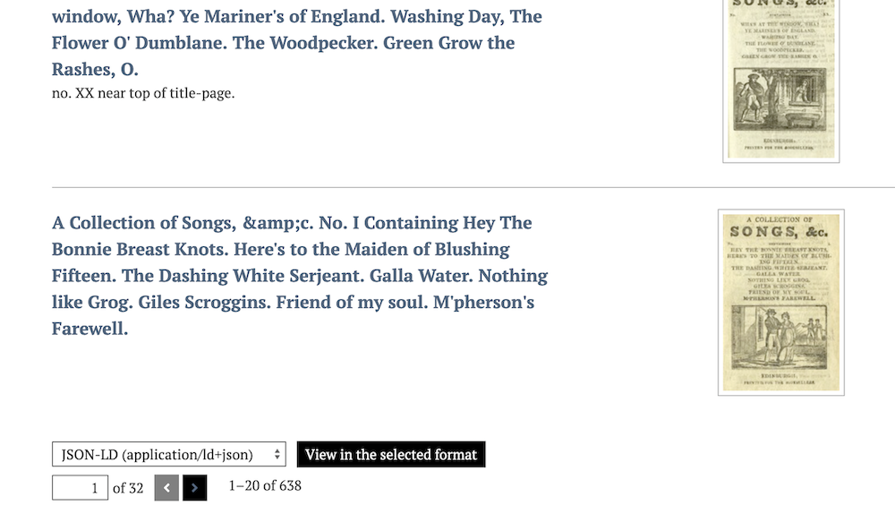
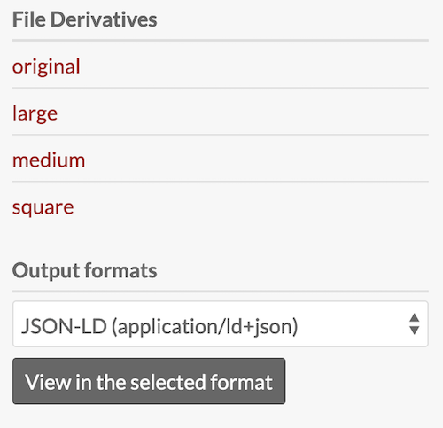
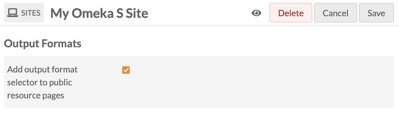
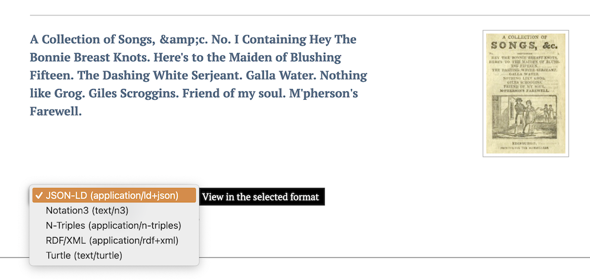

# Output Formats 

The [Output Formats module](https://omeka.org/s/modules/OutputFormats/){target=_blank} allows site administrators and/or site visitors to export datasets from collections. Outputs are added to administrative interfaces for items, media, and item sets. They can be added to public site pages for items and item sets. 

The output formats available for this module are:

- [JSON-LD](https://json-ld.org/){target=_blank}
- [Notation3](https://www.w3.org/wiki/NotationThree){target=_blank}
- [N-Triples](https://dbpedia.org/page/N-Triples){target=_blank}
- [RDF/XML](https://www.w3schools.com/XML/xml_rdf.asp){target=_blank}
- [Turtle](https://www.w3.org/TR/rdf12-turtle/){target=_blank}.

## Settings

This module has no configuration settings at an installation level. When active, it automatically appears in multiple places in the administrative interfaces. You can find it at the bottom of the items browse page, media browse pages, and item set browse pages. It is also in the sidebar of individual item view pages, media view pages, and item set view pages. 

The module must be turned on for individual sites. To enable the format selector on a site, go to the "Site admin" page. Click the "Settings" tab. There, look for the "Output Formats" section and check "Add output format selector to resource pages".

When enabled for a site, the module adds the download options to the bottoms of browse pages and search results. It also adds them on individual item and item set view pages. The option will not be available on public media view pages.

When a site visitor or logged-in user on an admin page makes a selection from the dropdown on a browse page, the resulting dataset contains a page's worth of browse/search results. The number of resources in the dataset will depend on the installation-wide pagination setting for admin pages. Or, it depends on the site's pagination settings for public site pages.

The options appear as follows:

- JSON-LD (application/ld+json)
- Notation3 (text/n3)
- N-Triples (application/n-triples)
- RDF/XML (application/rdf+xml)
- Turtle (text/turtle).

The button shows the text "View in the selected format".

After selecting an output, the user sees either a file available for download or a new browser tab or window with the results.

## Issues with outputs

The crosswalking of your site's data into these formats may produce some errors. Generally, these will be compatibility issues between your resource metadata and the formats. There might also be issues with the tool we employ to create these formats. 

We advise administrators to test each output thoroughly. Look for errors before they are discovered by the public. Then, edit resources as needed to fix the errors produced. Examples include:

- Metadata fields with strings that are too long for the output (such as the full-text capture of [Extract Text](extracttext.md)). 
- Line-break and other non-visible characters that cause issues with the selected formats.

You may see "Maximum execution time exceeded" as an error on some formats. This means your server is unable to generate the amount of information in the given dataset. Fix this by lowering the number of resources showing in a page in the site pagination settings. In some cases you cannot avoid this issue. 

It may help to review the information available for the tool we use, [EasyRDF](https://github.com/sweetrdf/easyrdf){target=_blank}.