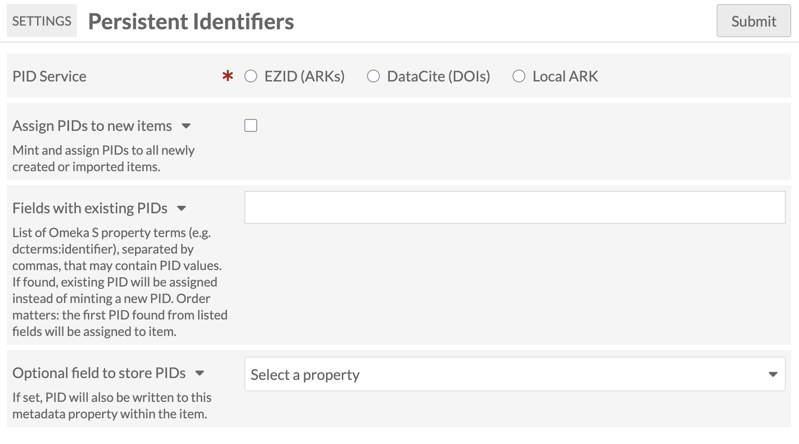
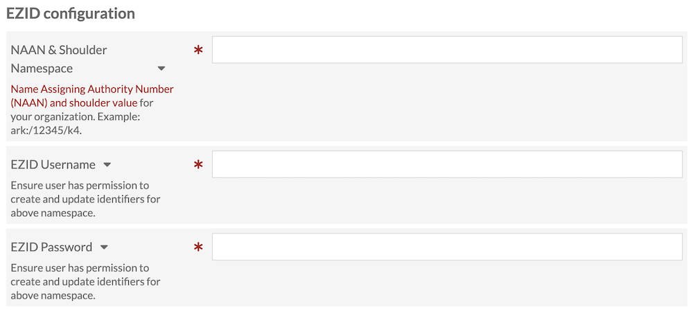
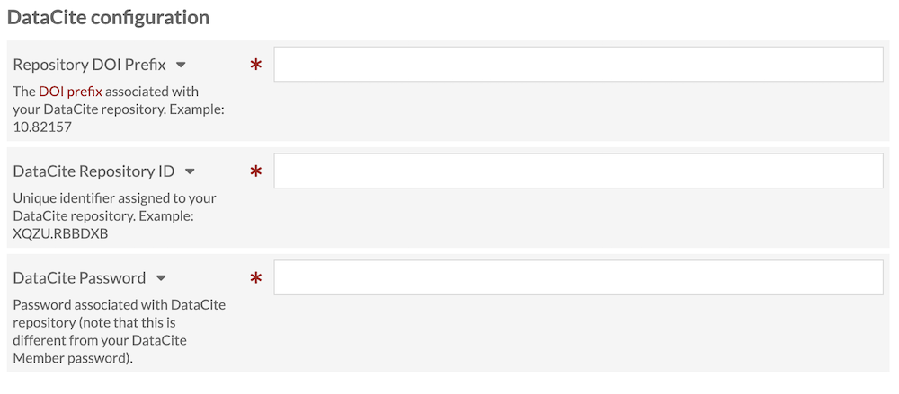
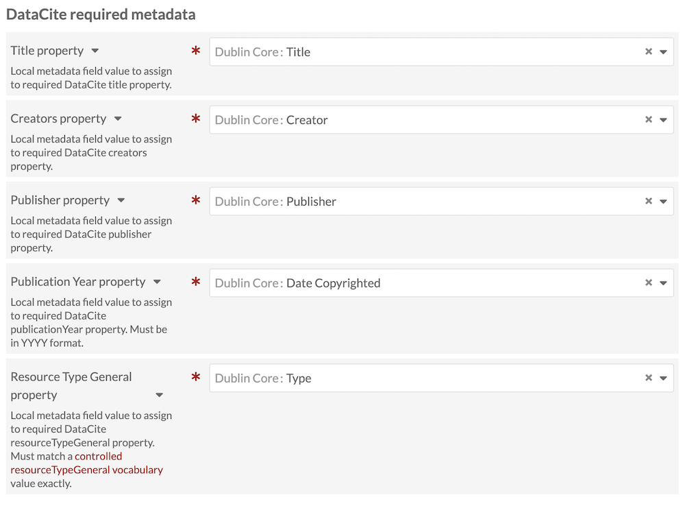
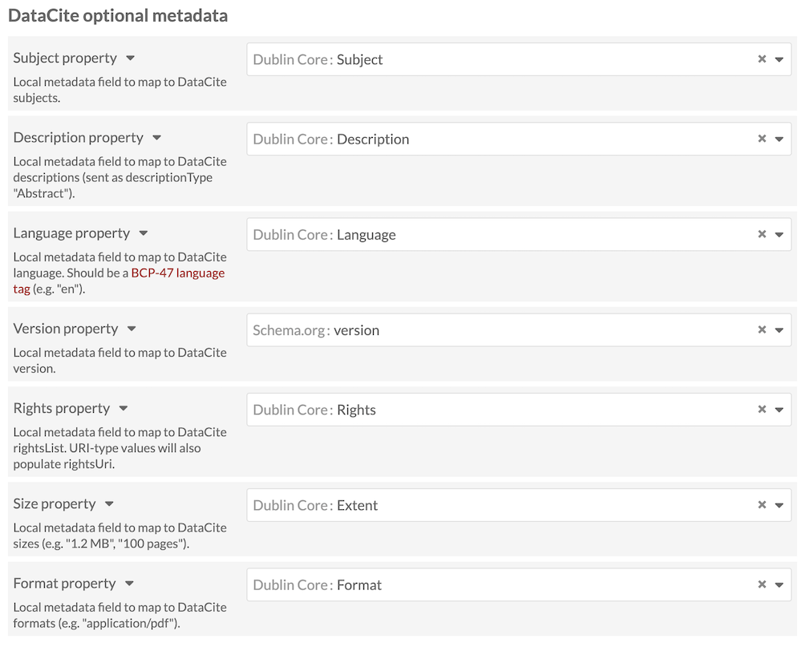
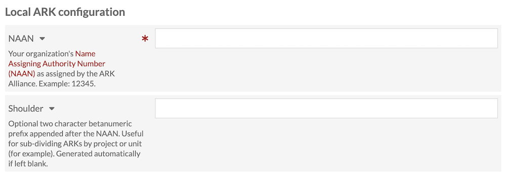
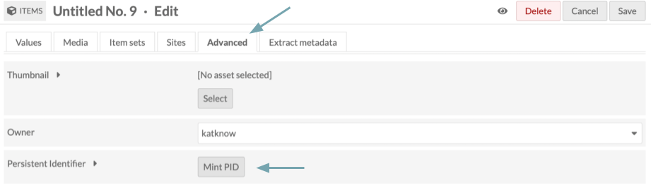
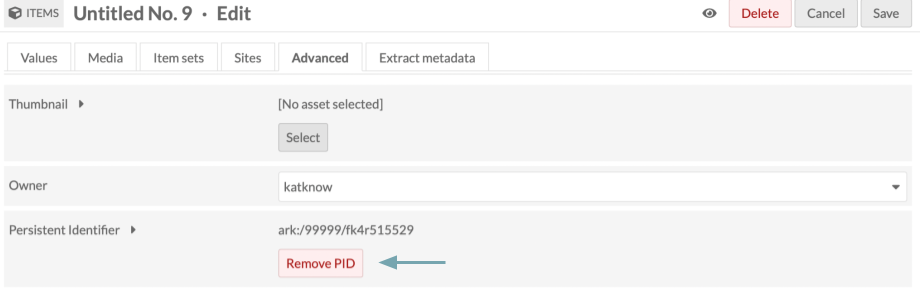
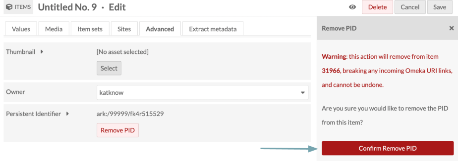

# Persistent Identifiers 

The [Persistent Identifiers module](https://omeka.org/s/modules/PersistentIdentifiers/){target=_blank} allows users to create or import persistent identifiers (PIDs) and assign them to Omeka S items. These PIDs can be assigned at item creation, via the item edit screen, or by batch edit. They can also be removed using the item edit or batch edit screens. PIDs may also be "extracted" from existing metadata fields. Once assigned, accessing an item's PID in-browser resolves to a stable, non-site-specific landing page containing the item's metadata, media, and any sites the item is assigned to.

The current PID services available for this module are:

+ [Archival Resource Keys (ARKs)](arks.org){target=_blank}
+ The [EZID service](https://ezid.cdlib.org/){target=_blank} to mint and manage [Archival Resource Keys (ARKs)](https://arks.org/){target=_blank} (current users only)
+ DataCite, used to mint and manage [Digital Object Identifiers (DOIs)](https://datacite.org/create-dois/){target=_blank}.

!!! note
	This module was originally built to use the EZID service to mint and manage [Archival Resource Keys (ARKs)](https://arks.org/){target=_blank}. EZID is not currently taking new members. As of version 1.2, this module also generates and stores ARKs locally. Current EZID users can continue to use their accounts; new ARK users need to request a (free) Name Assigning Authority Number (NAAN) using the [Ark Alliance's NAAN request form](https://docs.google.com/forms/d/e/1FAIpQLSf_847hNXtLGikR-XeDy1uT1AKd24DpHnt5UQh2i8ORRu7u-w/viewform){target=_blank}.

## General settings

After installation, Persistent Identifiers should appear in the left-hand navigation under **Modules**. The "Settings" subpage features general settings, including:

+ **PID Service**: Select which of the available PID services to use for minting or extraction. Only one PID service may be used at a time to mint and assign PIDs to items. 
+ **Assign PID to New Items**: Check this box to apply automatically to every new item in Omeka S, whether it is created in Omeka S or imported. This will either newly mint PIDs or extract existing PIDs and assign them, depending on your settings.
+ **Fields with Existing PIDs**: A list of metadata fields that may contain PID values within a newly created or imported item. If found, the existing PID will be assigned to the item instead of a new PID. Use the format `dcterms:identifier,bibframe:identifier`, etc.
+ **Optional field to store PIDs**: If set, the PID will also be written to this metadata property on each applicable item. 

## EZID configuration

When completing the configuration process for EZID, you will need to provide the:

+ **NAAN & Shoulder Namespace**: The Name Assigning Authority Number (NAAN) and ARK shoulder value uniquely assigned to an organization, which will appear in every ARK generated. 
+ **EZID Username**: The EZID user who has permission to create and update identifiers for the above namespace. 
+ **EZID Password**: The password for the above EZID user. Note that for security reasons this password doesn't persist in the form, so if changes are made to the **NAAN & Shoulder Namespace** or **EZID Username** you must also re-enter the password before pressing "Submit".

## DataCite configuration

    New optional fields added for DataCite PID generation (DataCite DOIs require certain metadata fields, which were already part of the module--this adds additional, entirely optional fields to better describe the DOI resource)

When completing the configuration process for DataCite, you will need to provide the:

+ **Repository DOI Prefix**: The prefix assigned to an institution's DOI minting and management repository. 
+ **DataCite Repository ID**: The unique identifier assigned to an institution's DOI repository. 
+ **DataCite Password**: The password associated with the above **DataCite Repository ID**. Note that for security reasons this password doesn't persist in the form, so if changes are made to any field on the DataCite Configuration screen, you must also re-enter the password before pressing "submit".

### DataCite required metadata

DataCite requires five descriptive metadata values in order to generate a DOI: Title, Creators, Publisher, Publication Year, and Resource Type. All of these fields must be mapped to an existing metadata field that you select from the list of available vocabularies in your Omeka S instance. The "Resource Type General" property must conform to a [`ResourceTypeGeneral` controlled vocabulary](https://support.datacite.org/docs/datacite-metadata-schema-v44-mandatory-properties#101-resourcetypegeneral){target=_blank} value exactly.

### DataCite optional metadata

DataCite allows further fields for optional metadata. Map any or all of the following: Subject, Description, Language, Version, Rights, Size, Format. Note that "Language" requires a [BCP-47 language tag](https://en.wikipedia.org/wiki/IETF_language_tag){target=_blank}.

## Local ARK configuration

+ **NAAN**: Your organization's Name Assigning Authority Number (NAAN) as assigned by the ARK Alliance. Example: 12345.
+ **Shoulder**: Optional two character betanumeric prefix appended after the NAAN. Useful for sub-dividing ARKs by project or unit (for example). Generated automatically if left blank.

The "Local ARK" version of the Persistent Identifiers form accepts the assigned NAAN (required) and a shoulder value for sub-dividing PID-assigned content beneath the larger/organizational NAAN (optional, but will generate a 2-3 digit value to use if none is input). The shoulder can also be changed in the future, or re-generated by clearing the field, to support multiple shoulder sub-divisions.

After inputting the NAAN (and custom or generated shoulder value) and generating and assigning ARKs using one of the methods below, the ARK should immediately resolve to a stable, generic, site-agnostic landing page for its corresponding Omeka resource, complete with metadata and any media using the `n2t` resolver with syntax `http://n2t.net/[ARK]`. Example: `http://n2t.net/ark:/99999/mk0081pk45`.

## Mint PIDs

To mint a PID from the item editing page, navigate to the Advanced tab and click "Mint PID." 

After a few moments, the ARK or DOI should appear. 

The "Mint PID" button should now be a "Remove PID" button. Click there to remove the PID if desired.

If you select "Remove PID," a drawer will open on the right warning you that this will remove the PID and break any incoming links. Click "Confirm Remove PID" to delete the PID.

Click "Save" before navigating away from the page when both minting and removing PIDs.

## Batch edit PIDs

You can batch edit PIDs from the Items page. Select the items with PIDs you wish to edit via the checkboxes, then choose "Edit Selected" before pressing "Go."

Near the bottom of the Batch Edit Items screen, you should see a Persistent Identifiers row. Here, you can mint or remove PIDs for all selected items. If you are batch editing other fields and would like PIDs to remain unaffected, you can select "[no action]".

![Batch edit items screen, with fields from a number of modules. Near the bottom is a "Persistent Identifiers" entry with three radio button options - "Mint PIDs", "Remove PIDs", and "[No action]". A blue arrow points to this entry.](../modules/modulesfiles/PID_batchoptions.png)

When you have made all desired edits, click "Save" in the upper right corner.