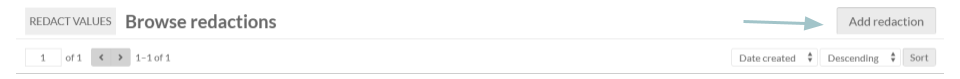
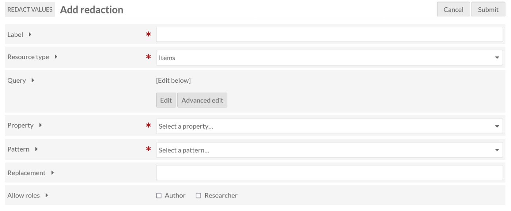
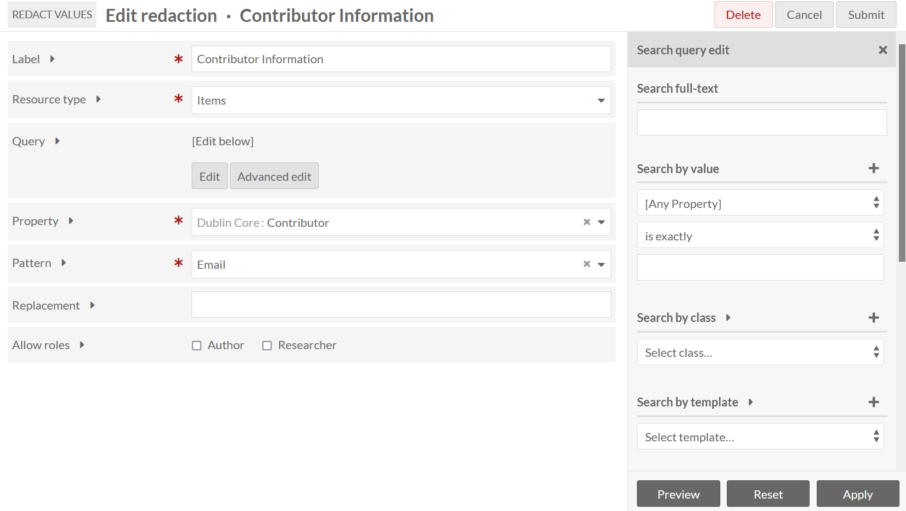
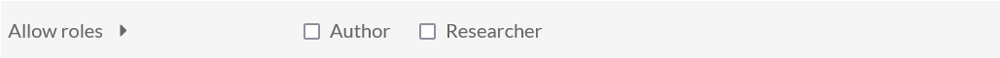
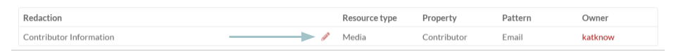
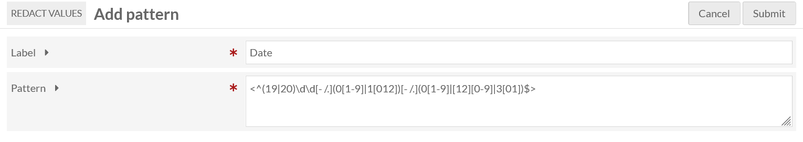
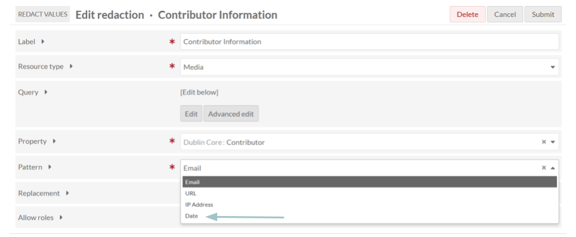

# Redact Values

The [Redact Values module](https://omeka.org/s/modules/RedactValues/){target=_blank} allows administrators to hide certain pieces of metadata. 

Site visitors (logged out) will always be unable to see values that are hidden. 

Logged-in users at the Editor, Supervisor, or Global Admin levels will always be able to see what has been redacted. The module allows your installation admin to set viewability for users at the Author or Researcher level.

!!! note
	The module does not apply redactions for users who have permission to update the resource. That means that values will never be redacted for Global administrators, Supervisors, and Editors. It also means that lower-level users will have full visibility on items they own.

Administrators will be able to choose a resource type, build a query to filter the resources, select the property from which to redact text, select the pattern to use for redaction, and enter the replacement text.

## Add a redaction

Select Redact Values from the Modules list in the left-hand navigation. From the "Browse Redactions" page, click the "Add Redaction" button in the upper right corner.

When adding a redaction, you are required to provide:

1. A **label** for your redaction
2. The **resource type** you would like to redact (item, item set, or media)
3. The **property** from which to redact text
4. The **pattern** to use when redacting text.

You can also add a query to filter the resources from which to redact text. You can add a query via the "Edit" button, which will open a drawer on the right that provides options for narrowing your search. Alternatively, you can use "Advanced Edit" to add your query directly from the search results page by copying everything in your browser's address bar starting with the question mark all the way to the end of the search URL (to the right). 

In either circumstance, be sure to click the "Apply" button to add your query to the form. No query means all resources of the specified resource type will be included in your redaction. 

There is a field to include the replacement text that will appear in place of the redacted values. If you leave this blank, the entire redacted field will be hidden.

Each redaction has individual viewing options. You have the option to give certain role types permissions in viewing redactions. Note that any user with permission to update a resource can automatically view its redacted text. You can allow authors or researchers by checking their respective boxes. Normally, values will be redacted for authors except for resources that they own, and researchers unless you grant them permissions in individual redactions.

Click "Submit" in the upper right corner to save your changes.

## Manage redactions

You can manage your already created redactions from the main module screen. To edit a previously added redaction, click the "Edit" icon next to the redaction you would like to change. 

Be sure to submit the form again after you have made any changes. 

You can also sort your existing redactions by date or label in ascending or descending order via the "Sort" function in the upper right corner.

## Add patterns

You can customize the patterns available for redactions by selecting "Patterns" under Redact Values in the Modules tab of the left-hand navigation. To create a new pattern, select the "Add Pattern" button in the upper right corner. You will be asked to provide both a **Label** and a **Pattern**.

For the pattern, you must enter the regular expression pattern that identifies the sequence of characters that will be redacted. You must enclose the pattern with [delimiters](https://www.php.net/manual/en/regexp.reference.delimiters.php){target=_blank}. You may use [modifiers](https://www.php.net/manual/en/reference.pcre.pattern.modifiers.php){target=_blank}. 

For more information on regular expressions, see [Regular-Expressions.info](https://www.regular-expressions.info/){target=_blank} and [PCRE Patterns](https://www.php.net/manual/en/pcre.pattern.php). 

To validate your pattern, try [RegExr](https://regexr.com/){target=_blank}.

Once you have added this information, click "Submit" in the upper right corner. Your added pattern should now appear in the Pattern dropdown menu when adding a redaction.

