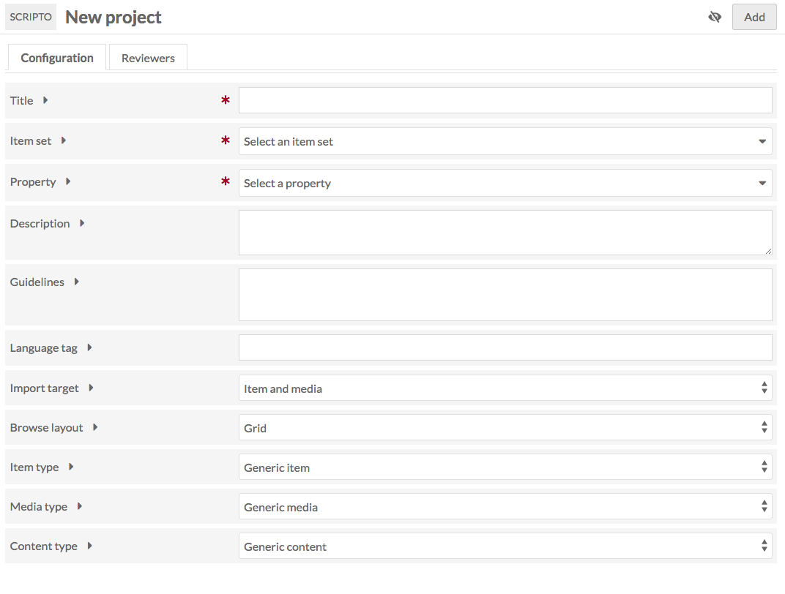
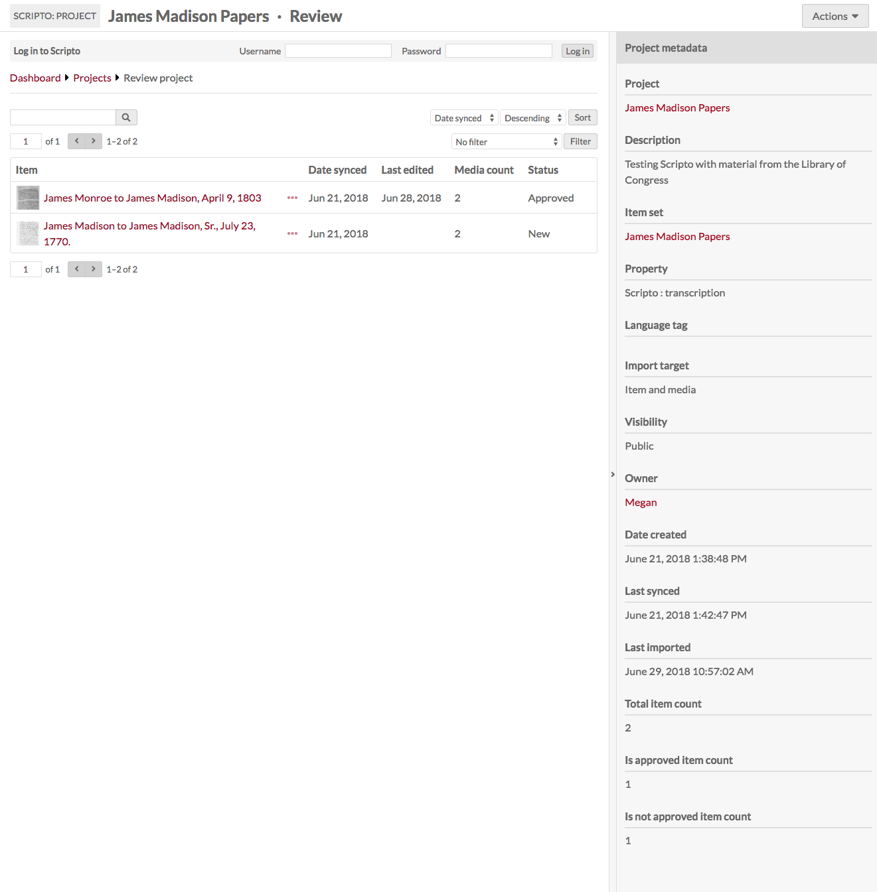

The Scripto module for Omeka S allows you to create projects to transcribe, translate, or describe media attached to items in your Omeka S installation. The items and media are organized into an item set and then imported into a project in Scripto and can be periodically synched with the Omeka S item set to send the data back from Scripto to the Omeka S item and media metadata.

The Omeka S Scripto module allows you to create multiple projects on a single Scripto installation. Like sites in Omeka S, Scripto projects can exist independently of each other. This means that you can support a manuscript transcription project and a document translation project through the same Omeka S installation.

## Installation and Configuration
To install Scripto, you need:

- To be running Omeka S 1.1.2
- Have a MediaWiki installation running on the same server as the Omeka S installation. Minimum MediaWiki version is 1.30.0.

Create the MediaWiki installation on your server using their instructions. Install the Scripto module using the [documentation for installing modules](https://omeka.org/s/docs/user-manual/modules/#installing-modules). 

Once you have installed the module and created your MediaWiki installation, go to the Modules tab of your Omeka S installation and activate the Scripto module.

Staying on the Modules tab, click the Configure button for the Scripto module. 

On the Configuration page, enter the url for your MediaWiki API endpoint; this should be something like `<your mediawiki url>/api.php`. 

### Create an item set
The Scripto module uses [item sets](../content/item-sets) to manage the content coming to and from your Omeka installation. 

Each Scripto project needs an item set with which it can synch. You can add items to this item set later if you need to. 

## Users

In addition to an Omeka S user account, any individual working on Scripto will need to have a MediaWiki user account as well.

In order to change the status of transcriptions and sync projects to and from Omeka S, users must have Bureaucrat level permissions on the MediaWiki installation. This *must be done on MediaWiki* and cannot be managed through the Scripto dashboard on Omeka S.

You may find it easiest to have administrators of Scripto projects use the same or similar user names on both installations, in order to keep track of who is doing what. 

## Scripto Admin Dashboard
The Scripto tab which appears under the Modules section of the left-hand navigation on the Omeka S installation admin side takes you to the Scripto Dashboard. From the dashboard, you can:

- Log in to Scripto using the bar across the top. If you are logged in, this bar will display your username, links to your contributions and watchlist, and the option to log out of Scripto.
- Quickly see the projects you own and the projects you review.
- See your recent contributions and activity on items on your watchlist. 
- From the dropdown in the upper right: browse all projects, add a new project, and browse all Scripto users. 

## Public and Admin views
To toggle between the public and admin views of a project, delete the `/admin` from the url of any Scripto site, or add it in directly after the name of your Omeka S installation. 

The admin side is `youromekaurl.net/admin/scripto` and the public side is `youromekaurl.net/scripto`.

## Creating a Project
To create a new Scripto project, go to the Scripto dashboard (the Scripto tab in the left-hand navigation) and use the dropdown menu in the upper right corner to select "add new project"

This will load the New project page, which has two tabs: Configuration and Reviewers. 

The eye symbol on the upper right by the "add" button sets the visibility of the project. If the button is set to private (eye with a slash) it will only be visible to users *of the Omeka site*

You can change these settings at any time by editing the project. 

**Configuration options**

- Title (required): the name of the Scripto project. This will display on public and admin sides.
- Item set (required): select the item set with which the Scripto project should synch. This item set should contain all the items and/or media you wish to include in the project. 
- Property (required): select from the dropdown which property should store the content created through Scripto and imported back into Omeka S metadata. In addition to installed [Vocabularies](https://omeka.org/s/docs/user-manual/content/vocabularies/), Scripto has its own vocabulary options of content, transcription, and translation. 
- Description: a description of the project. This will display on public and admin sides.
- Guidelines: transcription guidelines. These can be formatted using the WYSIWYG editor which will appear when typing inside this field.
- Language tag: the language tag for the content being imported into the property selected above.
- Import target: select the resource to store data when it is pushed from the Scripto project back to Omeka S metadata. Options are Item and Media, Item, or Media.
- Browse layout: choose the default browse layout for the project, either Grid or List.
- Item Type: if you want, you can specify the type of item used in this project. What you select here will change the interface language for users. For example, if you choose "manuscript" then the browse link for the project will display as "browse manuscripts" instead of "browse items". Choose from:
	- Generic Item (default)
	- Audio
	- Book
	- Document
	- Journal 
	- Manuscript
	- Paper
	- Video
- Media Type: use this dropdown to specify the type of media used in the project, and change the way that media is referred to in scripto for this project. Choose from:
	- Generic Media
	- Entry
	- Folio
	- Image
	- Page
	- Section
	- Segment
	- Sheet
- Content Type: use this to specify the kind of work in the project. Choose from:
	- Generic Content
	- Description
	- Transcription
	- Translation

**Reviewers**
Add Omeka S users to your Scripto project as reviewers, who can can access private projects, and mark media as approved and unapproved. Only Omeka users with site and global administrator roles can sync and import projects, due to the destructive potential of those actions.

On the right-hand side of the window is a browsable list of Omeka S users, sorted alphabetically by username. To add a user as a Scripto project reviewer, simply click on their name; this will add them to the table of reviewers in the main part of the page.

To remove a user as reviewer, click the trash can icon to the right of their email address in the table of reviewers.  

Click "Add" to create the new project.

### Initial Sync
Immediately upon creating a project, you will see the message: "No Scripto items found. Do you need to sync the project? If you have recently synced, the sync job has likely not finished."

To sync the project, go to the Actions dropdown button in the upper right corner of the window. From the options, select "Sync project" - this will update the project so that it has every item in the item set. 

Note that the first time you run the sync may take some time, and you may continue to see the "No Scripto items found" message. You should also see a green message across the top of the page stating that the project is syncing and giving you a link to the job for the sync.

## Admin Project View
From the Scripto dashboard you can access projects you own and those to which you have reviewer access. Regardless of your status for the project, clicking on the project's title will take you to its review page.

At the top of the page you will see the title of the project along with the label "Review". Underneath the project title will be the Scripto account bar, where you can either log in or navigate to the dashboard, your contributions and watchlist. 

The sidebar on the right summarizes the metadata for the project. The project title, item set, and owner all act as links .

In the main work area is a table with all of the items in the project, with the following information:

- Item* (first media thumbnail and title)
- Ellipses to see item metadata - this will open in a drawer on the right
- Date synced: date most recently synced.
- Last edited. If the item's media has not been edited, this will be blank
- Media* count: number of media associated with the item
- Status: item status, which will be blank, completed, or approved.

*NB: If you changed the Item, Media, or Content in the project configuration, then you will see the terms you selected instead of "item" or "media"

Above the table are options to:

- search items and media in the project (search bar)
- page through the project's items
- sort items and media, either ascending or descending, by:
	- Date synced
	- Last edited
	- If you have the module Numeric Data Types installed, you will also see:
		- Date Created
		- Date Submitted
		- Extent
		- Identifier
- filter results by:
	- is approved
	- is not approved
	- is in progress
	- is new
	- is edited after imported

## Admin Item Review
To review an item, click on its title in the project view.

The Item view page, like the project view, has near the top of the page a Scripto account bar, where you can either log in or navigate to the dashboard, your contributions and watchlist.

On the right is a bar summarizing the item's status and data. The properties for the Scripto Project and Omeka S item link back to their respective properties. 

The main work area has two tabs: one for Media and one with the Omkea item metadata.

### Media tab
On the Media tab, there is a table with all the media in an item. Users transcribe media by media, so Scripto allows you to review on the media level.

The table includes:

- A selectbox for the media
- The index number of the media
- The media's thumbnail and title
- last edited date
- status (approved, complete, blank)
- Edit protection (admin only, open to all)

You can sort the table by last synced, last edited, last completed and last approved, either ascending or descending, using the dropdowns in the upper right of the tab.

You can also filter which media are displayed using the dropdown to show only: 

- Is/is not edited
- Is/is not completed
- Is/is not approved
- Is edited after approved
- Is edited after imported
- Is synced after imported

Using the checkbox you can edit selected or all media.

Batch edit options are: 

Set completion status as Complete, incomplete, or no change. Set Approval status as Approved, not approved, or no change.

### Omeka item metadata
This tab is a static display of the metadata for the Omeka S item with which the Scripto item is associated. When you sync the project, this is the item which will be updated. To edit the item, scroll in the right hand drawer 

## Media Review page
This is where you review the community contributions.

Along the top of the page are the following buttons:

- A **star** to add this page to your watchlist (if you are logged in to Scripto)
- A button to go to the **Revision History**
- A button to **View notes** of the media
- A button to **Save** changes

There are three tabs on this page, along with a drawer on the right which remains open. 

The first tab is **Wikitext** and displays the user-generated text from MediaWiki next to the media. You can use the Layout buttons to toggle between side by side and top and bottom display. You can zoom in and rotate the media display using the buttons within the media viewer. There is also an option to go to a full screen view of the text and media.

The second tab is an **HTML** display of the Wikitext content, showing the formatted text as it will display on the public side of a site.

The third tab is **Omeka media metadata** for the media. 

To the right of the tabs is a set of foward-backward arrow buttons and numbers (1 of 2 in the image) which allow you to move through media attached to an item without backing out to the Review item page.

In the drawer:

- You can move through revisions using the forward and backward arrows.
- You can view review status and modify using checkboxes if your Mediawiki role includes bureaucrat.
- You can edit the protection of the Wikitext page, choosing from all users, confirmed users, or only administrators, and set the protection to expire or set it as indefinite. Again, you can only do this if your Mediawiki role allows it.

You can toggle the drawer open and closed using the open arrow `>` button in the middle of the divider between the drawer and the main work area. 

#### Media status:

* **Complete:** Community users have the ability to mark a media they are working on as "complete." This serves as a flag to notify the project team that the media is ready for review. If a media is not completely transcribed/translated/described, adminstrators can reverse the Complete status.
* **Approved:** Approval is granted by administrators and indicates that every media is complete and satisfactory. Items can only be considered approved when all child media are approved.
* **Protected:** Protection is a [MediaWiki function](https://www.mediawiki.org/wiki/Manual:Administrators#Protection). In the context of Scripto, it is a way for project owners to close editing on a media or item at a certain point, either because it is complete or because of a need to deal with that particular media or item (bad scan, for example). 
	* Protection can be limited to users, confirmed users, or administrators. In addition,  you can choose to protect the media infinitely or for a set amount of time: 1 hour; 1 day; 1 week; 2 weeks; 1 month; 3 months; 6 months; or 1 year. 

### Revision History
Clicking the "Revision History at the top of the Review media page takes you to a listing of the revision history for the media.

Clicking on the timestamp for a revision will take you to that revision. 

### Notes
Notes are a way for project staff and transcribers to communicate. Access the notes for a specific media using the "View notes" button in the upper right corner of the Review Media page

The note review options are similar to the media review options: there is a tab for wiktext where you can see the notes to the left of a small view of the media. The HTML tab displays only the wikitext in full HTML markup, not editable. The Omeka media metadata tab allows you to review the Omeka S metadata associated with the media.  

Using the drawer on the right hand side of the screen, you can change the protection of the notes page to allow only the selected level of users to edit the notes page: all users, only confirmed users, or only administrators. 

You can toggle the drawer open and closed using the open arrow `>` button in the middle of the divider between the drawer and the main work area. 

## Public view
On the public side, users can browse the Scripto project but in order to edit or create content they must have a Scripto (Mediawiki) account and be logged in. 

### Public project view
On the public side, projects display a progress bar for all items, so that community users can easily identify media or items to work on. 

### Public item view
The public item view displays the Omeka S item metadata in a column on the left side, and the media in the main area on the right. 

Users can toggle between gallery and list views using the layout button. They can also *sort* and *filter* media in the item. Sort options are by last edited, last completed, and last approved. Filter options are is edited, is not edited, is completed, is not completed, is approved, is not approved.

Users can either click on the media's index number to view media information, on edit to go straight to the mediawiki transcription/translation interface.

### Public media view
The initial media view shows the media on the right, with metadata on the left. Underneath the media display is the HTML of whatever wikitext has already been generated. 

At the top of the page is the title of the item, which functions as a link back to the item, followed by the media's number (the second page will be #2, for example). Below this information is the original title of the media itself. 

On the left above the media and metadata are a series of buttons:

- *Edit*
- *Browse revision history*
- *View notes*
- And *track/stop tracking media* with a star button which toggles this option.

On the right above the media and metadata is a pagination button which allows users to easily move between media for a single item

#### Adding text
To start working with a piece of media, the user clicks "edit" in the toolbar above the media and metadata display.

A new page loads, with a media viewer and a editing workspace for users to enter text. Depending on the selected layout, media may be to the right of the workspace or above it.

The area between the media title and the workspace and viewer has a combination of information display and action items for the user. 

On the far left is a button to track or stop tracking media, with a star icon.

In the center is an information display with the media's Protection, protection expiration, and status, and a checkbox where the user can mark the media as completed. 

On the far right are buttons to *save* or *cancel* changes. 

Users can rotate the media and zoom in and out using the controls within the media viewer. They can use the layout buttons to toggle between side by side and top and bottom views. 

Just above the mediawiki workspace is a field where users are encouraged to summarize their changes. 

The editing workspace has a formatting toolbar which adds MediaWiki markup to the text (it does not change the appearance of the text in the workspace). Any formatting will be applied to the HTML view of the text after changes are saved.

## Uninstalling Scripto

In order to successfully uninstall scripto, the module must be still be active. 