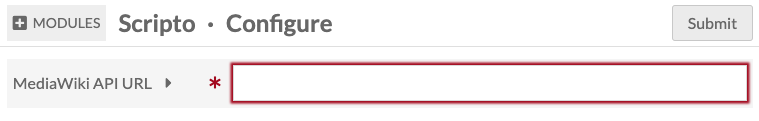
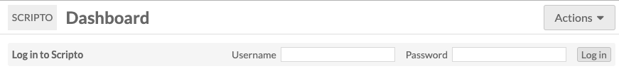
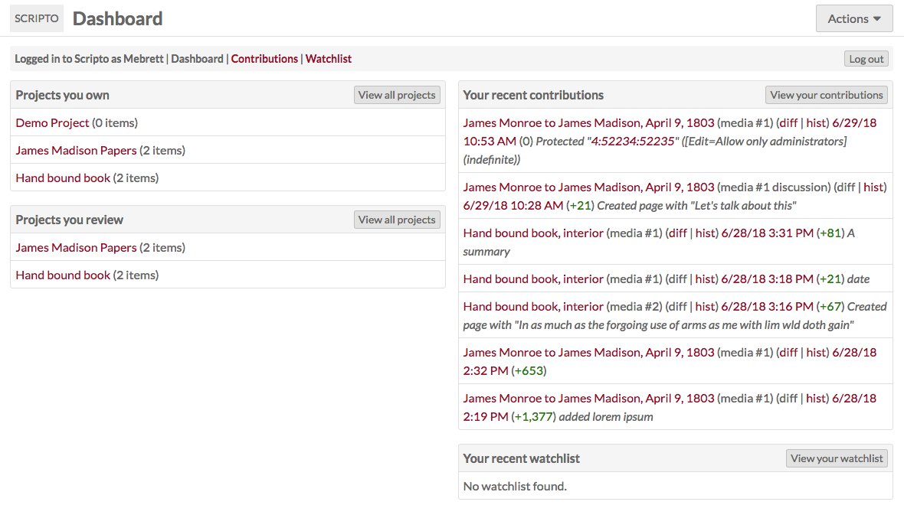
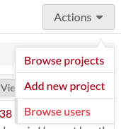
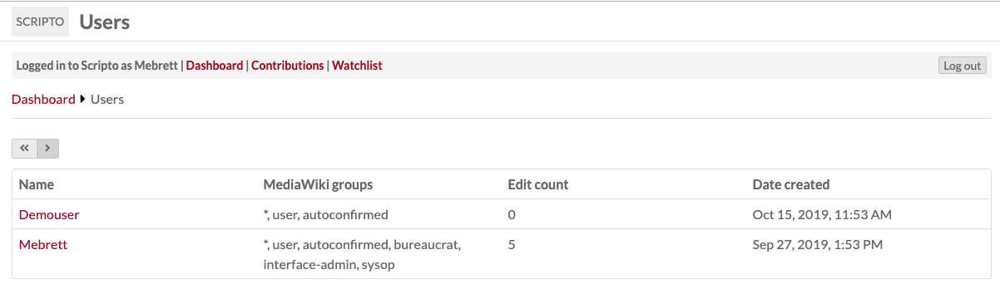
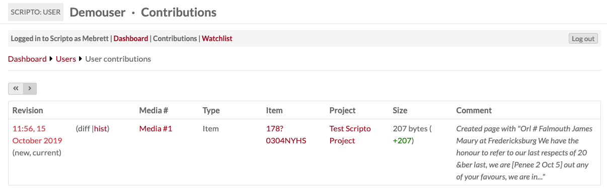

# Set up Scripto

The Scripto module for Omeka S allows you to create projects which allow members of the public to transcribe, translate, or describe media attached to items in your Omeka S installation. 

The items and media are organized into an item set and then synced with a project in Scripto. Content made within Scripto can be periodically imported into Omeka S as item and media metadata.

All content creation (transcription, translation, or description) takes place on the [public face](../../modules/scripto/scriptoPublicView/) of your Scripto [project](../../modules/scripto/scriptoproject/)

## Concepts and Terminology

A Scripto **Project** allows you to organize the materials you want to work with, and set how you intend to work with them. A project can either transcribe, translate, or describe; it cannot do more than one. 

However, the Omeka S Scripto module allows you to create multiple projects on a single Scripto installation. Like sites in Omeka S, Scripto projects can exist independently of each other. This means that you can support a manuscript transcription project and a document translation project through the same Omeka S installation.

An **Item** in Scripto corresponds to an item in Omeka S. When browsing projects, community members will page through items. Items can also be labeled as: audio, book, document, journal, manuscript, paper, or video.

The **Media** associated with an item are the level at which community members transcribe, translate, or describe. Every piece of media is associated with an item. Media can also be called: entry, folio, image, page, segment, section, or sheet. 

## Installation and Configuration
To install Scripto, you must:

- be running Omeka S v2.0.0 or higher;
- have a [MediaWiki](https://www.mediawiki.org/wiki/MediaWiki) installation running on the same server as the Omeka S installation. Minimum MediaWiki version is 1.30.0.

Create the MediaWiki installation on your server using [their instructions](https://www.mediawiki.org/wiki/Manual:FAQ#Installation_and_configuration). Install the Scripto module using the [documentation for installing modules](../../modules/#installing-modules). 

Once you have installed the module and created your MediaWiki installation, go to the Modules tab of your Omeka S installation and activate the Scripto module.

Staying on the Modules tab, click the Configure button for the Scripto module. There is a single, required field for you to enter the url for your MediaWiki API.

Enter the url for your [MediaWiki API endpoint](https://www.mediawiki.org/wiki/API:Main_page#Endpoint) in the field; this should be along the lines of `<your mediawiki url>/api.php`. Be sure to click "Submit" to save your changes.  

### Scripto Vocabulary
Once Scripto is installed and active, it will add the Scripto [Vocabulary](../../content/vocabularies/) to your Omeka S installation. This vocabulary contains the following properties:

- Content: A plain text representation of the content of a resource.
- Transcription: A transcription of a resource
- Translation: A translation of a resource.

Do not edit this vocabulary.

## Create an item set
The Scripto module uses [item sets](../../content/item-sets) to manage the content coming to and from your Omeka installation. 

Each Scripto project needs its own item set with which it can sync. Create the item set using items from your Omeka S installation which you want to be included in the project. You can add items to this item set later if you need to. 

## Scripto Admin Dashboard
The Scripto tab which appears under the Modules section of the left-hand navigation on the Omeka S installation admin side takes you to the Scripto Dashboard. 

From the dashboard, you can log in to Scripto using the bar across the top:

Once you are logged in, the dashboard will include:

- A bar across the top with your username and links to the dashboard, your contributions, your watchlist, and a button to Log Out of Scripto.
- A view of all the [Projects](../../modules/scripto/scriptoproject/) you own.
- A view of all the [Projects](../../modules/scripto/scriptoproject/) you review
- A view of your recent Contributions
- A view of your watchlist.

From the dropdown in the upper right, Omeka S global and site admins can: browse all [Projects](../../modules/scripto/scriptoproject/); add a new [Project](../../modules/scripto/scriptoproject/), and browse all Scripto users. 

## Users
In addition to an Omeka S user account, any individual working on Scripto will need to have a MediaWiki user account as well. They can sign up for this account from the public side of the Scripto interface: `<your omeka S url>/scripto/create-account`.

In order to change the status of transcriptions and sync projects to and from Omeka S, users must have [Bureaucrat level permissions](https://www.mediawiki.org/wiki/Manual:User_rights) on the MediaWiki installation. This *must be done on MediaWiki* and cannot be managed through the Scripto dashboard on Omeka S.

You may find it easiest to have administrators of Scripto projects use the same or similar user names on both installations, in order to keep track of who is doing what. 

### Browse users
From the "actions" dropdown in the upper right corner of the Scripto Dashboard, you can select "Browse users"

This will take you to a user browse page showing all of the Scripto users on this installation (from MediaWiki). 

The users are displayed in a table listing their:

- Name
- MediaWiki Groups, which will indicate their roles
- Edit count (how many media they have edited)
- Date the account was created.

### User contributions
Clicking on a user's name will take you to a page with a summary of their contributions. 

For each user, there will be a table with a row for every edit they have made to a piece of media. The columns are:

- Revision, with a timestamp which links to that revision;
- Media #, with a link to the media;
- Type;
- Item, which links to the item *in Scripto*;
- Project with which the item is associated;
- Size of the edit;
- Comment, if any. 

## Public and Admin views
To toggle between the public and admin views of a project, delete the `/admin` from the url of any Scripto site, or add it in directly after the name of your Omeka S installation. 

The admin side is `youromekaurl.net/admin/scripto` and the public side is `youromekaurl.net/scripto`.

All transcription activity takes place on the **public** side of the Scripto project. You cannot edit a transcription from the admin dashboard.

## Uninstalling Scripto

In order to successfully uninstall Scripto, the module must be still be active. Do not deactivate Scripto prior to uninstalling. 
