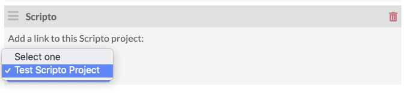
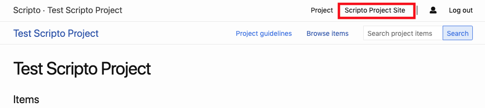
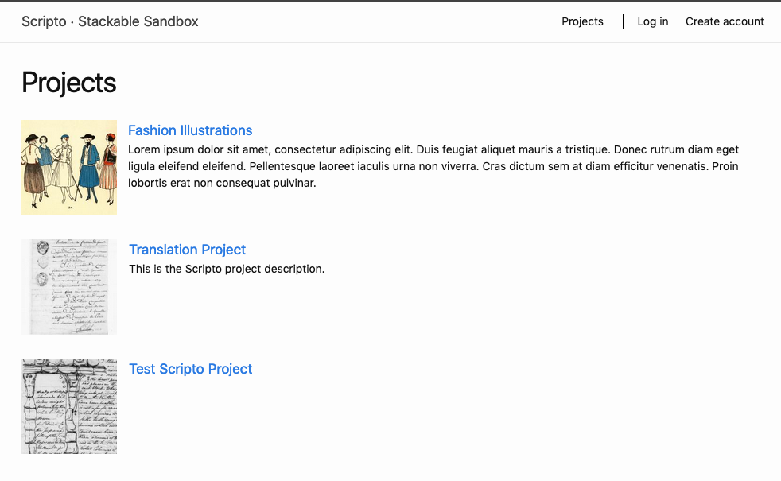
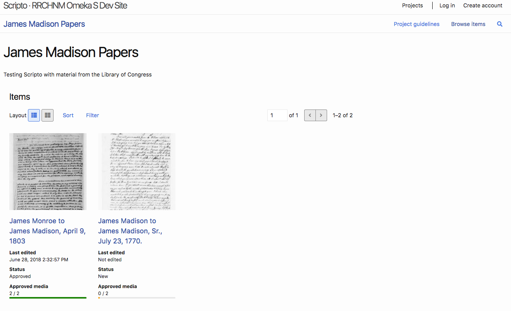
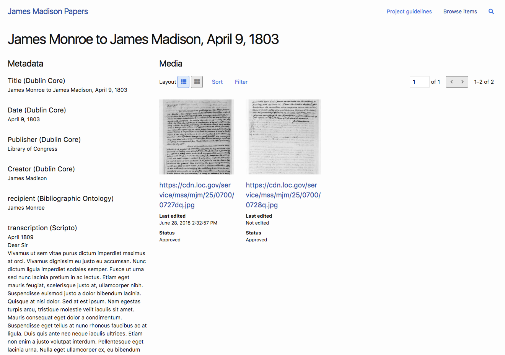
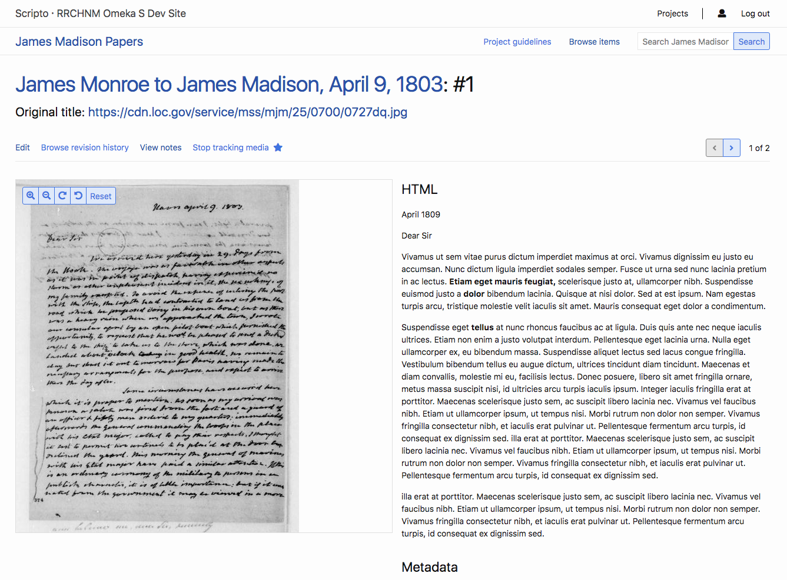
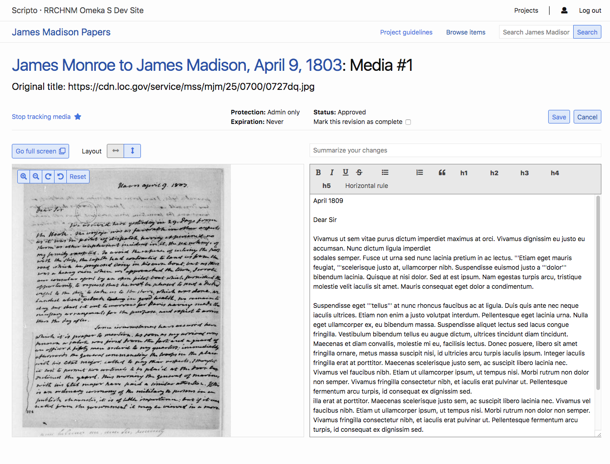

# Public Interface

On the public side, all users can browse Scripto projects that are marked as public. In order to edit or create content, users may need a Scripto (Mediawiki) account and be logged in, but this is only required for MediaWiki installations that forbid anonymous editing. Even so, users may still want to log in to Scripto so they can better monitor their work.

To toggle between the public and admin views of a project, delete the `/admin` from the url of any Scripto site, or add it in directly after the name of your Omeka S installation. 

The admin side is `youromekaurl.net/admin/scripto` and the public side is `youromekaurl.net/scripto`.

All transcription activity takes place on the **public** side of the Scripto project. You cannot edit a transcription from the admin dashboard.

For an example of how to orient community members to the interface, see the [Guide to transcribing the *Papers of the War Department*](http://wardepartmentpapers.org/s/home/page/transcribing-guide)

## Linking between Scripto and an Omeka S site
While the Scripto public interface exists somewhat separately from the sites you build in your Omeka S installation, it is possible to move between them.

From your Omeka S sites, you can create direct links to your Scripto projects using the [custom link](../../../sites/site_navigation/#custom-link) in site Navigation or as a link in any [HTML page block text](../../../sites/site_pages/#html).  

### Scripto page block
When you add the Scripto module, it creates a new [page block](../../../sites/site_pages/#page-blocks) called "Scripto"

The Scripto page block offers a drop-down to let you select from all available Scripto [projects](../scriptoproject/). Select the project you want to link from the dropdown.

On the public page view, this will display as a link. 

Once you have applied this block to a site, it also creates a link from the project to that Omeka S site *when accessed via the site, rather than a direct Scripto link*. When users browse the project, the name of the associated site is listed in the upper right hand corner of the browser window, near their user information; this serves as a link to the site.

## Public-side user dashboard
From the public side, users have access to their dashboard, which givens them an overview of your Contributions and your Watchlist. 

Recent Contributions (documents the user has edited) display as a list. In each row, it will show the following information:

- Document type (just “document” in most cases);
- Document title, which is also a link to the document page, with the page number in parentheses after the title;
- Link to see the changes with the version immediately before that (“diff”);
- Link to see the history of the document’s edits (“hist);
- Date of last change in the format Month/Day/Year followed by timestamp; and
- Summary of the changes, with the number of characters changed in parentheses, followed by any comment or summary supplied by the person making the change.

Above the list is a button which will take users to see all of their contributions

Watched pages will also display as a list. Watched pages include those which the user has already selected, which can include items being edited by another user. Next to the list header is a button which will display all items on the watchlist. 

The list of watched pages displays the following information:

- Document type (just “document” in most cases);
- Document title, which is also a link to the document page, with the page number in parentheses after the title;
- Link to see the changes made with the version immediately before that (“diff”);
- Link to see the history of the document’s edits (“hist);
- Date of last change in the format Month/Day/Year followed by timestamp; and
- Summary of the changes, with the number of characters changed in parentheses, followed by any comment or summary supplied by the person making the change

## Public project browse
On the upper right of the browser, near the "Log In" buttons or, when logged in, the user icon, is a link to browse all projects in the Scripto instance. 

This browse page shows the project title, a representative icon determined by the first item in the project, and the project's description (set in the [configuration options](../scriptoproject/#configuration-options)), if any. 

Clicking on any project's title or representative thumbnail takes you to the project's view.

## Public project view
The main project view displays the title of the project, as well as its description, if any.

Across the top of the page, just under the Scripto navigation options (project browse and user icon), are:

- the Project title which functions as link back to the main project page; 
- a link to the project guidelines; 
- a browse items links; and
- a search bar to search the items in the project (this is a full-text search for the metadata of the items and media).

Below this is a table of the items in the project. The table will be labeled Items unless you selected from the Item type dropdown in the project's [configuration options](../scriptoproject/#configuration-options).

The table has two display options. The default view is set in the project's configuration options.
 
- **List** displays the items in horizontal rows that prioritizes text with:
	- a small thumbnail of the image;
	- the document title;
	- date last transcribed; 
	- transcription status; and
	- number of approved pages, shown as a bar and a numeric count.
- **Grid** displays each items four per row with:
	- a large thumbnail of the first page, which can give you a quick sense of the quality of the image and handwriting;
	- the document title;
	- date last transcribed;
	- transcription status; and
	- number of approved pages, shown as a bar and a numeric count.

Transcription stat

On the public side, projects display a progress bar for all items, so that community users can easily identify media or items to work on. 

### Public item view
The public item view displays the Omeka S item metadata in a column on the left side, and the media in the main area on the right. 

Users can toggle between gallery and list views using the layout button. They can also *sort* and *filter* media in the item. Sort options are by last edited, last completed, and last approved. Filter options are is edited, is not edited, is completed, is not completed, is approved, is not approved.

Users can either click on the media's index number to view media information, on edit to go straight to the mediawiki transcription/translation interface.

### Public media view
The initial media view shows the media on the right, with metadata on the left. Underneath the media display is the HTML of whatever wikitext has already been generated. 

At the top of the page is the title of the item, which functions as a link back to the item, followed by the media's number (the second page will be #2, for example). Below this information is the original title of the media itself. 

On the left above the media and metadata are a series of buttons:

- *Edit*
- *Browse revision history*
- *View notes*
- And *track/stop tracking media* with a star button which toggles this option.

On the right above the media and metadata is a pagination button which allows users to easily move between media for a single item

#### Adding text
To start working with a piece of media, the user clicks "edit" in the toolbar above the media and metadata display.

A new page loads, with a media viewer and an editing workspace for users to enter text. Depending on the selected layout, media may be to the right of the workspace or above it.

The area between the media title and the workspace and viewer has a combination of information display and action items for the user. 

- On the far left is a button to track or stop tracking media, with a star icon.
- In the center is an information display with the media's Protection, protection expiration, and status, and a checkbox where the user can mark the media as completed. 
- On the far right are buttons to *save* or *cancel* changes. 
- Users can rotate the media and zoom in and out using the controls within the media viewer.
- Users can use the layout buttons to toggle between side by side and top and bottom views. 

Just above the MediaWiki workspace is a field where users are encouraged to summarize their changes. 

The editing workspace has a formatting toolbar which adds MediaWiki markup to the text (it does not change the appearance of the text in the workspace). Any formatting will be applied to the HTML view of the text after changes are saved.
