# Scripto Projects

Scripto is made up of projects. Every transcription, translation, or description effort you create can, and should, have its own project. 

## Create a Project
This [screencast](https://vimeo.com/422818763) walks you through the process of creating a Scripto project in Omeka S. 

To create a new Scripto project, go to the Scripto dashboard (the Scripto tab in the left-hand navigation) and use the "Actions" dropdown menu in the upper right corner to select "add new project"

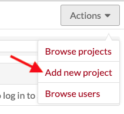

This will load the New project page, which has two tabs: Configuration and Reviewers. 

The eye symbol on the upper right by the "add" button sets the visibility of the project. If the button is set to private (eye with a slash) it will only be visible to users *of the Omeka site*.

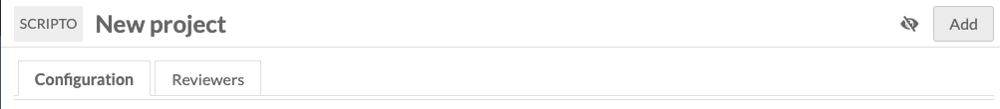

You can change these settings at any time by editing the project using the Actions dropdown on the project review.

### Configuration options
Some of these configuration options are required to create your Scripto project; all of them can be changed later using the "Edit project" option.

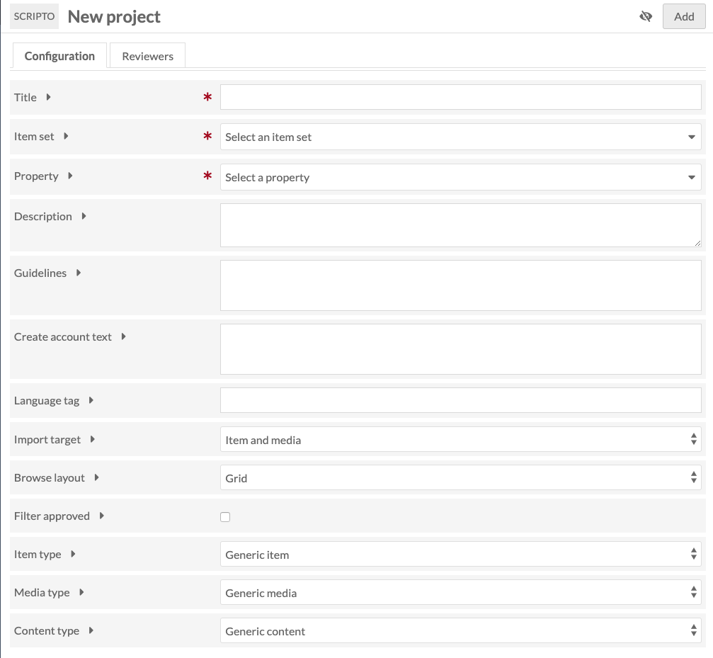

**Title:** (required) the name of the Scripto project. This will display on public and admin sides.

**Item set:** (required) select the item set with which the Scripto project should synch. This item set should contain all the items and/or media you wish to include in the project. 

**Property:** (required) select from the dropdown which property should store the content created through Scripto when it is imported back into Omeka S metadata. In addition to installed [Vocabularies](https://omeka.org/s/docs/user-manual/content/vocabularies/), Scripto has its own vocabulary options of content, transcription, and translation; any of these would work for the property.

**Description:** a description of the project. This will display on public and admin sides.

**Guidelines:** transcription guidelines. These can be formatted using the text formatting editor which will appear when typing inside this field.

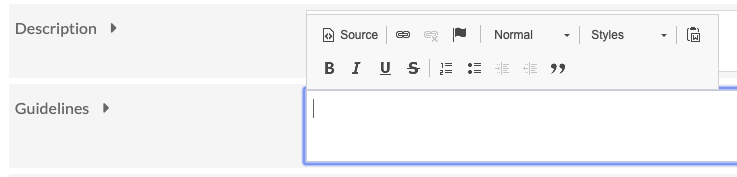

**Create account text:** enter text which will appear on the public page where users sign up to transcribe; for example, a brief summary of the aims or activities of the project. If left blank, the page will only display the fields for name, email, and password. 

**Language tag:** the language tag for the content being imported into the property selected above.

**Import target:** select the resource level to store data when it is pushed from the Scripto project back to Omeka S metadata. Options are Item and Media, Item, or Media.

If you select Item, then content created in Scripto will appear in the Item metadata, in the property you selected earlier. 

If you select Media, the content created in Scripto will appear in the media metadata, but not at the item level.

**Browse layout:** choose the default browse layout for the project, either Grid or List.

**Filter approved:** when checked, approved items will not display in the public browse view.

**Item Type:** if you want, you can specify the type of item used in this project. What you select here will change the interface language for users. For example, if you choose "manuscript" then the browse link for the project will display as "browse manuscripts" instead of "browse items". Choose from:

- Generic Item (default)
- Audio
- Book
- Document
- Journal 
- Manuscript
- Paper
- Video

**Media Type:** use this dropdown to specify the type of media used in the project, and change the way that media is referred to in scripto for this project. Choose from:

- Generic Media
- Entry
- Folio
- Image
- Page
- Section
- Segment
- Sheet

**Content Type:** use this to specify the kind of work in the project. Choose from:

- Generic Content
- Description
- Transcription
- Translation

### Reviewers
Add [Omeka S users](../../../admin/users/) to your Scripto project as reviewers, who can can access private projects, and mark media as approved and unapproved. You can manage users after adding a project (see below)

Only Omeka users with **site administrator** and g**lobal administrator** roles can sync and import projects, due to the destructive potential of those actions. 

Although reviewers do not need to have a MediaWiki account to review a Scripto project, it is recommended that they create one.

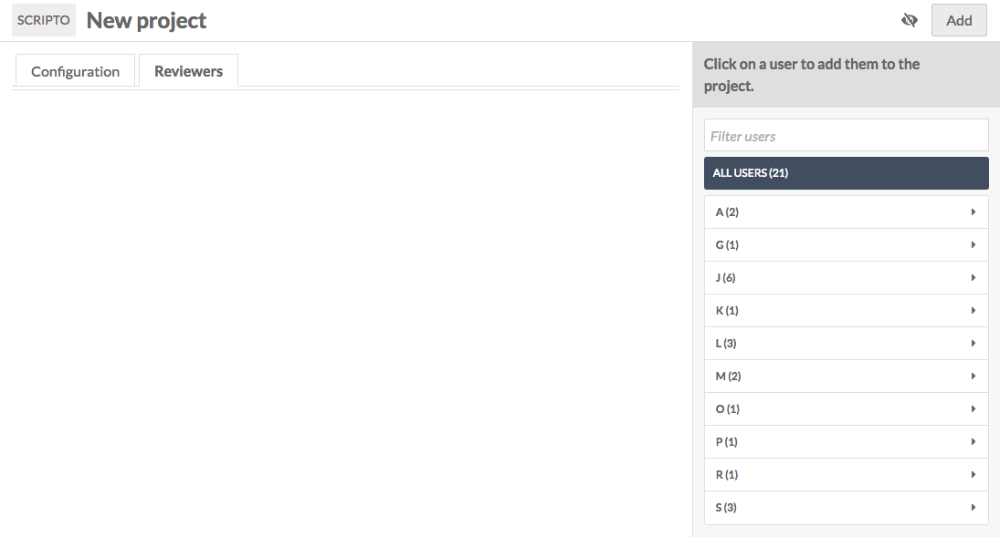

On the right-hand side of the window is a browsable list of Omeka S users, sorted alphabetically by username. To add a user as a Scripto project reviewer, simply click on their name; this will add them to the table of reviewers in the main part of the page.

Be sure to add yourself as a reviewer if you plan to work on this project. 

To remove a user as reviewer, click the trash can icon to the right of their email address in the table of reviewers.  

### Add project
Once you have entered the required fields and lick "Add" to create the new project.

### Initial Sync
Immediately upon creating a project, you will see the message: "No Scripto items found. Do you need to sync the project? If you have recently synced, the sync job has likely not finished."

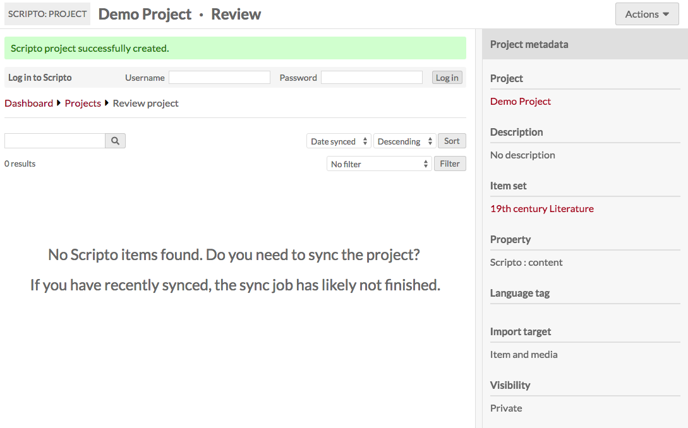

To sync the project, go to the Actions dropdown button in the upper right corner of the window. From the options, select "Sync project" - this will update the project so that it has every item in the item set. 

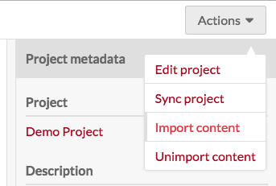

Note that the first time you run the sync may take some time, and you may continue to see the "No Scripto items found" message. You should also see a green message across the top of the page stating that the project is syncing and giving you a link to the job for the sync.

## Admin Project View
From the Scripto dashboard you can access projects you own and those to which you have reviewer access. Regardless of your status for the project, clicking on the project's title will take you to its review page.

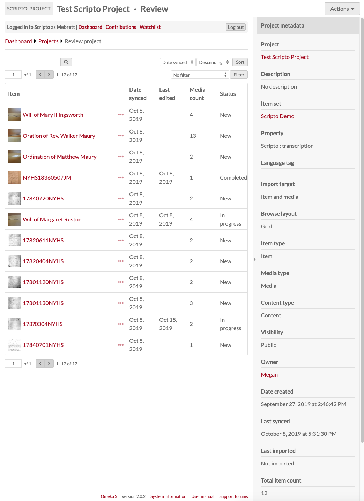

At the top of the page you will see the title of the project along with the label "Review". Underneath the project title will be the Scripto account bar, where you can either log in or navigate to the dashboard, your contributions and watchlist. 

In the top right corner is the Actions dropdown which has the following options:

- [Edit project](#edit-project)
- [Sync project](#sync-project)
- [Import content](#import-content)
- [Unimport content](#unimport-content)

The sidebar on the right summarizes the metadata for the project. The project title, item set, and owner all act as links.

### Table of items
In the main work area is a table with all of the items in the project, with the following information:

- Item* (first media thumbnail and title)
- Ellipses to see item metadata - this will open in a drawer on the right
- Date synced: date most recently synced.
- Last edited. If the item's media has not been edited, this will be blank
- Media* count: number of media associated with the item
- Status: item status, which will be blank, completed, or approved.

*NB: If you changed the Item, Media, or Content in the project configuration, then you will see the terms you selected instead of "item" or "media"

Above the table are options to:

- search items and media in the project (search bar)
- page through the project's items
- sort items and media, either ascending or descending, by:
	- Date synced
	- Last edited
- filter results by:
	- is approved
	- is not approved
	- is in progress
	- is new
	- is edited after imported

To find items which have been edited and are ready for review, filter all items by "is in progress." You may also want to sort by last edited.

### Edit project
You can edit your project using the Actions dropdown in the upper right hand corner of the screen. It offers the same two tabs you used when [creating your project](#create-a-project) - [Configuration](#configuration-options) and [Reviewers](#reviewers). 

## Admin Item Review
[This screencast](https://vimeo.com/431828023) shows the process of reviewing an item and its media.

To review an item, click on its title in the project view.

The Item view page, like the project view, has near the top of the page a Scripto account bar, where you can either log in or navigate to the dashboard, your contributions and watchlist.

On the right is a drawer summarizing the item's status and data. The properties for the Scripto Project and Omeka S item link back to their respective properties. Click the bar between the drawer and the main work area (indicated with a `>` symbol) to collapse the drawer.

The main work area has two tabs: one summarizing Media information and one with the Omeka item metadata.

### Media tab
On the Media tab, there is a table with all the media in an item. Users transcribe media by media, so Scripto allows you to review on the media level.

The table includes:

- A **checkbox** for the media
- The **index number** of the media
- The media's **thumbnail** and **title**. Click on this to review the media.
- An ellpises (`...`) which opens a drawer on the right displaying the metadata for that media
- **last edited** date
- **status** 
- **Edit protection** (admin only, open to all)

You can sort the table by last synced, last edited, last completed and last approved, either ascending or descending, using the drop-downs in the upper right of the tab.

You can also filter which media are displayed using the dropdown to show only: 

- Is/is not edited
- Is/is not completed
- Is/is not approved
- Is edited after approved
- Is edited after imported
- Is synced after imported

Using the checkbox you can edit selected or all media.

To review a specific piece of media, click either on its title or thumbnail. This will take you to its [media review page](#media-review-page).

#### Batch edit media 
If you batch edit media from the Review item tab, you have the following options: 

- Set completion status as Complete, incomplete, or no change.
- Set Approval status as Approved, not approved, or no change.
- Change protection level for the selected media to one of the following: No change, Allow all users, Allow only confirmed users, or Allow only administrators.
- Set an expiry date for the protection, choosing from: infinite, 1 hour, 1 day, 1 week, 2 weeks, 1 month, 3 months, 6 months, 1 year.
- Set watchlist status as watch, unwatch, or no change.

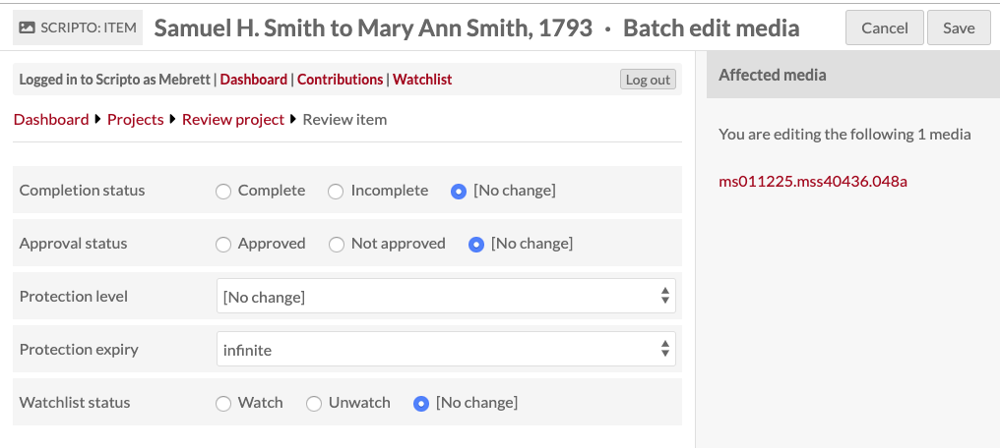

On the right side of the batch edit media view is a list of all of the media which you are editing.

When you are done, either click Save or Cancel, in the upper right hand corner of the screen.

### Omeka item metadata
This tab is a static display of the metadata for the Omeka S item with which the Scripto item is associated. When you sync the project, this is the item which will be updated. To edit the item, scroll in the right hand drawer display of Scripto item metadata to find the Omeka item link (indicated with an arrow in the below image)

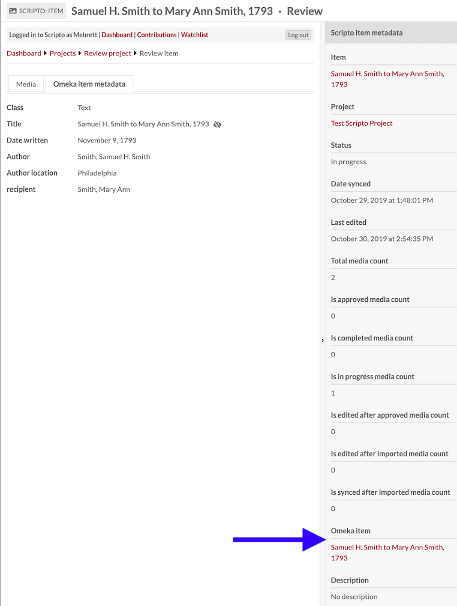

## Media Review page
Review of user-generated content takes place at the media level. To review the work for a specific piece of media, click on its title or thumbnail from the review item page of the item with which it is associated.

The Review media page consists of three tabs in the main work area and a drawer on the right hand side. 

Along the top of the page are the following buttons:

- A **star** to add this page to your watchlist (if you are logged in to Scripto)
- A button to go to the **Revision History**
- A button to **View notes** of the media
- A button to **Save** changes

The first tab is **Wikitext** and displays the user-generated text from MediaWiki next to the media. You can use the Layout buttons to toggle between side by side and top and bottom display. You can zoom in and rotate the media display using the buttons within the media viewer. There is also an option to go to a full screen view of the text and media. Note that you cannot edit the text from this view, you can only read it.

The second tab is an **HTML** display of the Wikitext content, showing the formatted text as it will display on the public side of a site.

The third tab is **Omeka media metadata** for the media. 

To the right of the tabs is a set of foward-backward arrow buttons and numbers (1 of 2 in the image) which allow you to move through media attached to an item without backing out to the Review item page.

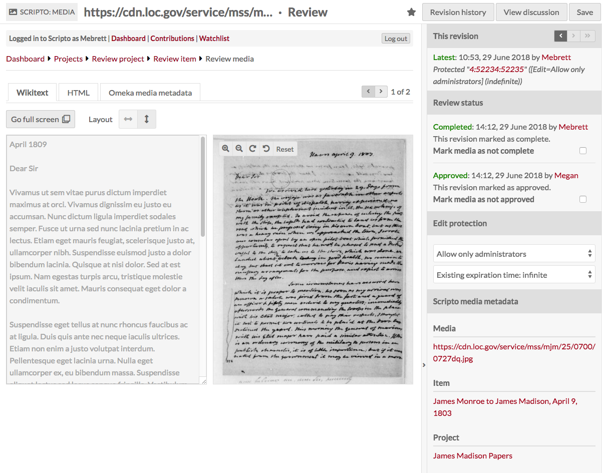

The drawer on the right is where review actions take place, in the section titled "Review Status." 

At the top of the drawer is the **This revision** section where you can move through revisions using the forward and back arrows. The first line in this section indicates whether it is the "Latest" revision or "out of date". Use the double-forward (`>>`) button to skip to the latest revision. This section also displays the name of the user who created this revision, the timestamp, and any comments they may have made when saving their changes. 

The next section is **Review status**. 

- You can move through revisions using the forward and backward arrows.
- You can view review status and modify using checkboxes if your Mediawiki role includes bureaucrat.
- You can edit the protection of the Wikitext page, choosing from all users, confirmed users, or only administrators, and set the protection to expire or set it as indefinite. Again, you can only do this if your Mediawiki role allows it.

You can toggle the drawer open and closed using the open arrow `>` button in the middle of the divider between the drawer and the main work area. 

#### Media status:

* **Complete:** Community users have the ability to mark a media they are working on as "complete." This serves as a flag to notify the project team that the media is ready for review. If a media is not completely transcribed/translated/described, adminstrators can reverse the Complete status.
* **Approved:** Approval is granted by administrators and indicates that every media is complete and satisfactory. Items can only be considered approved when all child media are approved.
* **Protected:** Protection is a [MediaWiki function](https://www.mediawiki.org/wiki/Manual:Administrators#Protection). In the context of Scripto, it is a way for project owners to close editing on a media or item at a certain point, either because it is complete or because of a need to deal with that particular media or item (bad scan, for example). 
	* Protection can be limited to users, confirmed users, or administrators. In addition,  you can choose to protect the media infinitely or for a set amount of time: 1 hour; 1 day; 1 week; 2 weeks; 1 month; 3 months; 6 months; or 1 year. 

### Revision History
Clicking the "Revision History at the top of the Review media page takes you to a listing of the revision history for the media.

Clicking on the timestamp for a revision will take you to that revision. 
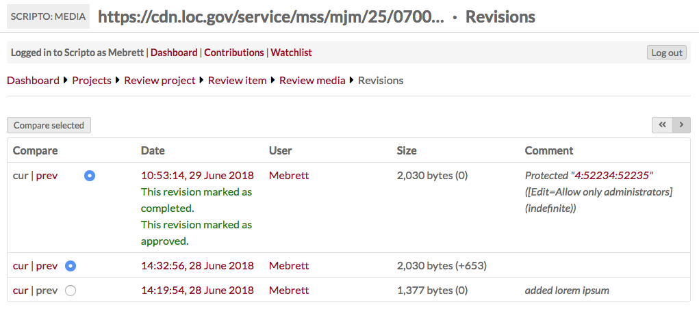

### Notes
Notes are a way for project staff and transcribers to communicate. Access the notes for a specific media using the "View notes" button in the upper right corner of the Review Media page

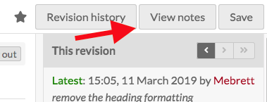

The note review options are similar to the media review options: there is a tab for wiktext where you can see the notes to the left of a small view of the media. The HTML tab displays only the wikitext in full HTML markup, not editable. The Omeka media metadata tab allows you to review the Omeka S metadata associated with the media.  

Using the drawer on the right hand side of the screen, you can change the protection of the notes page to allow only the selected level of users to edit the notes page: all users, only confirmed users, or only administrators. 

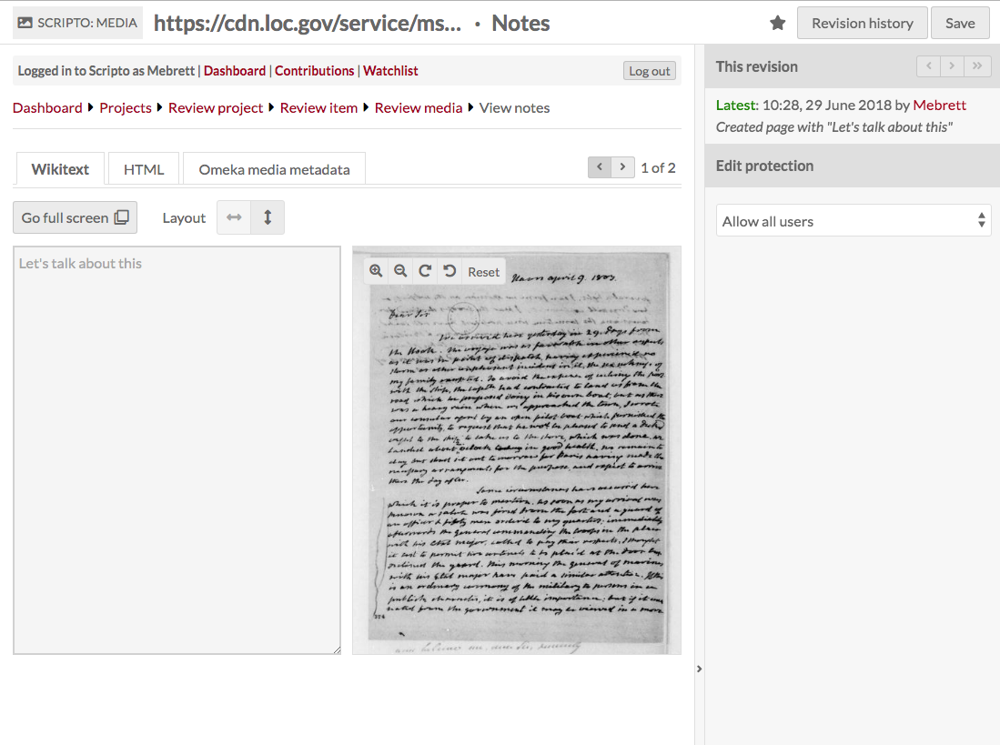

You can toggle the drawer open and closed using the open arrow `>` button in the middle of the divider between the drawer and the main work area. 

## Sharing data between Scripto and Omeka S
Scripto projects and the Omeka S items and item sets with which they are associated are separate entities. In order to update either Scripto or Omeka S, you will need to take one of the following actions on your project from the Actions dropdown in the upper right corner of the screen on the Project review page:

- Sync project
- Import content
- Unimport content

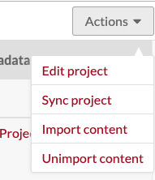

All three of these actions open a drawer on the right side of the screen with a summary of what the action does. In order to complete the action, you must click the button at the end of the text in order to complete the action. 

### Sync project
Syncing a project updates the project in Scripto with information **from** the Omeka S item set. 

Use this option if you have made changes to the Omeka S item set, or the items in that set. You should synchronize periodically, any time items are added or removed from the item set, and when item media have been added, removed, or reordered.

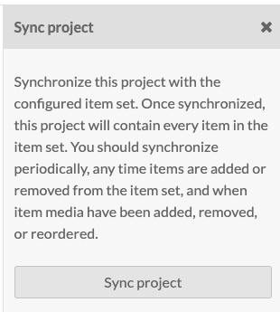

### Import content
This option is how you move content from your Scripto project **to** Omeka S metadata. 

This will only move approved transcriptions (or similar content) to the Omeka S items. By default, the target are Scripto vocabulary properties in the resource type you selected during configuration.

If you have a project which is fairly active, you should plan to import content weekly or monthly.

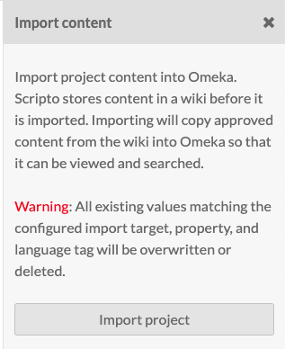

### Unimport content
This option deletes all project content from Omeka S. 

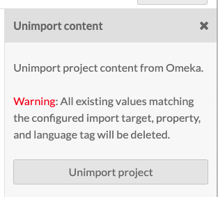

## Delete a project
To delete a project, choose the 'Edit project' option from the Actions dropdown in the upper right corner of the project dashboard. 

Click the Delete button in the upper right hand corner of the editing window. 

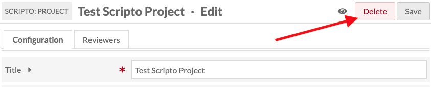

This will open a drawer asking you to confirm that you wish to delete the project. Click Confirm Delete to completely delete the project.
