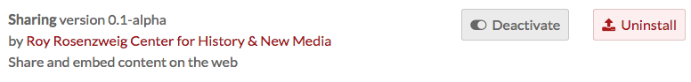
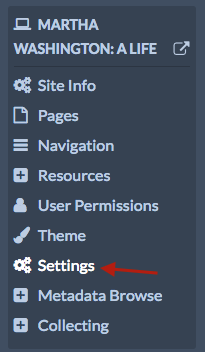
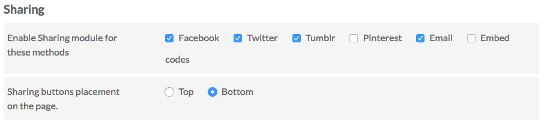
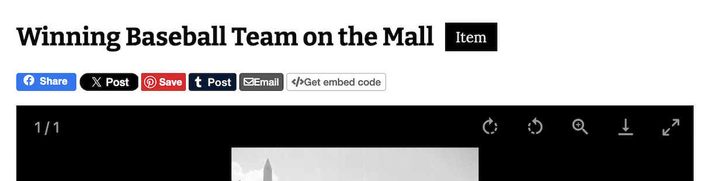
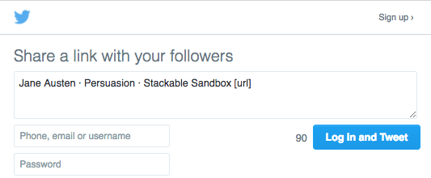

# Sharing

The Sharing [module](../modules/index.md) allows you to add buttons to site pages which visitors can use to share and embed content from your site on social media or via email.

Currently, Sharing supports the following options:
- Facebook
- Twitter
- Tumblr
- Pinterest
- Email
- Embed codes

Once sharing has been [installed](../modules/index.md#installing-modules)  and activated for an Omeka S install, it is available for all sites on the install. 

## Configuration

Sharing settings are configured on a site by site basis. 

Go to the site for which you want to configure the plugin and click through to the edit site dashboard. Click on the Site Settings. 

There should be a section labelled "Sharing" (see the image  below) with two options:

*Enable Sharing module for these methods*: gives a series of checkboxes, one for each service or option (Facebook, twitter, etc)

*Sharing buttons placement on the page*: sets the placement of the sharing buttons either at the top of the content (below the navigation and page header) or at the bottom (just above the footer). 

Ensure that the correct boxes are checked for your site. You can uncheck all of the boxes to turn off sharing for your site. Be sure to save your changes. 

## Public Side

Sharing icons for enabled services and options will display at the bottom of pages you build as well as individual item/show pages on your site. 

By default, the module will share the page title, name of site, and name of installation. 

