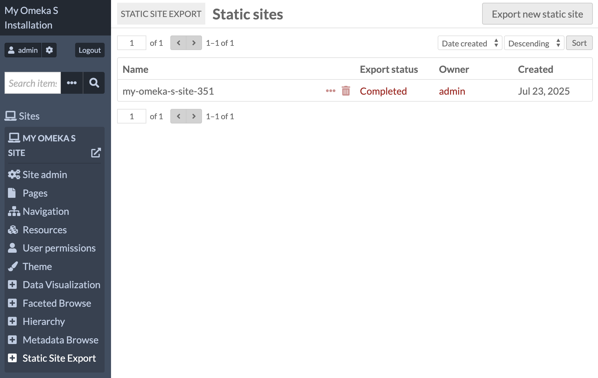
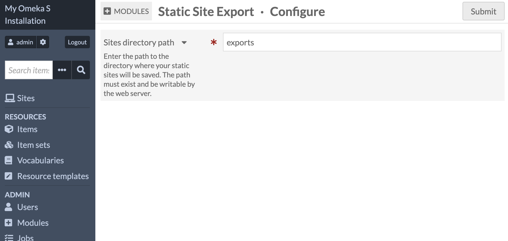
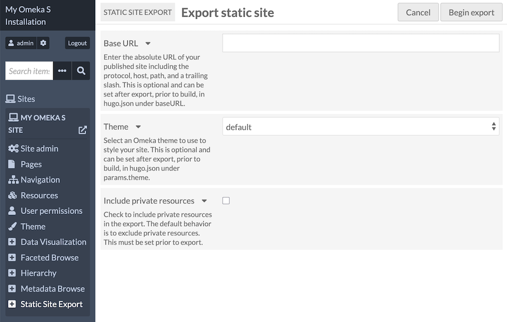
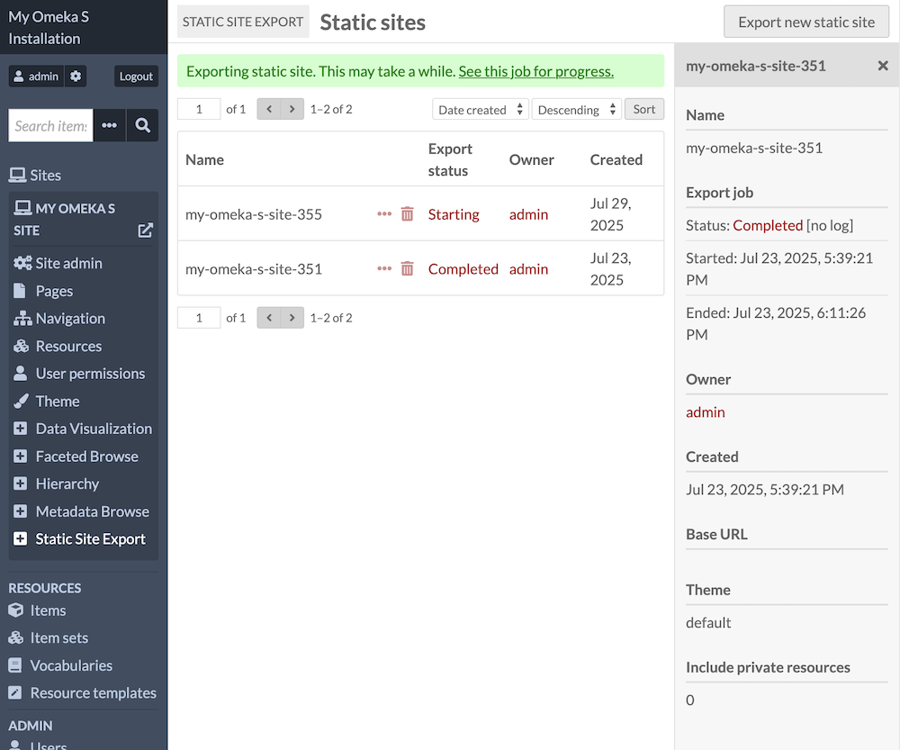
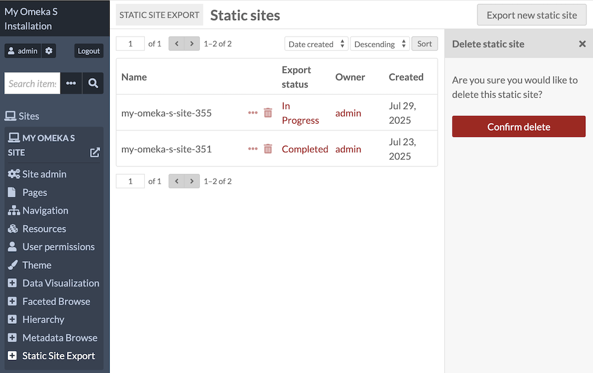

# Static Site Export

The [Static Site Export module](https://omeka.org/s/modules/StaticSiteExport){target=_blank} allows you to export a flattened copy of a site on your Omeka S installation. Using [Hugo](https://gohugo.io/){target=_blank}, you can rebuild a simplified version of your site that will maintain most of your page elements and all of your resources.  

Static sites do not contain the usual dynamic website elements, such as searching, or pages and page blocks that use search queries. Some page blocks will not render at all, and some will render without their original settings. Currently the SSE module only supports content from [Mapping](mapping.md) and not other modules. Static sites will be produced with a version of the "default" theme for S.



Once an export has been produced, you can edit its CSS or other code to customize it to more closely match your original site. For this and other advanced uses of the exports, see the developer documentation included in the Readme on the module package. 

Static sites can be useful as a backup and record of your site's content, and for reducing server load for legacy web projects. 

### Requirements and permissions

Exports can be created and managed by any user with site-specific permissions. 

!!! note
  If you are using Static Site Export version 1.0.0, you must use Hugo earlier than v0.146.0. For Static Site Export versions past 1.0.0, you must use Hugo at least v0.146.0 or later.

## Configuration

After installing this module, you will need to add a "Sites directory path" in the module configuration page. This is the path to the directory where your static sites will be saved on your server. The path must exist and be writable by the web server.



## Export a site

After installing and configuring this module, go to an Omeka site in the administrative interface, click on "Static Site Export" in the navigation, and click the "Export new static site" button.

On this page you will configure the export by: 

- entering a "Base URL": If you plan to deploy the flattened site online, 
- selecting a "Theme": At this time, Omeka S only offers a flat theme that resembles our "Default" theme. 
- declaring whether to "Include private resources": If this is left unchecked, your site will include only resources that are available to logged-out site viewers. If checked, resources included in the site but only visible to logged-in users will also be made available in the export (as though they were public). 


After configuring the export, click the "Begin export" button. The new export will be the first in the list. Click on the "Details" icon for information about the export, including status of the export job. The export is finished once the status is marked as "Completed".



Note that an export may take a long time, depending on the size of the site.

Note that the export runs several widely used commands on your server: cd, cp, rm, unzip, and zip. While these commands are required during export, they are likely already installed on your server, so there's nothing you need to do.



An export will be a ZIP file that appears in the folder you set in the module configuration. This will be relative to your installation path. You can navigate to and download your export ZIP using your browser or with the command line. 



## Deploy your site with Hugo

You can extract the export and build your site using Hugo either locally or online. 

After exporting a static site, you can unzip the resulting ZIP file and immediately use [Hugo](https://gohugo.io/){target=_blank} to build the site, run a local testing server, and view the site:

```
cd /path/to/static-sites/
unzip <export-name>.zip
cd <export-name>/
hugo server
```

After the build is complete, follow the instructions in your terminal and go to the specified web server in your browser. If your site is very large, you may need to disable the default "watch for changes and recreate" behavior by running `hugo server --watch=false`.

When you are ready to deploy your site, run `hugo` in your project directory. See Hugo's documentation to learn more about how to use the  [command line interface (CLI)](https://gohugo.io/commands/){target=_blank} to manage your site, and how to [host and deploy](https://gohugo.io/host-and-deploy/){target=_blank} your site.
