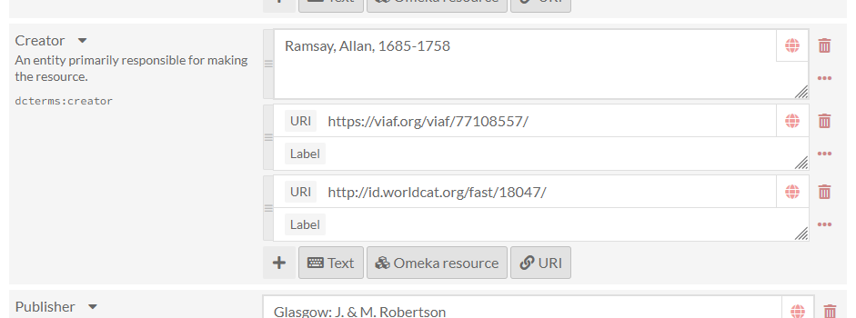
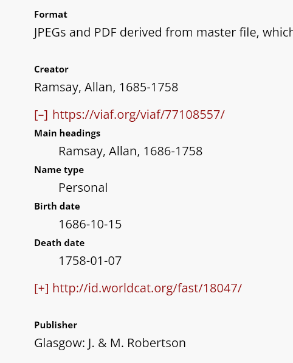
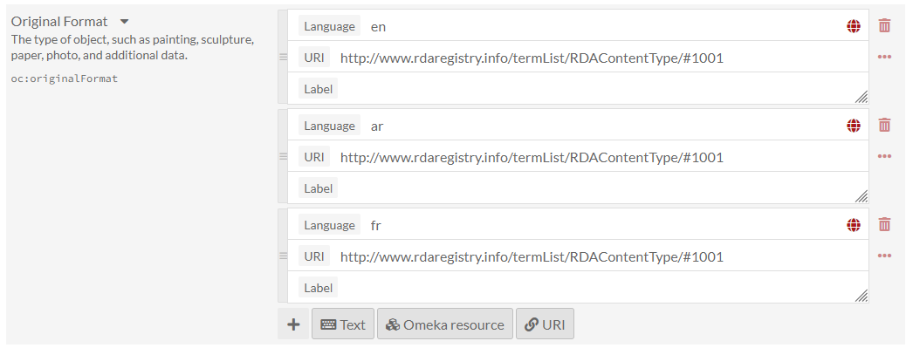

# URI Dereferencer

The [URI Dereferencer module](https://omeka.org/s/modules/UriDereferencer/) allows pages to dynamically display data from the source of many URIs on Omeka item, media, and item set pages. 

This module has no configuration settings and adds no functions to the administrative dashboard. It appears on the front-end, on recognizable URIs from built-in [linked data services](#linked-data-services), on any resource view where a URI has been input as a metadata value.

![Two URIs in the Creator field with [+] toggle links beside them.](modulesfiles/uri-display.png)

This module looks up URIs on the page and provides users a snapshot of linked data without having to navigate away from the page. It will automatically dereference all "URI" data type values that match a registered service. URIs recognized will display with a "[+]" link next to them, which can be clicked to expand information found at the source. When expanded, the links will change to "[-]". The snapshot of external metadata loads below the URI.

These toggle buttons will load with the class `uri-dereferencer-toggle` and can be styled using the [CSS Editor module](../modules/csseditor.md) or with externally-hosted stylesheets. When expanded, the external metadata will load inside a `div` with the class `uri-dereferencer-markup` and from there into a `dl` description list. Properties will appear as `dt` and values as `dd`. 

The number of dereferenced metadata values, and which ones, are determined by the service and its own data type, and cannot be set in Omeka. You should test the services and data types before deciding if you wish to use these URIs and allow users to see the dereferenced metadata. This module does not allow you to include or exclude specific properties from being dereferenced.

If the service provides information in multiple languages, you can specify which language's fields should be displayed by providing a two-letter language tag in the language field (the globe icon) when editing the property value. 

When the item is accessed on a public page, the URIs can be expanded to display information in the specified language. If the desired language is not available, URIs will fall back to English. Check with the specific service to see which languages are offered. Currently there are only four services that offer translations: [Wikidata](https://www.wikidata.org/wiki/Wikidata:Main_Page), [DBpedia](https://wiki.dbpedia.org/), [RDA Value Vocabularies](http://www.rdaregistry.info/termList/), and [Getty Vocabularies](https://www.getty.edu/research/tools/vocabularies/) (excluding ULAN).

If you have [custom data type values](../modules/customvocab.md) and wish them to be dereferenceable, you must add the class `uri-value-link` to the anchor tag containing the URI.

## Linked data services

Linked data services are JavaScript objects that are responsible for dereferencing URIs and returning information about the resource. This module comes with a handful of services built in:

- [DBpedia](https://wiki.dbpedia.org/)
- [Geonames](https://www.geonames.org/)
- [Getty Vocabularies](https://www.getty.edu/research/tools/vocabularies/)
- [LC Linked Data Service](http://id.loc.gov/)
- [OCLC VIAF](https://www.oclc.org/en/viaf.html)
- [OCLC FAST](http://fast.oclc.org/)
- [RDA Value Vocabularies](http://www.rdaregistry.info/termList/)
- [Wikidata](https://www.wikidata.org/wiki/Wikidata:Main_Page)
- [Gemeentegeschiedenis](https://www.gemeentegeschiedenis.nl/).

To learn about adding other services, view the [Readme](https://omeka.org/s/modules/UriDereferencer/).
