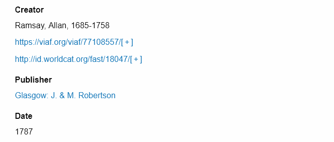

# URI Dereferencer

The [URI Dereferencer module](https://omeka.org/s/modules/UriDereferencer/){target=_blank} allows pages to dynamically display data from the source of any URI on Omeka item, media, and item set pages. 

Dereferenceable URIs are the backbone of Linked Data. They can be looked up (dereferenced) to provide useful information about the resource that the URI identifies, which in turn refers to other URIs, and so on.

This module looks up URIs on the page and provides users a snapshot of linked data without having to navigate away from the page. It will automatically dereference all "URI" data type values that match a registered service. URIs recognized will display with a "[ + ]" link next to them, which can be clicked to expand information found at the source. When expanded, the links will change to "[ - ]". 

If you have custom data type values and wish them to be dereferenceable, you must add the class `uri-value-link` to the anchor tag containing the URI.

## Linked data services

Linked data services are JavaScript objects that are responsible for dereferencing URIs and returning information about the resource. This module comes with a handful of services built in:

- [DBpedia](https://wiki.dbpedia.org/)
- [Geonames](https://www.geonames.org/)
- [Getty Vocabularies](https://www.getty.edu/research/tools/vocabularies/)
- [LC Linked Data Service](http://id.loc.gov/)
- [OCLC VIAF](https://www.oclc.org/en/viaf.html)
- [OCLC FAST](http://fast.oclc.org/)
- [RDA Value Vocabularies](http://www.rdaregistry.info/termList/)
- [Wikidata](https://www.wikidata.org/wiki/Wikidata:Main_Page)
- [Gemeentegeschiedenis](https://www.gemeentegeschiedenis.nl/).

To learn about adding other services, view the [Readme](https://omeka.org/s/modules/UriDereferencer/){target=_blank}.