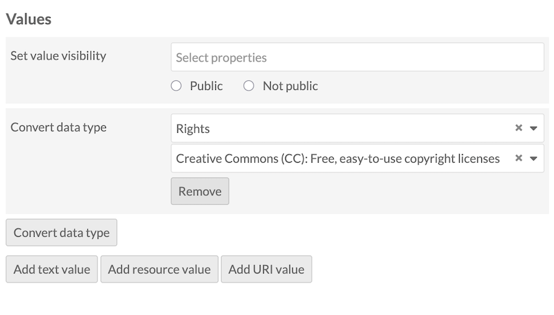
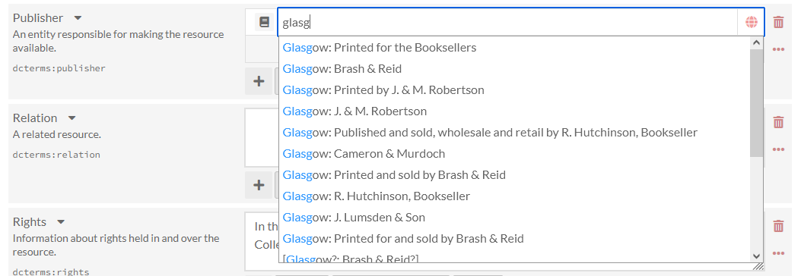

# Value Suggest

The [Value Suggest module](https://omeka.org/s/modules/ValueSuggest){target=_blank} adds an auto-complete feature to properties in resource templates, and draws on published controlled vocabularies (see the end of this page for a complete list) to help users fill them out. Users can, for example, fill out the "Subject" field in Dublin Core with terms from the Library of Congress Subject Headings. 

When a user is editing the metadata of a resource (an item, a piece of media, or an item set) that uses the Value-Suggest-enabled resource template, they can choose from a vocabulary's options. It functions as a [data type](../content/resource-template.md#data-types), but works like a modification to a text field: a user can start typing and select a suggestion from the dropdown, or ignore the dropdown and type in a textual entry.

Value Suggest comes packaged with many popular vocabularies - see the list below. Some examples: VIAF, PBCore for publishing information, RDA for multimedia, RightsStatements, and Creative Commons licenses. The module supplies terms in a number of languages. 

This module also allows any field to [suggest values already stored in that property across the entire Omeka installation](#internal-suggestions). You can choose to narrow the suggested values to ones from resources with the same class, or ones from resources using the same resource template, to limit the number of suggestions and make them more relevant. 

This feature helps encourage consistent metadata input and data compatibility with other databases. Note that Value Suggest offers, but cannot require, terms from the autosuggest feature. Users will always have the option of creating their own text value instead.

## Suggest values via resource templates

Value Suggest vocabularies are applied through resource templates. For additional information on resource templates, see the [resource template documentation](../content/resource-template.md).

1. From the Resource Templates page in the admin dashboard, either add a new [template](../content/resource-template.md) or edit an existing one.
1. Add the property to which you want to offer a Value Suggest vocabulary. 
1. Once the property is added to the template, click the pencil/edit icon for that property.
1. At the bottom of the drawer which opens on the right, open the "Data type" dropdown. Below the standard options, you will see the Value Suggest options. Select the vocabulary you want to use from the dropdown. Note that you can add alternate labels and comments for the property in this drawer.
1. Click the "Set changes" button at the bottom of the drawer to assign the values to the property. 
1. Save changes to the resource template. 

When you click the title of a resource template to see its details, the Value Suggest vocabulary will appear under the Data type table heading.

## Suggest values for resources

When a Value Suggest resource template is used for an item, media, or item set, the designated properties will auto-suggest values from the vocabulary specified in the template. 

Users must start typing in the open text box of that specific property to prompt the auto-suggest feature. There may be a slight delay, but a drop-down menu will appear with choices drawn directly from the authority or vocabulary list you have associated with that property. In some cases, your text will search behind-the-scenes values: for example, ROR will display organization names with matching acronyms; ORCID will display researcher names that match an ORCID ID you have entered. 

Hover over selections in the dropdown menu for a description of that vocabulary.

After selecting a value, a box containing a URL should appear under the value. This link will direct visitors to a webpage with additional information on the value selected. This box can be removed by clicking the "X".

### Batch-apply vocabularies

You can also apply Value Suggest vocabularies as data types to existing resources' **existing property values**, whether or not they are using any resource template. This will **not** set a Value Suggest data type onto the resources' property for future use, the way a resource template does. 

This can convert an existing text or URI value into a recognized Value Suggest value from one of its vocabularies. For example, you may have manually entered in RightsStatements URIs into the copyright field of many items, and now wish to convert those values into one of the structured entries from Value Suggest's RightsStatements "data type" to match future entries. 

This conversion may work with text values. Value Suggest looks for the text string to match a URL format (for example, "https://creativecommons.org/licenses/by/4.0/"). If your values are in URI form, Value Suggest will look to match either the URI value or the label text string.

To do so, select the desired resources and batch-edit them. Look for the "Convert data type" button near the bottom of the form, in the "Values" section. Select the property (for example, "Rights" under Dublin Core) and then choose the Value Suggest vocabulary from the "Data type" dropdown (for example, Creative Commons or RightsStatements). 

When converting an existing value into a Value Suggest data type, **the structured label will not be imported** from the source vocabulary into your metadata fields. If using URIs, your existing labels will be preserved, or if the label fields are empty, that will persist. If using text values, the URI will be preserved and converted into a URI, but the label field will be empty.

You can see whether the data-type conversion has succeeded when looking at the item in the admin interface. The original value, whether text (no link) or URI (link with an external-website icon to the right), should now appear as a link with no icon. 

We recommend checking the conversion success by going into editing mode on the resources after the process has completed, and checking that the value is now showing the correct Value Suggest dropdown when clicked on. You can select the appropriate vocabulary-provided label at this time. 

## Internal suggestions

This module offers the ability to suggest values currently stored in your Omeka installation, that is, where a resource already has the value in a property:

- Omeka: Property (values of the same property, for example `dcterms:creator`)
- Omeka: Property / Resource template (values of the same property that are being used by items that share the same resource template, for example "Base resource")
- Omeka: Property / Resource class (values of the same property that are being used by items that share the same class, for example `dctype:StillImage`).

## Available vocabularies

This module includes the following vocabularies:

- Creative Commons
- Dublin Core
- Gemeinsame Normdatie (GND)
- GeoNames
- The Getty Vocabularies
- Homosaurus
- IdRef
- Library of Congress Linked Data Service
- Nomenclature
- Nuovo Soggettario
- OCLC Metadata Services
- ORCID (Open Researcher and Contributor ID)
- PBCore Controlled Vocabularies
- PACTOLS of Frantiq
- PeriodO
- RDA Value Vocabularies
- RightsStatements.org
- Research Organization Registry (ROR)
- Tesauros del patrimonio cultural de España
- UNESCO
- Les vocabulaires du Ministère de la Culture
- Thesaurus de la Universitat de Barcelona (THUB).

Note that the [NDE Termennetwerk vocabularies are now available as a separate module](ndetermennetwerk.md). That module requires Value Suggest to be installed and active.

!!! note
	Some vocabularies appear in multiple languages in the list below: for example, Homosaurus (in English) is listed separately from the Dutch translation of Homosaurus found in the [NDE Termennetwerk module](ndetermennetwerk.md). Search the list and refer to the services to see which languages they support. We have indicated languages here for services that serve primarily one (non-English) language.

### [Creative Commons (CC)](https://creativecommons.org/share-your-work/cclicenses/)

- Provides a standardized way to grant the public permission to use their creative work under copyright law.

### [Dublin Core (DCMI Metadata Terms)](https://www.dublincore.org/specifications/dublin-core/dcmi-terms/){target=_blank}

- Classes
- Elements
- Terms
- Types.

### [Gemeinsame Normdatei (GND)](http://lobid.org/gnd){target=_blank} (`de`)

- The GND contains standardized entries for persons, corporations, congresses, geographical areas, keywords and work titles.

### [GeoNames](http://www.geonames.org/){target=_blank}

- The GeoNames geographical database
- GeoNames features.

### [The Getty Vocabularies](https://www.getty.edu/research/tools/vocabularies/index.html){target=_blank}

- The Art & Architecture Thesaurus (AAT)
- The Getty Thesaurus of Geographic Names (TGN)
- The Union List of Artist Names (ULAN)
- Cultural Objects Name Authority (CONA)
- Getty Iconography Authority (IA).

### [Homosaurus](http://homosaurus.org/){target=_blank}

- Homosaurus.org linked data vocabulary.

### [IdRef](https://www.idref.fr/){target=_blank} (`fr`)

- The French national database of identifiers for research (all repositories)
- Person names
- Collectivities (Corporations)
- Conferences
- Subject headings (all)
- Subject headings [RAMEAU](https://rameau.bnf.fr){target=_blank} (Répertoire d’autorité-matière encyclopédique et alphabétique unifié, or Unified encyclopaedic and alphabetical list of subject authorities)
- Subject headings [F-MeSH](http://mesh.inserm.fr/FrenchMesh){target=_blank} (French version of the medical subject headings)
- Geographic names
- Family names
- Titles
- Authors-Titles
- Trademarks
- PPN (unique identifier used for any item in all the database)
- Libraries (RCR: Répertoire des centres de ressources).

### [Library of Congress Linked Data Service](http://id.loc.gov/){target=_blank}

- All
- Subject Headings
- Name Authority File (LCNAF)
- Classification
- Children's Subject Headings
- Genre/Form Terms (LCGFT)
- Medium of Performance Thesaurus for Music
- Demographic Group Terms
- Thesaurus for Graphic Materials
- AFS Ethnographic Thesaurus
- Cultural Heritage Organizations
- ISO639-1 Languages
- ISO639-2 Languages
- ISO639-5 Languages
- MARC Countries
- MARC Geographic Areas
- MARC Languages
- MARC Relators
- LC Rare Materials Cataloging.

### [Nomenclature for Museum Cataloging](https://page.nomenclature.info/apropos-about.app?lang=en){target=_blank}

- All
- Category 01: Built Environment Objects
- Category 02: Furnishings
- Category 03: Personal Objects
- Category 04: Tools & Equipment for Materials
- Category 05: Tools & Equipment for Science & Technology
- Category 06: Tools & Equipment for Communication
- Category 07: Distribution & Transportation Objects
- Category 08: Communication Objects
- Category 09: Recreational Objects
- Category 10: Unclassifiable Objects.

### [Nuovo Soggettario](https://thes.bncf.firenze.sbn.it/){target=_blank} (`it`)

- Agenti: Organismi
- Agenti: Organizzazioni
- Agenti: Persone e gruppi
- Azioni: Attività
- Azioni: Discipline
- Azioni: Processi
- Cose: Forme
- Cose: Materia
- Cose: Oggetti
- Cose: Spazio
- Cose: Strumenti
- Cose: Strutture
- Tempo.

### [OCLC Metadata Services](https://www.oclc.org/en/services/a-z.html/:F2664:/){target=_blank}

- The Virtual International Authority File (VIAF)
- Faceted Application of Subject Terminologies (FAST).

### [ORCID (Open Researcher and Contributor ID)](https://info.orcid.org/){target=_blank}

- ORCID. Search by name or by entering in an ORCID number and selecting the name from the dropdown.

### [PBCore Controlled Vocabularies](https://pbcore.org/pbcore-controlled-vocabularies)

- pbcoreAssetType
- @dateType
- @titleType
- @descriptionType
- pbcoreRelationType
- instantiationRelationType
- creatorRole and contributorRole
- publisherRole
- instantiationPhysical: Audio
- instantiationPhysical: Film
- instantiationPhysical: Video
- instantiationMediaType
- instantiationGenerations.

### [PACTOLS of Frantiq](https://pactols.frantiq.fr/){target=_blank} (`fr`)
 
- The entire PACTOLS thesaurus
- The subject group only.

### [PeriodO](http://perio.do/en/){target=_blank}

- A gazetteer of period definitions for linking and visualizing data.

### [RDA Value Vocabularies](http://www.rdaregistry.info/termList/){target=_blank}

#### RDA Reference value vocabularies

- Aspect Ratio Designation
- Bibliographic Format
- Broadcast Standard
- Carrier Extent Unit
- Carrier Type
- Cartographic Data Type
- Colour Content
- Configuration of Playback Channels
- Content Type
- Conventional Collective Title
- File Type
- Font Size
- Form of Musical Notation
- Form of Notated Movement
- Form of Tactile Notation
- Format of Notated Music
- Frequency
- Generation
- Groove Pitch of an Analog Cylinder
- Groove Width of an Analog Disc
- Illustrative Content
- Layout
- Material
- Media Type
- Mode of Issuance
- Polarity
- Presentation Format
- Production Method
- Recording Medium
- Reduction Ratio Designation
- Regional Encoding
- Scale Designation
- Sound Content
- Special Playback Characteristics
- Status of Identification
- Terms
- Track Configuration
- Type of Recording
- Video Format.

#### RDA Local value vocabularies

- Gender.

#### RDA/ONIX Framework value vocabularies

- Character
- Extension Mode
- Extension Requirement
- Extension Termination
- Housing Format
- Image Dimensionality
- Image Movement
- Interaction
- Intermediation Tool
- Revision Mode
- Revision Requirement
- Revision Termination
- Sensory Mode
- Storage Medium Format.

### [RightsStatements.org](https://rightsstatements.org/){target=_blank}

- Standardized rights statements for cultural heritage institutions that can be used to communicate the copyright and re-use status of digital objects to the public.

### [Research Organization Registry (ROR)](https://ror.org/){target=_blank}

- The Research Organization Registry (ROR) is a global, community-led registry of open persistent identifiers for research organizations.

### [Tesauros del patrimonio cultural de España](http://tesauros.mecd.es/tesauros){target=_blank} (`es`)

- Diccionario de Bienes Culturales
- Diccionario de Materias
- Diccionario de Técnicas
- Diccionario de Contextos Culturales
- Diccionario Geográfico
- Diccionario de Toponimia Histórica
- Diccionario de Cerámica
- Diccionario de Numismática
- Diccionario de Mobiliario.

### [UNESCO](http://skos.um.es/){target=_blank} (`es`)

- Tesauro
- Nomenclatura de Ciencia y Tecnología
- Biblioteca Digital Floridablanca.

### [Les vocabulaires du Ministère de la Culture](http://data.culture.fr/thesaurus/){target=_blank} (`fr`)

- Catégories techniques et domaines - Inventaire/MH
- Domaines archivistiques pour l'indexation des circulaires
- Etat de conservation du patrimoine mobilier - Inventaire/MH
- Inscriptions, marques, emblématique et poinçons - Inventaire/MH
- Liste d'autorité Actions pour l'indexation des archives locales
- Liste d'autorité Contexte historique pour l'indexation des archives locales
- Liste d'autorité Typologie documentaire pour l'indexation des archives locales
- Liste d'autorités Auteurs - Joconde
- Liste d'autorités Domaines - Joconde
- Liste d'autorités Découverte - Joconde
- Liste d'autorités Dénomination - Joconde
- Liste d'autorités Genèse - Joconde
- Liste d'autorités Inscriptions - Joconde
- Liste d'autorités Lieux - Joconde
- Liste d'autorités Localisation - Joconde
- Liste d'autorités Périodes - Joconde
- Liste d'autorités Représentation - Joconde
- Liste d'autorités Sources de la représentation - Joconde
- Liste d'autorités Techniques – Joconde
- Liste d'autorités Utilisation - Joconde
- Liste d'autorités Écoles - Joconde
- Liste d'autorités Époques - Joconde
- Matériau de la couverture - Inventaire/MH
- Matériau du gros-oeuvre et mise en oeuvre - Inventaire/MH
- Matériaux et techniques du patrimoine mobilier - Inventaire/MH
- Nomenclatures HADOC
- Référentiel de communicabilité des archives publiques
- Stade de la création des objets mobiliers - Inventaire/MH
- Statut de la propriété des Biens culturels - Inventaire/MH
- Techniques photographiques
- Thésaurus de la désignation des objets mobiliers
- Thésaurus de la désignation des œuvres architecturales et des espaces aménagés
- Thésaurus-matières pour l'indexation des archives locales
- Type de la couverture - Inventaire/MH
- Type de protection MH - Inventaire/MH
- Vocabulaire des activités des entités productrices d'archives
- Vocabulaire des altérations
- Vocabulaire des domaines d'action ou objets des entités productrices d'archives
- Vocabulaire pour les techniques photographiques.

### [Thesaurus de la Universitat de Barcelona (THUB)](https://vocabularis.crai.ub.edu/ca/thub){target=_blank} (`es`)
 
- Thesaurus de la Universitat de Barcelona (THUB).

## Request more vocabularies

You can request that new vocabularies be added to this module. Get in touch with the Omeka team on [the module's dedicated GitHub repository](https://github.com/omeka-s-modules/ValueSuggest){target=_blank}, by creating an issue and sharing the vocabularies you would like to see added. 

You may be interested in using or forking [the NDE Termennetwerk module](https://github.com/omeka-s-modules/NdeTermennetwerk/){target=_blank}, which is a fork of this module specifically for supplying [Dutch Digital Heritage Network terms](https://termennetwerk.netwerkdigitaalerfgoed.nl/en){target=_blank}. 
