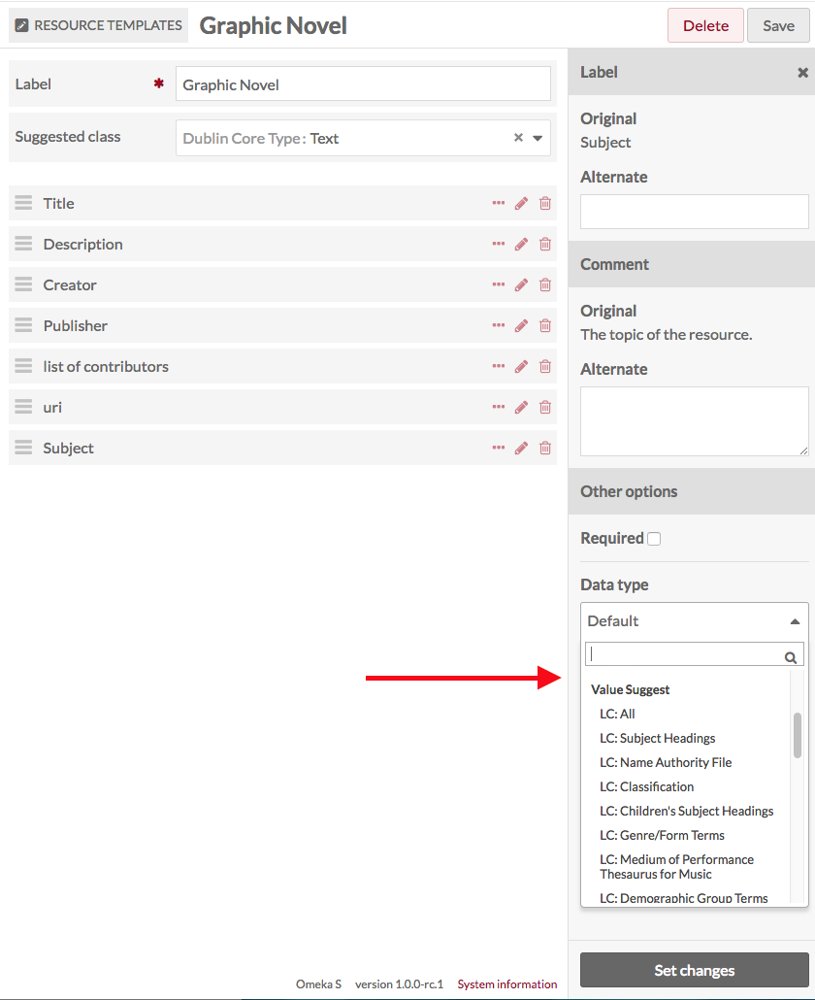
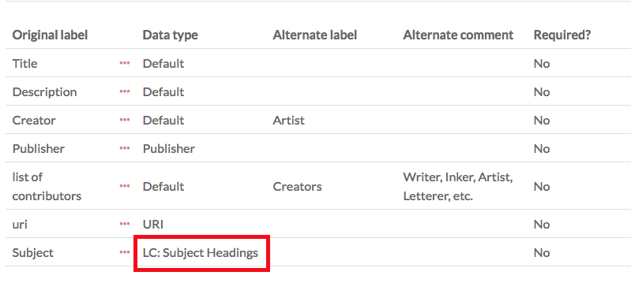
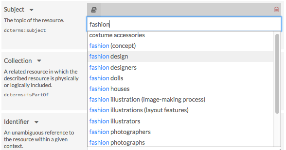
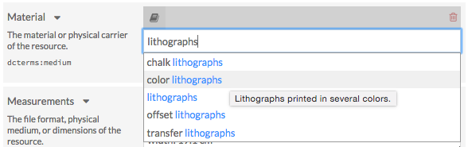
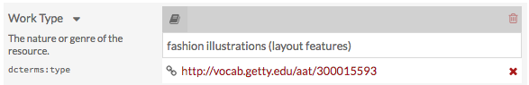

# Value Suggest

The [Value Suggest module](https://omeka.org/s/modules/ValueSuggest){target=_blank} adds an auto-complete feature to specific properties in a resource template, and draws on controlled vocabularies (see the end of this page for a complete list) to help users fill them out. Value Suggest appears when a user is editing the metadata of a resource (an item, a piece of media, or an item set) that uses the enabled resource template.

This functionality helps those building an Omeka site encourage consistent metadata input and data compatibility with other databases of records. Note that Value Suggest offers, but cannot require, that users select values from the autosuggest feature. Users will always have the option of creating their own value instead.

## Add suggestions to a resource template

Value Suggest vocabularies are applied through resource templates. For additional information on resource templates, see the [resource template documentation](../content/resource-template.md).

1. From the Resources templates page in the admin dashboard, either add a new [template](../content/resource-template.md) or edit an existing one.
2. Add the property to which you want to apply the Value Suggest. 
3. Once the property is added to the template, click the pencil/edit icon for that property.
4. At the bottom of the drawer which opens on the right, open the "Data type" dropdown. Below the standard options, you will see the Value Suggest options. Select the vocabulary you want to use from the dropdown. Note that you can add alternate labels and comments for the property in this drawer.
6. Click the "Set changes" button at the bottom of the drawer to assign the values to the property. 
7. Save changes to the resource template. 

When you click the title of a resource template to see its details, the Value Suggest vocabulary will appear under the Data type table heading.

## Adding Value Suggest to resources

When a Value Suggest resource template is used in an item, media, or item set, the designated properties will auto-suggest values from the vocabulary specified in the template. 

Users must start typing in the open text box of that specific property to prompt the auto-suggest feature. There may be a slight delay, but a drop-down menu will appear with choices drawn directly from the authority or vocabulary list you have associated with that property.

Hover over selections in the dropdown menu for a description of that vocabulary.

After selecting a value, a box containing a URL should appear under the value. This link will direct visitors to a webpage with additional information on the value selected. This box can be removed by clicking the "X".

## Available vocabularies

This module includes the following vocabularies:

- Dublin Core
- Gemeinsame Normdatie (GND)
- GeoNames
- The Getty Vocabularies
- Homosaurus
- IdRef
- Library of Congress Linked Data Service
- Nuovo Soggettario
- OCLC Metadata Services
- PACTOLS of Frantiq
- PeriodO
- RDA Value Vocabularies
- RightsStatements.org
- Tesauros del patrimonio cultural de España
- UNESCO
- Les vocabulaires du Ministère de la Culture.

### [Dublin Core (DCMI Metadata Terms)](https://www.dublincore.org/specifications/dublin-core/dcmi-terms/){target=_blank}

- Classes
- Elements
- Terms
- Types.

### [Gemeinsame Normdatei (GND)](http://lobid.org/gnd){target=_blank}

- The GND contains standardized entries for persons, corporations, congresses, geographical areas, key words and work titles.

### [GeoNames](http://www.geonames.org/){target=_blank}

- The GeoNames geographical database.

### [The Getty Vocabularies](http://vocab.getty.edu/){target=_blank}

- The Art & Architecture Thesaurus (AAT)
- The Getty Thesaurus of Geographic Names (TGN)
- The Union List of Artist Names (ULAN).

### [Homosaurus](http://homosaurus.org/){target=_blank}

- Homosaurus.org linked data vocabulary.

### [IdRef](https://www.idref.fr/){target=_blank}

- The French national database of identifiers for research (all repositories)
- Person names
- Corporations
- Conferences
- Subject headings (all)
- Subject headings [RAMEAU](https://rameau.bnf.fr){target=_blank} (Répertoire d’autorité-matière encyclopédique et alphabétique unifié, or Unified encyclopaedic and alphabetical list of subject authorities)
- Subject headings [F-MeSH](http://mesh.inserm.fr/FrenchMesh){target=_blank} (French version of the medical subject headings)
- Geographic names
- Family names
- Titles
- Author-Titles
- Trademarks
- PPN (unique identifier used for any item in all the database)
- Libraries (RCR: Répertoire des centres de ressources).

### [Library of Congress Linked Data Service](http://id.loc.gov/){target=_blank}

- AFS Ethnographic Thesaurus
- All
- Children's Subject Heading
- Classification
- Cultural Heritage Organizations
- Demographic Group Terms
- Genre/Form Terms
- ISO639-1 Languages
- ISO639-2 Languages
- ISO639-5 Languages
- MARC Countries
- MARC Geographic Areas
- MARC Languages
- MARC Relators
- Medium of Performance Thesaurus for Music
- Name Authority File
- Subject Headings
- Thesaurus for Graphic Materials.

### [Nuovo Soggettario](https://thes.bncf.firenze.sbn.it/){target=_blank}

- Agenti: Organismi
- Agenti: Organizzazioni
- Agenti: Persone e gruppi
- Azioni: Attività
- Azioni: Discipline
- Azioni: Processi
- Cose: Forme
- Cose: Materia
- Cose: Oggetti
- Cose: Spazio
- Cose: Strumenti
- Cose: Strutture
- Tempo.

### [OCLC Metadata Services](https://www.oclc.org/en/services/a-z.html/:F2664:/){target=_blank}

- Faceted Application of Subject Terminologies (FAST)
- The Virtual International Authority File (VIAF).

### [PACTOLS of Frantiq](https://pactols.frantiq.fr/){target=_blank}

- The entire PACTOLS thesaurus
- The subject group only.

### [PeriodO](http://perio.do/en/){target=_blank}

- A gazetteer of period definitions for linking and visualizing data.

### [RDA Value Vocabularies](http://www.rdaregistry.info/termList/){target=_blank}

#### RDA Reference value vocabularies

- Aspect Ratio Designation
- Bibliographic Format
- Broadcast Standard
- Carrier Extent Unit
- Carrier Type
- Cartographic Data Type
- Colour Content
- Configuration of Playback Channels
- Content Type
- Conventional Collective Title
- File Type
- Font Size
- Form of Musical Notation
- Form of Notated Movement
- Form of Tactile Notation
- Format of Notated Music
- Frequency
- Generation
- Groove Pitch of an Analog Cylinder
- Groove Width of an Analog Disc
- Illustrative Content
- Layout
- Material
- Media Type
- Mode of Issuance
- Polarity
- Presentation Format
- Production Method
- Recording Medium
- Reduction Ratio Designation
- Regional Encoding
- Scale Designation
- Sound Content
- Special Playback Characteristics
- Status of Identification
- Terms
- Track Configuration
- Type of Recording
- Video Format.

#### RDA Local value vocabularies

- Gender.

#### RDA/ONIX Framework value vocabularies

- Character
- Extension Mode
- Extension Requirement
- Extension Termination
- Housing Format
- Image Dimensionality
- Image Movement
- Interaction
- Intermediation Tool
- Revision Mode
- Revision Requirement
- Revision Termination
- Sensory Mode
- Storage Medium Format.

### [RightsStatements.org](https://rightsstatements.org/){target=_blank}

- Provides a set of standardized rights statements for cultural heritage institutions that can be used to communicate the copyright and re-use status of digital objects to the public.

### [Tesauros del patrimonio cultural de España](http://tesauros.mecd.es/tesauros){target=_blank}

- Diccionario de Bienes Culturales
- Diccionario de Materias
- Diccionario de Técnicas
- Diccionario de Contextos Culturales
- Diccionario Geográfico
- Diccionario de Toponimia Histórica
- Diccionario de Cerámica
- Diccionario de Numismática
- Diccionario de Mobiliario.

### [UNESCO](http://skos.um.es/){target=_blank}

- Tesauro
- Nomenclatura de Ciencia y Tecnología
- Biblioteca Digital Floridablanca.

### [Les vocabulaires du Ministère de la Culture](http://data.culture.fr/thesaurus/){target=_blank}

- Catégories techniques et domaines - Inventaire/MH
- Domaines archivistiques pour l'indexation des circulaires
- Etat de conservation du patrimoine mobilier - Inventaire/MH
- Inscriptions, marques, emblématique et poinçons - Inventaire/MH
- Liste d'autorité Actions pour l'indexation des archives locales
- Liste d'autorité Contexte historique pour l'indexation des archives locales
- Liste d'autorité Typologie documentaire pour l'indexation des archives locales
- Liste d'autorités Auteurs - Joconde
- Liste d'autorités Domaines - Joconde
- Liste d'autorités Découverte - Joconde
- Liste d'autorités Dénomination - Joconde
- Liste d'autorités Genèse - Joconde
- Liste d'autorités Inscriptions - Joconde
- Liste d'autorités Lieux - Joconde
- Liste d'autorités Localisation - Joconde
- Liste d'autorités Périodes - Joconde
- Liste d'autorités Représentation - Joconde
- Liste d'autorités Sources de la représentation - Joconde
- Liste d'autorités Techniques – Joconde
- Liste d'autorités Utilisation - Joconde
- Liste d'autorités Écoles - Joconde
- Liste d'autorités Époques - Joconde
- Matériau de la couverture - Inventaire/MH
- Matériau du gros-oeuvre et mise en oeuvre - Inventaire/MH
- Matériaux et techniques du patrimoine mobilier - Inventaire/MH
- Nomenclatures HADOC
- Référentiel de communicabilité des archives publiques
- Stade de la création des objets mobiliers - Inventaire/MH
- Statut de la propriété des Biens culturels - Inventaire/MH
- Techniques photographiques
- Thésaurus de la désignation des objets mobiliers
- Thésaurus de la désignation des œuvres architecturales et des espaces aménagés
- Thésaurus-matières pour l'indexation des archives locales
- Type de la couverture - Inventaire/MH
- Type de protection MH - Inventaire/MH
- Vocabulaire des activités des entités productrices d'archives
- Vocabulaire des altérations
- Vocabulaire des domaines d'action ou objets des entités productrices d'archives
- Vocabulaire pour les techniques photographiques.
