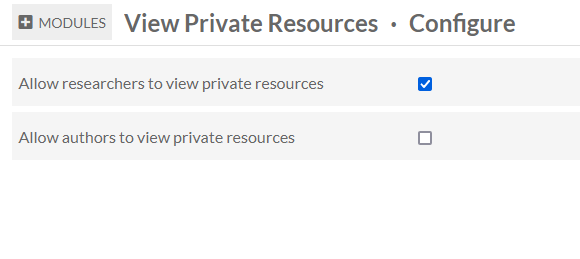

# View Private Resources

The [View Private Resources module](https://omeka.org/s/modules/ViewPrivateResources){target=_blank} allows installation administrators to change permissions for users at the Author and Researcher level. Specifically it allows either, or both, of these user levels to see view resources (items, media, and item sets) that are set to private. 

[Logged-in users at any level](../admin/users.md#roles-and-permissions) can always view resources that they own (that is, that they have created or have had transferred to them), whether those resources are private or public. By default, Authors and Researchers cannot see non-public resources owned by others; all other user levels can see private resources. Using this module can change these two settings so that Authors and/or Researchers will have the ability to view (but not edit) private resources owned by other users.

## Change visibility settings

This module can be configured from the Modules page. The "Configure" button appears in the module's row. The module offers two options: "Allow researchers to view private resources" and "Allow authors to view private resources." Each has a checkbox. Be sure to save your changes at the top right of the page.