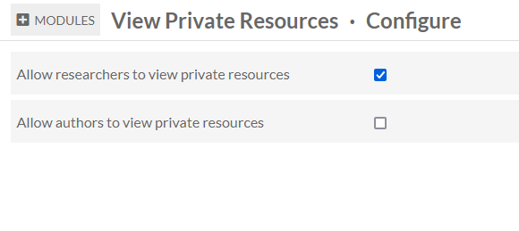

# View Private Resources

The [View Private Resources module](https://omeka.org/s/modules/ViewPrivateResources){target=_blank} allows installation administrators to change permissions for users at the Author and Researcher level. It allows either, or both, of these user levels to see view resources (items, media, and item sets) set to private. 

[Logged-in users at any level](../admin/users.md#roles-and-permissions) can always view resources that they own. That is, that they have created or have had transferred to them. This is true whether those resources are private or public. By default, Authors and Researchers cannot see non-public resources owned by others. All other user levels can see private resources. This module can change these two settings. This gives Authors and/or Researchers the ability to view (but not edit) private resources owned by other users.

## Change visibility settings

Configure this module from the Modules page. The "Configure" button appears in the module's row. The module offers two options. One is "Allow researchers to view private resources". Another is "Allow authors to view private resources." Each has a checkbox. Be sure to save your changes at the top right of the page.