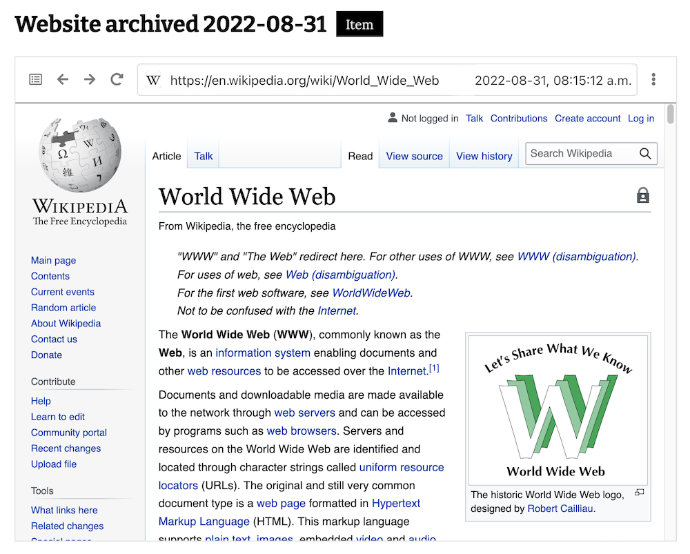
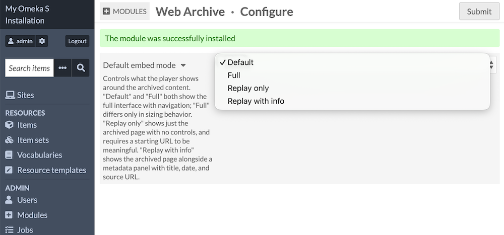
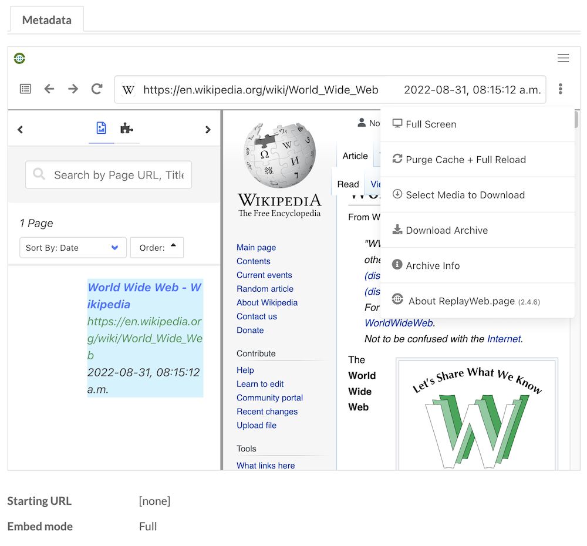
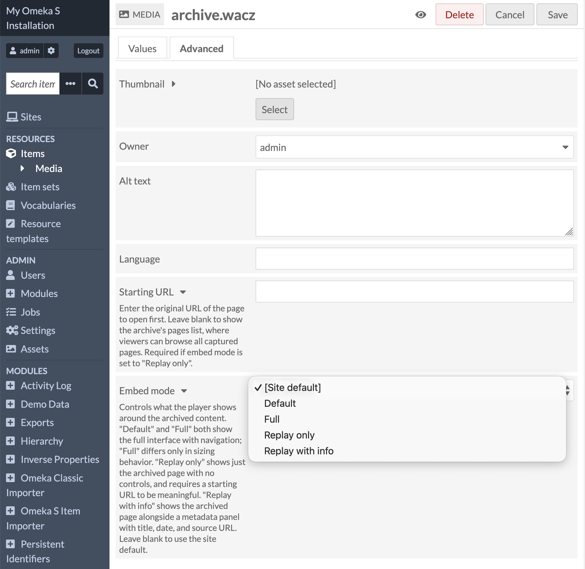

# Web Archive

The [Web Archive module](https://omeka.org/s/modules/WebArchive){target=_blank} adds support for ingesting and replaying web archive files as media. Web archives are captures of web pages or entire sites at a point in time. The module uses the [ReplayWeb.page player](https://replayweb.page/){target=_blank} to replay them in embedded players inside Omeka S public pages. 

## Server requirements

This player loads archive files using HTTP Range requests. If your server applies `Content-Encoding` to a web archive file, playback will fail.

This most often affects uncompressed `.warc` files, since `.wacz` and `.warc.gz` are already compressed and are usually left alone. When the module detects this condition, it shows an error message instead of a broken player. See the [developer documentation page for this module](https://omeka.org/s/docs/developer/module_docs/WebArchive/){target=_blank} on Github for more technical information about resolving this error if you see it. 

Web archive files can get quite large, so ensure your server settings are configured to enable large files (20MB+).

## Configuration

When the module is first installed, you will see the Configuration screen. You will be prompted to set a "Default embed mode", which will take effect for every web archive ingested into the installation. This setting can be overridden with individual embeds. 

The default embed mode controls what the player shows around the archived content. There are [four choices, derived from ReplayWeb.page's options](https://replayweb.page/docs/embedding/#embed-modes){target=_blank}:

- "Default" shows the replayable website in a browser-like frame with a location bar showing the captured URL. Users can access the list of pages/URLs in the archive and can navigate to other pages. There are buttons for downloading the archive file and information about the file size and source.
- "Full" adds a topmost bar with the ReplayWeb.page logo to the default display. 
- "Replay only" shows no browser-like controls, and requires a starting URL to be meaningful. (See below.) This is useful for embedding just a single page. Users can still attempt to navigate inside the archive file by clicking links to other pages. 
- "Replay with info" shows the archived page as in "Replay only". At the top of the frame is a dropdown menu that will display the same information available in other views: a download link, the file size, and information about when it was recorded.

A web archive set to "Full" mode:

A web archive set to "Replay with info" mode:

## Upload a web archive

Web archive files can be uploaded as media attached to items. They can also be ingested by providing a URL to a publicly available online web archive, such as [the example file provided by WebRecorder](https://webrecorder.github.io/example-webarchive/items/wikipedia/){target=_blank} at [this URL](https://webrecorder.github.io/example-webarchive/items/wikipedia/archive.wacz) (3.7MB). 

Depending on the file size, Omeka may take some time to ingest the media.

Once a web archive is uploaded, the player should appear immediately in the media page on the admin side, and be visible on any public sites that include the item. Check these links right away to ensure the file is playing as expected. If you see an error, see the above section on [Server requirements](#server-requirements). 

Note that an item with a web archive uploaded as its only media will not generate a thumbnail, but you can add one to the item manually. 

### Media configuration

Each web archive you upload or ingest as media has its own settings. Go to the media page in the admin interface, click the "Edit media" button, and go to the Advanced tab. You will see two fields specific to this file: 

- **Starting URL**: Enter the original URL of the page to open first. Leave blank to show the archive's pages list, where viewers can browse all captured pages. Required if embed mode is set to "Replay only". This URL can be found inside the player itself, by selecting a single page and copying the URL from the address bar. Once you enter that URL in this field, you can change the setting below to hide the address bar. Ensure this URL is exactly the same as what is found inside the archive file. 
- **Embed mode**: Controls what the player shows around the archived content. (See above.)

## Public display

On a public site, the web archive player will show in the ["Media render" or "Media embeds" resource blocks](../sites/site_theme.md#configure-resource-pages). You can "Configure resource pages" from the Theme settings page on each site. Note that the "Lightbox Gallery" will not display this player, so you may need to weigh each site's priorities for rendering its range of media on item view pages. Lightbox Gallery will generate a list of "Other media" that cannot be rendered in its player, so users can click on those links to view the web archive on the media page instead of the item page. 

Web archives can be embedded in Omeka S site pages using the "Media embed" block. Page blocks that use derivative images, such as the Item Carousel block, will not display the web archive player. 

## Troubleshooting

Upon installation, this module automatically adds `wacz`, `warc`, and `gz` to the installation's "Allowed file extensions" list, and `application/wacz`, `application/warc`, and `application/gzip` to the "Allowed media types" list. Double-check that these appear as expected. 