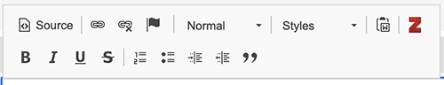
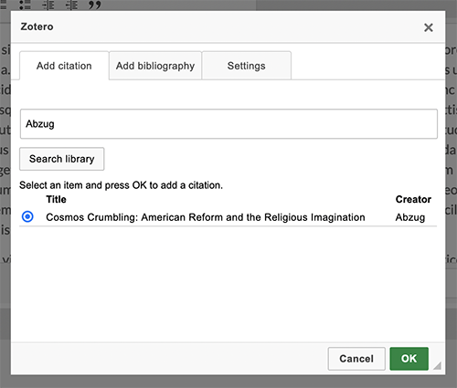

# Zotero Citations

The [Zotero Citation module](https://omeka.org/s/modules/ZoteroCitations/){target=_blank} allows users to access Zotero libraries to add citations using the built-in rich-text editor.

Once activated, users set up their Zotero access from their user settings. Their Zotero libraries will be accessible via HTML and other blocks on [site pages](../sites/site_pages.md). 

## Zotero Settings

The Zotero Citation module adds a number of configuration options to the User Settings page. These are default settings for the module.

- Citation style: Select from a dropdown menu of available citation formats.
- Bibliography locale: Select a language locale for rendering the citation and bibliography.
- Bibliography link wrap: Check this option if you would like URLs for bibliographies to wrap with the rest of the text of the entry.
- API library type: Select whether you would like to access a User library or a Group library.
- API library ID: Input the numerical id for the library you wish to access
- API key: If you wish to access a library that is not public, you will need to generate an API key from the Zotero account that owns the library. Input that key here.
- Search sort by: Select a sort field for search results when accessing your library: Title, Creator, or Data Modified.

## Accessing Zotero for Citations and Bibliographies

Within site pages, citations and bibliographies can be added to any element that has a rich-text editor, such as the [HTML Block](../sites/site_pages.md#html) or with captions for Items.

When the module is active, it will add a red "Z" icon to the rich-text editor. 

Place your cursor in the desired place in the editing window and click on the icon to open the Zotero selection dialog box that has three tabs: 

- **Add citation**: Search for the individual item using the text input. Click "Search library". Select an item entry from within the results. Only one citation can be added at a time. Click "Ok" to generate the citation in the editor.
- **Add bibliography**: If you have added a number of citations in the editor, you can position your cursor to generate a bibliography. Check the authorization box and click the **OK** button to produce the bibliography in the editor.
- **Settings**: Though you have entered default settings on your user page, you may wish to change those selections in the course of creating content. Here you can change your citation style, your biblography locale, your library type, your library ID, your API key if you are using one, and your sorting element. Adjusting the settings only changes them for the current citation/bibliography generation. Once you have adjusted the settings, return to the "Add citation" or "Add bibliograph" tabs to apply the settings to your desired actions.

