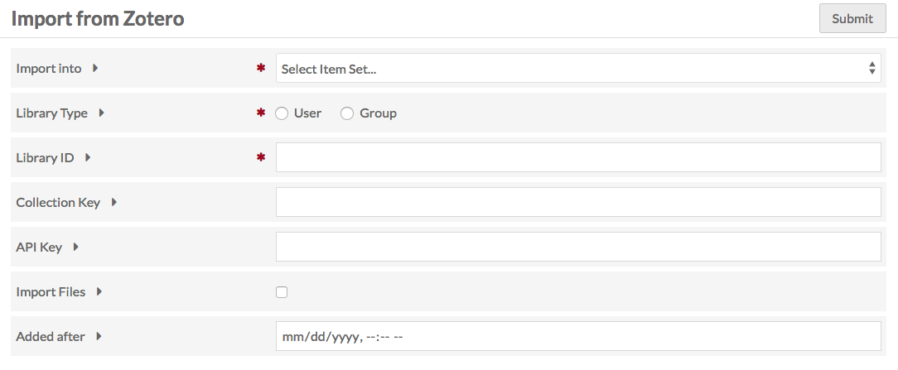
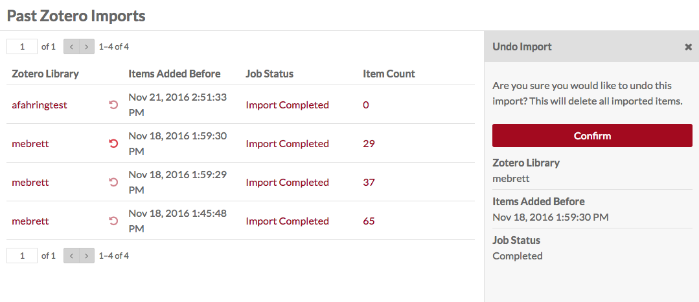

# Zotero Import

The [Zotero Import module](https://omeka.org/s/modules/ZoteroImport){target=_blank} allows you to connect an Omeka S instance to a Zotero library and import items from that library.

## Prepare your Zotero Library
In order to import from a Zotero library, you must have API access to the library. To use Zotero Import, you will need the ID for the group or user:

  * Individual IDs are found on the Feeds/API tab of your Zotero settings; there is a sentence stating “Your userID for use in API call is”.
  * Group IDs are found on the Zotero group library page by looking at the URL of the library - it will be `zotero.org/groups/<number>`. If you go to `https://api.zotero.org/groups/<numer>`, you should get some information on that page.

You may also want to have the ID for a specific collection and an API key to import files. 

* Collection keys appear in the url of a collection page - they are the alphanumeric sequence at the end of the url, following "collections/".
* To generate an API key, go to Settings in your Zotero account, to the Feeds/API tab, and click the *Create new private key* link.

## Import data

To import, go to the Zotero Import section on the left-hand navigation of the admin dashboard of your Omeka S install. This will automatically take you to the Import subsection, also in the left-hand navigation.

To import from a Zotero library:

* Choose an Item Set to which the imported items will be added (required). 
* Choose between **User** or **Group** libraries with the radio buttons (required). 
* Enter the Library ID (this is either the Group or User ID number, discussed above). 
* If importing a collection, enter the collection key.
* Enter your API key to import private data and/or files (optional for import but necessary to import files).
* Click the checkbox to import files. The API key is required to import files.
	* HTML page snapshots will be imported as zip files. 
*  The "Added After" option allows you to import only those Zotero items added to the library after the date and time you choose. You can use this as a way to update from a previous import without re-adding files you already imported.

When you have completed the form, click "Submit" in the upper right-hand corner of the browser window.

!!! note
	Are your jobs starting and not completing? You might need to [set the path for PHP](../configuration.md#php-path) so that your system can perform the background process to make the items.

A note on files: The rules for importing an item are the same as creating an item in Omeka, so if your Zotero library has files which are a disallowed media type, the items will not be imported.

The page will load on the Past Imports subsection with a message "Importing from Zotero". To check the status of the import, reload the page or click to the [Jobs section of the admin dashboard](../admin/jobs.md).

Managing past imports
---------------------------------
To view and manage past imports, click on the Zotero Import section in the left-hand navigation, and then click on the "Past Imports" subsection that appears when the menu expands.

The Past Imports page shows a table of previous imports, whether successful, failed on error, or undone. The table has the following columns:

- **Zotero Library**: giving the User or Group library name.
- The **Undo** button: a counter-clockwise curved arrow.
- **Items Added Before**: the date of the import.
- **Job Status**: current status of job. Clicking on the text of a job status will take you to that job's page.
- **Item Count**: the number of items added in the import.

To Undo an import, click the "Undo" button to the left of the **Items Added Before** timestamp. This will open a sidebar dialog asking you to confirm that you want to undo the import and delete all imported items. Click "Confirm" to continue. 

Past imports which have already been undone will have a job status of "Undo Import Completed".
