# Searching

There are search functions on both the administrative and public sides of Omeka S installations and sites.

## Administrative interface

### Basic search

There is a search field near the top of the left-hand menu, just underneath the user information. This search field works as a keyword search across all the properties of the resources.

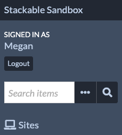

By default, this search operates on items in your installation. However, you can use the ellipsis (three dots) to open a menu and change the resource type being searched, selecting from Items, Item Sets, or Media.

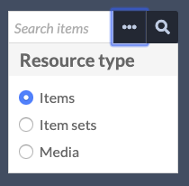

### Item advanced search

Advanced search for items only is available on the [Items](content/items.md) page, from the "Advanced Search" link above the table of items.

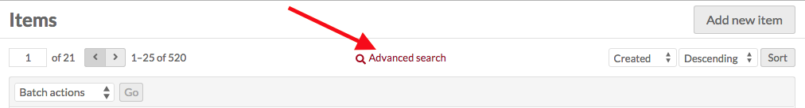

The advanced search loads on a new page, and has the following options:

- **Sort**: You can set how to display your results, based on the resource-specific columns you have set up in your user account. You can order each selection by ascending or descending.
- **Search full-text**: runs a full-text search on all of the text for every item in the installation.
- **Search by value**: search for a term or phrase which you enter.
	- The first selector allows you to specify a property to search.
	- The second selector allows you to set the relationship the property has with the value. The options are:
		- is exactly,
		- is not exactly,
		- contains,
		- does not contain,
		- is resource with ID,
		- is not resource with ID,
		- has any value (there is something in the property),
		- has no values,
		- has data type, or
		- does not have data type.
	- Enter the value you want the property to have. To find a resource ID, go to the resource and look at the URL in your browser's address bar. The numbers at the end of the URL are the resource ID.
- **Search by class**: select a class from the dropdown menu.
- **Search by template**: select a resource template from the dropdown. Templates are arranged by owner, then alphabetically. 
- **Search by item set**: Select whether the intended results are included in or excluded from the given item set. Pick an item set from the dropdown, or type to search. You can add multiple parameters; these will narrow the search (i.e., return all items that are not in set X AND also not in set Y; all items that are in set X AND also in set Y; all items that are in set X AND also not in set Y).
- **Search by site**: select a site from a dropdown of sites in the installation. Note that you can only search for items from one site at a time.
- **Search by media presence**: select whether the results have media or do not have media.
- **Search by owner**: select a user from a dropdown of users in the installation.
- **Search by visibility**: select whether the results are public or private items.
- **Search by ID**: enter a specific item identifier value, or a list of identifiers separated by commas (for example, "1, 5, 9, 12, 43, 44, 45"). Only works for exact matches, not with wildcards or ranges.

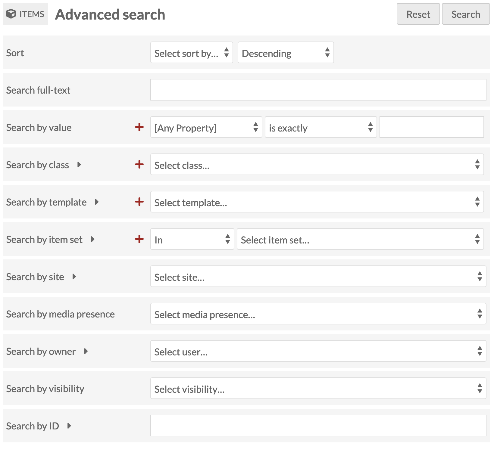

Other search fields may be introduced with modules that add new metadata fields to your items.

Searches by value, class, template, and item set allow you to search by more than one input - use the large red plus-sign icons to add more parameters. These search terms build - searching for two item sets will return all items in either item set, rather than only those items which are in both. You can remove those searches using the red trash can icon to the right of the lines.

You can reset your search terms at any time by using the "Reset" button on the upper right next to the "Search" button.

### Media advanced search
Advanced search for media is accessed from the [Media](content/media.md) browse page, from the **Advanced Search** link above the table of item sets.

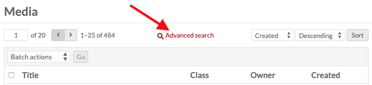

The advanced search loads on a new page, and has the following options:

- **Sort**
- **Search full-text**
- **Search by value**
- **Search by class**
- **Search by template**
- **Search by MIME type**: you can specify the media type for the search. For example, to find all TIFF images, you would enter `image/tiff`.
- **Search by owner**
- **Search by visibility**
- **Search by ID**: enter a specific media identifier value, or a list of identifiers separated by commas (for example, "1, 5, 9, 12, 43, 44, 45"). Only works for exact matches, not with wildcards or ranges.

### Item Set advanced search

Advanced search for item sets only is accessed on the [Item Sets](content/item-sets.md) page, from the "Advanced Search" link above the table of item sets.

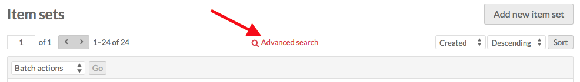

The advanced search loads on a new page, and has the following options:

- **Sort**
- **Search full-text**
- **Search by value**
- **Search by class**
- **Search by template**
- **Search by owner**
- **Search by visibility**
- **Search by ID**: enter a specific item set identifier value, or a list of identifiers separated by commas (for example, "1, 2, 5, 9"). Only works for exact matches, not with wildcards or ranges.

## Public views

The exact appearance of the search interface will vary based on the [theme](sites/site_theme.md) selected. The way search works is consistent regardless of theme.

### Basic search
There is a search bar near the menu for each site. In the default theme, it is located just beneath the main menu, as shown in the image below.

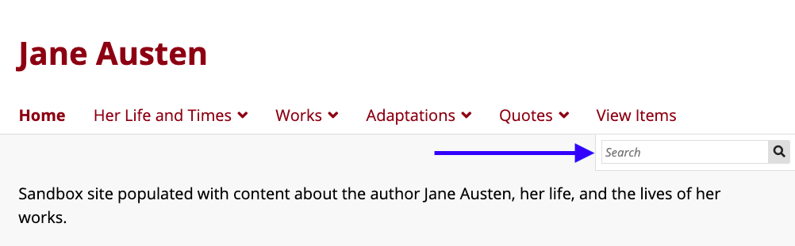

This search bar works as a full-text search for the whole site. It will search all of the items, item sets, and media as well as the content of every page published on the site. Results are sorted by type, grouping together page results and item or item set results. From the initial results page, you can view all the results for that type (page, item) using the "view all results" link.

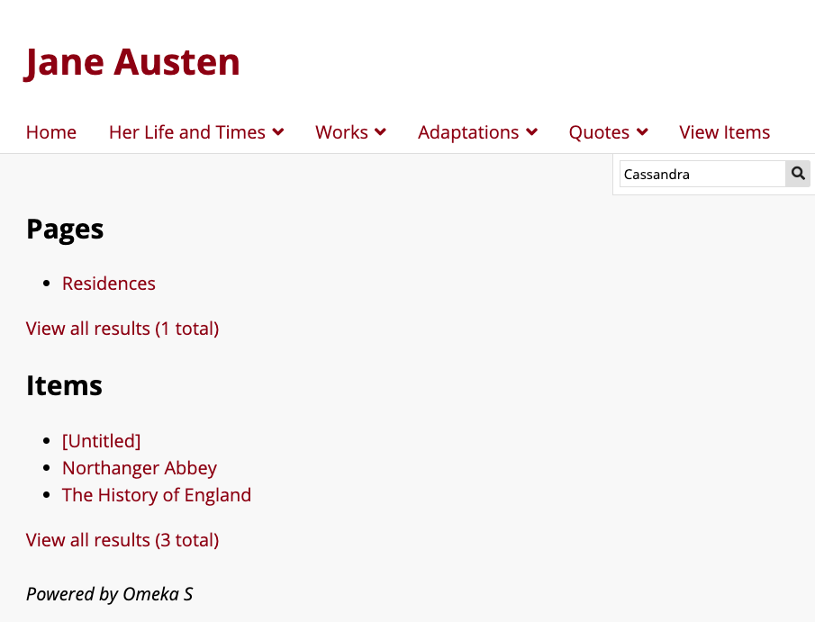

### Advanced item search
Site visitors can access an advanced item search from the Browse Items page, if you have that page accessible. There is a link for "Advanced search" between the pagination and the sort options at the top of the item browse table.

You can control advanced search settings on a site-by-site basis, from the [Site Settings tab](sites/site_settings.md#search). This will include advanced search fields introduced by modules.

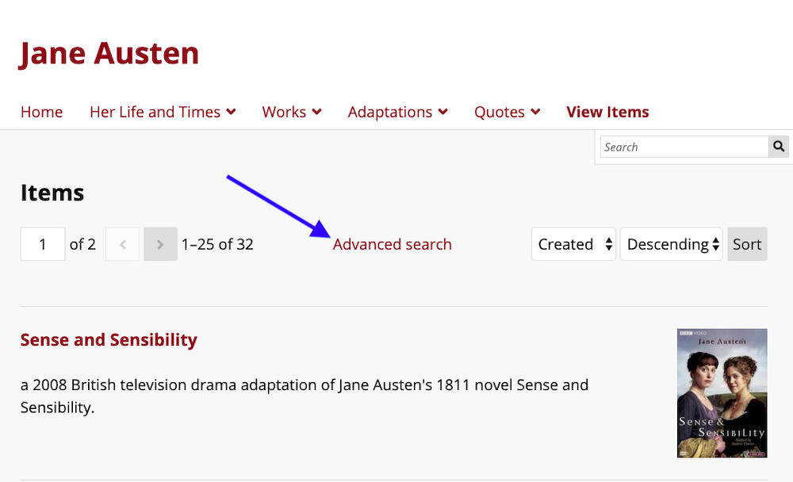

Clicking this loads a new page with four options for search:

- **Sort**
- **Search full-text**: runs a full-text search on all of the text for every item in the site.
- **Search by value**
	- Note that if you have have the [site set](sites/site_settings.md#search) to restrict search to templates, this will only display the properties used by those templates.
- **Search by class**
- **Search by item set**: The results will display the items inside one or more of the sets you chose.
- **Search by media presence**
- **Search by ID**.

Here is the default advanced search form in two themes - Thanks, Roy, and The Daily:

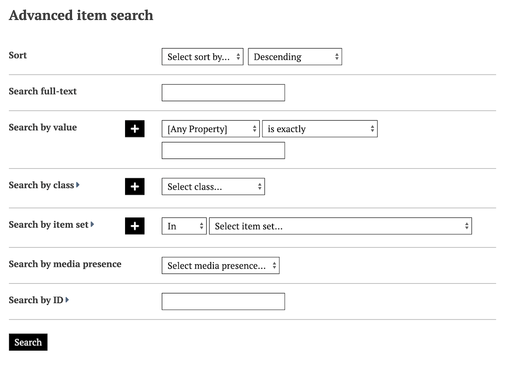

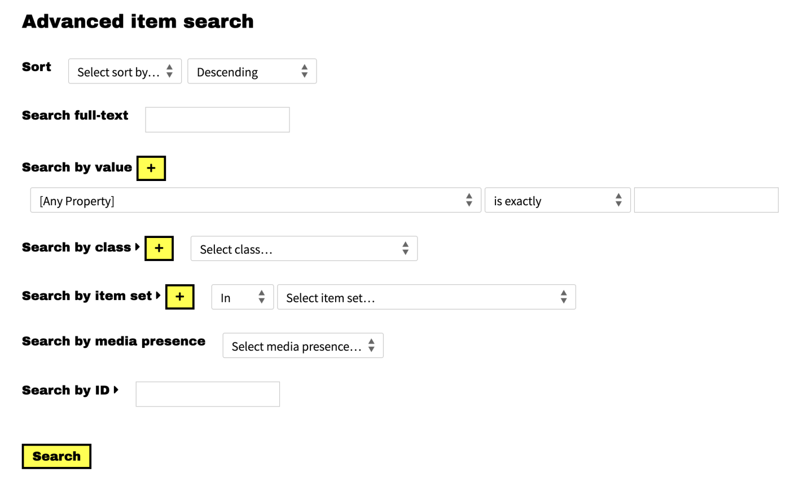

### Advanced item set search

Site visitors can access an advanced item set search from the Browse Items Sets page, if you have that page accessible. There is a link for Advanced search near the top of the Item Sets page.

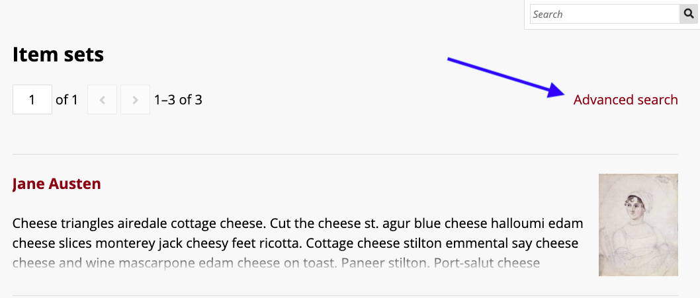

Clicking the advanced search link loads a new page with three options for search:

- **Sort**
- **Search full-text**
- **Search by value**
	- Note that if you have have the [site set](sites/site_settings.md#search) to restrict search to templates, this will only display the properties used by those templates.
- **Search by class**
- **Search by ID**.

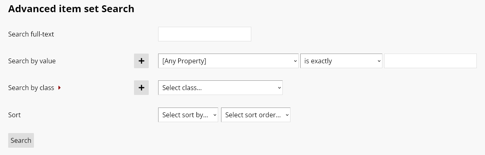

### Style the public views

You can style, hide, and emphasize search fields by using CSS. Each entry has a custom identifier, such as the `div` with "has_media_field", within the "advanced-search-content" class `div`. You can style these options using the [CSS Editor module](../modules/csseditor) or by modifying the code of your installation.  

## Sorting

All of the public and administrative browsing views and all search results can be ordered in a number of ways. To the top right of every browse or result table is two dropdowns and a "Sort" button. One allows you to select a field, and the other determines the order in which to sort them.

You can modify these default sorting orders for the public pages of sites in [Site settings](sites/site_settings.md#settings), and for the administrative pages on a user-by-user basis in [User settings](admin/users.md#admin-browse-defaults).

The default way most resources are ordered is by the interal Omeka identifier (ID), in reverse chronological order (Descending). This is true of items, media, and item sets. Sites, vocabularies, and resource templates are default ordered by Title or Label Ascending. Users are default ordered by Email Ascending. 

When a full-text search is performed, the results will be displayed by relevance, descending (most relevant results first). 

Ascending means A-Z alphabetically for text fields, earliest to latest for date-formatted fields such as Created (meaning the internal item creation date and time) and Modified (the date and time the item was last modified), and smallest to greatest for numbers such as Identifiers. Note that some fields (such as Dublin Core Date) may be text-formatted to include information such as "circa" and will sort alphabetically rather than as numbers (such as "1800-01-01") or dates. You may be using modules such as [Numeric Data Types](modules/numericdatatypes.md) that can modify these settings.

In both ascending and descending orders, empty fields will come at the end.