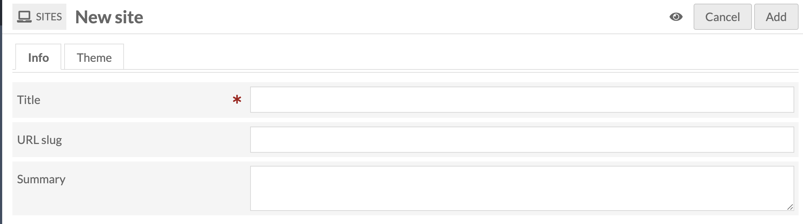
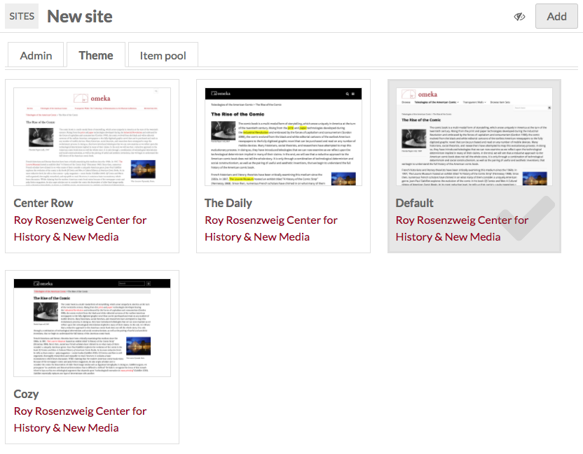

#  Sites Management

Sites are the public-facing side of an Omeka-S installation. With sites you can create content and interpretation around a group of items from your installation. 

Sites are managed and access via the *Sites* tab on the left-hand side of the administrative dashboard. 

The manage sites page displays a table with all the sites for the installation, giving the title and owner for each site. 

Use the two drop-downs on the right side above the table to sort sites. You can sort by *title*, *URL slug* or *owner*, either ascending or descending. Click the sort button to apply your choices. 

Above the table of sites, on the left, is the pagination for the item sets table, where you can click the left and right arrows to move forward and back or enter a page number to go a specific page of item sets.

Each row gives the title of a site, options to *view* (box with outward arrow), *edit* (pencil), or *delete* (trash can), and displays the owner of the site. *Only global admins and site owners can delete a site.*

Sites which are not public will have the private icon (an eye with a slash through it) display to the right of the site title. 

Clicking on the site title will take you to a summary page for the site which displays the site’s *url slug,* and *title,* from which you can return to the site list using a button on the left side of the scree, or *edit* or *view* the site using buttons in the upper right 

## Adding a site
To create a site, click the *Add new site* button in the upper right-hand corner of the site browse page.

The Add New Site page has three tabs: Admin, Theme, and Item Pool.

### The Admin tab
* Give your site a *title* (required)
* create a *slug* for the site’s url. The url will be *installurl/site/slug*. This is optional - if you leave this field blank, Omeka S will create a slug based on the site title.
* Create a *summary* for your site, a brief idea of what it is about which will appear on your installation's landing page and on [list of site blocks](../sites/site_pages/#page-blocks)

### The Theme tab
Select from the installed themes. Each theme appears as a button with a screenshot of the theme, the theme name, and a link to its creator. When a theme is selected, it will highlight slightly in gray and a checkbox will appear in the bottom right corner of the button.

### Publication settings
In the upper right hand corner of the screen, next to the *Add* button, you can set the visibility of your site using the the *make public/private* button (eye icon).

 Public 

  Private

You will probably want to leave the site Private until you have added some content.

### Add site
When you are ready, click the Add button in the upper right corner. Once the page is created, you will be redirected to the site info tab of the site management. 

If you decide you do not want to create this site, click the Cancel button in the upper right next to the Add button

## Manage a site
To manage a site, navigate to the *Sites* tab from the Omeka S Admin Dashboard. Click either on the site’s title or the edit (pencil) button in the list of sites. 

This will take you to the Site Info page, and open the context menu for that site in the left hand navigation. 

The context menu for every site has the site title at the top, with an icon of a computer (the site icon) to the right. To the left of the site title is a view button (box with escaping arrow). Clicking the view button will open the public side of the site in a new window.

Site admin left hand navigation options are: 

- *[Site Admin](../sites/site_settings.md)*,
- *[Pages](../sites/site_pages.md)*, 
- *[Navigation](../sites/site_navigation.md)*, 
- *[Resources](../sites/site_resources.md)*,
- *[User Permissions](../sites/site_users.md)*,
- *[Theme](../sites/site_theme.md)*, and
- Modules, if installed.

Any modules which you have installed that have site-specific settings will appear below the site Settings tab in the site's context menu. In the image above, the modules Metadata Browse and Collecting are installed.

The standard options in the left hand navigation of the Omeka S Admin (items, item sets, etc) are still available below the site context menu. 
