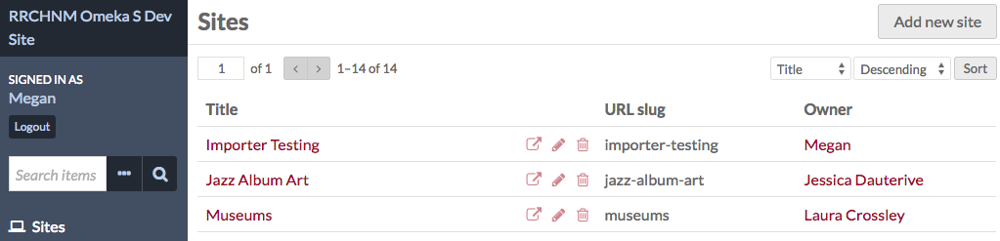
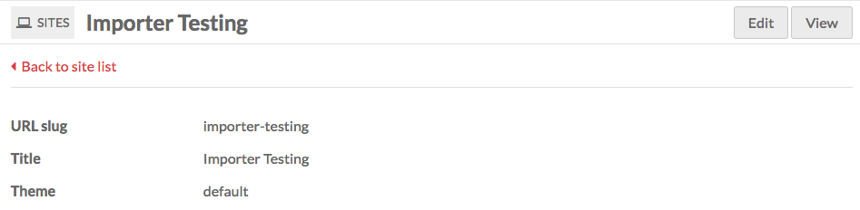
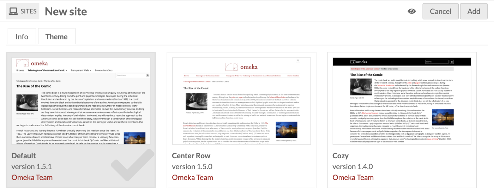
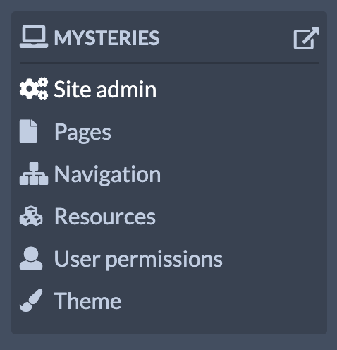

#  Sites Management

Sites are the public-facing side of an Omeka S installation. With sites you can create content and interpretation around a group of items from your installation. 

Sites are managed and accessed via the "Sites" link on the left-hand side of the administrative dashboard. 

The Sites page displays a table with all the sites for the installation, giving the title and owner for each site. 

Use the two drop-downs on the right side above the table to sort your sites. You can sort by **title**, **URL slug**, or **owner**, either ascending or descending. Click the "Sort" button to apply your choices. 

Above the table of sites, on the left, is the pagination for the sites table.

Each row gives the title of a site on the left, the URL in the middle, and the display name of the site's owner on the right. Each site has options to **view** (the box with the outward arrow), **edit** (the pencil), or **delete** (the trash can). **Only global admins and site owners can delete a site.**

Sites that are not public will have the **private** icon (an eye with a slash through it) display to the right of the site title. 

Clicking on the site title will take you to a summary page for the site which displays the site’s **URL slug**, **title**, **theme**, and the **thumbnail image** associated with the site. You can return to the site list, or "Edit" or "View" the site using buttons in the upper right. You will also see the left-hand menu expand to display the management options for the site.

## Add a site
To create a site, click the "Add new site" button in the upper right-hand corner of the site browse page.

The "New site" page has two tabs: **Info** and **Theme**.

### Info tab

* Give your site a **title** (required).
* Create a **slug** for the site’s URL (optional). The URL for this site will be `youromekainstall.org/s/slug`. If you leave this field blank, Omeka S will create a slug based on the site title.
* Create a **summary** for your site: a brief description of what it is about (optional). The summary text will appear on your installation's landing page and on the [list of sites](site_pages.md#list-of-sites) page block.
* Upload a **thumbnail** for your site, or select one from your installation's assets (optional). This will appear alongside the summary text on the landing page and in the [list of sites page block](site_pages.md#list-of-sites). We recommend using a small image, no more than 240 pixels wide (the largest it will display, on the landing page). You can also [set a favicon for your site later](site_settings.md#general-settings).

### Theme tab
Select from the [installed themes](site_theme.md). Each theme appears as a tile with a screenshot of the theme, the theme name, and a link to its creator. When a theme is selected, it will highlight in gray and a checkbox will appear in the bottom right corner of the tile.

### Publication
In the upper right corner of the screen, next to the "Add" button, you can set the visibility of your site by clicking on the eye icon to make the site public or private.

Site is public: {style="display:inline;"}

Site is private: {style="display:inline;"}

Sites are created as public by default. You will probably want to make the site private until you have finished configuring it and added some content.

When you are ready, click the "Add" button in the upper right corner. You cannot save a draft site, but you can make the site private while you finish working on it. Once the site is created, you will be redirected to the site's Info tab. 

If you decide you do not want to create this site, click the "Cancel" button in the upper right next to the "Add" button.

## Manage sites
To manage a site, navigate to the **Sites** screen from the admin dashboard. Click either on the site’s title or the edit button (pencil icon) in the list of sites. 

This will take you to the site's Info tab, and open the context menu for that site in the left-hand navigation. 

The context menu for every site has the site title at the top, with an icon of a computer (the site icon) to the left. To the right of the site title is a view button (box with escaping arrow). Clicking the view button will open the public side of the site in a new tab or window.

Site admin left hand navigation options are: 

- [Site admin](../sites/site_settings.md)
- [Pages](../sites/site_pages.md)
- [Navigation](../sites/site_navigation.md) 
- [Resources](../sites/site_resources.md)
- [User permissions](../sites/site_users.md)
- [Theme](../sites/site_theme.md)
- Settings added by modules, if installed.
