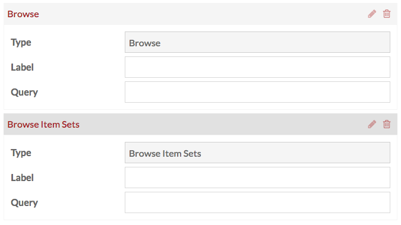
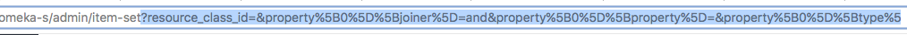
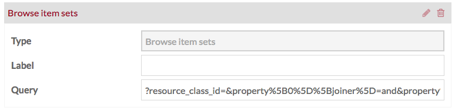

# Navigation

Use the *Navigation* tab of the [Sites](../sites/index.md) to manage the navigation, or menu, or your site. You can add links, browse pages, and your [pages](../sites/site_pages.md) to the navigation, arrange them, and delete links from the navigation.

For every item in the navigation, you have three options: view (box with arrow icon); edit (pencil icon); or delete (trash can icon). Parent navigation pages also have a gray square with a black triangle which collapses or expands their child pages.

## Set Homepage
By default, the topmost page in the navigation acts the main page for your site. Note that custom URLs will not work as a home page - the topmost item in your navigation must be a page.

You can set the homepage without changing the order of your pages using the *Select a homepage* section in the righthand drawer. This section has a dropdown which lists all the pages in your site. Simply select the page which you want to use as your homepage.

To change which page is used as the homepage, select a different page from the dropdown. If you want to revert to using the top page in the navigation, click the 'x' to the right of the page name in the menu (circled in red in the below image).

## Adding Navigation
Add to the navigation of the site using the options on the right hand side of the page. There are two sections: [Add a custom link](../sites/site_navigation/#custom-link) and [Add a link to a site page](../sites/site_navigation/#site-page)

### Add a custom link
To add a link you can use the *Add a custom link* options on the right hand drawer to add:
 * a *Custom URL* to any web address;
 * a Browse page for items on your site;
 * a Browse page for item sets on your site. 

Or you can add one of your [pages](../sites/site_pages), which should be listed in the right-hand drawer below the *Add a custom link* dropdown. If you need to find a specific page, begin typing the page title in the search box with the helper text *Filter pages* which appears directly below the text “Add a link to a site page.” 

**Custom URL** link blocks display three pieces of information: the block *type* (Custom URL), the *label* which is the text which will appear in the site navigation menu, and the *url*. 

 URL Block

**Browse** blocks create a browse page for [resources](../sites/site_resources.md) already associated with your site. There are blocks to create a browse items page and a block to browse item sets.  

You can change the *label* of the block to reflect what, specifically, site visitors will browse. 

If you want to refine the Browse block, you can use the Query to create a search query that returns the desired results. 

Note that you **must** enter a query for the block to function.

To create a Browse Item Set navigation for all the item sets which you have already assigned to the [resources](../sites/site_resources/) with the site on which you are working:

- (In a separate window): conduct an [advanced item set search](../search/#advanced-item-set-search) using your site for the "In site pool" option.
- Once the search results load, highlight everything in your browser's address bar starting with the question mark all the way to the end of the search url (to the right).

- Paste the text you just copied into the "Query" field of the Browse item sets Navigation link.

### Site Page
Site page blocks create links to pages you have built for your site. The *page* field indicates which page is in use, as does the block title. You can change the *label* for the page link in the navigation, as in the example image below. Note that changing the label does not change the page title. 

 Site Page block

If you have many pages, you can use the *Filter pages* field to find the names and slugs of specific pages.

Be sure to click Save before leaving the Navigation tab to save changes. If you do not want to save changes, click the Cancel button.

## Editing and Arranging Navigation
When you add a link block it is automatically expanded. To collapse an open link block, click the edit (pencil) icon in the  upper right corner of each block, next to the delete (trash) icon. When you arrive at the Navigation tab after saving changes or from the main site edit page, the navigation items should be collapsed; open the block by clicking the edit (pencil) icon.

The topmost item in the navigation is the main page for your site.

You can arrange your navigation links by dragging and dropping them into your preferred order. Nest links by dragging the desired child link on top of the desired parent link; when you do so a small black triangle should appear to the left of the parent block.

 In this image, Custard page 2 is the child link; Opening Page will be the parent link, as indicated by the small black triangle on the left

Omeka S allows for multiple levels of nested navigation.

## Deleting Navigation
To delete a link from the navigation, click the delete (trash can) icon and then click *Save*. If you accidentally click the delete icon, you can click the undo (back looped arrow) icon before click save to cancel the deletion.

 

In this image, the delete icon for browse has been clicked; the block now displays the undo button instead

NOTE: Deleting a parent block from the navigation will also delete any child blocks. 

 
