# Navigation

Once you click [Sites](index.md) and select a site to work on, you can use the Navigation link the left sidebar to manage the navigation, or menu, of your site. You can add or delete links, browse pages, and your [pages](site_pages.md) to the navigation, as well as arrange and nest them. 

Themes present your navigation links in different ways. You can also modify navigation settings under [Theme settings](site_theme.md#edit-theme-settings), such as the depth of nested links to display. Be sure to refresh and check your public pages to ensure the navigation is working correctly after you make changes.

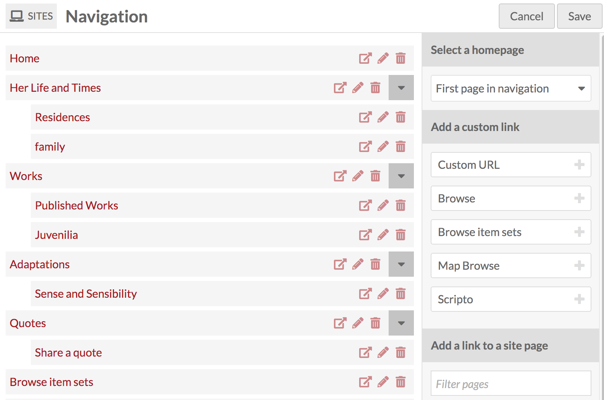

For every item in the navigation, you have three options: view (box with arrow icon), edit (pencil icon), or delete (trash can icon). Parent navigation pages also have a gray square with a black triangle which collapses or expands their child pages.

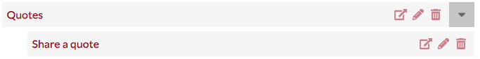

## Homepage
By default, the topmost page in the navigation acts the main page for your site. Note that custom URLs will not work as a homepage - Omeka will ignore these entries in your navigation and select the first page.

You can set the homepage without changing the order of your pages using the **Select a homepage** section in the right-hand drawer. This section has a dropdown which lists all the pages in your site. Simply select the page you want to use as your homepage.

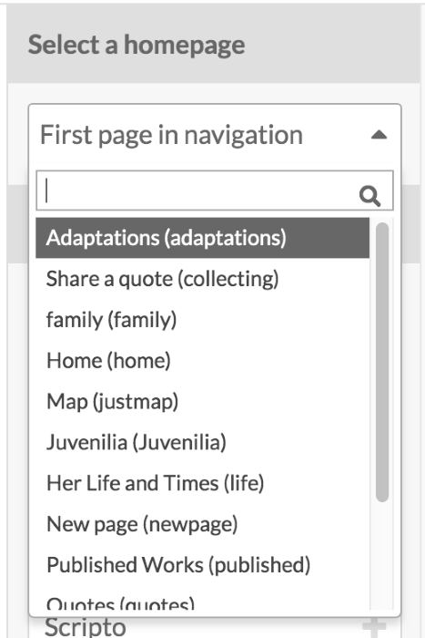

To change which page is used as the homepage, select a different page from the dropdown. If you want to revert to using the top page in the navigation, click the "X" to the right of the page name in the menu (circled in red in the below image).

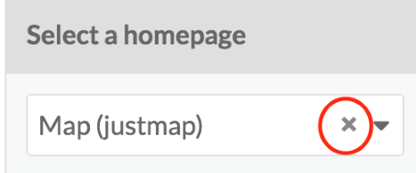

## Add links
Add to the navigation of the site using the options on the right-hand side of the page. There are two sections: "Add a custom link" and "Add a link to a site page".

### Add a custom link
To add a link you can use the **Add a custom link** options on the right-hand drawer to add:

* A "Browse" page for items on your site
* A "Browse item sets" page for item sets on your site
* A Custom URL to any web address
* Other pages added by modules.

The **Custom URL** link option, when added to your navigation, have three fields: the link **type** (showing as "Custom URL"), the **label** (the text that will appear in the site navigation menu), and the **URL**. You can also select whether the link will open a new browser window or tab when clicked.

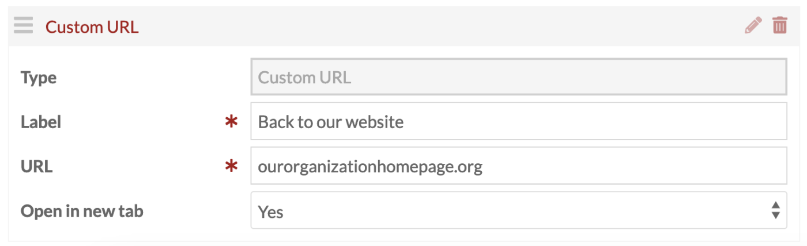

**Browse** links create a browse page for [resources](../sites/site_resources.md) already associated with your site. There are options to create a browse items page and a browse item sets page.  

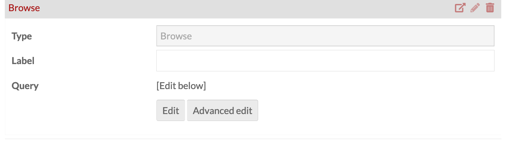

To refine the Browse page, you can use the Query interface to create a search query that returns the desired results. 

Click the "Edit" button to reveal the advanced search interface in the drawer. Once you are satisfied with the pool of items in your search, clicking the "Apply" button will set the pool of items for the Browse page.

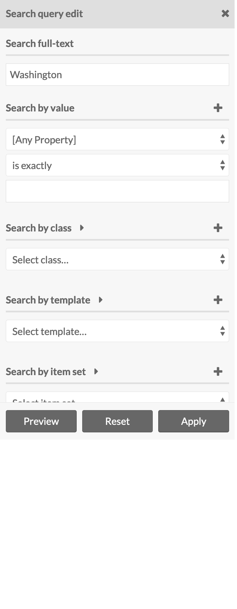

Once a query has been set, you can click "Edit" to update the pool of items. You can click "Advanced edit" to directly edit the query string. Finally, you can "Clear" a query to start over. If you have cleared a search in error, you can "Restore" it. 

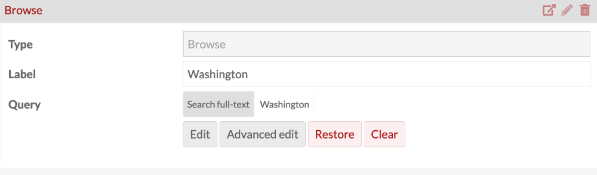

You can change the **label** of the link to reflect what, specifically, site visitors will browse. For example, if you wish to provide separate links for users to browse images or documents, set the query to the appropriate classes and change the labels to indicate "Browse images" or "Browse documents".

### Add a link to a site page
Pages you have built for your site will appear here if they have not yet been added to the site navigation.

When added, the entry title and the **page** field indicate which page is in use. You can change the **label** for the page link in the navigation, as in the example image below. Note that changing the label does not change the page title. 

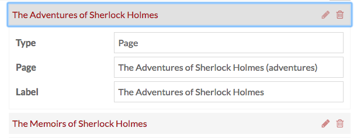

If you have many pages, you can use the **Filter pages** field to find the names and slugs of specific pages.

Be sure to click Save before leaving the Navigation tab to save changes. If you do not want to save your changes, click the Cancel button.

## Edit and arrange links
When you add a link it is automatically expanded to show its options. To collapse an open link entry, click the edit (pencil) icon in the  upper right corner, next to the delete (trash) icon. When you arrive at the Navigation tab after saving changes or from the main site edit page, the navigation items should be collapsed; open each by clicking the edit (pencil) icon.

You can arrange your navigation links by dragging and dropping them into your preferred order. Nest links by dragging the desired child link on top of the desired parent link; when you do so a small black triangle should appear to the left of the parent block.

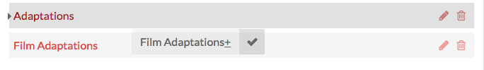 

In this image, "Film Adaptations" is the child link; "Adaptations" will be the parent link, as indicated by the small black triangle on the left.

Omeka S allows for multiple levels of nested navigation.

## Delete links
To delete a link from the navigation, click the delete (trash can) icon and then click "Save". If you accidentally click the delete icon, you can click the undo (back looped arrow) icon before click "Save" to cancel the deletion.

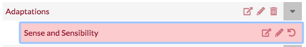 

In this image, the delete icon for the "Sense and Sensibility" page has been clicked; the block now displays the undo button in its place.

Deleting a parent block from the navigation will also delete any child blocks, which in the interface is shown by all the child blocks also becoming highlighted in red. 

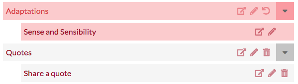 

In this image, the delete icon for "Adaptations" has been clicked; "Adaptations" and its child page "Sense and Sensibility" are both shown in red, and "Adaptations" now shows the undo button where the trash can used to be. 
