# Pages Management

Pages form the content of your [sites](../sites/index.md). A site can have a single page or many pages.

Manage the pages for a site by navigating to the Sites tab on the left-hand navigation of the admin dashboard. Select the site  for which you want to manage the pages and click either the title or the edit (pencil) button to edit that site. 

Once you are editing the site, click the Pages tab in the left hand navigation.

When you create a new site, Omeka S automatically adds a page titled *Welcome* with a single HTML block (see below). You can edit this page or delete it.

## Adding Pages
From the page for the site, click the Pages tab. Then click the *Add new page* button on the upper left side of the window.

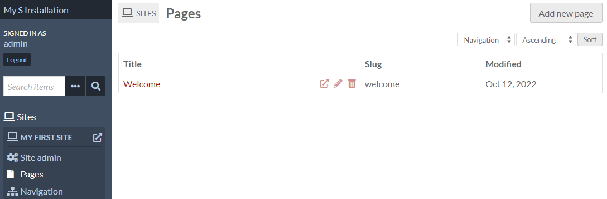  

To add a page you must enter a *Title*. 
You can also enter a *URL Slug*. 

Both of these can be edited later but are required to create the page. If you do not enter a slug, Omeka S will create one from the page title. A slug is the page’s portion of the url and can only contain letters, numbers, and hyphens; no other characters are allowed.

In addition, there is a checkbox for "Add to navigation". If checked, the page will automatically appear at the main [navigation](../sites/site_navigation.md) level for the site. If you do not check this box, you will have to manually add the page to the site navigation at a later point. 

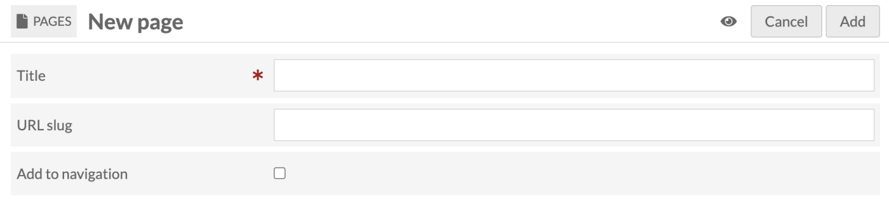

The eye icon to the left of the Cancel and Add buttons is a toggle to set the visibility of your page. If the toggle is set to public (no line), then anyone can see the page. If the toggle is set to private (line through the eye icon), the page will only be visible to logged-in users of the Omeka S installation who have site permissions (Supervisors and Global Admins will always be able to see private pages). 

Clicking or hitting enter on the eye icon toggles between public and private. 

 Public 

  Private

Once you have entered this information and set visibility, click the Add button in the upper right hand corner of the browser window. You will be automatically taken to that page's edit view (see below). 

If you decide you do not want to create the page, click the Cancel button.

## Browse Pages
The pages tab (once you have at least one page) will display all of your pages in their navigation order. Child pages will display below the parent page with a `-` before the page title.

Every page is listed with its *Title*, buttons to view (box with an arrow coming out), edit (pencil), or delete (trash can) the page, and the page's slug. 

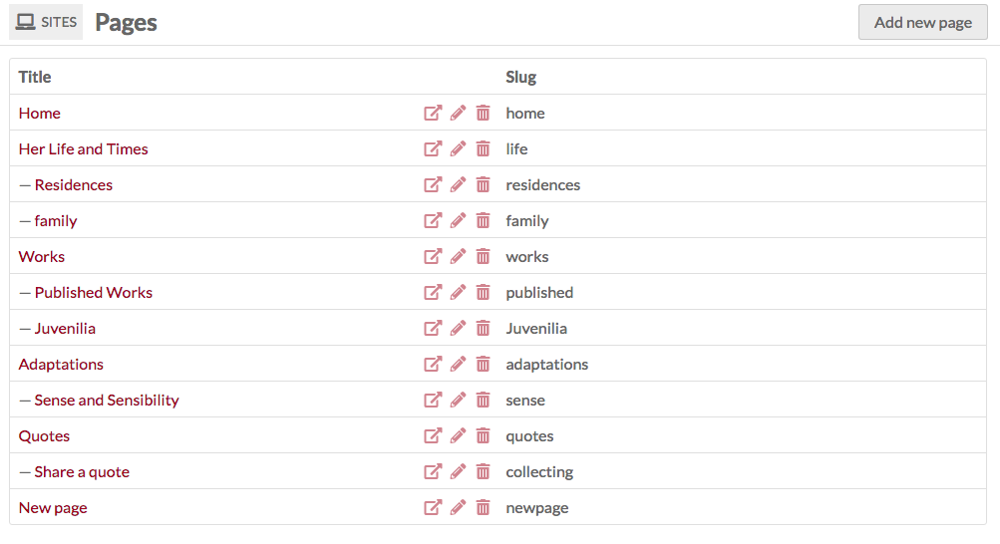

Use the [Navigation](../sites/site_navigation/) tab of the site admin to set the order of pages, including setting child and parent pages.

## Editing Pages  
After clicking the Pages tab, select the page you wish to edit by clicking the name of the page or the edit button (pencil). Note: clicking on the Page *title* will take you to the public view of that page. 

The edit view for a page will display the page's title across the top. In the upper left is the public/private toggle (the eye icon), and buttons to view the public version (opens in a new tab), delete the page, cancel changes, or save changes. Note that changes will not display on the public view until after they have been saved.

At the top of the work area are fields for the page title and URL slug. You can edit these at any time, but remember that the slug must be unique within the site (you cannot have two pages with the slug "welcome" on the same site).

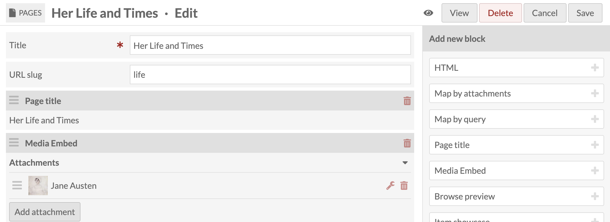

On the right hand side you can choose to add a new block by selecting one of the following layouts: 
- HTML
- Page title
- Media Embed
- Browse preview
- Item showcase
- List of sites
- Table of contents
- Line break
- Item with metadata
If you have the relevant modules installed, you may also have:

- Map
- Collecting

Once you have added blocks to your page, click the Save button in the right hand corner.  To leave without saving changes, click Cancel.

You can delete any of the blocks by clicking on the trash can icon located in the upper right corner of the block. 

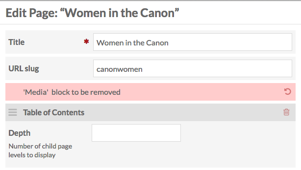

Change the order of blocks by clicking on the three horizontal lines on the upper left corner of the block and then dragging and dropping it to the desired location.

Some modules may create additional blocks for your site pages. For information on working with these blocks, please see the documentation for that [module](../modules/index.md)

### From the Public Side
If you are on the admin side and click "View" in the upper right-hand corner of a page, it will take you to the public view for that page. 

As you are browsing the public side of your site, you can edit the page you are viewing if you are currently logged in and the [user bar option is turned on in Site Settings](../sites/site_settings/#general-settings). 

The user bar, which appears across the top of the page, includes a link to edit the current page - circled in red in the below image. 

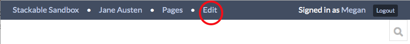

## Page Blocks
Pages are made up of blocks, each of which has a different form of content.

### HTML
Creates an HTML box in which you can add formatted text and links. When you click in the box, a formatting menu will display above the text field. 

Basic block: 

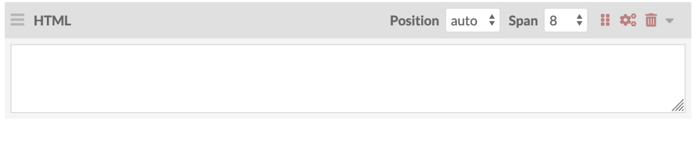

With formatting menu open:

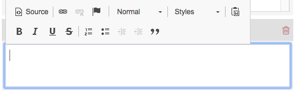

You can embed content from elsewhere on the internet using iFrames or other embed codes in the HTML block. 

1. Click into the HTML block content area to show the formatting menu and then click on the button labeled "Source". 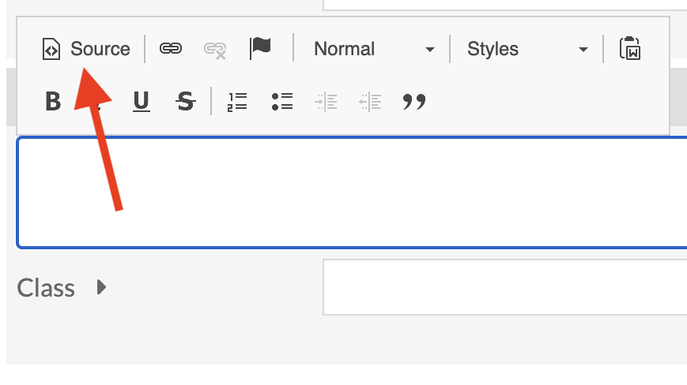
2. This will open a dialog box where you can write HTML content.
3. Copy and paste the embed code into the source code editor. 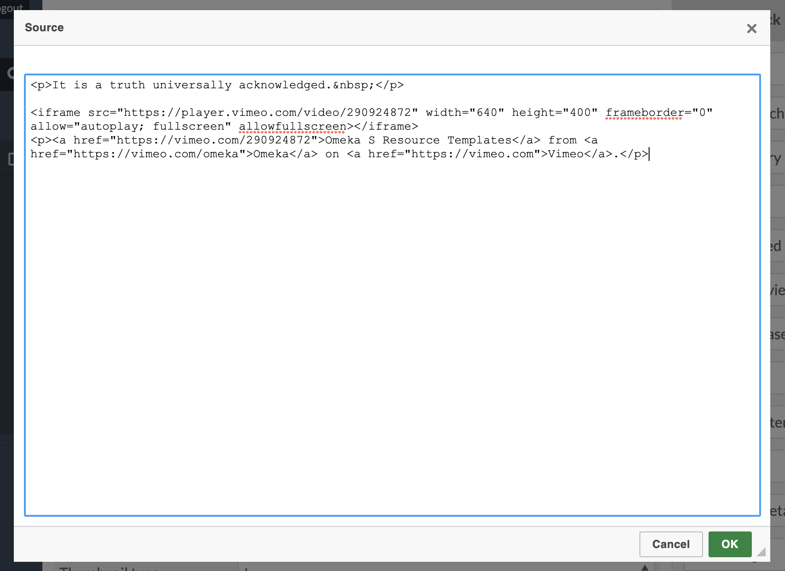
4. Click the green OK button at the bottom of the editor.
5. Your embed should show up in the HTML block either as a gray rectangle or as the embedded content. 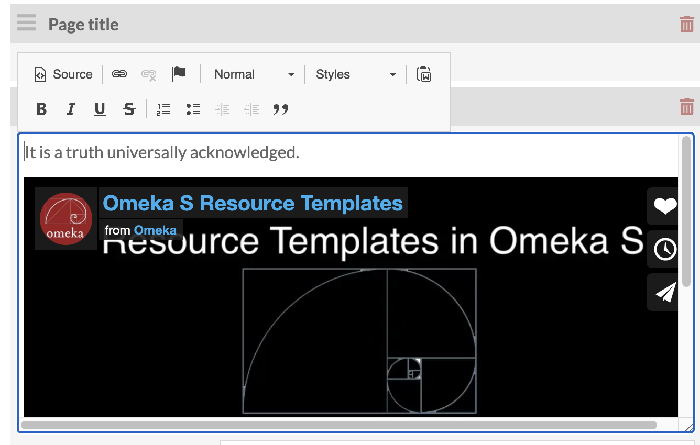

### Page Title
Displays the title of the current page.

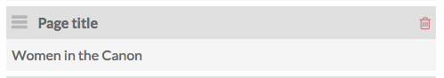

### Media Embed
Creates a block with one or more pieces of media associated with items in the item pool. In media blocks, multiple attachments stack vertically.

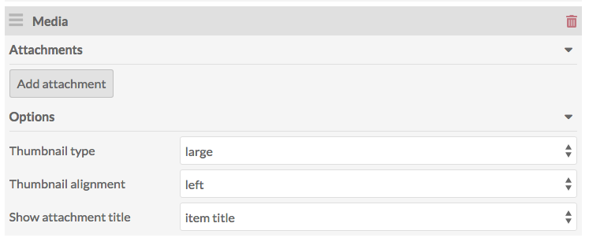

The Media block has options for the display of the media: 

- Thumbnail type: choose from large, medium, and square.
- Thumbnail alignment: float left, float right, and center.
- Set the attachment title as:
	- item title (title of the attached item);
	- media title (title of the specific piece of media you select associated with the item); or
	- no title.

*Layout note:* If you want media to appear beside a block of text, place a media block *above* an HTML block, select a smaller thumbnail size, and choose either float left or right for alignment. In the example below, the media has a thumbnail type of "medium", alignment "float right," and attachment title of the "item title": 

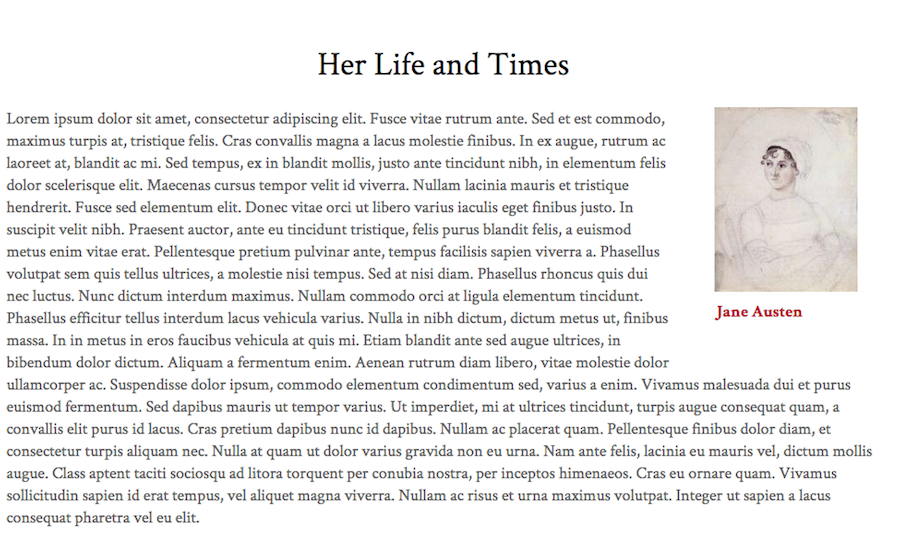

Placing a media block *after* an HTML block will cause the media to appear below the end of the HTML paragraphs. 

To **add media to the block**, click the *add attachment* button. 

On loading, the drawer will show a list of your items, most recent first. You can select from the first page, page through using the forward and back arrows, or search using the search bar. You can select from the first page, page through using the forward and back arrows, or search using the search bar. 

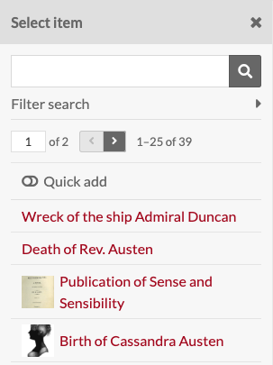
 
If you have a large number of items to navigate, or multiple items with the same title, you can use the "Filter search" options by clicking the triangle button to the right of its label. 
 
These options are:

- Filter by class: opens a dropdown to select from all of the classes for the vocabularies in the Omeka S installation.
- Filter by item set: opens a dropdown to select from all item sets in the installation, not just those associated with the site on which you are working.
- Filter by item id: you can put in the specific item id for an item (the number which appears in the url when you are looking at the item on the admin). 

Once you have applied your changes to the filter, you must click the search button (magnifying glass) to apply the filters or run the search.  
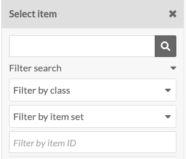

Once you’ve selected an item, the drawer will shift to that item’s information. You can add a caption and select which media (if more than one) you want to use. To return to the list of items, click the *Select item* button at the top of the drawer. To use the item displayed and apply the caption, etc, click the *Apply changes* button at the bottom of the drawer.

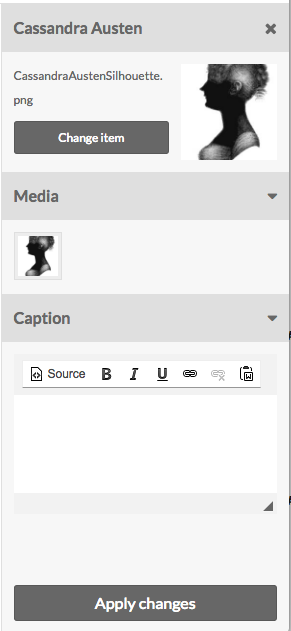

To add multiple items at once, click the "quick add" slider just above the list of items in the right hand drawer. This will add a checkbox to the left of each item. Check the boxes of those items you want to add to the block, then click the "Add selected" button at the bottom of the drawer.

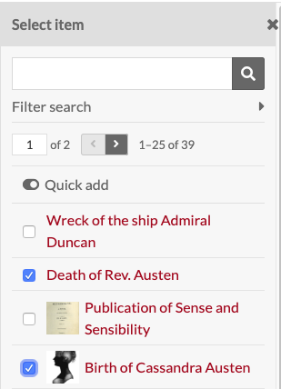

### Browse Preview
Allows you to add a block of items on a site page.

In order to create a Browse Preview block, you'll first need to perform a search on your Omeka S installation for the items you want to include. You can use the general search on the left hand navigation or, if you want to show all items in an item set, use the Advanced Search from Items browse. NB: if you leave the search options blank, the browse preview will load all items in your site's item pool.

Once you have searched, highlight everything in your browser's address bar starting with the question mark all the way to the end of the search url (to the right).

 

- From the *Resource type* dropdown, choose the kind of resource you want to display in the block: Items, Item Sets, or Media. 
- In the *Query* field of the Browse Preview block, paste the part of the url you just copied (everything from the question mark over). 
- The *Limit* field lets you set the number of resources to display in the block; any additional results from your query can be accessed on a search page linked from the bottom of the block (you set the text of the link in the *browse link text* field below).
- The *Preview Title* field sets the heading above the browse section on the page.
- The *Browse link text* field sets the link text at the bottom of the block - the block will only display as many results as you set in the *Limit* field above.

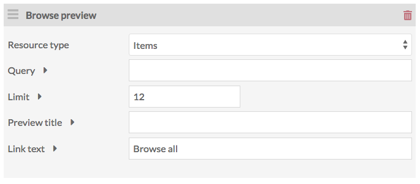

### Item Showcase
A list of items. 

In item showcase blocks, multiple attachments build horizontally, creating rows across the page.

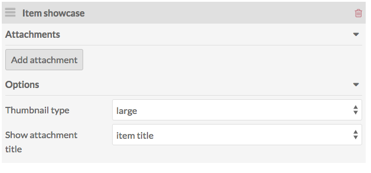

Using the drop-down menu in the block, you can:

- set the thumbnail size for these items as large (default), medium, or square. 
- set the attachment title as:
	- item title (title of the attached item);
	- media title (title of the specific piece of media you select associated with the item); or
	- no title.

Click the *Add Attachment* button to add an item to the block. This will open a drawer on the right side of the page to browse and select items.

If you have a large number of items to navigate, or multiple items with the same title, you can use the "Filter search" options by clicking the triangle button to the right of its label. 
 
These options are:

- Filter by class: opens a dropdown to select from all of the classes for the vocabularies in the Omeka S installation.
- Filter by item set: opens a dropdown to select from all item sets in the installation, not just those associated with the site on which you are working.
- Filter by item id: you can put in the specific item id for an item (the number which appears in the url when you are looking at the item on the admin). 

Once you have applied your changes to the filter, you must click the search button (magnifying glass) to apply the filters or run the search.

Once you’ve selected an item, the drawer will shift to that item’s information. You can add a caption and select which media (if more than one) you want to use. To return to the list of items, click the *Select item* button at the top of the drawer. To use the item displayed and apply the caption, etc, click the *Apply changes* button at the bottom of the drawer.

To add multiple items at once, click the "quick add" slider just above the list of items in the right hand drawer. This will add a checkbox to the left of each item. Check the boxes of those items you want to add to the block, then click the "Add selected" button at the bottom of the drawer.

To cancel the item selection, click the X in the upper right corner of the drawer at any time.

Once you’ve added an item, it will appear in the Item List block. You can edit the caption or media options by clicking the edit (wrench) button for that row, and you can delete the item using the delete (trash can) icon.

You can add multiple items to the list.

### List of sites
This block displays a list of all of the sites on your Omeka S install. This block has the following options:

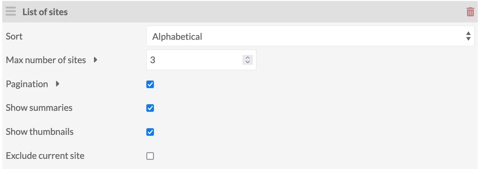

- Sort sites by: Alphabetical order (A-Z); Oldest first; newest first. By default this is set to alphabetical. 
- Max number of sites allows you to limit the number of sites which display at once. If left blank, all sites will display.
- A checkbox to turn on pagination, applied only if you set a limit.
- A checkbox to show site summaries.  
- A checkbox to exclude the current site from the list. 

This image shows a List of sites block, sorted oldest first, with no limits:

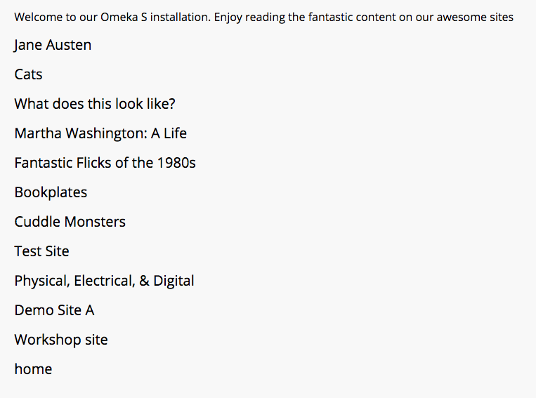

This is the same block edited to have a limit of 5 and pagination is turned on:

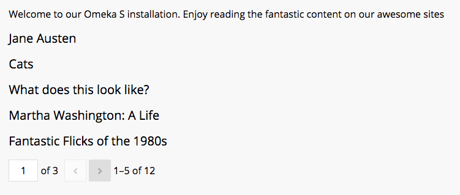

The same block with pagination and site summaries turned on:

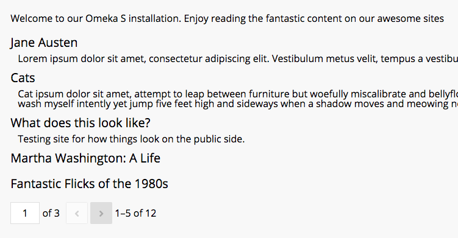

### Table of Contents
If the current page has child pages, you can add a table of content block for those pages.

The Depth option allows you to set how many levels of child pages you want to display. If left blank, it will display all possible levels. Please enter a whole number.  

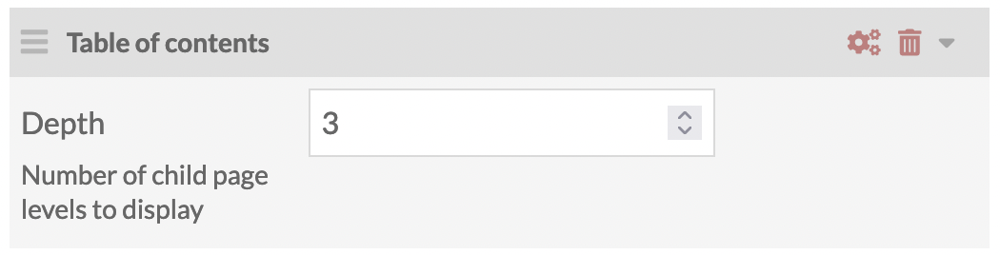

Add and arrange pages using the [Site Navigation](../sites/site_navigation.md) settings. 

### Line Break
Line break creates a transparent or opaque line break on the page, clearing all blocks. Select whether the line is transparent or opaque from the dropdown.

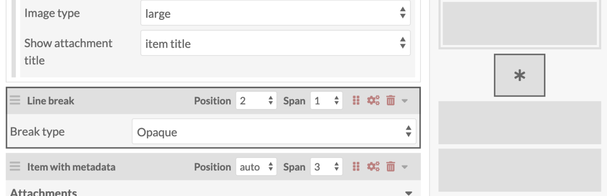

HTML blocks wrap around Media blocks and at times you may want to clear the page. You might also want to create a visual break on the page. 

### Item with Metadata
This block displays an item along with all associated metadata (entered when creating or editing the [item](../content/items.md)).

Add attachments in the same manner as the [media](../sites/site_pages/#media) page block.

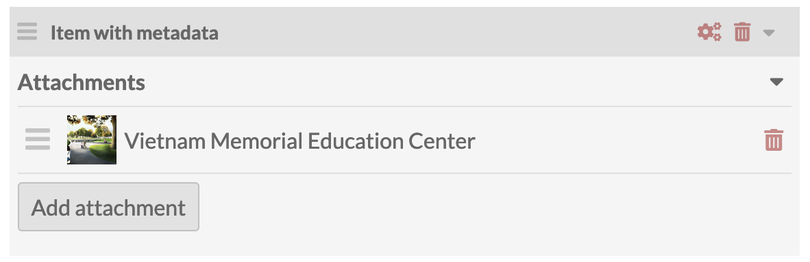

### Other blocks
For module-specific blocks (like [Collecting](../modules/collecting.md) or [Map](../modules/mapping.md)) see the documentation for that module.

## Deleting Pages
To delete a page, go the to *Pages* tab of the site of which the page is a part. Click the delete (trash can) button at the right end of the row for that page. 

A drawer will open on the right side of the page asking you to confirm that you wish to delete the page, with the name of the page displayed under the confirm button. To proceed, click the *Confirm delete* button. Otherwise, click the *X* in the upper right corner of the drawer to cancel.

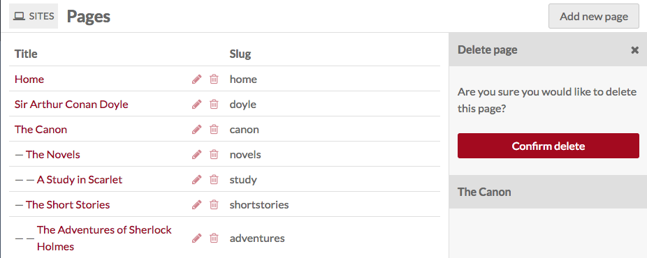

