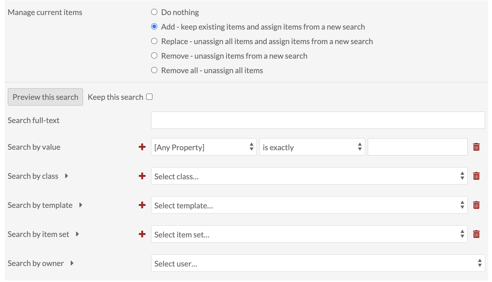
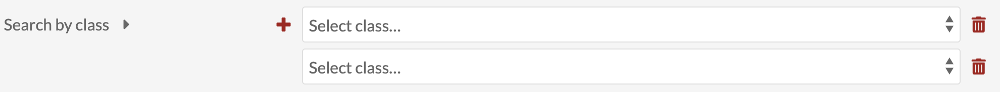

# Resources

The Resources tab of the site context menu allows you to set what Items and Item Sets are available on your site's browse pages. The Items tab also sets which items are available in the sidebar when building pages.

Resources has two tabs across the top of the window: Items and Item Sets. 

Under the Items tab, you can set the items available for selection and browse in your site.

Item Sets is where you select the sets which will show up on the  Browse Item Sets page, should you choose to include it 

**Note** The two tabs operate *independently* from each other. The selections made on one will have no effect on the other. The Items tab limits which items are available, while the Item Set tab limits which sets are visible for public browsing.

## Items

The Items tab determines what automatically appears in the resource selection options on the [pages](../sites/site_pages.md) of your Omeka S [site](../sites/index.md). It also limits the resources which appear on a browse page on your site.

When you first navigate the to items tab, it will display information about the number of items in the site and give you options for making changes. You will see:

A statement of the number of items current assigned to the site. Click on the number to open a new browser tab showing all of those items. 

A statement of whether the site automatically includes new items, and a link to the site admin to change that setting. 

A table with the following options for managing your current items:
	- Do nothing: make no changes)
	- Add - keep existing items and assign items from a new search
	- Replace - unassign all items and assign items from a new search
	- Remove - unassign items from a new search
	- Remove all - unassign all items

If you want to make changes to the item sources in your site, select the radio button for the action you want to take. For all but "Do nothing" and "Remove all", a search form will automatically load.

Note that the search options in the form work together to build an overall search. If you had the search in the image above, looking for items where "Creator" contains the word "Doyle" and you added a criteria where Class=Text, it would only add items to your pool which matched *both* statements.

Above the search fields is a button to Preview this search. Clicking the button after creating a search will open a new browser tab with the items which meet the criteria of the search.

There is also a checkbox for "keep this search". Checking this box will re-load this search the next time you come to make changes to the site items. 

Search forms options are:

*Search full-text:* search all values of all items. 

*Search by value:* search for a term or phrase which you enter 

- The first selector allows you to specify a property to search. 
- The second selector allows you to set the relationship the property has with the value. The options are:
	- is exactly, 
	- is not exactly, 
	- contains,
	- does not contain,
	- is resource with ID,
	- is not resource with ID,
	- has any value (there is something in the property), and
	- has no values.
- Finally, there is a text field for you to enter the value you want the property to have.

To find a resource ID, go to the resource and look at the url in your browser's address bar. The numbers at the end of the url are the resource ID. 

*Search by Class:* select one or more classes from the dropdown menu - the search will only return items with this class. 

*Search by template:* select from existing resource templates and the search will only return items using this resource template or templates. 

*Search by item set:* select from a dropdown of item sets.

*Search by owner:* select from a dropdown of site users. 

Note that the fields for searches by value, class, template, and item set have a large red plus sign to the left of the select options. Use these to add more than one search of this kind to your form. You can use the red trash can icon to the right of the field to remove it.

Item Sets
---------------------------
On this tab you can select which Item Sets will display on a Browse Item Sets page when added to the [navigation](../sites/site_navigation.md). 

The table in the Item Sets tab shows any item sets already added, with their title and owner's email address. 

To add an item set, select it in the right hand sidebar. You can find the desired item set by either:

- typing the name of the item set in the search bar and then clicking on the correct item set, or
- click on the name of the item set owner, then clicking on the name of the item set.

Remove an item set by clicking the red delete button (trash can icon). It will still be available to re-add from the drawer on the right.

You can change the order of the item sets by dragging and dropping using the three-bar icon on the left end of the row.

The following image shows a browse item sets public view using the default theme: 

