# Site Admin

The Site Admin page allows you to manage the main settings for the site on which you are working. Changes will only be applied to this site and will not change other sites' settings.

In the left-hand navigation, once you have select a site from the Sites page, it is the first link under the site title, represented with a gear icon.

The Site Admin page has two tabs: Info and Settings.

## Info
The site info settings for an Omeka S site are where you can change the basic info for the site - the same information you entered when you created the site. You can change the:

* **Title**: a text field, with a maximum of 190 characters.
* **Slug**: the URL for your site, which will be generated automatically from the title if you leave this blank.
* **Summary**: a brief description of what your site is about, which will appear on your installation's landing page and on the [list of sites](../sites/site_pages.md#list-of-sites).
* **Thumbnail** - a small image for your site, which will appear on your installation's landing page and on the [list of sites](../sites/site_pages.md#list-of-sites). This will be uploaded to and selected from your installation's assets. We recommend using a small image, no more than 240 pixels wide (the largest it will display, on the landing page). You can also [set a favicon for your site](#general-settings) on the settings tab.

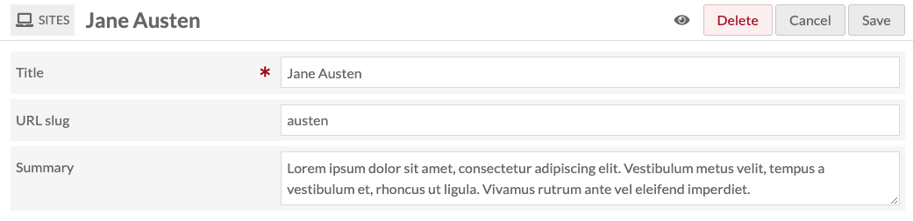

In the upper right hand corner of the window on this tab, you can use buttons to:

- Set your site as public or private using the eye icon
- Delete the site
- Cancel making changes
- Save your changes.

The **make public/private** button (eye icon) is used to both indicate and set whether the site is visible to the public or only to users of this Omeka S installation.

Site is public: {style="display:inline;"}

Site is private: {style="display:inline;"}

## Settings

The Settings page is divided into multiple sections; more sections may be added by modules, such as [Collecting](../modules/collecting.md), [Mapping](../modules/mapping.md), and [Sharing](../modules/sharing.md). 

To implement any changes you make, click "Save" at the top right of the browser window when you are done. To leave without saving changes, click "Cancel".

### General settings

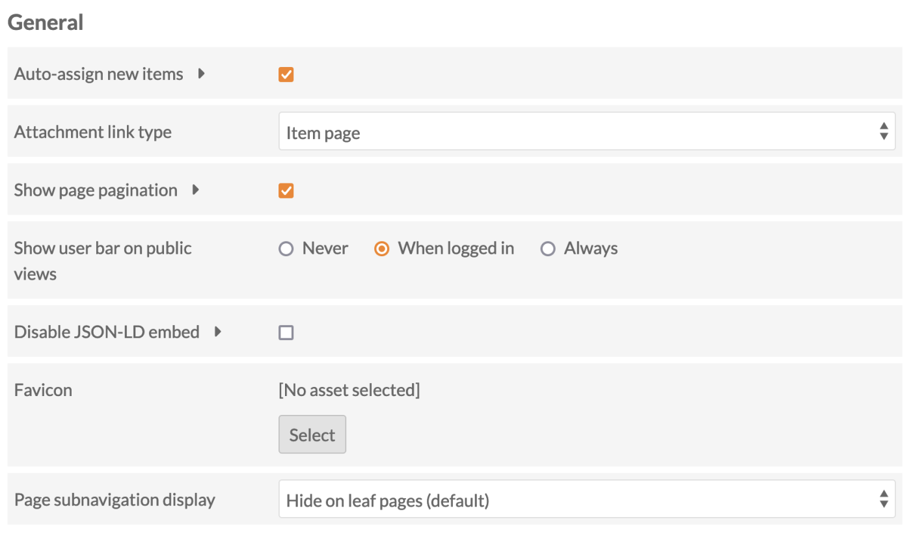

**Auto-assign new items**: a checkbox which sets whether new items are automatically added to this site. If checked, every new item will be added to the site, regardless of the item's owner. Note that item owners may unassign their items from the site at any time, in the item's edit pages.

**Attachment link type**: sets the target of links from attachments you add to [site page blocks](../sites/site_pages.md#page-blocks) (for example, in the [media embed block](../sites/site_pages.md#media-embed)). It offers a dropdown with the following options:

- Item page: clicking on the attachment takes users to the item page associated with the attached media.
- Media page: clicking on the attachment takes users to the media page.
- Direct link to file: clicking on the attachment takes user to the file alone.

**Show page pagination**: when checked, "Previous" and "Next" links will display at the bottom of every page in the site, proceeding through your navigation. If unchecked, these links will not display.

**Show user bar on public views**: sets whether there is a bar across the top of public site pages which allow users to access the admin side of the site.

When users are logged in, the user bar has the following options:

- Installation Title: takes you back to the installation admin.
- Site Title: takes you back to the landing page for managing the site (site/show).
- Resource view: depending on what you are viewing, this is a link to the admin side management for [Pages](../sites/site_pages.md), [Items](../content/items.md), or [Item Sets](../content/item-sets.md).
- Edit link for that page, item set, or item.
- User's display name: takes you to your user page.
- Logout: logs out current user.

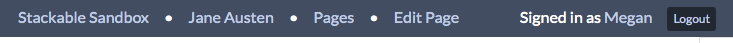

If you opt to always show the user bar, when any site visitor navigates to your site who is not logged in, the user bar appears and displays a login option.

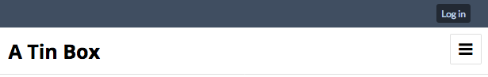

The options for this setting are:

- Never
- When identified (when logged in)
- Always.

**Disable JSON-LD embed**: Check this box to disable JSON-LD embedding on resource browse and show pages for this site. This is also available as a [global setting at the installation level](../admin/settings.md).

**Favicon**: Choose from your assets, or upload a file, to appear in the small browser window/tab icon space. A [favicon](https://www.w3schools.com/html/html_favicon.asp){target=_blank} should be a small image around 32x32 pixels in size uploaded specifically for this purpose. Favicons can be [set at an installation level](../admin/settings.md#general) as well as on each individual site.

**Page subnavigation display**: Pages can be navigated from top to bottom according to the order used on the [navigation](site_navigation.md) tab, using the "Previous" and "Next" buttons that appear at the bottom of each page. Some themes may also show a breadcrumb at the top of each page. 

Where pages are arranged in a hierarchy in the navigation, a subnavigation is also displayed to help visitors move from parent to child pages, and between sibling pages. When shown, the subnavigation will display the current page's children if it has any. When a child page (or a "leaf page", as in leaves of a tree) shows subnavigation, it will display itself in context with its siblings. 

You can opt to:

- Show the subnavigation on all pages
- Hide it on leaf pages (the default setting)
- Hide the subnavigation wherever it may appear.

You may wish to use the [Table of contents page block](site_pages.md#table-of-contents) or the [List of pages page block](site_pages.md#list-of-pages) to help users navigate your site.  

### Language

**Locale** is a dropdown menu to select the language code for this site. By default this will be set to the same as the global locale setting for the entire Omeka S installation. To change this, select a language from the dropdown menu.

**Filter values based on the site locale** is a checkbox to restrict visible values to those that match the site language setting and those that do not have a locale ID. When this is checked, your resources will only show properties and values where the values have the same language setting, or no language. This allows you to, for example, have an English site and French site that each only show the respective English or French values assigned to the same items. 

**Show language labels for values** is a checkbox to control the visibility of the language label for each value on the resources' public pages.

### Browse

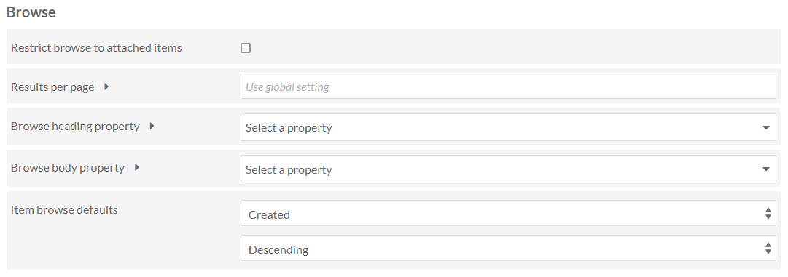

**Restrict browse to attached items** is a checkbox. If checked, the Browse functions of your site will only show items which have been added to a page block. If unchecked, browse pages and blocks on your site will include all items in the Item Pool.

**Results per page** sets the number of results per page on browse pages by entering a number. If left blank, the site will use the default from the [global settings](../admin/settings.md).

Depending on the [site theme](../sites/site_theme.md), you may want to make this a multiple of 4 for a more elegant display. Note that using very large numbers (50, 75, 100) may cause browse pages to load slowly.

**Browse heading property** sets which property to use as the heading for each resource on a browse page. By default, this is Dublin Core: Title. The dropdown allows you to select from all available vocabularies, and includes a search bar to quickly find the desired property.

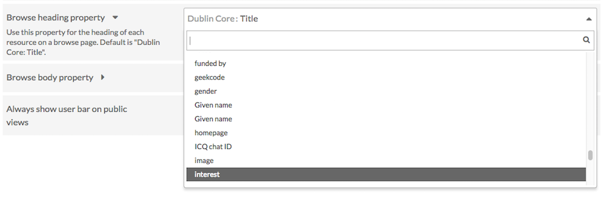

**Browse body property** sets which property to use as the body text for each resource on a browse page. By default, this is Dublin Core: Description. The dropdown allows you to select from all available vocabularies, and includes a search bar to quickly find the desired property.

**Item browse defaults** allow you to customize the default browsing and search results sorting of your site. By default, items are ordered by "Created" "Descending," meaning most recently added items are at the top of browses and searches. Note that users can always change these sorting methods on the public pages. Here you can set an alternative default, such as alphabetically by Title, or alphabetically by Resource Class. 
You can also choose a property in your installation to use as a custom default sorting method, although this property will not display in each item's entry in browses and search results. Select "[Custom sort by]" and enter the property in the text field, in the format `vocabulary:property` - for example, `dcterms:format`. You can also use `id` and `modified`. 
This custom entry will be the active sort method on all item tables in your site. Note that this will appear as "Custom (dcterms:format)" in your public dropdowns. 
See the ["Sorting" section of the Searching page](../search.md#sorting) for more information on sorting behaviors. 

### Show

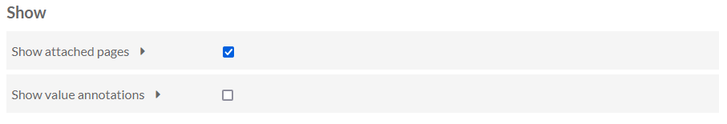

**Show attached pages**: When this box is checked, site pages to which an item is attached will display on the public view of that item.

**Property label information**: Where metadata are displayed, site visitors see a human-readable label for the vocabulary term used (such as "Title" for `dcterms:title`). You can choose to also include the full term, or the vocabulary's name, in brackets after each label - for example, to display "Description (dcterms:description)" or ""Description (Dublin Core)" instead of just "Description". 

**Value annotations**: Where [annotations](../content/items.md#value-annotation) are used, you can choose to always hide them on this site, to show an icon which will expand when clicked on, or to show them expanded by default with an icon available to collapse them. Remember that value annotations are applied at the resource level and are therefore available installation-wide, not on a site-by-site basis.

**Exclude resources not in site**: When this box is checked, the site will not display [linked Omeka resources](../content/items.md#linked-resources) that are not [added as resources to the site](site_resources.md).

**Embed media on item pages (legacy)**: Check this where themes do not show an item's media on the item-view page by default. 

### Search

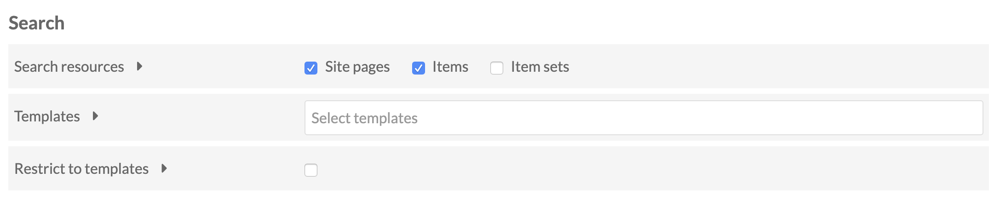

**Search type** is a dropdown which allows you to set from which site(s) the search bar generates results:

- This site: only return results from this site.
- All sites: return results for all sites on the installation.

**Search resources** is a series of checkboxes which let you select which types of resources are searched from the main search field on the site. Select from: site pages, items, and item sets. You can select all if you want.

**Advanced search vocabulary members** allows you to limit the search options for properties and classes. You can select to only provide the properties and classes used in this site, or used across this Omeka installation, rather than all properties and classes supplied by all vocabularies currently installed on the platform.

**Templates** allows you to limit the properties for advanced item or item set search to only properties included in a template or templates. When this field is empty, the "Search by Value" on the advanced search will display all properties from all vocabularies in the Omeka S installation. Applying a template not only limits the options in the dropdown, it also includes your alternate labels for properties:

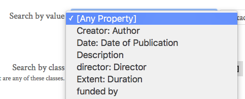

Click in the field to add a template; you can add more than one template by clicking in the field again.

**Restrict to templates** will restrict search results to only those items which are using the selected templates.

### IIIF Viewer

Omeka S comes packaged with the [Mirador viewer](https://projectmirador.org/){target=_blank} for displaying IIIF images and presentations. The following settings only affect the presentation viewer (for multiple images). 

**Show sidebar**: When checked, any Mirador viewer on the site will display the information sidebar by default. It can be hidden or shown by users at any time. 

**Theme**: Depending on your site design, you may wish to use Mirador's light or dark theme for the IIIF viewer. 

The viewer in the dark theme, with the sidebar visible:

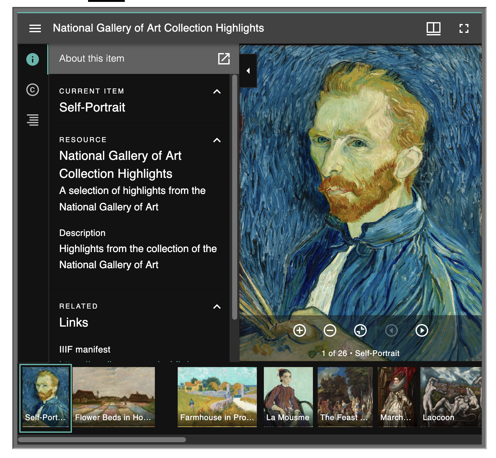

The viewer in the light theme, with the sidebar not visible:

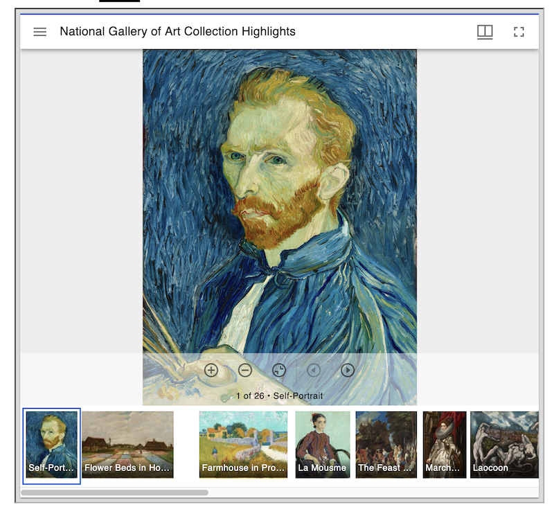

### Sections added by modules

If you see extra sections on this page added by modules, go to the specific module's page in this user manual for more information on configuration. 
