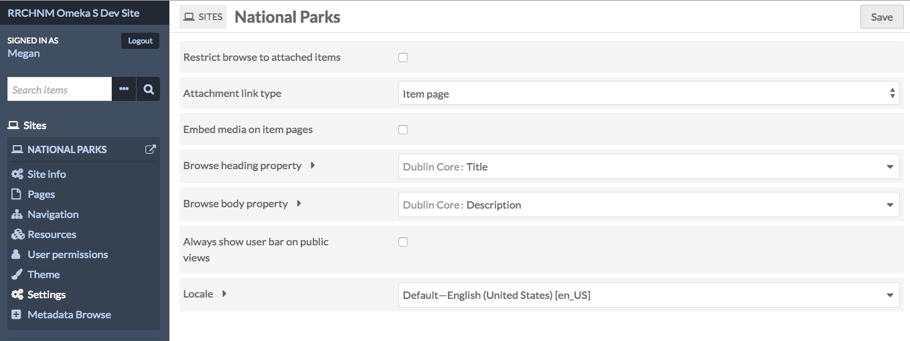

This tab allows you to configure settings for the [site](../sites/index.md) overall. These settings include browse options, links, and the option for a user bar on the public side of the site.

## Restrict browse to attached items
A checkbox. If checked, the Browse functions of your site will only show items which have been added to a page block. If unchecked, browse pages and blocks on your site will include all items in the Item Pool.

## Attachment link type
Sets the target of links from attachments you add to [site page blocks](../sites/site_pages.md#editing-pages) (for example, in an [item showcase](../sites/site_pages.md#item-showcase). It offers a dropdown with the following options:

- *item page:* clicking on the attachment takes users to the item page associated with the attached media;
- *media page:* clicking on the attachment takes users to the media page; 
- *direct link to file:* clicking on the attachment takes user to the file alone. 

## Embed media on item pages
A checkbox. When checked, any linked media (such as videos) will be embedded on the item pages. When unchecked, site visitors will click through to view playable media.

## Browse heading property
Set which property to use as the heading for each resource on a browse page. By default, this is Dublin Core: Title. The dropdown allows you to select from all available vocabularies, and includes a search bar to quickly find the desired property.

## Browse body property
Set which property to use as the body text for each resource on a browse page. By default, this is Dublin Core: Description. The dropdown allows you to select from all available vocabularies, and includes a search bar to quickly find the desired property.

## Always show user bar on public views
A checkbox. When checked, the public views of the site will have a header bar which either displays navigation options (for logged-in users) or a login option (for logged-out users)

- When users are logged in, the user bar has the following options:
	- Installation Title: takes you back to the installation admin
	- Site Title: takes you back to the landing page for managing the site (site/show).
	- User's display name: takes you to your user page.
	- Logout: logs out current user.

- When users are not logged, the user bar only displays a login option.

## Locale
A dropdown menu to select the language code for this site. By default this will be set to the same as the global locale setting for the entire Omeka S installation. To change, select a language from the dropdown menu.