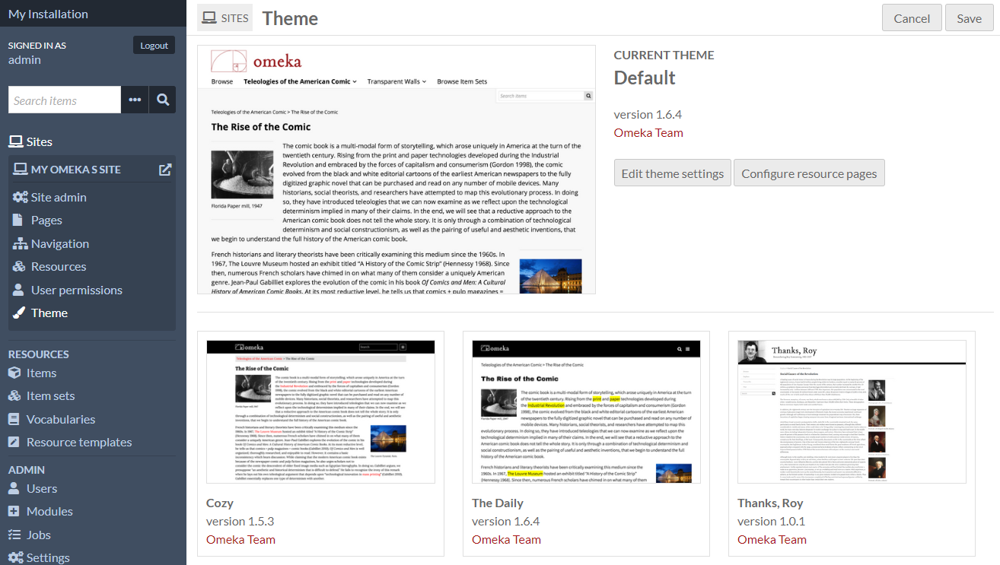
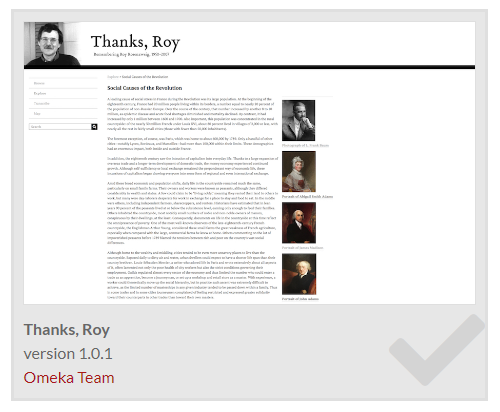
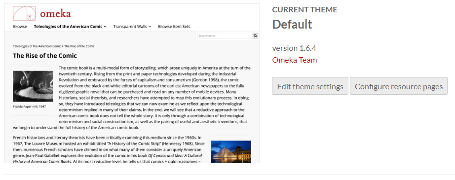
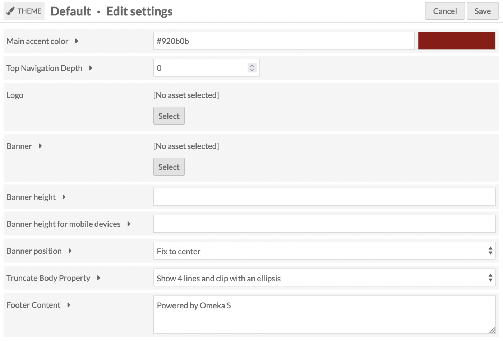
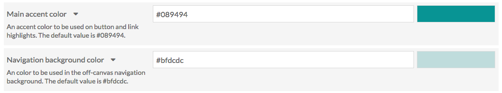
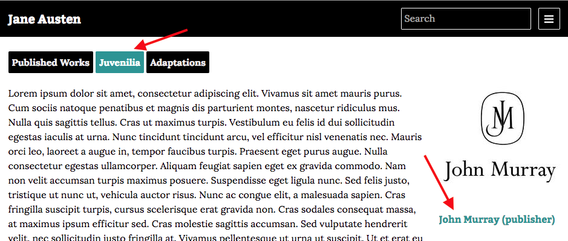
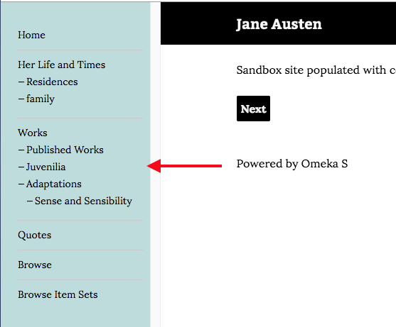
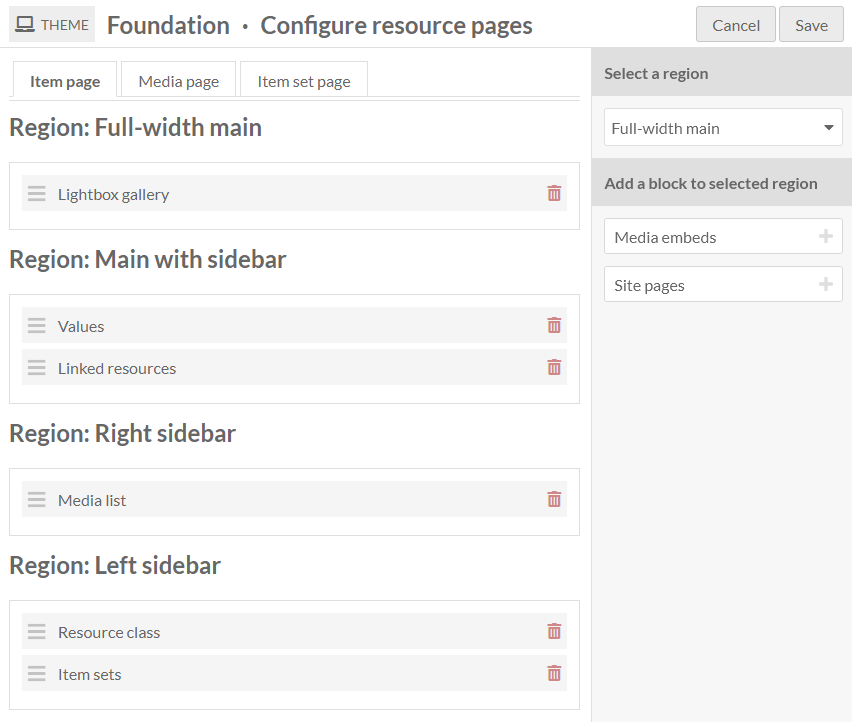
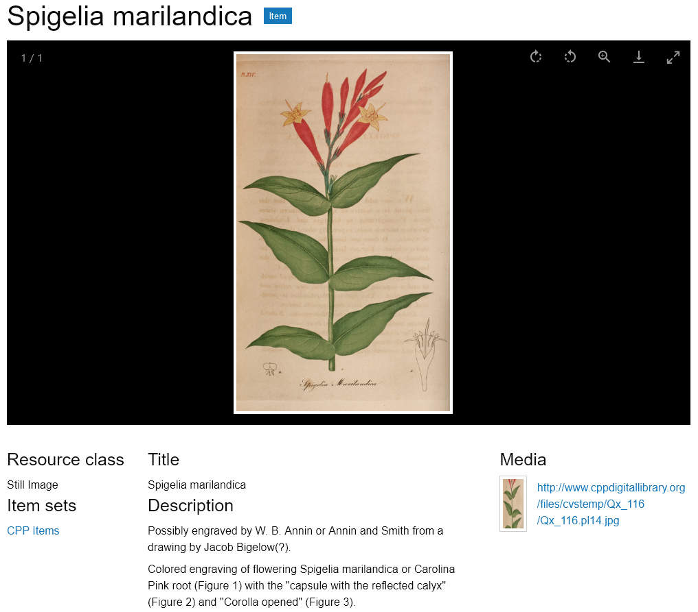

# Themes

The Theme section of each Site menu allows you to select the theme for your site, and to set theme-specific settings. Each site on your Omeka S installation can have a separate theme and numerous customizations. A fresh Omeka S install comes with one theme, called Default.

## Install themes

In order to appear on the **Themes** page for sites, themes must be manually added to the `/themes` folder of the installation, using an FTP program or an SSH connection.

To add a theme to the site using FTP:

1. Download the zipped theme to your computer.
1. Open your FTP client, log on to the server that houses the Omeka S install and navigate to the `/themes` folder (this should be located in the main folder of the install).
1. Upload the zipped theme to the `/themes` folder.
1. Unzip the theme.
1. You can delete the zipped file if it remains on your server.
1. When you navigate to the Themes page of the Sites menu, you should see your newly added theme represented there.

!!! note
	The folder that appears in the `/themes` folder should show the name of the theme, without any version numbers. If you are having issues installing a theme, check that you have unzipped the theme correctly, without creating extra folder levels.

You can also use SSH to clone a theme directly from that theme's git repository. Do this only if you are comfortable with git, GitHub, and working with SSH. You can find links to each theme's GitHub repository on [our website's Themes directory](https://omeka.org/s/themes/){target=_blank} - click on a theme and look above the version history table.

To **uninstall a theme**, simply delete the folder from the `/themes` directory in your Omeka S installation. All settings on that theme, from all sites, are saved elsewhere and will not be deleted. This means you can reinstall the theme again at a later date and recover your settings.

To **update a theme**:

1. Download the new version of the theme you would like to update.
1. Open your FTP client and log on to the server that houses the Omeka S install.
Navigate to the `/themes` folder.
1. Move the old copy of the theme to your computer.
1. Upload the zipped folder for the latest version of the theme to the `/themes` folder.
1. In your FTP client, unzip the new version theme.
1. On the Omeka S installation dashboard, go to a Site, then to the Themes page, and verify that you are seeing the new version of the theme.
1. Check to be sure your settings have been preserved and there are no errors. After this, you can safely delete the old theme folder that you saved to your computer.

## Select a theme

Currently installed themes will be available for selection in the process of [adding a new site](../sites/index.md). Click to the "Theme" tab before saving to select one, then save your site. If you do not select a theme, your new site will use the Default theme.

When you navigate to the Theme screen of a site, the currently active theme will appear on the top of the page.

A large image of the active theme appears on the left, with the theme title, version, creator, and two buttons to the right: "[Edit theme settings](#edit-theme-settings)" and "[Configure resource pages](#configure-resource-pages)".

Below the current theme are tiles for all other installed themes. The tiles have a small image of the theme in action, the theme name and version, and a link to the creator of the theme.

To switch themes, click on the theme you want to use. It will highlight slightly in gray, with a checkbox in the lower right-hand corner of the theme tile.

Click the "Save" button in the upper right-hand corner of the window to save changes. Click the "Cancel" button to leave without saving your changes.

Once you have selected a new theme and saved the page, you will have the options to "Edit theme settings" or "Configure resource pages" for that active theme.

## Edit theme settings

Theme settings allow you to customize aspects of the site's theme, such as adding a logo to the top or writing footer text.

To edit the settings of your selected theme, click on the button labeled "Edit theme settings" to the right of the current theme thumbnail.

Note that your settings for a specific theme on a site will be saved when you change themes. For example, if you customized the footer for the Default theme, then switched to using The Daily for a while, then switched back to the Default theme, your custom footer will still be there.

### Settings

Depending on which theme you have selected, you may see the following options:

#### Logo

(All themes)

Upload an asset to function as a logo in the header of your site. Allowed file types are: jpg, gif, png, svg, and svgz.

This asset is not associated with any of the items, and will be stored separately; once uploaded to a site you will be able to select it again without re-uploading even if you change themes for a while. Any asset uploaded to one site will be available for all sites on the installation.

To upload a logo, click the "Select" button. This will open a sidebar where you can either upload a new file from your computer or choose from assets already uploaded to the installation.

Note that the logo may completely replace the header, including the site title, for the site, so you may want to consider an image with text if it is important to you that users see the site title.

To remove a logo, click the "Clear" button in that block (only visible when a logo is active) and save your changes.

#### Banner

(All themes)

Upload an asset to display across the top of each page of your site. This may be a logo, or a visual accent. In some themes this image sits behind text. This is sometimes called "header" rather than a "banner".

Most themes also allow you to configure the position of the banner, or its height. 

#### Footer content

(All themes)

A text field in which you can enter content to appear in the footer of the site.

By default, the message is "Powered by Omeka S".

You can add HTML formatting to the text by manually adding the tags.

#### Top navigation depth

(Default, Cozy, Foundation)

Top Navigation Depth allows you the limit the depth of the top navigation menu on the public side of the site.  The default setting, 0, does not restrict the number of levels of the top navigation menu. Setting it to one would only show the top-level pages or links of your site.

#### Color selection

(Default, Cozy, The Daily, Thanks Roy, Freedom)

The themes Default, Cozy, and The Daily include an option to enter values for the **main accent color**; Cozy also has an option for the **navigation background color**. Thanks Roy has eight separate color choices. 

The Main Accent color is used for link text and on-hover colors, as in the image below:

The navigation background color sets the color of the navigation sidebar for the theme.

Edit either field by typing a color value into the field. Either a triplet or a six-character hexadecimal code will work. Once you have entered a valid value, the color bar on the left will automatically update to show the color entered, even without saving changes.

The default values are stored in the prompt text for the field. For the Cozy theme, the main accent color is `087b94` and the navigation background color is `bfdcdc`.

#### Layout for browse pages

(Center Row, Foundation, Freedom)

Select how to display items within their browse views.

* **Grid**: Items are organized into rows and columns. This is recommended for items that prominently feature images.
* **List**: Items are stacked into a single column.
* **Toggle** (default grid): Site visitors can choose to display the browse views as grids or lists, with grids as the default.
* **Toggle** (default list): Site visitors can choose to display the browse views as grids or lists, with lists as the default.

#### Truncate Body Property 

Set how much of the browse body property displays on the browse page, and in the browse preview page block. You can:
	* **Show full value** which displays all of the property text.
	* **Show 4 lines and fade out** which displays 4 lines of text with a fade at the end of the text block.
	* **Show 4 lines and ellipsis** which displays 4 lines of text concluding with an ellipsis (...).

Note that fading out to white may not display well if your browse preview page block has a background color or image. 

#### Media Caption in Viewer

Allows you to select which metadata field (from Dublin Core Title or Dublin Core Description) appears with the content in the Lightbox gallery viewer where it appears (e.g. item view pages). 

### Foundation theme settings

Foundation is a theme that comes with a few default stylesheets for fast prototyping or getting started with modifying themes. As a result, it has some unique settings. For more information on using Foundation, including working with Sass, see the [theme ReadMe file](https://github.com/omeka-s-themes/foundation-s/blob/master/README.md){target=_blank}.

Settings not described above:

* **Stylesheet:** The theme provides 4 style options.
	  * **Default** uses ZURB Foundation's default styles for prototyping, which are all viewable in their documentation under the [Kitchen Sink](https://get.foundation/sites/docs/kitchen-sink.html){target=_blank}.
	  * **Revolution** aims to capture the feel of old documents and juxtaposes it with a bright red accent. It includes a textured paper background image.
	  * **Sea Foam** offers a clean, friendly look with a teal palette.
	  * **Inkwell** features a high contrast serif family for its typography, as well as sunny yellow accents.
* **Navigation layout:** Global navigation can display as a **horizontal top bar with optional dropdown menus** or a **left vertical column**.
* **Show Top Navigation Child Pages:** Toggle display of child pages within the main navigation. If unchecked, only the top-level navigation will display.
* **Metadata Layout for Show Pages:** Resource metadata can show display as **stacked** with properties as headings above their values, or **inline** with properties as headings inline with their values.

Foundation also models significant theme customization tools for developers, including the most development on page and block templates. Foundation includes the following block templates:

* Asset
	* Card: Uses [Foundation Framework's card container](https://get.foundation/sites/docs/card.html){target=_blank} styles.
	* Media object: Uses [Foundation Framework's media object container](https://get.foundation/sites/docs/media-object.html){target=_blank} styles.
* Browse preview
	* List: Ignores theme setting for browse view layouts and displays all resources as a single column list.
	* Grid: Ignores theme setting for browse view layouts and displays all resources in a grid that maxes out at 4 columns.
	* Toggle (default: list): Ignores theme setting for browse view layouts and lets the user choose their browse style, defaulting to a single column list of resources.
	* Toggle (default: grid): Ignores theme setting for browse view layouts and lets the user choose their browse style, defaulting to a grid of resources maxing out at 4 columns.
* Item with metadata
	* Large media left: A 2-column layout with the item media rendered to the left of the metadata.
	* Large media right: A 2-column layout with the item media rendered to the right of the metadata.
* List of pages
	* With container: Provides a gray box container.
* List of sites
	* Card: Uses [Foundation Framework's card container](https://get.foundation/sites/docs/card.html){target=_blank} styles for each site.
* Page title
	* Accent: Renders the page title with the theme's primary color as a background color.

And the following page templates:

* Default: Constrain the page content to a width of 1200 pixels, if the navigation is set to "horizontal dropdown" rather than "full height column". This will include page subnavigation inside the 1200 pixels if it is displayed.
* Full-width: Occupy all available width in the browser window, minus the vertical navigation column if applicable. Page subnavigation will appear above page content rather than beside it.

## Configure resource pages

Within a site it is possible to configure the blocks of content that appear on the resource pages: the item page, the media page, and the item set page.

Individual themes will define the available regions (for example, Main or Sidebar) where blocks may be placed. Some themes may not offer these options.

These settings are available to [site Managers](../sites/site_users.md), as well as [installation Supervisors and Global Administrators](../admin/users.md).

When on the Theme page of a Site, your current theme will appear at the top, with two buttons on the right: "Edit theme settings" and "Configure resource pages." Select the "Configure resource pages" button to modify how these pages will display in this theme.

Note that your settings for a specific theme on a site will be saved if you change themes. For example, if you customized the item page for the Default theme, then switched to using Foundation for a while, then switched back to the Default theme, your item page settings would be retained.

### Select regions and blocks
In the right-hand drawer, select a region from the dropdown menu, and then add a block to it from the list of available blocks by clicking on the block name. Blocks may be reordered or moved to other regions by dragging and dropping.

To remove a block, click the delete icon and then save the page. It will once again appear in the right sidebar.

The image below shows the "Configure resource pages" screen with the "Item page" tab selected. The right sidebar includes a dropdown menu to select a region and a list of the remaining possible blocks to be added to the page. The Foundation theme is being used and there are four regions: Full-width main, Main with sidebar, Right sidebar, and Left sidebar.

If you put no content in a specific region, such as a sidebar, it will not appear, and the other regions will expand to occupy the space.

You can use the [CSS Editor module](../modules/csseditor.md) to modify the relative widths or other display properties of regions you choose to use, such as setting different background colors, adding borders, or configuring separate text styles. Use your browser inspection tool to identify regions to call: for example, in the Foundation theme, the regions are identified with classes `.full-width-main`, `.left-sidebar`, `.main-with-sidebar`, and `.right-sidebar`. 

Keep in mind that other theme settings and site settings may also combine with how these pages display information. For example, the Foundation theme includes a setting on whether to stack a property and its value (e.g. displaying "Description" on one line and the description content on the next line, or the two on the same line) that may influence your decision of where to place the "Values" block in the page regions.

You can also use the CSS Editor to style specific blocks within those regions (such as the `.resource-class` block), and the metadata properties (`.property`) within the "Values" block. Values (`.value`) are displayed with a CSS class indicating their data type (such as `.literal`), and you can also style `.language` indicators, the `.has-annotation` icon, etc. 

### Available blocks

A basic Omeka S installation will create the following configurable blocks, but modules may also add their own blocks. For example, the [Mapping module](../modules/mapping.md) will allow you to reposition the map on item and item set pages (not media).

If a block would be empty of content (for example, if there are no linked resources, no media, nothing set as a resource class, or no site pages), it will not display on that particular item.

#### Item page

Available blocks:

- Item sets: display the list of item sets that contain the item.
- Lightbox gallery: show attached media using the Lightbox gallery viewer.
- Linked resources: display a filterable table of resources that are linked to the item.
- Media embeds: show all of the attached media as embedded files.
- Media list: show the attached media as a list with thumbnail and title.
- Site pages: display the list of all site pages where the item is attached.
- Resource class: display the resource class of the item.
- Values: display all item property values.

The image below displays the public item page in the Foundation theme, with the blocks set as in the screenshot above: Lightbox gallery in the Full-width main region; Values and Linked resources in the Main region; Media list in the Right sidebar region; Resource class and Item sets in the Left sidebar region.

#### Media page

Available blocks:

- Lightbox gallery: show the media using the Lightbox gallery viewer.
- Linked resources: display a filterable table of resources that are linked to the media.
- Media render: show the current media.
- Resource class: show the resource class of the media.
- Values: display all media property values.

#### Item set page

Available blocks:

- Values: display all media property values.
- Resource class: show the resource class of the item set.
- Linked resources: display a filterable table of resources that are linked to the item set.

The item set view page will always contain a list of items contained in the item set, which can be found with the CSS class `item-set-items` in some themes. This area does not appear as a configurable block in the administrative side, and must be located by looking at the public site. In most themes it appears below the configured regions, but in some it will appear in a column alongside the regions. 