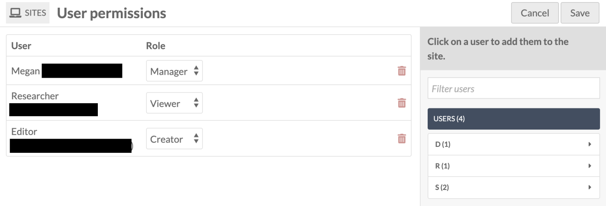
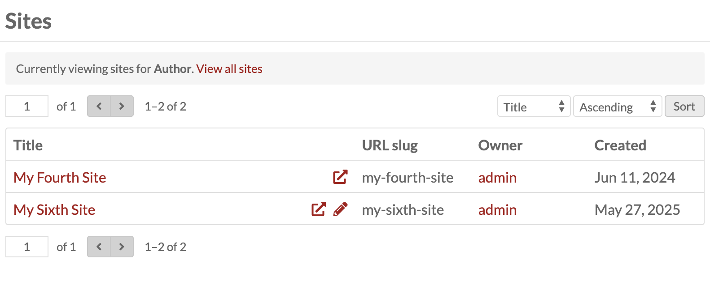

# Site Users

Sites have specific user settings that are separate from the [user roles set at an installation-wide level](../admin/users.md). Users must be added at the installation level, then added to each site individually that you would like them to have access to. 

Global Admins and Supervisors have all permissions on all sites. Other user roles in Omeka S (Editor, Reviewer, Author, Researcher) are unrelated to site-specific user roles (Manager, Creator, Viewer). For example, a user set to Researcher in the installation can nevertheless be set as a Manager of a site, which means they can delete that site. 

Setting a user (at the installation level) to have a default site for their items will not give them a site role. 

To add a user to a single site, navigate to the **User Permissions** tab after selecting your intended site.

A drawer on the right hand side of the screen shows all of the users for your install, sorted by the first letter of their display name. 

To add a user, click on their name. Then select their role from the dropdown:

* **Viewer**: Can see a site's entry in the list of sites, even if the site's visibility is set to private, but cannot make any modifications.
* **Creator**: Can access and edit all of the site's properties, that is, everything available from the site-specific submenu. (This role was called "Editor" in Omeka S versions 1.x-2.x.)
* **Manager**: Has full administrative privileges for the site, including adding/removing users and deleting the site. (This role was called "Admin" in Omeka S versions 1.x-2.x.)

You can add or revoke privileges for users by going back to the User permissions tab and selecting or deselecting the boxes and clicking "Save". Users can be deleted from the site by clicking the trash can icon on their row, and confirming the deletion in the drawer that appears.

Once you've added one or more users, click the "Save" button located in the upper right hand corner. To cancel your changes, click the "Cancel" button in the upper right hand corner. 

You can also use the "Admin > Users" interface to [batch-edit user options](../admin/users.md#batch-editing), which includes adding/removing one or more users to a site, and changing the site-specific role.

## User views

Lower-level users will, at first, only see sites for which they have some kind of permission set. They can choose to view all the sites on the Omeka S installation by clicking the "View all sites" link in the grey bar. Note that in the example image below, the user has editing permissions for one site (indicated by the pencil icon) and only viewing privileges for the other (no pencil icon). 

They can choose to view all the sites on the Omeka S installation by clicking the "View all sites" link in the grey bar. Note that they will not see sites with visibility set to private, if they do not have access already. 