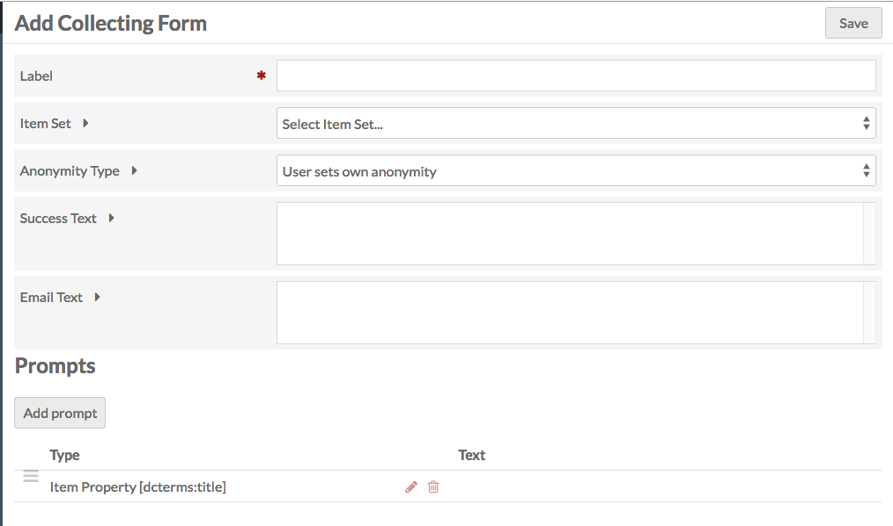

The Collecting module allows you to gather public contributions through your sites. 

Once activated on the [modules](../modules/modules.md) tab of the admin dashboard, Collecting is configured on a site-by-site basis.

Managing Collecting Forms
-----------------------------
If Collecting is active, then a tab for Collecting will appear in the context menu for every site. 

Clicking on this will take you to a list of your collecting forms for that site. If you have just installed the module, the Collecting Forms page will display the message "This site has no collecting forms." To add a new form, click the *Add new form* in the upper right hand corner of the window.

### Add New Form
The Add Collecting Form page has two sections: the first has a set of fields and options for you to complete; the second is where you add and edit the prompts which will make up the form that site visitors see and fill out.

**Fields and Settings:**
- *Label*: name the collecting form. The label will appear as a header above the form on the public side, so the label should be descriptive and helpful to both you and site visitors. 
- *Item Set*: select the item set to which you want to add collected items.
- *Anonymity Type*: a dropdown with three options:
     - "User sets own anonymity":users can decide whether they contribute anonymously and whether their items can be published).
     - "User Public and User Name inputs are publicly visible": both the user's name and their items will be made public
     - "User Public and User Name inputs are private": both inputs remain public. 
 - *Success Text*: the message that displays on a new page if the item is successfully collected.
 - *Email text*: the message in the email that will be sent to site visitors who submit an item, if you collect an email address from them.

**Prompts**
Prompts are listed in a table which gives their *Type* and the display *Text* on the public form. These prompts make up the form which site visitors will see (in addition to the label, discussed above).

To add a new prompt, click the *Add prompt* button just below the Prompts header. This will open a side drawer with a dropdown to select prompt type.

On selection, the options for that type will load in the sidebar for you to edit, with a Save Changes button at the bottom of the options. 

The Collecting module has Prompt Types with options as follows:

*Item Property*: a property from the installation's vocabularies. Options:
     - Property: select a property from the vocabularies (example: Description)
     - Prompt Text: If you want the prompt to be something other than the property label.
     - Input type: options are "text boxs