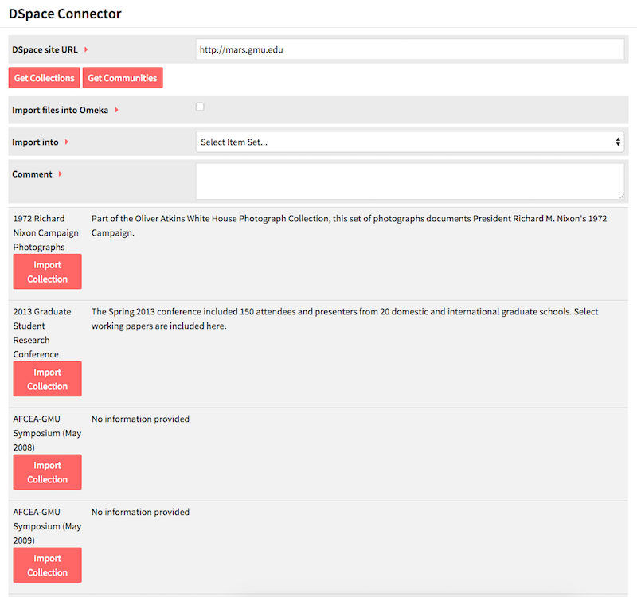

DSpace Connector is a [module](modules/modules.md) for Omeka S which allows you to connect an Omeka S instance to a DSpace repository to import items from containers in that repository. In addition to importing information, the Omeka S item will include a link back to the original item.

To install DSpace Connector, follow the instructions for [Installing Modules](../modules/modules.md#installing-modules) on the Modules documentation. Following a successful installation you should be redirected to the configuration page for DSpace Connector.

Note that DSpace Connector only works with DSpace versions 4 and higher.

You can view past imports by going to the DSpace Connector tab on the left-hand navigation of the admin dashboard and clicking the *Past Imports* sub-tab.

## Import Data
To use DSpace Connector, navigate to the tab labelled *DSpace Connector* on the left-hand navigation of the admin dashboard. This will automatically take you to the Import sub-tab.

You should see a screen with the following options:

* *DSPace site URL* for the Repository (required);
* Button options to *Get Collections* or *Get Communities*
* *Import files into Omeka* checkbox, check yes if you want to import media and other files attached to content (optional, recommended);
* *Import into* a selected [Item Set](../content/item-sets.md), if desired (optional). 
 * Note that the Item Set must already exist in order to import into it.
* *Comment* for example, any notes to yourself or other users of the installation (optional);

To import from a DSpace Repository:
 1.  Enter a URL into the *DSpace site URL* field and then click either *Get Collections* or *Get Communities*, depending on your preference. Note that you have to enter the entire url, including the “http://“. This will load the collections or communities below the other options. 
1. If you want to import files as well as data, check the *Import files into Omeka* box.
1. If desired, select an [Item Set](../content/item-sets.md) to which you want the imported items to be added.
1. Add any comments.
1. Click the *Import Collection* button for the collection you want to import.

You can track the status of the import by navigating to the DSpace Connector > Past Imports tab or on the [Jobs](../jobs.md) tab of the left-hand navigation on the admin dashboard.

## Review Imports
Go to the DSpace Connector tab on the left-hand navigation of the admin dashboard, click on DSpace Connector and then click on Past Imports, which should appear below the DSpace Connector tab.

This page displays a table of Past DSpace Imports, with their *Job ID*, the repository’s *Dspace Collection Link*, any *Comments* made during import, the number of *Items* imported, the *Date* of the import, the import *Status*, and the *Owner*, or user who initiated the import.

## Undo an Import
To undo a completed import and remove all associated items, go to the DSpace Connector tab on the left-hand navigation of the admin dashboard, click on DSpace Connector and then click on Past Imports, which should appear below the DSpace Connector tab.

This table shows you all previous 

Check the box for each import you wish to undo and click submit.

