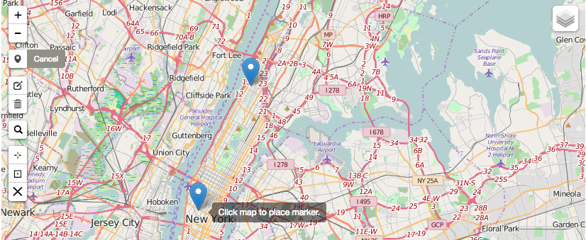
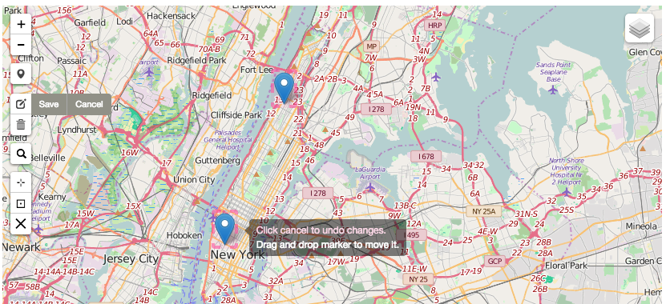
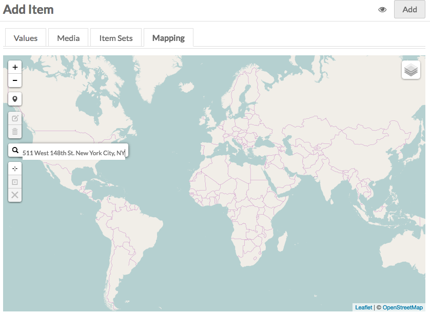
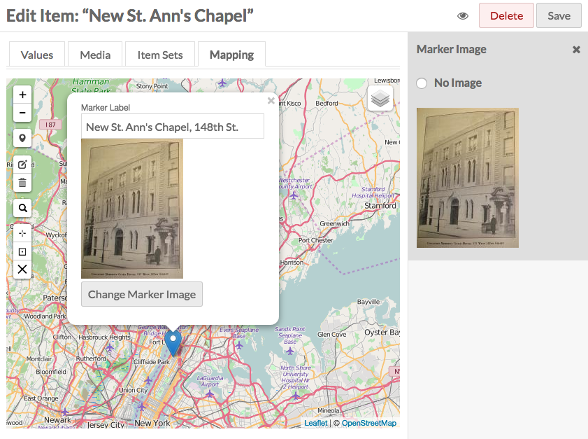
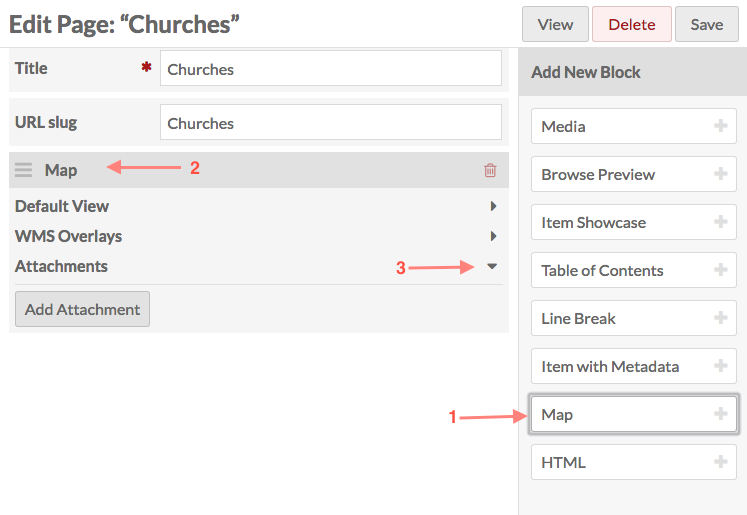
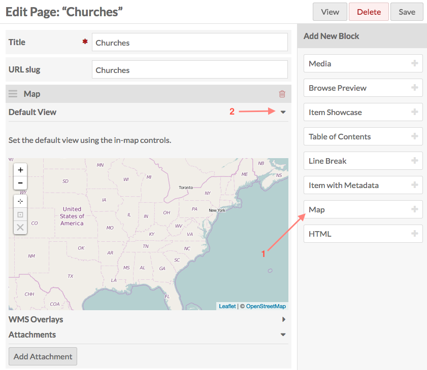

Mapping is a [module](../modules/modules.md) for Omeka S which allows you to geolocate Omeka S items and add interactive maps to [Site Pages].

To install Mapping, follow the instructions for [Installing Modules](../modules/modules.md#installing-modules) on the Modules documentation.

## Adding Geolocation to an Item

To add a map to a new or existing item, click to edit the item. Navigate to the  _Mapping_ tab to add a map to the item. Selecting the tab will open the map interface.

### Manipulating the Map
Small white buttons on the left side of the map control and modify the appearance of the map. Hover over the buttons with the mouse to view tool-tips.

* _Zoom in_: The small white square with a black plus sign. Each click zooms in one step.
* _Zoom out_: The small white square with black minus sign. Each click zooms out one step.
* _Draw a Marker_: The small white square with black bubble marker. When you click the button your pointer becomes a blue marker. Click again on the map to place the marker. An item can have multiple markers on its map.[See Figure 1 below.]
* _Move Marker_: The small white square with black box and pencil icon. This option is only available after a marker has been added. Click the button and a pink box appears around each marker. Click a marker to move it. Click again to place. Use the grey buttons to _Save_ or _Cancel_. [See Figure 2 below.]
* _Delete Marker_: The small white button with a trashcan icon. This option is only available after a marker has been added. Click the icon to select a marker. Click the marker to be removed and it will disappear. Use the grey buttons to _Save_ or _Cancel_ these changes. [See Figure 3 below.]
* _Search Address_: The small white square with a black magnifying glass icon. Click to enter an address in the search bar. Hit enter to locate. [See Figure 4 below.]
* _Set the current view as default view_: The small white square with a target or crosshair symbol. The map will default to a very zoomed out (global) view. Click to set the current view as the default view.
* _Go to current default view_: The small black square with a black box around a dot. The This option is only available after you have set a default view. Click to pan and zoom map to the selected view.
* _Clear the default center and zoom level_: The small white square with a black "X". This option is only available after you have set a default view. Click to clear pan and zoom preferences and return to the initial global view.
In addition to these options, you can also navigate the map using your mouse or trackpad by scrolling to zoom and clicking and dragging to pan.

####Drawing a Marker [Figure 1]

####Move a Marker [Figure 2]

####Delete a Marker [Figure 3]

####Search Address [Figure 4]

### Modifying the appearance of a Marker
The appearance of existing markers may be modified. Click the Marker to open a dialog window. 
* Enter descriptive text in the text field. 
* To add an image to the marker click _Select Marker Image_ to select an image from the media uploaded to this item. 
      * Note: the item must have image media attached in order to select an image. 

## Adding Items to a Page in a Site
To add a map to a new or existing page, click to edit the page. On the right, under _Add New Block_ , click the  _Map_ tab to add a map to the item [1]. Selecting the tab will open the map block to the page [2]. This block includes customizable features for the map in collapsable panes. Click the triangle to expand or collapse these fields [3]. 

* _Default View_: Small white buttons on the left of the map interface set the default view for the map.
    * _Zoom in_: Each click zooms in one step.
    * _Zoom out_: Each click zooms out one step.
    * _Set the current view as default view_: The map will default to a global view. Click to set the current view as the default view.
    * _Go to current default view_: This option is only available after you have set a default view. Click to pan and zoom map to the selected view.
    * _Clear the default center and zoom level_: Click to clear pan and zoom preferences and return to the initial global view.

* _WMS Overlays_: Add, edit, and delete Web Map Service (WMS) overlays.
    * _Label_: Create a unique, descriptive label for the map overlay. This will be visible to visitors and should be used to differentiate between overlays. _Base URL_: Add a URL to the WMS map.
    * _Layers_:
    * _Styles_:
    * Click Add Overlay to create the overlay. Click _Clear Inputs_ to clear each of the fields. Multiple overlays can be added. Choose a default overlay by checking the box next to it. Edit or delete an overlay click on the red pencil edit button, or click the red trashcan icon to delete..

* _Attachments_: Markers are added to the map using  _Items_.
    * After Items have been mapped, click _Add Attachment_ to select them from a list on the right. 
    * Clicking an item adds it to a list in the Attachments pane.
    * Click and drag items in this list to reorder them. 
    * Delete items by clicking the red trashcan. 

