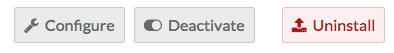
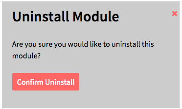

Modules extend the functionality of your Omeka S installation and sites. 

[List of modules](../modules/modules_list.md)

## Managing Modules

To see what modules are installed on your Omeka S site, click on the Modules link on the left-hand navigation of your [admin dashboard](../admin-dashboard.md)

Note that only Global Administrators can install and manage modules. Site Administrators can browse installed modules. Other users do not have access to this tab.

Any modules which have been installed on the Omeka S install should appear in the list of Modules. Each module displays the name of the module with the version number, creator, and a summary of its function. 

There are multiple buttons which can appear to the right of a module’s label. Each button has both an icon and a label describing its action:
* *Configure* (a wrench icon): some modules have settings which can be adjusted. Click this icon to adjust settings for the module in this row.
* *Activate/Deactivate* (sliding switch): when a module is active, the slider area background is transparent and the switch is to the left. When inactive, the background of the slider area background is opaque and the switch is to the right.
* *Install/Uninstall* (arrow and rectangle): use this button to install or uninstall a module. When the arrow is coming from the rectangle, the button will uninstall the module. When the arrow is pointing into the rectangle, the button will install the module.

## Installing Modules
### Add the Module to Omeka S
In order to appear on in the *Modules* table on the Modules tab of the Admin Dashboard for your Omeka S installation, modules must be manually added to the modules folder of the installation, using an FTP program or an ssh connection.

To add a module to the site using FTP

1. Download the zipped module to your computer.

1. Open your FTP client, log on to the server that houses  the Omeka S install and navigate to the /modules folder (this should be located in the main folder of the install).

1. Upload the zipped module to the /modules folder 

1. Unzip the module

You can also use git to clone a module directly from the git repository. Do this only if you are comfortable with git.

### Install the Module
To install a module, navigate to the Modules tab on the left-hand navigation of the admin dashboard of your Omeka S installation.

Find the module in the table and click the install button.

The module is now installed. You should see a success message once the page reloads. For modules with configuration options, you will be taken immediately to the configuration page for that module. For all other modules the Modules page will simply reload. On the Modules page, the *Status* of the module should change from “Not Installed” to “Not Active”

Modules are automatically activated when installed. 

### Activating Module
If you have a module which is installed but inactive, click the activate button to use the module.

You should see a success message once the page reloads, and the *Status* of the module should change from “Not Active” to “Active”

## Configuring a module
Some, but not all, modules include the option to configure settings for that module. If an active module displays the *configure* (wrench) button, you may configure that module.

Information regarding configuration options for individual modules can be found on the documentation page for those modules.

## Uninstalling a module
Removing a module is essentially installing in reverse:
1. Deactivate the module by clicking the *deactivate* button
1. Uninstall the module by clicking the *uninstall* button
1. A drawer will open on the right side of the window asking you to confirm that you want to uninstall the module. Click “Confirm Uninstall” to continue.

The uninstalled module will continue to appear on your Modules page unless the folder for the module is removed from the /modules folder on the Omeka S installation, which can be done via FTP or SSH.
