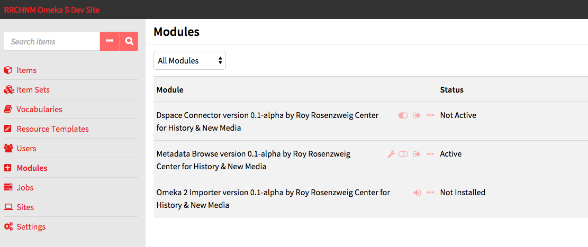
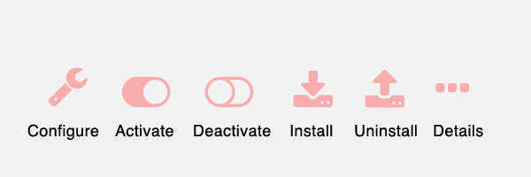
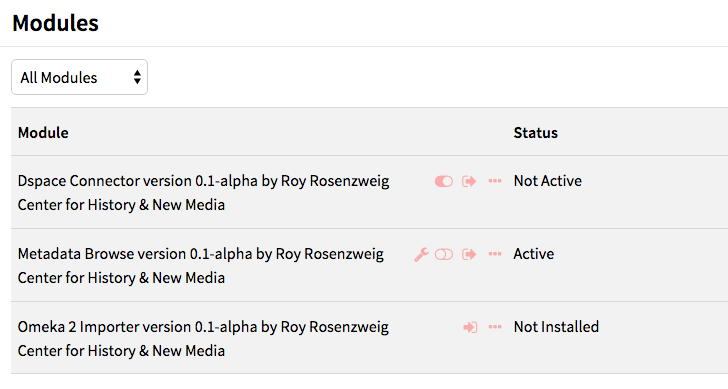

To see what modules are installed on your Omeka S site, click on the Modules link on the left-hand navigation of your administrative dashboard. 

Note that only Global Administrators can install and manage modules. Site Administrators can browse installed modules. Other users do not have access to this tab.

Any modules which have been installed on the Omeka S install should appear in the Modules table. This table has headings for the for *Module* name and author and for its *Status*, including Not Active, Active, and Not Installed.

There are multiple buttons which can appear to the right of a module’s title:
* *Configure* (a wrench icon): some modules have settings which can be adjusted. Click this icon to adjust settings for the module in this row.
* *Activate/Deactivate* (sliding switch): when a module is active, the slider area background is transparent and the switch is to the left. When inactive, the background of the slider area background is opaque and the switch is to the right.
* *Install/Uninstall* (arrow and rectangle): use this button to install or uninstall a module. When the arrow is coming from the rectangle, the button will uninstall the module. When the arrow is pointing into the rectangle, the button will install the module.
* *Details* (ellipses): clicking this button will open a drawer on the right side of the screen with the module’s title and a brief description of what it does.

In the following image, DSpace connector is *Not Active*, Metadata Browse is *Active* and can be *Configured*, and Omeka2Importer is *Not Installed*.

## Installing Modules
### Add the Module to Omeka S
In order to appear on in the *Modules* table on the Modules tab of the Admin Dashboard for your Omeka S installation, modules must be manually added to the modules folder of the installation, using an FTP program or an ssh connection.

To add a module to the site using FTP

1. Download the zipped module to your computer.

1. Open your FTP client, log on to the server that houses  the Omeka S install and navigate to the /modules folder (this should be located in the main folder of the install).

1. Upload the zipped module to the /modules folder 

1. Unzip the module

You can also use git to clone a module directly from the git repository. Do this only if you are comfortable with git.

### Install the Module
To install a module, navigate to the Modules tab on the left-hand navigation of the admin dashboard of your Omeka S installation.

Find the module in the table and click the install button.

The module is now installed.

### Activate the Module

