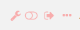

To see what modules are installed on your Omeka S site, click on the Modules link on the left-hand navigation of your administrative dashboard. 

Note that only Global Administrators can install and manage modules. Site Administrators can browse installed modules. Other users do not have access to this tab.

Any modules which have been installed on the Omeka S install should appear in the Modules table. This table has headings for the for *Module* name and author and for its *Status*, including Not Active, Active, and Not Installed.

There are multiple buttons which can appear to the right of a module’s title:
* *Configure* (a wrench icon): some modules have settings which can be adjusted. Click this icon to adjust settings for the module in this row.
* *Activate/Deactivate* (sliding switch): when a module is active, the slider area background is transparent and the switch is to the left. When inactive, the background of the slider area background is opaque and the switch is to the right.
* *Install/Uninstall* (arrow pointing right from rectangle): use this button to install or uninstall a module.
* *Details* (ellipses): clicking this button will open a drawer on the right side of the screen with the module’s title and a brief description of what it does.

In the following image, DSpace connector is *Not Active*, Metadata Browse is *Active* and can be *Configured*, and Omeka2Importer is *Not Installed*.

## Installing Modules

