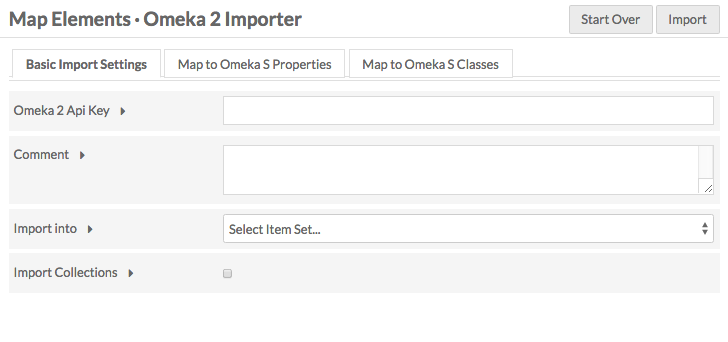
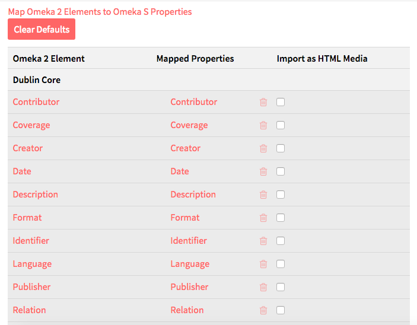
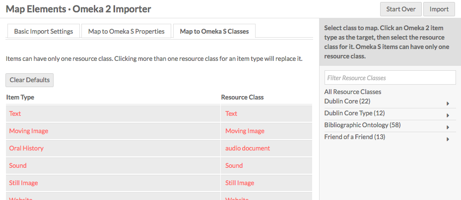
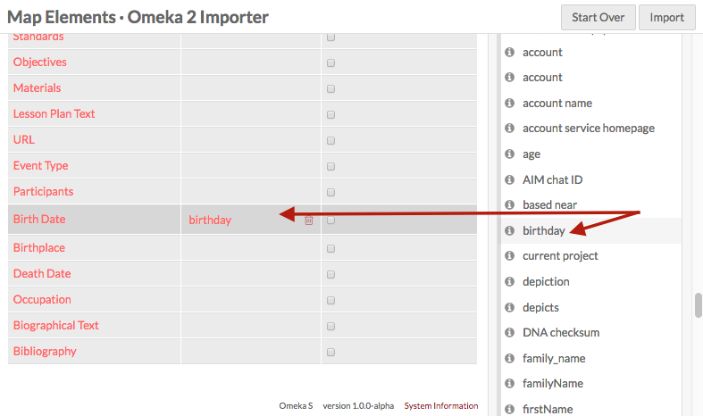
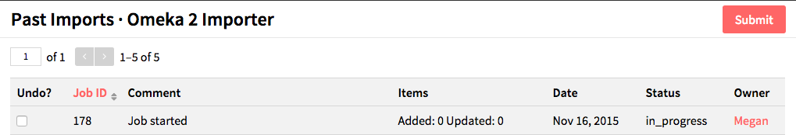

title: Omeka 2 Importer
---

The Omeka 2 Importer module which enables you to import items from an Omeka 2.x site into an Omeka S installation. 

For information on installing, see the instructions on the general modules page. 

Once installed, the Omeka 2 Importer module should appear toward the bottom of the left navigation menu on the main admin dashboard. When selected, there are sub-menu items for *Import* and *Past Imports*

# Import
From the Import tab you can start new imports. 

**Note** You must have API enabled on the source Omeka installation for the importer to work.

On the first page of the importer, enter the *Omeka 2 Api Endpoint* - the site URL for the API you wish to access (it should end with api). Make sure you enter the full url, beginning with http, otherwise the importer will not be able to access the items at that site. Click *next*.

If you have entered a valid API endpoint, the next page will load with no issue. If you have entered an invalid endpoint, the module will display error messages “Warning: Invalid argument”.

On the second page of the importer there is a block of basic import settings and a table which allows you to map specific Omeka 2 elements to Omeka S properties.

**Basic Import Settings**
* *Omeka 2 Api Key*: This field can either be blank or filled, depending on whether you have an API key for the site you are attempting to import data from.  
* *Comment*: You can add a comment such as “Jane Doe’s API, no key” to help identify the specific import when viewing previous imports.  
* *Import Into*: This option allows you to select a specific item set in which to import the items.   
* *Import Collections*: Check this box if you wish to import the collections from the Omeka 2 site to the Omeka S site.

The tables for mapping show the *Omeka 2 Element*, the *Mapped Properties* and a checkbox option to *Import as HTML Media*. There are tables for *Dublin Core*, *Item Type Metadata*, any other element sets in your Omeka 2.x installation, and a table to map Omeka 2 Item Types to Omeka S Resource Classes.

Most properties will automatically map. To clear the default mapping, click the *Clear Defaults* button. 

Custom item type elements may not map; you will need to manually map them. 

To map:
1. Select the element or item type in the table by click on its row.
1. In the  right-hand drawer, either click through or search for the property or class to which you want to map your element. 
1. Click on the property or class in the drawer to map it. 

To remove a mapping, click the delete (trash can) icon in the element/property row.

When you have finished customizing the mapping, click the *Import* button in the upper right corner of the window.

# Manage Past Imports
The past imports section of the module allows you to view previous API imports.

Each import is a row. The table has the following columns.

* *Undo*: Check this box if you wish to undo the import. Once you click submit, the status for that specific import will be undone.    
* *Job ID*: A numerical value assigned to each specific API import. You can also view the job under the Jobs tab on the administrative dashboard.  
* *Comment*: If you entered a comment in the Comment field in the Import section of the module, that comment will appear. If you typed "Jane Doe's API, no key" in the import section you will see it as a comment.  
* *Items*: Lists the number of items added and updated with each import.   
* *Date*: The date on which the import took place.   
* *Status*: Will be in_progress, completed, or undone.  
* *Owner*: The user who requested the import.