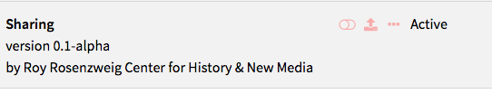
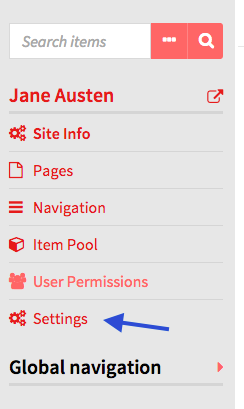
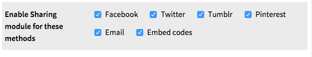
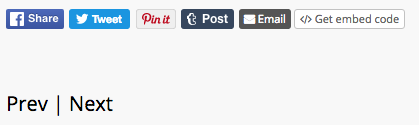
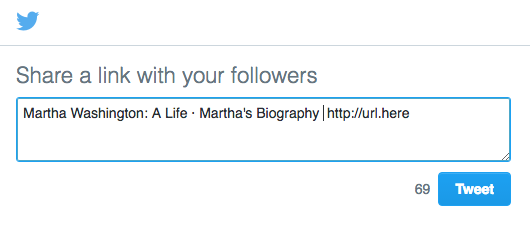

The Sharing module allows you to add buttons to site pages which  visitors can use to share and embed content from your site on social media or via email.

Currently, Sharing supports the following options:
- Facebook
- Twitter
- Tumblr
- Pinterest
- Email
- Embed codes

Once sharing has been installed and activated for an Omeka S install, it is available for all sites on the install. 

Configuration
--------------
Sharing settings are configured on a site by site basis. 

Go to the site for which you want to configure the plugin and click through to the edit site dashboard. Click on the Site Settings. 

There should be a section which looks like image below, with label *Enable Sharing module for these methods* and a series of checkboxes for each service or option.

Ensure that the correct boxes are checked for your site. You can uncheck all of the boxes to turn off sharing for your site. Be sure to save your changes. 

Sharing icons for enabled services and options will display at the bottom of pages you build as well as individual item/show pages on your site. 

By default, the module will share the page title, name of site, and name of installation. 
