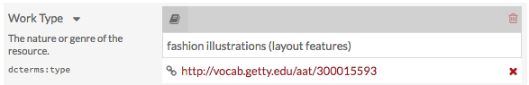

The ValueSuggest module adds an auto-complete feature to a specific property in a resource template and draws on controlled vocabularies from Library of Congress and Getty Collection.
This functionality helps those building an Omeka site to enforce consistent metadata input and data compatibility with other databases of records.

To install ValueSuggest follow the instructions for Installing Modules on the Modules documentation.

Create a Resource Template
--------------------
ValueSuggest vocabularies are applied through Resource Templates. For additional information on Resource Templates, see the [Resource Template Documentation](../content/resource-template.md).

1. From the Resources Templates tab in the Admin Dashboard, click the Add new resource template button. Add a label and assign a class. 
2. Add properties from the list of vocabularies in the menu on the right side of the screen. To add a vocabulary from the Library of Congress or Getty Collections to a property, select the data type for the element. Whichever you choose will be automatically loaded once someone selects that Resource Type and they will only be able to use this data type for the element. (For instance, selecting the Getty: Union List of Artist Names as the data type for the Creator property will auto-complete the metadata entry of an artist’s name for an item with this Template applied.)
3. If desired, add an alternate label and alternate comment for the element. 
4. When done, click Add to Save.

When you click the title of a Resource Template to see its details, the ValueSuggest vocabulary will appear under the Data Type table heading.

Adding ValueSuggest to an Item
--------------------
When this Resource Template is used in an Item or Item Set, the designated properties will auto-suggest vocabulary. Users must start typing in the open text box of that specific property to prompt the auto-suggest feature. There may be a slight delay, but a drop-down menu will appear with choices drawn directly from the authority or vocabulary list you have associated with that property.

Hover over selections in the dropdown menu for a description of that vocabulary.

Note: after selecting a Getty or LC property, a box containing a URL should appear under the value. This link will direct visitors to a webpage with additional information on the value selected. This box can be removed by clicking the “X”.

