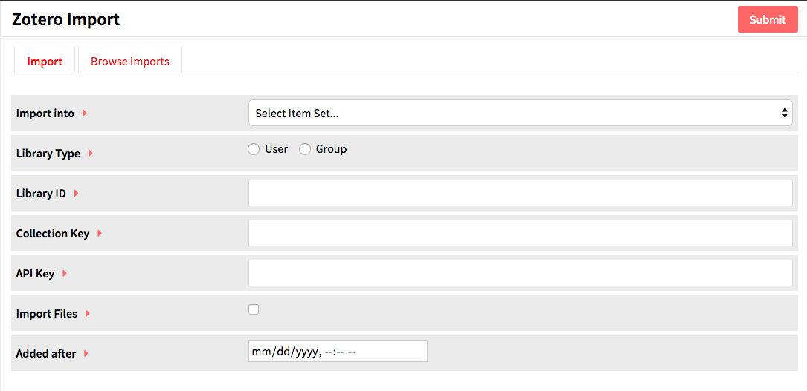

Zotero Import is a [module](modules/modules.md) for Omeka S which allows you to connect an Omeka S instance to a Zotero library and import items from that library.

To install Zotero Import, follow the instructions for [Installing Modules](../modules/modules.md#installing-modules) on the Modules documentation.

## Import Data
In order to import from a Zotero library, you must have API access to the library. To use Zotero Import, you will need the ID for the group or user
  * Individual IDs are found on the Feeds/API tab of your Zotero Settings; there is a sentence stating “Your userID for use in API call is”.
  * Group IDs are found on the Zotero group library page by looking at the URL of “Subscribe to this feed” - it is numeric sequence following “api.zotero.org/groups/“.

You may also want to have the id for a specific collection and an API key to import files. 
* Collection keys appear in the url of a collection page - they are the alphanumeric sequence at the end of the url, following “collectionKey/“
* To generate an API key, go to Settings in your Zotero account, to the Feeds/API tab, and click the *Create new private key* link.

To import, go to the Zotero Import tab on the left-hand navigation of the admin dashboard of your Omeka S install. This will automatically take you to the Import tab.

To import from a Zotero library:
* Choose an Item Set for imported items (required); 
* Choose between *User* or *Group* libraries with the radio buttons (required); 
* Enter the user ID (required); 
* Enter a collection key (not required); 
* Enter your API key to import private data and/or files (optional for import but necessary to import files)
* Choose whether to import files. The API key is required to import files.
*  Choose “Added After”. Only import items that have been added to Zotero after this datetime.
* Hit Submit.

You can track the status of the import by navigating to the Browse Imports tab from the Zotero Import page or on the [Jobs](../jobs.md) tab of the left-hand navigation on the admin dashboard.

