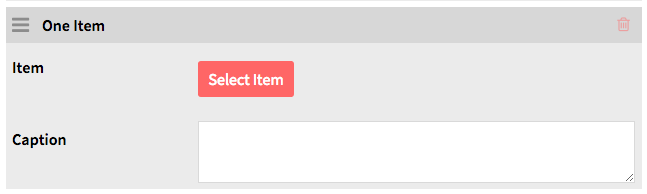

Pages form the content of your [sites](../sites/sites.md). A site can have a single page or many pages.

Manage the pages for a site by navigating to the Sites tab on the left-hand navigation of the admin dashboard. Select the site  for which you want to manage the pages and click edit. 

Once you are editing the site, click the Pages tab on the top navigation for sites. 

## Adding Pages
From the page for the site, click the Pages tab. Then click the "Add a Page" button on the left side of that tab to be taken to the Add Page function.

To add a page you must enter a *URL slug* and a *Title*. Both of these can be edited later but are required to create the page.  A slug is the portion of the url and can only contain letters, numbers, and hyphens; no other characters are allowed.

Once you have entered this information, click the Add button in the upper right hand corner of the browser window.

## Editing Pages  
After clicking the Pages tab, select the page you wish to edit by clicking the name of the page or the edit button (pencil). Note: clicking on the Page *title* will take you to the public view of that page. On the right hand side you can choose to add a new block by selecting one of the following layouts:

*HTML:* Opens up an HTML box in which you can add text and links

*Browse preview:* Allows you to add resources via searching 

*One item:* Once you click the Select Item button, a drawer appears on the right hand side displaying the various items in your Omeka install. Click on the item you wish to add to the page and then click the Select resource button. You can add a caption to the item using the box. In order to add more than one item you will need to add a *One Item* block for each item.

Once you have added items to your page, click the Save button in the right hand corner. You can delete any of the blocks by clicking on the trash can icon located in the upper right corner of the block. 

Change the order of blocks by clicking on the three horizontal lines on the upper left corner of the block and then dragging and dropping it to the desired location.

## Deleting Pages
To delete a page, go the to *Pages* tab of the site of which the page is a part. Click the delete (trash can) button at the right end of the row for that page. The title of the page will change to “Page to be removed” and the entire row will highlight.

To complete deletion, click *Save* in the upper right corner of the window.

To cancel the deletion, click the undo (counter-clockwise circle arrow) button which replaced the trash can.

