Pages form the content of your [sites](../sites/sites.md). A site can have a single page or many pages.

Manage the pages for a site by navigating to the Sites tab on the left-hand navigation of the admin dashboard. Select the site  for which you want to manage the pages and click either the title or the edit (pencil) button to edit that site. 

Once you are editing the site, click the Pages tab in the left hand navigation.

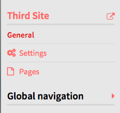

## Adding Pages
From the page for the site, click the Pages tab. Then click the "Add a Page" button on the left side of that tab to be taken to the Add Page function.

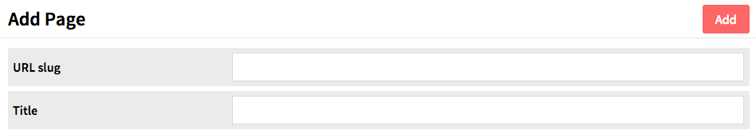

To add a page you must enter a *URL slug* and a *Title*. Both of these can be edited later but are required to create the page.  A slug is the portion of the url and can only contain letters, numbers, and hyphens; no other characters are allowed.

Once you have entered this information, click the Add button in the upper right hand corner of the browser window.

## Editing Pages  
After clicking the Pages tab, select the page you wish to edit by clicking the name of the page or the edit button (pencil). Note: clicking on the Page *title* will take you to the public view of that page. On the right hand side you can choose to add a new block by selecting one of the following layouts: *HTML; Browse Preview; Item List; Navigation; File with Text*.

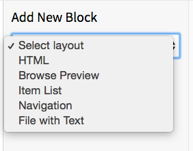

Once you have added blocks to your page, click the Save button in the right hand corner. 

You can delete any of the blocks by clicking on the trash can icon located in the upper right corner of the block. 

Change the order of blocks by clicking on the three horizontal lines on the upper left corner of the block and then dragging and dropping it to the desired location.

### HTML: 
Creates an HTML box in which you can add formatted text and links.

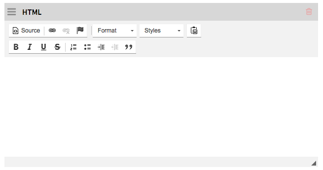

### Browse preview: 
Allows you to add a browsable block of resources. You designate which resources to display by defining search through the *Query* field. 

The *Preview Title* field is the heading above the browse 
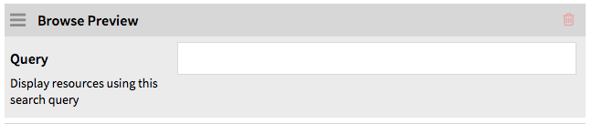

### Item List
A list of items. 

Using the drop-down menu in the block, you can set the thumbnail size for these items as large (default), medium, or square. 

Click the *Add Attachment* button to add an item to the block. This will open a drawer on the right side of the page to browse and select items. 
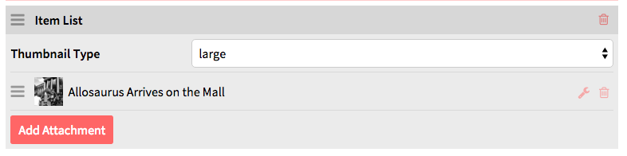

On loading, the drawer will show a list of your items, most recent first. You can select form the first page, page through using the forward and back arrows, or search using the search bar.

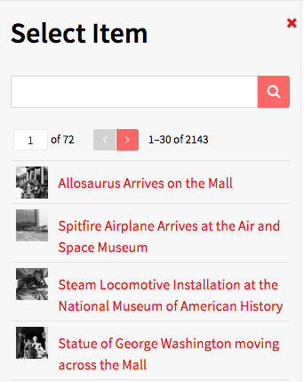

Once you’ve selected an item, the drawer will shift to that item’s information. You can add a caption and select which media (if more than one) you want to use. To return to the list of items, click the *Select item* button at the top of the drawer. To use the item displayed and apply the caption, etc, click the *Apply changes* button at the bottom of the drawer.

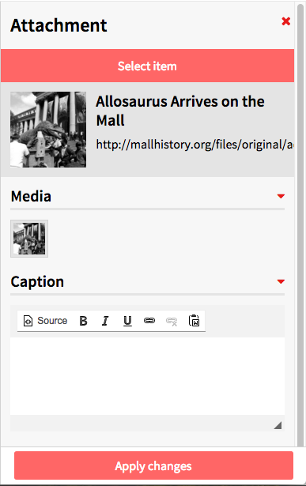

To cancel the item selection, click the X in the upper right corner of the drawer at any time.

Once you’ve added an item, it will appear in the Item List block. You can edit the caption or media options by clicking the edit (wrench) button for that row, and you can delete the item using the delete (trash can) icon.

You can add multiple items to the list.

### Table of Contents
If the current page has child pages, you can add a table of content block for those pages.

The Depth option allows you to set how many levels of child pages you want to display. If left blank, it will display all possible levels. Please enter a whole number.  

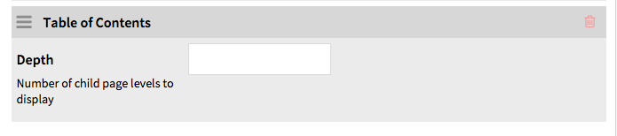

Add and arrange pages using the [Site Navigation](../sites/site_navigation.md) settings. 

### File with Text
A block with one more more items and a text block.

Using the drop-down menu in the top of the block, you can set the thumbnail size for these items as large (default), medium, or square. 

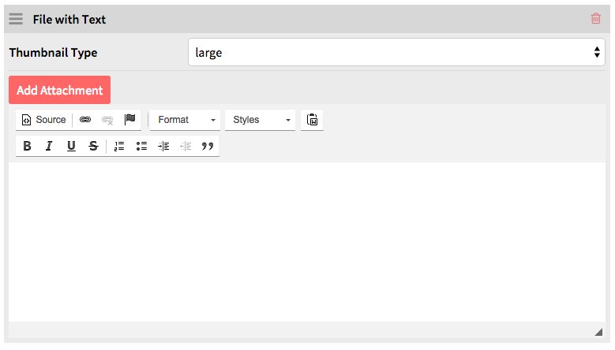

On loading, the drawer will show a list of your items, most recent first. You can select form the first page, page through using the forward and back arrows, or search using the search bar.

Once you’ve selected an item, the drawer will shift to that item’s information. You can add a caption and select which media (if more than one) you want to use. To return to the list of items, click the *Select item* button at the top of the drawer. To use the item displayed and apply the caption, etc, click the *Apply changes* button at the bottom of the drawer.

To cancel the item selection, click the X in the upper right corner of the drawer at any time.

The text has full HTML formatting options. 

## Deleting Pages
To delete a page, go the to *Pages* tab of the site of which the page is a part. Click the delete (trash can) button at the right end of the row for that page. The title of the page will change to “Page to be removed” and the entire row will highlight.

To complete deletion, click *Save* in the upper right corner of the window.

To cancel the deletion, click the undo (counter-clockwise circle arrow) button which replaced the trash can.

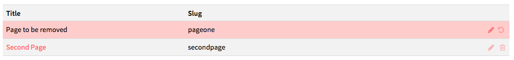

