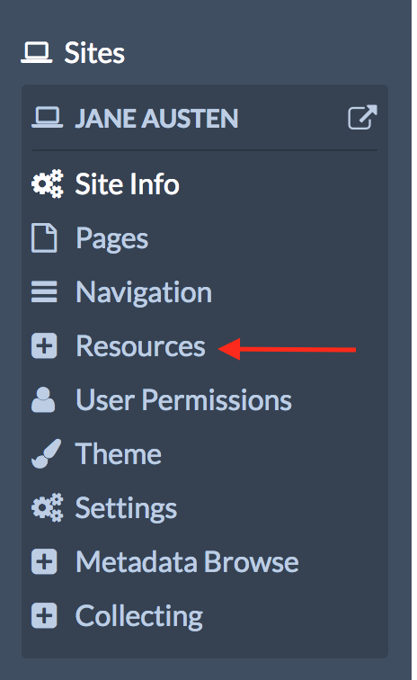
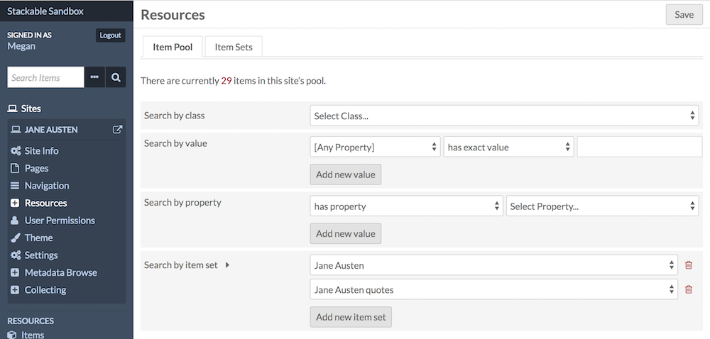
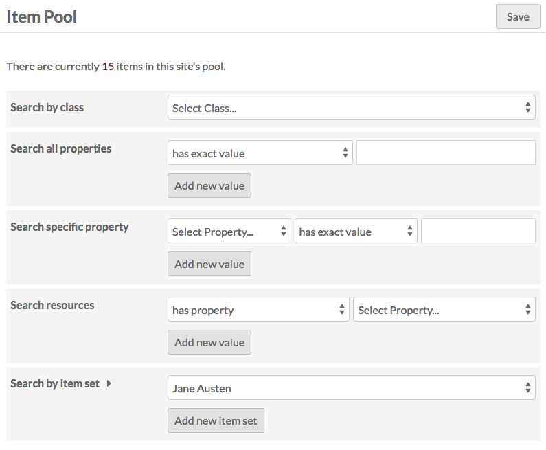
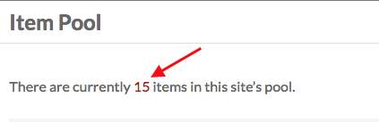
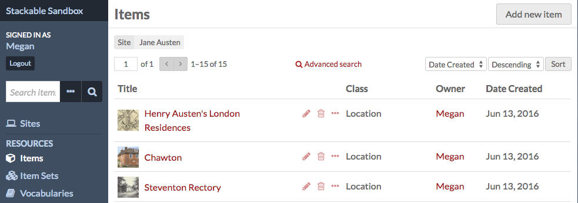
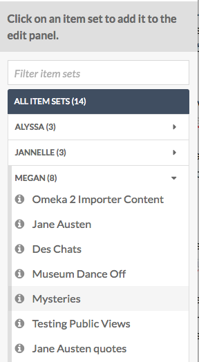

The Resources tab of the site context menu allows you to set what Items and Item Sets available on your site's browse pages. The Item Pool also sets which items are available in the sidebar when building pages.

Resources has two tabs across the top of the window: Item Pool and Item Sets. 

Item Pool is where you can set the items available for selection and browse in your site.

Item Sets is where you select the sets which will show up on the  Browse Item Sets page, should you choose to include it 

**Note** The two tabs operate independently from each other. The selections made on one will have no effect on the other.

Item Pool
----------------------------
The Item Pool determines what automatically appears in the resource selection options on the [pages](../sites/site_pages.md) of your Omeka S [site](../sites/sites.md). It also limits the resources which appear on a browse page on your site.

Note that the search options for the Item Pool work together to build an overall search. If you have a Class

The settings in the Item Pool tab allow you to set the parameters for the pool. You can use one or more of the search options:
* *Search by class*: search by resource Class. 
* *Search by value*: search for a term or phrase. 
    - The first selector allows you to specify a property to search. 
    - The second selector allows you to set the relationship the property has exactly, does not have exactly, contains, or does not contain the value you enter in the text area.
    - finally, there is a text field for you to enter the value you want the property to have.
* *Search by property*: include items which have data entered into a property. With this setting, you don't look for specific text in the property.
    - The first selector allows you to toggle between whether to search for an item which *has property* or *does not have property*.
    - The second selector allows you to specify a property.
* *Search by item set*: include all items within a specific item set. This is the only criteria where adding will actually broaden the pool - selecting a second item set will include all items in Item Set A or in Item Set B. 

If you have already set terms for an item pool, the Item Pool page will display a message above the table of search options, with the number of items in the current site pool (see the image below). The number functions as a link which takes you to an admin-side browse of all the items in the site's item pool. *Note that clicking the link takes you outside of the Sites admin*

The image below shows how those items are displayed; the name of the site is displayed just under the header for items. Note that we are back in the Items section of the Omeka S install admin, rather than the Site admin. 

Item Sets
---------------------------
On this tab you can select which Item Sets will display on a Browse Item Sets page when added to the [navigation](../sites/site_navigation.md). 

The table in the Item Sets tab shows any item sets already added, with their title and owner's email address. 

To add an item set, select it in the right hand sidebar. You can find the desired item set by either:
    - typing the name of the item set in the search bar and then clicking on the correct item set, or
    - click on the name of the item set owner, then clicking on the name of the item set.

Remove an item set by clicking the red delete button (trash can icon). You can change the order of the item sets by dragging and dropping using the three-bar icon on the left end of the row.

The following image shows a browse item sets public view using the default theme: 

